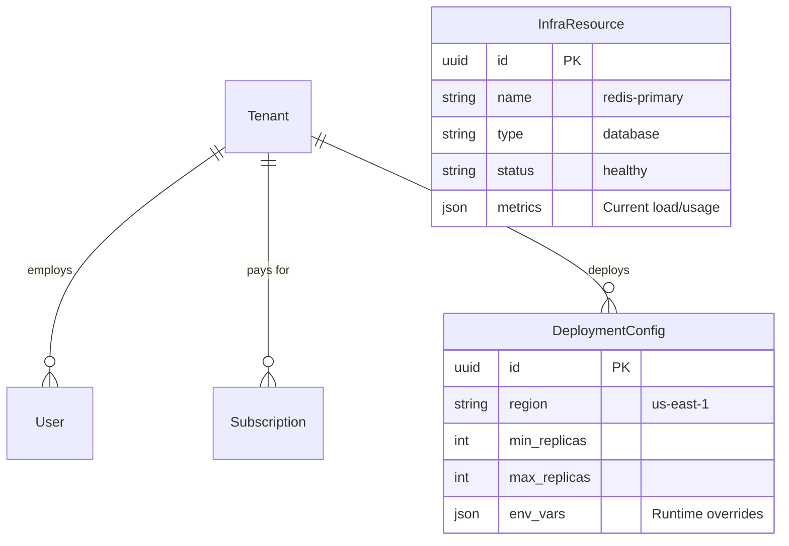
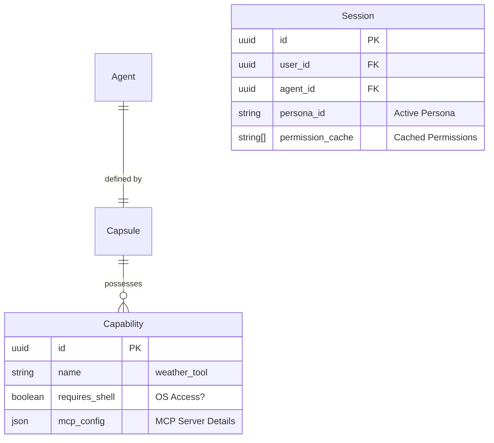

# SRS: Chat Flow, Granular Governance & SaaS Matrix V.0.3

**Document ID:** SA01-SRS-CHAT-FLOW-2026-03
**Version:** 0.3
**Status:** CANONICAL REFERENCE
**Compliance:** ISO/IEC 29148:2018
**Persona Audit:** APPROVED (Principal, Security, QA)

---

## 1. Scope

This Software Requirements Specification (SRS) defines the **Complete SaaS Operations Architecture** for SomaAgent01. It moves beyond simple chat flows to strictly enforce **Granular Governance** across four pillars: **Communication (Chat)**, **Execution (Tools)**, **Administration (Deployment/Infra)**, and **Evolution (Dynamic Creation)**.

It mandates that **every single feature** is mapped to a specific Permission Gate, creating a "Zero-Trust, Full-Audit" environment.

---

## 2. The Grand Unified SaaS Permission Matrix

The System defines **11 Standard Roles** governing access to **5 Functional Domains**.

### 2.1 Roles & Definitions

| Role Code | Role Name | Description |
|-----------|-----------|-------------|
| **SA** | Super Admin | SaaS Admin Mode. Full access to *all* Tenants and Infra. |
| **TA** | Tenant Admin | Admin for a specific Tenant. Can manage Users/Agents. |
| **AO** | Agent Owner | Can configure/deploy specific Agents. |
| **OP** | Operator | Can run Agents and view debug logs, but not configure. |
| **US** | User | Standard end-user. Chat & Standard Tools only. |
| **VW** | Viewer | Read-only access to Chat History. |
| **BA** | Billing Admin | Can view invoices and manage payments. |
| **AU** | Auditor | Read-only access to Audit Logs and Compliance data. |
| **IA** | Infra Admin | Can view/manage underlying Kubernetes/Resources. |

### 2.2 Functional Domain Matrix

#### Domain A: Infrastructure & Deployment
| Permission | SA | TA | AO | OP | US | IA |
|------------|:--:|:--:|:--:|:--:|:--:|:--:|
| `infra:view` | ● | ○ | ○ | ○ | ○ | ● |
| `infra:configure` | ● | ○ | ○ | ○ | ○ | ● |
| `deployment:create` | ● | ● | ○ | ○ | ○ | ○ |
| `deployment:rollback` | ● | ● | ○ | ○ | ○ | ○ |
| `platform:read_metrics` | ● | ○ | ○ | ○ | ○ | ● |

#### Domain B: Agent Governance (The "Trinity")
| Permission | SA | TA | AO | OP | US | VW |
|------------|:--:|:--:|:--:|:--:|:--:|:--:|
| `agent:create` | ● | ● | ○ | ○ | ○ | ○ |
| `agent:configure` | ● | ● | ● | ○ | ○ | ○ |
| `agent:delete` | ● | ● | ○ | ○ | ○ | ○ |
| `agent:capsule:edit` | ● | ● | ● | ○ | ○ | ○ |
| `agent:view_logs` | ● | ● | ● | ● | ○ | ○ |

#### Domain C: Chat & Execution (Runtime)
| Permission | SA | TA | AO | OP | US | VW |
|------------|:--:|:--:|:--:|:--:|:--:|:--:|
| `chat:send` | ● | ● | ● | ● | ● | ○ |
| `chat:history` | ● | ● | ● | ● | ● | ● |
| `tool:view` | ● | ● | ● | ● | ● | ○ |
| `tool:execute` | ● | ● | ● | ● | ● | ○ |
| `tool:shell:execute` | ● | ○ | ○ | ○ | ○ | ○ | (OS Level) |
| `tool:pkg:install` | ● | ○ | ○ | ○ | ○ | ○ | (OS Level) |
| `tool:create` | ● | ● | ● | ○ | ○ | ○ | (Dynamic) |

#### Domain D: Data & Memory
| Permission | SA | TA | AO | OP | US | AU |
|------------|:--:|:--:|:--:|:--:|:--:|:--:|
| `memory:read` | ● | ● | ● | ● | ● | ● |
| `memory:wipe` | ● | ● | ● | ○ | ○ | ○ |
| `file:upload` | ● | ● | ● | ● | ● | ○ |
| `audit:read` | ● | ● | ○ | ○ | ○ | ● |

---

## 3. Comprehensive Data Architecture (ERD)

Strict adherence to **Rule 91 (Zero Hardcode)** means all configuration lives here.

### 3.1 Core SaaS & Infra Entities

### 3.2 The Agent "Trinity" & Security Context

---

## 4. Extremely Detailed User Journeys

### 4.1 Journey 1: The "Granular Discovery" Flow
**User Story**: A **Junior User** (`US`) logs in. The Agent has powerful Admin tools (`ResetDB`, `GrantAccess`) and standard tools (`CheckStatus`). The User MUST NOT know the Admin tools exist.

1.  **User Login**:
    *   User posts credentials to `/auth/login`.
    *   System validates credentials and loads **Role**: `user`.
    *   System loads **Permissions**: `[chat:send, tool:execute]`.
    *   **Permision Check**: System specifically checks `tool:admin:view`. Result: **DENIED**.

2.  **Session Start**:
    *   User navigates to the Chat Interface. calls `/api/chat/session`.
    *   System initializes `Session` object.
    *   System loads `Capsule` (Agent Body) containing ALL tools: `[ResetDB, GrantAccess, CheckStatus]`.

3.  **Prompt Construction (The Filter)**:
    *   System iterates through Capsule Tools.
    *   **Check 1**: `ResetDB`. Required Perm: `tool:admin:execute`. User has it? **NO**. -> **DROP**.
    *   **Check 2**: `GrantAccess`. Required Perm: `tool:admin:execute`. User has it? **NO**. -> **DROP**.
    *   **Check 3**: `CheckStatus`. Required Perm: `tool:execute`. User has it? **YES**. -> **INCLUDE**.

4.  **LLM Generation**:
    *   System sends System Prompt to LLM: *"You have the following tools: [CheckStatus]."*
    *   LLM responds: *"Hello! I can help you check the status of services."*
    *   **Result**: The Admin tools are physically absent from the Agent's cognitive horizon. The User cannot possibly prompt the agent to use them.

### 4.2 Journey 2: The "OS Sovereignty" Execution
**User Story**: An **Agent Owner** (`AO`) wants the agent to run a shell script to analyze a log file.

1.  **Request**:
    *   User types: *"Analyze the logs in /var/log/syslog please."*

2.  **Intent Recognition**:
    *   LLM identifies tool need: `ShellTool`.
    *   LLM generates Tool Call: `{"tool": "shell", "cmd": "cat /var/log/syslog"}`.

3.  **The 4-Phase Gate (Governance)**:
    *   **Phase 1 (Registry)**: Is `ShellTool` enabled globally? **YES**.
    *   **Phase 2 (Capsule)**: Is `ShellTool` in this Agent's Capsule? **YES**.
    *   **Phase 3 (Trinity Permission)**:
        *   System checks SpiceDB: `user:alice` on `resource:shell`?
        *   Required Perm: `tool:shell:execute`.
        *   Role `AO` (Agent Owner) **HAS** `tool:shell:execute`. -> **PASS**.
    *   **Phase 4 (Policy/OPA)**:
        *   OPA Policy: `allow_shell_commands = ["ls", "grep", "cat"]`.
        *   Input: `cat /var/log/syslog`.
        *   Policy Check: **PASS**.

4.  **Zero-Loss Observability**:
    *   **Trace**: Span `exec_shell` started.
    *   **Audit**: Event `tool.shell.execute` logged to Kafka.
    *   **Telemetry**: Usage metric `shell_usage` incremented.

5.  **Execution**:
    *   System executes `subprocess.run("cat /var/log/syslog")`.
    *   Output returned to LLM.

### 4.3 Journey 3: The "Genesis Engine" (Dynamic Creation)
**User Story**: A **Super Admin** (`SA`) wants the Agent to write a *new* Python tool to calculate fibonacci numbers and use it immediately.

1.  **Instruction**:
    *   Admin types: *"Write a tool named 'fib_calc' that calculates fibonacci numbers."*

2.  **Code Generation**:
    *   LLM writes Python code: `def fib_calc(n): ...`
    *   LLM generates Tool Call: `create_tool(name="fib_calc", code="...")`.

3.  **Creation Gate**:
    *   System intercepts `create_tool`.
    *   **Permission Check**: Does User have `tool:create`?
    *   Role `SA` **HAS** `tool:create`. -> **PASS**.

4.  **Persistance**:
    *   System saves code to `admin.core.models.Capability`.
    *   System runs `pylint` / security scan on the new code (Automated Audit).

5.  **Hot-Linking**:
    *   System adds the new `Capability` ID to the current `Capsule.capabilities` list.
    *   System triggers **Hot Reload** of the Agent Context.

6.  **Usage**:
    *   System re-prompts LLM: *"You now have the tool: [fib_calc]. Proceed."*
    *   LLM calls: `fib_calc(10)`.
    *   System executes the *just-created* tool.

---

## 5. Deployment & Infrastructure Architecture

### 5.1 Infrastructure Database
The `InfraResource` and `DeploymentConfig` tables MUST exist to support the **Infra Admin** role.

1.  **Replication**: `DeploymentConfig.min_replicas` drives the Kubernetes HPA.
2.  **Metrics**: `InfraResource.metrics` drives the `/api/v2/infrastructure/health` dashboard.

### 5.2 Maintenance Windows
**Permission**: `infra:configure` required.

During a maintenance window (`MaintenanceWindow` table active):
1.  All `tool:execute` permissions are effectively revoked for non-Admin roles.
2.  User requests return `503 Service Unavailable` with a friendly "Under Maintenance" message.

---

## 6. Security & Governance Matrix (Lookup)

| Action | Resource | Permission Required | Failure Mode |
|--------|----------|---------------------|--------------|
| **See Tool** | Tool Definition | `view` (Implicitly checked at discovery) | Tool Hidden (Invisible) |
| **Run Tool** | Tool Execution | `execute` | PermissionDenied Audit Event |
| **Run Shell** | OS Shell | `tool:shell:execute` | Execution Blocked |
| **Install Pkg** | PackageManager | `tool:package_manager:install` | Installation Blocked |
| **Create Tool** | Capability Registry | `tool:create` | Creation Denied |

---

## 7. Verification & Testing Strategy

**MANDATE**: "Test Always on Real Infra"

### 7.1 Testing Tiers
1.  **Unit Tests (Fast / Local)**
    *   **Scope**: Pure logic, utility functions, parser logic.
    *   **Mocking**: Allowed ONLY for external I/O here.
    *   **Command**: `pytest tests/unit`

2.  **Integration & E2E Tests (Real Infra)**
    *   **Scope**: Database interactions, Full Agent Flows, Tool Execution.
    *   **Mocking**: **STRICTLY FORBIDDEN**.
    *   **Requirements**:
        *   Must run against real Postgres (SpiceDB).
        *   Must run against real Redis/Kafka.
        *   Must execute actual Shell commands (in container).
    *   **Command**: `pytest tests/e2e` (Requires `SA01_INFRA_AVAILABLE=true`)

### 7.2 Validation Workflow
1.  Agent **Deployment** -> Verify `DeploymentConfig` applied to K8s.
2.  Chat **Functionality** -> Verify Message persisted to Postgres.
3.  Tool **Execution** -> Verify Audit Log appears in Kafka Topic `audit.events`.

**End of Specification**
