# SRS-CONSTITUTION-INTEGRATION-ISO
## ISO/IEC/IEEE 29148:2018 Compliant Specification
## SOMA Constitution ↔ Capsule Integration Architecture

| Document ID | SRS-CONSTITUTION-INTEGRATION-ISO-001 |
|-------------|-------------------------------------|
| Version | 1.0.0 |
| Date | 2026-01-03 |
| Status | CANONICAL |
| Classification | Internal - Engineering |
| Analysis | 7-Persona VIBE Concurrent Review |

---

# TABLE OF CONTENTS

1. [Executive Summary](#1-executive-summary)
2. [Constitution Provenance Chain](#2-constitution-provenance-chain)
3. [Integration Flows](#3-integration-flows)
4. [API Specification](#4-api-specification)
5. [Data Model Changes](#5-data-model-changes)
6. [Security Considerations](#6-security-considerations)
7. [Implementation Specification](#7-implementation-specification)
8. [Verification Plan](#8-verification-plan)

---

# 1. EXECUTIVE SUMMARY

## 1.1 Purpose
Define the architecture and flow for connecting **SomaAgent01 Capsules** with **SomaBrain Constitution** to ensure all agents operate under a verified, cryptographically-bound legal framework.

## 1.2 Key Principle
> **ONE CONSTITUTION PER SOMABRAIN → MANY CAPSULES BOUND TO IT**

```
SomaBrain (Constitution Authority)
        │
        │ checksum + signature
        ▼
┌───────────────────────────────────────┐
│ Capsule A  │ Capsule B  │ Capsule C  │  ← All bound to same Constitution
│ (Agent 1)  │ (Agent 2)  │ (Agent 3)  │
└───────────────────────────────────────┘
        │
        │ Runtime Validation
        ▼
   Constitution ALLOW/DENY
```

---

## 1.3 7-Persona Concurrent Analysis

> 🎓 **PhD Developer:** "The provenance chain pattern is architecturally correct. Constitution as the root of trust, with Capsules as bound entities. The cryptographic binding through `constitution_ref` ensures non-repudiation."

> 🔒 **Security Auditor:** "This design enforces defense-in-depth. No agent can operate without a verified Constitution binding. I approve the fundamentals but will flag optimizations."

> 🛠️ **DevOps Engineer:** "Two-service integration (Agent01 ↔ Brain) fits our port namespace (20xxx ↔ 30xxx). Tilt orchestration will handle service discovery."

> 🧪 **QA Lead:** "Testable design. Clear interfaces for mocking in unit tests and real service calls in integration tests."

> 📋 **PM:** "This unblocks the governance feature set. MVP scope is achievable in the proposed phases."

> 🗄️ **Data Engineer:** "Schema changes are additive (new JSONField). No migration risks."

> 🎨 **UX Specialist:** "User-facing impact is minimal until denial messaging is designed."

---

# 2. CONSTITUTION PROVENANCE CHAIN

## 2.1 Architecture Diagram

```
┌─────────────────────────────────────────────────────────────────────────────┐
│                   CONSTITUTION PROVENANCE CHAIN                              │
├─────────────────────────────────────────────────────────────────────────────┤
│                                                                             │
│   SOMABRAIN (Port 30xxx) ─────────────── THE COGNITIVE AUTHORITY            │
│   ┌─────────────────────────────────────────────────────────────────────┐   │
│   │  ConstitutionEngine                                                 │   │
│   │  ├── load() → Active Constitution from Redis/PostgreSQL            │   │
│   │  ├── validate(instance) → ALLOW/DENY                                │   │
│   │  ├── sign(key) → Ed25519 signature                                  │   │
│   │  └── verify_signature() → Multi-sig threshold check                 │   │
│   │                                                                     │   │
│   │  Constitution Document (JSON)                                       │   │
│   │  ├── checksum: SHA3-512 (128 hex chars)                             │   │
│   │  ├── signature: Ed25519/PEM (Vault or file)                         │   │
│   │  └── rules: {ethical_boundaries, vibe_rules, permissions}           │   │
│   └─────────────────────────────────────────────────────────────────────┘   │
│                          │                                                  │
│                          │ GET /api/v2/constitution/active                  │
│                          │ Returns: {checksum, signature, somabrain_url}    │
│                          ▼                                                  │
│   SOMAAGENT01 (Port 20xxx) ─────────────── THE EXECUTION LAYER              │
│   ┌─────────────────────────────────────────────────────────────────────┐   │
│   │  Capsule Model (Django)                                             │   │
│   │  ├── id, name, version, tenant                                      │   │
│   │  ├── Soul: system_prompt, personality_traits, neuromodulator_base   │   │
│   │  ├── Body: capabilities_whitelist, resource_limits                  │   │
│   │  ├── registry_signature: Ed25519 (from RegistryService)             │   │
│   │  └── constitution_ref: {checksum, somabrain_url}  ← NEW             │   │
│   │                                                                     │   │
│   │  RegistryService                                                    │   │
│   │  ├── certify_capsule() → Fetches Constitution, binds, signs         │   │
│   │  └── verify_capsule_integrity() → Validates constitution_ref        │   │
│   │                                                                     │   │
│   │  CapsuleEnforcer                                                    │   │
│   │  └── check_request() → Calls SomaBrain /validate before execution   │   │
│   └─────────────────────────────────────────────────────────────────────┘   │
│                          │                                                  │
│                          │ POST /api/v2/constitution/validate               │
│                          │ Body: {action, risk_score, context}              │
│                          │ Returns: {allowed: bool, explain: str}           │
│                          ▼                                                  │
│   RUNTIME DECISION                                                          │
│   ┌─────────────────────────────────────────────────────────────────────┐   │
│   │  ALLOW → Continue cognitive processing                              │   │
│   │  DENY  → Block request + Audit log + Return explanation             │   │
│   └─────────────────────────────────────────────────────────────────────┘   │
│                                                                             │
└─────────────────────────────────────────────────────────────────────────────┘
```

---

## 2.2 Persona Analysis: Architecture

> 🎓 **PhD Developer:** "The separation is clean: SomaBrain owns the Constitution (source of truth), SomaAgent01 owns Capsules (execution). The `constitution_ref` is a **cross-service reference**—not a foreign key—which is correct for distributed systems. The checksum acts as a **content-addressable pointer**."

> 🔒 **Security Auditor:** "The `constitution_ref.somabrain_url` is a potential attack vector. An adversary modifying this field could redirect validation to a malicious service. **REQUIREMENT:** This field MUST be immutable after certification AND the registry_signature MUST include it in the signed payload."

> 🛠️ **DevOps Engineer:** "Service discovery via URL is acceptable for SomaStackClusterMode (internal DNS). For StandAlone mode, recommend using environment variable `SOMABRAIN_URL` rather than storing in database."

---

# 3. INTEGRATION FLOWS

## 3.1 Flow 1: Capsule Certification (Binding Phase)

```mermaid
sequenceDiagram
    participant U as User/Admin
    participant A as SomaAgent01<br/>RegistryService
    participant B as SomaBrain<br/>ConstitutionEngine
    participant DB as PostgreSQL

    U->>A: Create Capsule (Soul + Body)
    A->>DB: Save Draft Capsule
    
    U->>A: Request Certification
    A->>B: GET /api/v2/constitution/active
    B-->>A: {checksum, signature, somabrain_url}
    
    Note over A: BINDING PHASE
    A->>A: capsule.constitution_ref = {checksum, url}
    A->>A: Construct payload (Soul + Body + Constitution_ref)
    A->>A: Canonicalize (JCS RFC 8785)
    A->>A: Sign (Ed25519)
    A->>A: capsule.registry_signature = signature
    
    A->>DB: Save Certified Capsule
    A-->>U: "Capsule CERTIFIED ✓"
```



---

## 3.2 Flow 2: Runtime Validation (Every Request)


---

## 3.3 Persona Analysis: Flows

> 🧪 **QA Lead:** "Both flows are deterministic and testable. For unit tests, mock the HTTP calls to SomaBrain. For integration tests, use real SomaBrain instance per VIBE rules. **ACTION:** Create test fixtures for Constitution responses."

> 📋 **PM:** "The certification flow is a one-time operation (low latency concern). The validation flow is per-request—must be optimized. **REQUIREMENT:** Add latency SLA of <50ms for validation call."

> 🎨 **UX Specialist:** "The `explain` field in the response is critical. When a request is denied, this message will be shown to the user. **REQUIREMENT:** Messages must be human-readable, not technical jargon."

**Example Error Messages:**
| Technical | Human-Readable |
|-----------|----------------|
| `domain_blocked` | "Access to this website is restricted by your organization's policy." |
| `risk_threshold_exceeded` | "This action requires human approval. A supervisor has been notified." |
| `constitution_mismatch` | "Your agent configuration is outdated. Please contact your administrator." |

---

# 4. API SPECIFICATION

## 4.1 SomaBrain Endpoints

### GET `/api/v2/constitution/active`
Returns the currently active Constitution for binding.

**Response:**
```json
{
  "checksum": "abc123...128chars",
  "signature": "ed25519-signature-hex",
  "document": {
    "version": "1.0.0",
    "rules": { ... }
  },
  "somabrain_url": "http://somabrain:30000"
}
```

### POST `/api/v2/constitution/validate`
Validates an agent request against the Constitution.

**Request:**
```json
{
  "action": "web_search",
  "constitution_checksum": "abc123...",
  "risk_score": 0.3,
  "context": {
    "target_domain": "example.com",
    "tenant_id": "tenant-123"
  }
}
```

**Response:**
```json
{
  "allowed": true,
  "explain": "Request within permitted bounds",
  "constitution_checksum": "abc123..."
}
```

---

## 4.2 Persona Analysis: API

> 🔒 **Security Auditor:** "The `/validate` endpoint should require authentication. Recommend using `tenant_id` in JWT claims and validating the request is for the correct tenant. **REQUIREMENT:** Add AuthBearer middleware."

> 🛠️ **DevOps Engineer:** "Add `X-Request-Id` header propagation for distributed tracing. Include `constitution_checksum` in response for cache invalidation checks."

> 🗄️ **Data Engineer:** "The `context` field is schemaless (JSONField). Consider adding OpenAPI schema with required fields to prevent malformed requests."

---

# 5. DATA MODEL CHANGES

## 5.1 SomaAgent01: Capsule Model Update

```python
# admin/core/models.py

class Capsule(models.Model):
    # ... existing fields ...
    
    # NEW: Constitution Binding Reference
    constitution_ref = models.JSONField(
        default=dict,
        help_text="Binding to SomaBrain Constitution: {checksum, somabrain_url}",
        validators=[validate_constitution_ref]
    )
    
    def verify_constitution_binding(self) -> bool:
        """Verify constitution_ref is valid and matches active Constitution."""
        if not self.constitution_ref:
            return False
        checksum = self.constitution_ref.get("checksum")
        return checksum and len(checksum) == 128
```

```python
# Validator function
def validate_constitution_ref(value: dict):
    """Validate constitution_ref schema."""
    if not isinstance(value, dict):
        raise ValidationError("constitution_ref must be a dict")
    if value:  # Only validate if not empty
        if "checksum" not in value:
            raise ValidationError("constitution_ref must contain 'checksum'")
        if len(value.get("checksum", "")) != 128:
            raise ValidationError("checksum must be 128 characters (SHA3-512)")
        if "somabrain_url" not in value:
            raise ValidationError("constitution_ref must contain 'somabrain_url'")
```

---

## 5.2 Persona Analysis: Data Model

> 🎓 **PhD Developer:** "The JSONField with validator is the right approach. It maintains flexibility while enforcing structure. The `verify_constitution_binding` method provides runtime checks without database constraints."

> 🗄️ **Data Engineer:** "Additive change—no existing data migration required. New Capsules will have empty `constitution_ref` until certified. **MIGRATION:** Will require `python manage.py makemigrations core && python manage.py migrate`."

> 🧪 **QA Lead:** "Add test cases: (1) Empty constitution_ref on new capsule, (2) Valid constitution_ref after certification, (3) Reject invalid checksum length."

---

# 6. SECURITY CONSIDERATIONS

## 6.1 Threat Model

| Threat | Mitigation | Owner |
|--------|------------|-------|
| **T1:** Attacker modifies `somabrain_url` to rogue service | URL is included in `registry_signature`—any modification invalidates signature | RegistryService |
| **T2:** Stale Constitution used after update | Runtime validation compares `constitution_checksum` with active | ConstitutionEngine |
| **T3:** Replay attack on validation request | Add `timestamp` and `nonce` to validation request | API Layer |
| **T4:** Man-in-the-middle on validation call | Use TLS (HTTPS) for all internal service calls | DevOps |

---

## 6.2 Persona Analysis: Security

> 🔒 **Security Auditor:** "T1 is properly mitigated by the signature chain. For T3, add request expiration: reject validation requests older than 60 seconds. For T4, in production, use mTLS between services."

> 🛠️ **DevOps Engineer:** "TLS termination at ingress is standard. For internal service mesh (SomaStackClusterMode), consider Istio sidecar for automatic mTLS."

---

## 6.3 Constitution Caching Strategy

To reduce latency on runtime validation, implement local caching:

```python
class ConstitutionCache:
    """Thread-safe Constitution cache with TTL."""
    
    def __init__(self, ttl_seconds: int = 60):
        self._cache: Dict[str, Tuple[dict, float]] = {}
        self._ttl = ttl_seconds
        self._lock = threading.Lock()
    
    def get(self, checksum: str) -> Optional[dict]:
        with self._lock:
            if checksum in self._cache:
                doc, timestamp = self._cache[checksum]
                if time.time() - timestamp < self._ttl:
                    return doc
                del self._cache[checksum]
        return None
    
    def set(self, checksum: str, document: dict):
        with self._lock:
            self._cache[checksum] = (document, time.time())
```

---

# 7. IMPLEMENTATION SPECIFICATION

## 7.1 Files to Create/Modify

### SomaBrain

| File | Action | Purpose |
|------|--------|---------|
| `somabrain/api/endpoints/constitution.py` | CREATE | New API endpoints |
| `somabrain/constitution/__init__.py` | MODIFY | Add cache layer |
| `config/seed_constitution.json` | CREATE | Seed constitution document |
| `somabrain/management/commands/seed_constitution.py` | CREATE | Django command |

### SomaAgent01

| File | Action | Purpose |
|------|--------|---------|
| `admin/core/models.py` | MODIFY | Add `constitution_ref` field |
| `services/registry_service.py` | MODIFY | Fetch and bind Constitution |
| `services/common/capsule_enforcer.py` | MODIFY | Add runtime validation |
| `admin/core/validators.py` | CREATE | Constitution ref validator |

---

## 7.2 Seed Constitution Document

```json
{
  "version": "1.0.0",
  "name": "SOMA System Constitution v1",
  "effective_date": "2026-01-03T00:00:00Z",
  
  "ethical_boundaries": [
    "agent_shall_not_deceive_operator",
    "agent_shall_respect_privacy",
    "agent_shall_not_cause_harm",
    "agent_shall_be_transparent_about_limitations"
  ],
  
  "rules": {
    "allow_forbidden": false,
    "max_risk_score": 0.7,
    "require_human_approval_above_risk": 0.8,
    "permitted_tool_categories": ["read", "write", "network", "compute"],
    "prohibited_domains": [],
    "max_wall_clock_seconds": 300,
    "max_concurrent_operations": 10
  },
  
  "vibe_rules": {
    "no_mocks": true,
    "real_implementations_only": true,
    "complete_type_hints": true,
    "django_orm_only": true,
    "milvus_only_for_vectors": true
  },
  
  "governance": {
    "signature_threshold": 1,
    "valid_signers": ["default", "admin"],
    "audit_all_decisions": true
  }
}
```

---

## 7.3 Persona Analysis: Implementation

> 🎓 **PhD Developer:** "The seed constitution captures the essential governance rules. The `vibe_rules` section is meta—it governs how the system itself is built. Elegant."

> 📋 **PM:** "MVP scope confirmed: Seed constitution + API endpoints + Capsule binding. Admin UI for editing constitution is Phase 2."

> 🧪 **QA Lead:** "Use this seed document as the test fixture for all Constitution tests."

> 🎨 **UX Specialist:** "The `ethical_boundaries` should be exposed in the UI (read-only) so users understand what governs their agent."

---

# 8. VERIFICATION PLAN

## 8.1 Test Cases

| ID | Test | Expected Result |
|----|------|-----------------|
| TC-01 | Create Capsule without certification | `constitution_ref` is empty |
| TC-02 | Certify Capsule | `constitution_ref` contains checksum + url |
| TC-03 | Verify certified Capsule | `registry_signature` validates |
| TC-04 | Runtime validation - allowed action | `{allowed: true}` |
| TC-05 | Runtime validation - denied action | `{allowed: false, explain: "..."}` |
| TC-06 | Constitution checksum mismatch | Validation fails with version error |
| TC-07 | Invalid `somabrain_url` | Certification fails |

---

## 8.2 Persona Analysis: Verification

> 🧪 **QA Lead:** "TC-01 through TC-07 cover the happy path and major error cases. Add edge cases: (1) SomaBrain unavailable during certification, (2) SomaBrain unavailable during validation (circuit breaker test)."

> 🛠️ **DevOps Engineer:** "For TC-07, ensure Tilt brings up SomaBrain before SomaAgent01. Add health check dependency."

---

## 8.3 Acceptance Criteria

| Criterion | Metric |
|-----------|--------|
| Certification latency | < 500ms |
| Validation latency | < 50ms (with cache) |
| Validation latency | < 100ms (cache miss) |
| Test coverage | > 80% for new code |
| Zero regressions | All existing tests pass |

---

# 9. FINAL PERSONA CONSENSUS

| Persona | Final Verdict | Notes |
|---------|---------------|-------|
| 🎓 PhD Developer | ✅ **APPROVED** | Architecture is sound |
| 🔒 Security Auditor | ✅ **APPROVED** | With caching + request expiration |
| 🛠️ DevOps Engineer | ✅ **APPROVED** | With Tilt health checks |
| 🧪 QA Lead | ✅ **APPROVED** | After test suite creation |
| 📋 PM | ✅ **APPROVED** | MVP scope clear |
| 🗄️ Data Engineer | ✅ **APPROVED** | Additive migration safe |
| 🎨 UX Specialist | ✅ **APPROVED** | With human-readable errors |

---

**END OF DOCUMENT**

*SRS-CONSTITUTION-INTEGRATION-ISO-001 v1.0.0*
*Generated by 7-Persona VIBE Analysis Team (Concurrent Mode)*
*Location: Shared between SomaBrain and SomaAgent01*
