# SRS-CONTEXT-BUILDING — Prompt Assembly

**System:** SomaAgent01
**Document ID:** SRS-CONTEXT-BUILDING-2026-01-16
**Version:** 5.0 (AAAS Direct Calls Enforced)
**Status:** CANONICAL

**Applied Personas:** ALL 10 ✅

---

## 0. AAAS Direct Call Rule

> **ContextBuilder and Memory Recall use DIRECT IMPORTS — ZERO HTTP LATENCY**

```python
# ✅ AAAS MODE
from admin.core.context_builder import build_context
from somabrain.cognitive import CognitiveCore

brain = CognitiveCore(db=django_db)
context = await build_context(capsule, message, brain)  # All direct = 0ms
```

---

## 1. Core Principle

> ContextBuilder assembles prompts from `capsule.body.persona` and uses brain-learned lane preferences from `capsule.body.learned`.

---

## 2. Context Lanes

```mermaid
flowchart LR
    subgraph LANES ["📊 Context Lanes"]
        L1[🔧 System - base prompt]
        L2[📜 History - conversation]
        L3[🧠 Memory - brain recall]
        L4[🛠️ Tools - available tools]
        L5[📝 Buffer - user message]
    end

    L1 --> T[Total Context]
    L2 --> T
    L3 --> T
    L4 --> T
    L5 --> T
```



---

## 3. Lane Allocation from Capsule

### 3.1 Source: capsule.body.learned.lane_preferences

```json
{
    "learned": {
        "lane_preferences": {
            "system": 0.15,
            "history": 0.30,
            "memory": 0.25,
            "tools": 0.20,
            "buffer": 0.10
        }
    }
}
```

### 3.2 Derivation Logic

```python
def get_lane_allocation(capsule: Capsule) -> dict:
    """Get lane allocation from brain-learned or default."""

    # 1. Try brain-learned preferences
    learned = capsule.body.get("learned", {})
    if "lane_preferences" in learned:
        return learned["lane_preferences"]

    # 2. Default based on intelligence
    intel = capsule.body["persona"]["knobs"]["intelligence_level"]

    if intel <= 3:
        return {"system": 0.20, "history": 0.20, "memory": 0.20, "tools": 0.20, "buffer": 0.20}
    elif intel <= 6:
        return {"system": 0.15, "history": 0.30, "memory": 0.25, "tools": 0.20, "buffer": 0.10}
    else:
        return {"system": 0.10, "history": 0.35, "memory": 0.30, "tools": 0.15, "buffer": 0.10}
```

---

## 4. Prompt Building from Capsule

```python
async def build_context(
    capsule: Capsule,
    user_message: str,
    history: list
) -> BuiltContext:
    """Build context entirely from capsule.body."""

    persona = capsule.body["persona"]

    # 1. System prompt from persona.core
    system = persona["core"]["system_prompt"]

    # 2. Inject prompts from persona.prompts
    for injection in persona["prompts"].get("injection_prompts", []):
        if injection["trigger"] == "start":
            system += "\n" + injection["content"]

    # 3. Get lane allocation
    lanes = get_lane_allocation(capsule)

    # 4. Derive max tokens from knobs
    settings = derive_all_settings(capsule)
    max_tokens = settings.max_tokens

    # 5. Allocate per lane
    return BuiltContext(
        system=system[:int(max_tokens * lanes["system"])],
        history=format_history(history, int(max_tokens * lanes["history"])),
        memory=await recall_memories(capsule, user_message, int(max_tokens * lanes["memory"])),
        tools=format_tools(persona["tools"]["enabled_capabilities"], int(max_tokens * lanes["tools"])),
        buffer=user_message[:int(max_tokens * lanes["buffer"])],
    )
```

---

## 5. Memory Recall from Capsule

```python
async def recall_memories(
    capsule: Capsule,
    query: str,
    max_tokens: int
) -> str:
    """Recall memories using capsule.persona.memory settings."""

    memory_config = capsule.body["persona"]["memory"]

    memories = await brain_client.recall(
        query=query,
        capsule_id=capsule.id,
        limit=memory_config["recall_limit"],
        threshold=memory_config["similarity_threshold"]
    )

    return format_memories(memories, max_tokens)
```

---

## 6. Chat Flow Integration


---

## 7. Acceptance Criteria

| Criterion | Verification |
|-----------|--------------|
| ✅ System from persona.core | No hardcoded prompts |
| ✅ Lanes from learned | Brain-learned allocation |
| ✅ Memory from persona.memory | Capsule config |
| ✅ Tools from persona.tools | Capsule capabilities |
| ✅ Max tokens derived | From knobs |

---

**Document End**
