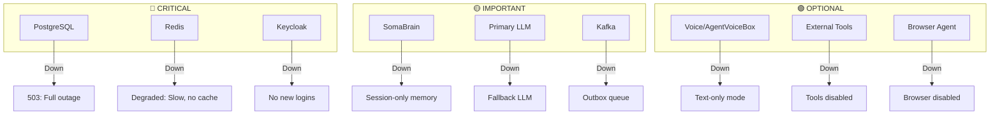

# SRS: Error Handling & Edge Cases

**Document ID:** SA01-SRS-ERROR-HANDLING-2025-12  
**Scope:** All roles, all screens  
**Classification:** REQUIRED

---

## 1. HTTP Error Responses

### 1.1 Standard Error Format

```json
{
  "error": {
    "code": "QUOTA_EXCEEDED",
    "message": "User limit reached for your plan",
    "details": {
      "current": 50,
      "limit": 50,
      "upgrade_url": "/admin/billing/upgrade"
    },
    "request_id": "req_abc123"
  }
}
```

### 1.2 Error Code Mapping

| HTTP | Code | User Message | Recovery Action |
|------|------|--------------|-----------------|
| 400 | VALIDATION_ERROR | "Please fix the errors below" | Highlight invalid fields |
| 400 | INVALID_INPUT | "Invalid input: {field}" | Show field error |
| 401 | UNAUTHENTICATED | "Please log in to continue" | Redirect to /login |
| 401 | TOKEN_EXPIRED | "Session expired. Please log in again." | Redirect to /login |
| 403 | PERMISSION_DENIED | "You don't have access to this resource" | Show what permission is needed |
| 403 | MODE_REQUIRED | "This requires {MODE} mode" | Show mode switch prompt |
| 404 | NOT_FOUND | "{resource} not found" | Back to list / 404 page |
| 409 | CONFLICT | "{resource} already exists" | Suggest alternatives |
| 409 | CONCURRENT_EDIT | "Resource was modified. Refresh to see changes." | Offer refresh |
| 422 | BUSINESS_RULE | "{specific rule violation}" | Explain what to do |
| 429 | RATE_LIMITED | "Too many requests. Wait {X} seconds." | Show countdown |
| 402 | QUOTA_EXCEEDED | "{resource} limit reached. Upgrade plan." | Show upgrade CTA |
| 500 | INTERNAL_ERROR | "Something went wrong. Please try again." | Retry button |
| 502 | BAD_GATEWAY | "Service temporarily unavailable" | Retry with backoff |
| 503 | SERVICE_UNAVAILABLE | "Service is down for maintenance" | Show status page |
| 504 | GATEWAY_TIMEOUT | "Request timed out. Please try again." | Retry button |

---

## 2. Service Degradation Handling

### 2.1 Service Dependencies



### 2.2 Degradation UI Patterns

**Banner Component:**
```html
<degradation-banner>
  <icon>⚠️</icon>
  <title>Some services are unavailable</title>
  <services>
    <service status="degraded">Memory: Session-only</service>
    <service status="down">Voice: Unavailable</service>
  </services>
  <action>View status</action>
</degradation-banner>
```

**Inline Indicators:**
```html
<!-- In chat input -->
<input disabled placeholder="Voice unavailable. Type your message.">

<!-- In memory browser -->
<empty-state>
  <icon>🔌</icon>
  <message>Memory service unavailable</message>
  <detail>Showing cached data from 5 minutes ago</detail>
</empty-state>
```

---

## 3. Authentication Edge Cases

### 3.1 Login Flows

| Scenario | System Response |
|----------|-----------------|
| Wrong password | ❌ "Invalid email or password" (no details) |
| Account locked | ❌ "Account locked. Contact admin." |
| MFA required | Redirect to MFA screen |
| MFA wrong code | ❌ "Invalid code. X attempts remaining." |
| Session on another device | ⚠️ "Continue here? Other session will end." |
| OAuth provider down | ❌ "Google login unavailable. Try email." |
| Keycloak down | ❌ "Authentication service down" + Status link |

### 3.2 Token Handling

| Event | Action |
|-------|--------|
| Token expires during request | Queue request, refresh token, retry |
| Refresh token expired | Redirect to login |
| Token revoked (logout elsewhere) | Show "Logged out" + redirect |
| Invalid token signature | Immediate logout |

---

## 4. Quota & Billing Edge Cases

### 4.1 Quota Warnings

| Threshold | UI Change |
|-----------|-----------|
| 80% used | 🟡 Yellow progress bar |
| 90% used | 🟠 Orange + "Almost at limit" |
| 100% reached | 🔴 Red + Block action + Upgrade CTA |

### 4.2 Billing Scenarios

| Scenario | System Response |
|----------|-----------------|
| Card declined | Email + In-app banner + Grace period |
| Grace period ending | Countdown banner |
| Service suspended | Read-only mode + "Pay to reactivate" |
| Downgrade blocked | "Current usage exceeds new limits" |
| Proration calculation | Show clear breakdown |

---

## 5. Data Validation

### 5.1 Client-Side Validation

| Field Type | Validations |
|------------|-------------|
| Email | Format, required |
| Password | Min 8 chars, complexity |
| Slug | Lowercase, alphanumeric, hyphens only |
| URL | HTTPS required, valid format |
| JSON | Valid syntax |
| File | Type, size limits |

### 5.2 Server-Side Validation Errors

```json
{
  "error": {
    "code": "VALIDATION_ERROR",
    "message": "Please fix the errors below",
    "fields": {
      "email": "Invalid email format",
      "slug": "Slug already exists",
      "password": "Password must be at least 8 characters"
    }
  }
}
```

**UI Display:**
- Scroll to first error
- Highlight field in red
- Show error message below field
- Clear error on field change

---

## 6. Concurrent Editing

### 6.1 Optimistic Locking

**Pattern:**
1. Load resource with `version` field
2. User edits
3. Submit with `version` in request
4. If version mismatch → 409 Conflict
5. UI shows: "Resource was modified. Review changes."

### 6.2 Real-Time Sync

**For shared resources (agents, settings):**
- WebSocket subscription to changes
- Show "Modified by {user}" toast
- Offer "Load latest" or "Overwrite"

---

## 7. Network Error Handling

### 7.1 Connection States

| State | UI Indicator |
|-------|--------------|
| Online | (none - normal) |
| Reconnecting | 🔄 "Reconnecting..." in header |
| Offline | 🔴 "Offline" banner + queue actions |
| Slow connection | 🐌 "Slow connection" indicator |

### 7.2 Retry Strategy

```javascript
const retryConfig = {
  maxAttempts: 3,
  baseDelay: 1000,  // 1s
  maxDelay: 10000,  // 10s
  backoffFactor: 2,
  retryableErrors: [500, 502, 503, 504, 'NETWORK_ERROR']
};
```

**UI During Retry:**
```html
<retry-indicator>
  <message>Retrying... (attempt 2/3)</message>
  <progress-bar></progress-bar>
  <cancel-button>Cancel</cancel-button>
</retry-indicator>
```

---

## 8. Long-Running Operations

### 8.1 Async Operations

| Operation | Expected Duration | UI Pattern |
|-----------|-------------------|------------|
| Agent start | 5-30s | Progress bar + status |
| Memory export | 10-120s | Background task + notification |
| Bulk delete | 5-60s | Progress bar + cancel option |
| File upload | Variable | Upload progress bar |

### 8.2 Progress UI

```html
<async-operation status="running">
  <operation-name>Starting agent...</operation-name>
  <progress value="45" max="100"></progress>
  <status-message>Initializing model...</status-message>
  <cancel-button>Cancel</cancel-button>
</async-operation>
```

---

## 9. Empty States

### 9.1 First-Time User

| Context | Empty State |
|---------|-------------|
| No conversations | "Start your first conversation" + CTA |
| No memories | "Memories will appear as you chat" |
| No agents | "Create your first AI agent" + Tutorial link |
| No users | "Invite team members" + CTA |

### 9.2 No Results

| Context | Empty State |
|---------|-------------|
| Search no results | "No results for '{query}'. Try different terms." |
| Filter no results | "No {items} match your filters. [Clear filters]" |
| Empty audit log | "No activity yet. Events will appear here." |

---

## 10. Error Recovery Actions

### 10.1 Action Buttons by Error

| Error Type | Actions |
|------------|---------|
| Network error | [Retry] |
| Validation error | Fix fields + [Submit] |
| Permission denied | [Request Access] [Go Back] |
| Quota exceeded | [Upgrade Plan] [View Usage] |
| Resource deleted | [Go to List] |
| Session expired | [Log In Again] |
| Service down | [View Status] [Retry Later] |

### 10.2 Automatic Recovery

| Scenario | Auto-Action |
|----------|-------------|
| Token refresh | Transparent retry |
| Network reconnect | Retry pending requests |
| WebSocket disconnect | Auto-reconnect with backoff |
| Service recovery | Clear degradation banner |

---

## 11. Logging & Debugging

### 11.1 Client-Side Error Logging

```javascript
const errorPayload = {
  timestamp: new Date().toISOString(),
  error: error.message,
  stack: error.stack,
  url: window.location.href,
  userId: currentUser?.id,
  tenantId: currentTenant?.id,
  requestId: lastRequestId,
  userAgent: navigator.userAgent
};
```

### 11.2 User-Facing Debug Info

**In error modals (DEV mode only):**
```
Request ID: req_abc123
Timestamp: 2024-12-24T15:45:32Z
[Copy Debug Info] [Report Issue]
```

---

**Next:** [SRS-AUTHENTICATION.md](./SRS-AUTHENTICATION.md)
