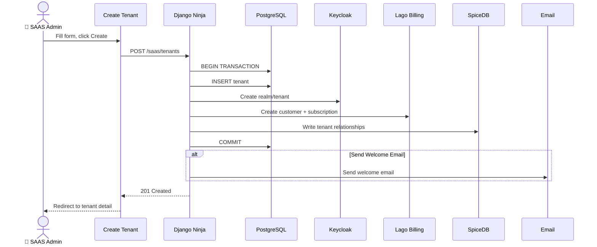

# SRS: Eye of God — Complete SAAS Platform Administration

**Document ID:** SA01-SRS-EOG-COMPLETE-2025-12-25  
**Role:** 🔴 SAAS SysAdmin (God Mode)  
**Permission:** `platform->manage`  
**Routes:** `/saas/*`  
**Status:** CANONICAL

---

## 1. Overview

The **Eye of God** is the super-admin interface for managing the entire SomaAgent platform. It provides complete control over tenants, subscriptions, roles, permissions, and platform health.

### 1.1 Screen Inventory

| # | Screen | Route | Purpose |
|---|--------|-------|---------|
| 1 | Platform Dashboard | `/saas` | Platform overview, KPIs |
| 2 | Tenant List | `/saas/tenants` | Manage all tenants |
| 3 | Create Tenant | `/saas/tenants/new` | Provision new tenant |
| 4 | Tenant Detail | `/saas/tenants/{id}` | View/edit single tenant |
| 5 | Subscription Tiers | `/saas/subscriptions` | Configure pricing tiers |
| 6 | Tier Builder | `/saas/subscriptions/{id}` | Edit tier limits/features |
| 7 | Platform Billing | `/saas/billing` | Revenue, invoices |
| 8 | Platform Health | `/saas/health` | Service status |
| 9 | Role Management | `/saas/roles` | System roles |
| 10 | Permission Browser | `/saas/permissions` | SpiceDB viewer |
| 11 | Audit Trail | `/saas/audit` | All platform events |

---

## 2. Permission Matrix

### 2.1 Platform Permissions (SpiceDB)

```zed
definition saas_admin {
    relation platform: platform
    
    permission manage = platform           // Full control
    permission manage_tenants = platform   // CRUD tenants
    permission manage_tiers = platform     // Subscription tiers
    permission manage_roles = platform     // Role definitions
    permission view_billing = platform     // Revenue data
    permission configure = platform        // Platform settings
    permission impersonate = platform      // Become any user
}
```

### 2.2 Screen Access Matrix

| Screen | manage | manage_tenants | view_billing | impersonate |
|--------|--------|----------------|--------------|-------------|
| Platform Dashboard | ✅ | ✅ | ✅ | - |
| Tenant List | ✅ | ✅ | - | ✅ |
| Create Tenant | ✅ | ✅ | - | - |
| Tenant Detail | ✅ | ✅ | - | ✅ |
| Subscription Tiers | ✅ | - | ✅ | - |
| Platform Billing | ✅ | - | ✅ | - |
| Platform Health | ✅ | - | - | - |
| Role Management | ✅ | - | - | - |
| Permission Browser | ✅ | - | - | - |
| Audit Trail | ✅ | ✅ | - | - |

---

## 3. Screen 1: Platform Dashboard (`/saas`)

### 3.1 Wireframe

```
┌─────────────────────────────────────────────────────────────────────────────┐
│ 🔴 Eye of God                                                    [Logout]   │
├──────────────┬──────────────────────────────────────────────────────────────┤
│              │ PLATFORM DASHBOARD                                           │
│  NAVIGATION  │                                                              │
│  ─────────   │  ┌────────────┐ ┌────────────┐ ┌────────────┐ ┌────────────┐ │
│  Dashboard   │  │ TENANTS    │ │ USERS      │ │ MRR        │ │ UPTIME     │ │
│  Tenants     │  │ 156        │ │ 4,892      │ │ $45,600    │ │ 99.97%     │ │
│  Tiers       │  │ +12 month  │ │ +234 week  │ │ +$2,100    │ │ SLA: 99.9% │ │
│  Billing     │  └────────────┘ └────────────┘ └────────────┘ └────────────┘ │
│  Health      │                                                              │
│  Roles       │  TENANTS BY TIER              SERVICE HEALTH                 │
│  Permissions │  ┌─────────────────────────┐  ┌─────────────────────────────┐│
│  Audit       │  │ Free     ████ 45        │  │ ✅ PostgreSQL    12ms       ││
│              │  │ Starter  ████████ 67    │  │ ✅ Redis         3ms        ││
│              │  │ Team     ██████ 32      │  │ ⚠️ SomaBrain     degraded   ││
│              │  │ Enterp.  ██ 12          │  │ ✅ Keycloak      45ms       ││
│              │  └─────────────────────────┘  │ ✅ Lago          89ms       ││
│              │                               └─────────────────────────────┘│
│              │  RECENT ACTIVITY                                             │
│              │  ┌───────────────────────────────────────────────────────────┤
│              │  │ 10:45 - Tenant "Acme Corp" upgraded to Team               │
│              │  │ 10:32 - New tenant "Beta Inc" created                     │
│              │  │ 10:15 - User john@acme.com suspended                      │
│              │  └───────────────────────────────────────────────────────────┤
└──────────────┴──────────────────────────────────────────────────────────────┘
```

### 3.2 Data Model

```python
class DashboardMetrics(BaseModel):
    total_tenants: int
    total_users: int
    mrr: Decimal
    uptime_percent: float
    tenants_by_tier: dict[str, int]
    
class ServiceHealth(BaseModel):
    name: str
    status: Literal["healthy", "degraded", "down"]
    latency_ms: int
    last_check: datetime

class ActivityEvent(BaseModel):
    timestamp: datetime
    event_type: str
    description: str
    tenant_id: Optional[UUID]
    user_id: Optional[UUID]
```

### 3.3 API Endpoints

| Method | Endpoint | Response |
|--------|----------|----------|
| GET | `/api/v2/saas/dashboard` | DashboardMetrics |
| GET | `/api/v2/saas/health` | List[ServiceHealth] |
| GET | `/api/v2/saas/activity?limit=10` | List[ActivityEvent] |

---

## 4. Screen 2: Tenant List (`/saas/tenants`)

### 4.1 Wireframe

```
┌─────────────────────────────────────────────────────────────────────────────┐
│ 🔴 TENANTS                                              [+ Create Tenant]   │
├─────────────────────────────────────────────────────────────────────────────┤
│ [Search...                    ] [Status ▼] [Tier ▼] [Sort ▼]                │
│                                                                             │
│ ┌─────────────────────────────────────────────────────────────────────────┐ │
│ │ Tenant          │ Owner           │ Tier      │ Users │ Status │ Actions││
│ ├─────────────────────────────────────────────────────────────────────────┤ │
│ │ Acme Corp       │ john@acme.com   │ Team      │ 45/50 │ ✅ Active │ ⋮   ││
│ │ Beta Inc        │ jane@beta.io    │ Starter   │ 8/10  │ ✅ Active │ ⋮   ││
│ │ Gamma LLC       │ bob@gamma.net   │ Enterprise│ 89/∞  │ ⚠️ Payment│ ⋮   ││
│ │ Delta Co        │ sue@delta.org   │ Free      │ 2/3   │ 🔴 Suspended│ ⋮ ││
│ └─────────────────────────────────────────────────────────────────────────┘ │
│                                                                             │
│ Showing 1-4 of 156 tenants                        [< Prev] [1] [2] [Next >] │
└─────────────────────────────────────────────────────────────────────────────┘
```

### 4.2 Data Model

```python
class TenantStatus(str, Enum):
    ACTIVE = "active"
    SUSPENDED = "suspended"
    PENDING = "pending"
    DELETED = "deleted"

class Tenant(models.Model):
    id = models.UUIDField(primary_key=True, default=uuid.uuid4)
    name = models.CharField(max_length=100)
    slug = models.SlugField(unique=True)
    status = models.CharField(choices=TenantStatus.choices, default=TenantStatus.ACTIVE)
    subscription = models.ForeignKey('SubscriptionTier', on_delete=models.PROTECT)
    owner = models.ForeignKey('User', on_delete=models.PROTECT, related_name='owned_tenants')
    created_at = models.DateTimeField(auto_now_add=True)
    updated_at = models.DateTimeField(auto_now=True)
    settings = models.JSONField(default=dict)

class TenantListOut(BaseModel):
    id: UUID
    name: str
    slug: str
    owner_email: str
    tier_name: str
    user_count: int
    user_limit: int
    agent_count: int
    status: TenantStatus
    created_at: datetime
```

### 4.3 API Endpoints

| Method | Endpoint | Purpose |
|--------|----------|---------|
| GET | `/api/v2/saas/tenants?status=&tier=&search=&page=` | List with filters |
| DELETE | `/api/v2/saas/tenants/{id}` | Soft delete |
| POST | `/api/v2/saas/tenants/{id}/suspend` | Suspend tenant |
| POST | `/api/v2/saas/tenants/{id}/activate` | Reactivate |
| POST | `/api/v2/saas/tenants/{id}/impersonate` | Impersonate admin |

### 4.4 Actions Menu

| Action | Permission | Confirmation |
|--------|------------|--------------|
| View | manage_tenants | - |
| Edit | manage_tenants | - |
| Suspend | manage_tenants | "This will block all user logins" |
| Delete | manage | "Type tenant slug to confirm" |
| Impersonate | impersonate | Audit log entry created |

---

## 5. Screen 3: Create Tenant (`/saas/tenants/new`)

### 5.1 Wireframe

```
┌─────────────────────────────────────────────────────────────────────────────┐
│ 🔴 CREATE NEW TENANT                                                        │
├─────────────────────────────────────────────────────────────────────────────┤
│                                                                             │
│  Organization Details                                                       │
│  ─────────────────────                                                      │
│                                                                             │
│  Organization Name *                                                        │
│  ┌─────────────────────────────────────────────────────────────────────┐   │
│  │ Acme Corporation                                                    │   │
│  └─────────────────────────────────────────────────────────────────────┘   │
│                                                                             │
│  Slug (URL identifier) *                                                    │
│  ┌─────────────────────────────────────────────────────────────────────┐   │
│  │ acme-corp                                                           │   │
│  └─────────────────────────────────────────────────────────────────────┘   │
│  Will be accessible at: acme-corp.somaagent.io                             │
│                                                                             │
│  Owner Email *                                                              │
│  ┌─────────────────────────────────────────────────────────────────────┐   │
│  │ admin@acme-corp.com                                                 │   │
│  └─────────────────────────────────────────────────────────────────────┘   │
│                                                                             │
│  Subscription                                                               │
│  ─────────────                                                              │
│                                                                             │
│  Tier *                                                                     │
│  ┌─────────────────────────────────────────────────────────────────────┐   │
│  │ ○ Free ($0)   ○ Starter ($49)   ● Team ($199)   ○ Enterprise       │   │
│  └─────────────────────────────────────────────────────────────────────┘   │
│                                                                             │
│  Options                                                                    │
│  ───────                                                                    │
│  ☑ Send welcome email to owner                                             │
│  ☐ Create default agent ("Assistant")                                      │
│  ☐ Skip payment method (trial)                                             │
│                                                                             │
│                                               [Cancel]  [Create Tenant]     │
└─────────────────────────────────────────────────────────────────────────────┘
```

### 5.2 Form Validation

| Field | Validation | Error Message |
|-------|------------|---------------|
| name | Required, 2-100 chars | "Name must be 2-100 characters" |
| slug | Required, lowercase, unique | "Slug already taken" |
| owner_email | Required, valid email | "Invalid email format" |
| tier | Required | "Select a subscription tier" |

### 5.3 API Endpoint

```python
class TenantCreate(BaseModel):
    name: str = Field(min_length=2, max_length=100)
    slug: str = Field(pattern=r'^[a-z0-9-]+$')
    owner_email: EmailStr
    tier_id: UUID
    send_welcome_email: bool = True
    create_default_agent: bool = False
    skip_payment: bool = False

# POST /api/v2/saas/tenants
# Response: TenantOut with created tenant details
```

### 5.4 Flow Diagram



---

## 6. Screen 4: Tenant Detail (`/saas/tenants/{id}`)

### 6.1 Wireframe

```
┌─────────────────────────────────────────────────────────────────────────────┐
│ 🔴 TENANT: Acme Corporation                                  [← Back]       │
├─────────────────────────────────────────────────────────────────────────────┤
│ [Overview] [Users] [Agents] [Billing] [Settings] [Audit]                    │
│                                                                             │
│  Status: ✅ Active                                                          │
│  Created: Dec 15, 2024                                                      │
│  Owner: admin@acme-corp.com                     [Impersonate] [Suspend]     │
│                                                                             │
│  ┌──────────────────────────────┐  ┌──────────────────────────────────────┐ │
│  │ SUBSCRIPTION                 │  │ USAGE                                │ │
│  │ ─────────────                │  │ ─────                                │ │
│  │ Plan: Team ($199/mo)         │  │ Users:   ████████████░░░ 42/50      │ │
│  │ Billing: Monthly             │  │ Agents:  ██████░░░░░░░░░ 6/10       │ │
│  │ Next: Jan 1, 2025            │  │ Tokens:  ████████░░░░░░░ 5.2M/10M   │ │
│  │ [Change Plan]                │  │ Storage: ████░░░░░░░░░░░ 23GB/100GB │ │
│  └──────────────────────────────┘  └──────────────────────────────────────┘ │
│                                                                             │
│  RECENT AGENTS                                                              │
│  ┌─────────────────────────────────────────────────────────────────────────┐│
│  │ Agent               │ Model    │ Status   │ Sessions │ Actions         ││
│  │ CustomerSupport-AI  │ GPT-4o   │ ✅ Active │ 234      │ [Configure]    ││
│  │ Sales-Bot           │ Claude   │ ✅ Active │ 89       │ [Configure]    ││
│  │ Internal-Assistant  │ GPT-4o   │ 🔴 Error  │ 0        │ [View Logs]    ││
│  └─────────────────────────────────────────────────────────────────────────┘│
│                                                                             │
│  ⚠️ DANGER ZONE                                                             │
│  ┌─────────────────────────────────────────────────────────────────────────┐│
│  │ [Delete Tenant] - Permanently delete this tenant and all data          ││
│  └─────────────────────────────────────────────────────────────────────────┘│
└─────────────────────────────────────────────────────────────────────────────┘
```

### 6.2 Data Model

```python
class TenantDetail(BaseModel):
    id: UUID
    name: str
    slug: str
    status: TenantStatus
    owner: UserSummary
    subscription: SubscriptionSummary
    usage: UsageMetrics
    agents: List[AgentSummary]
    created_at: datetime
    settings: dict

class UsageMetrics(BaseModel):
    users_current: int
    users_limit: int
    agents_current: int
    agents_limit: int
    tokens_current: int
    tokens_limit: int
    storage_gb_current: float
    storage_gb_limit: float
```

---

## 7. Screen 5: Subscription Tiers (`/saas/subscriptions`)

### 7.1 Wireframe

```
┌─────────────────────────────────────────────────────────────────────────────┐
│ 🔴 SUBSCRIPTION TIERS                                        [+ New Tier]   │
├─────────────────────────────────────────────────────────────────────────────┤
│                                                                             │
│ ┌───────────────┐ ┌───────────────┐ ┌───────────────┐ ┌───────────────┐    │
│ │     FREE      │ │    STARTER    │ │     TEAM      │ │  ENTERPRISE   │    │
│ │     $0/mo     │ │    $49/mo     │ │   $199/mo     │ │   Custom      │    │
│ ├───────────────┤ ├───────────────┤ ├───────────────┤ ├───────────────┤    │
│ │               │ │               │ │               │ │               │    │
│ │ Agents: 1     │ │ Agents: 3     │ │ Agents: 10    │ │ Agents: ∞     │    │
│ │ Users: 3      │ │ Users: 10     │ │ Users: 50     │ │ Users: ∞      │    │
│ │ Tokens: 100K  │ │ Tokens: 1M    │ │ Tokens: 10M   │ │ Tokens: ∞     │    │
│ │ Storage: 1GB  │ │ Storage: 10GB │ │ Storage: 100GB│ │ Storage: ∞    │    │
│ │               │ │               │ │               │ │               │    │
│ ├───────────────┤ ├───────────────┤ ├───────────────┤ ├───────────────┤    │
│ │ FEATURES:     │ │ FEATURES:     │ │ FEATURES:     │ │ FEATURES:     │    │
│ │ ☐ Voice       │ │ ☑ Voice       │ │ ☑ Voice       │ │ ☑ Voice       │    │
│ │ ☐ DEV Mode    │ │ ☐ DEV Mode    │ │ ☑ DEV Mode    │ │ ☑ DEV Mode    │    │
│ │ ☐ TRN Mode    │ │ ☐ TRN Mode    │ │ ☑ TRN Mode    │ │ ☑ TRN Mode    │    │
│ │ ☐ API Access  │ │ ☑ API Access  │ │ ☑ API Access  │ │ ☑ API Access  │    │
│ │ ☐ SSO         │ │ ☐ SSO         │ │ ☐ SSO         │ │ ☑ SSO         │    │
│ │ ☐ SLA         │ │ ☐ SLA         │ │ ☐ SLA         │ │ ☑ SLA         │    │
│ ├───────────────┤ ├───────────────┤ ├───────────────┤ ├───────────────┤    │
│ │ Tenants: 45   │ │ Tenants: 67   │ │ Tenants: 32   │ │ Tenants: 12   │    │
│ │ [Edit]        │ │ [Edit]        │ │ [Edit]        │ │ [Edit]        │    │
│ └───────────────┘ └───────────────┘ └───────────────┘ └───────────────┘    │
│                                                                             │
│ 📊 MRR by Tier: $0 | $3,283 | $6,368 | $35,988 = $45,639                   │
└─────────────────────────────────────────────────────────────────────────────┘
```

### 7.2 Data Model

```python
class SubscriptionTier(models.Model):
    id = models.UUIDField(primary_key=True, default=uuid.uuid4)
    name = models.CharField(max_length=50)
    slug = models.SlugField(unique=True)
    
    # Limits
    max_agents = models.IntegerField()
    max_users = models.IntegerField()
    max_tokens_per_month = models.BigIntegerField()
    max_storage_gb = models.IntegerField()
    
    # Pricing
    price_monthly = models.DecimalField(max_digits=10, decimal_places=2)
    price_yearly = models.DecimalField(max_digits=10, decimal_places=2, null=True)
    lago_plan_code = models.CharField(max_length=50)
    
    # Features (JSON)
    features = models.JSONField(default=dict)
    # {"voice": true, "dev_mode": true, "api_access": true, ...}
    
    is_visible = models.BooleanField(default=True)
    sort_order = models.IntegerField(default=0)
```

---

## 8. Screen 6: Platform Health (`/saas/health`)

### 8.1 Wireframe

```
┌─────────────────────────────────────────────────────────────────────────────┐
│ 🔴 PLATFORM HEALTH                                       [Refresh] [Export] │
├─────────────────────────────────────────────────────────────────────────────┤
│                                                                             │
│  Overall Status: ⚠️ DEGRADED (1 service impacted)                          │
│                                                                             │
│  ┌─────────────────────────────────────────────────────────────────────────┐│
│  │ Service          │ Status     │ Latency │ Last Check │ Actions         ││
│  ├─────────────────────────────────────────────────────────────────────────┤│
│  │ 🔵 PostgreSQL    │ ✅ Healthy │ 12ms    │ 10s ago    │ [Details]       ││
│  │ 🔵 Redis         │ ✅ Healthy │ 3ms     │ 10s ago    │ [Details]       ││
│  │ 🔵 Keycloak      │ ✅ Healthy │ 45ms    │ 10s ago    │ [Details]       ││
│  │ 🟡 SomaBrain     │ ⚠️ Degraded│ 850ms   │ 10s ago    │ [Details]       ││
│  │ 🔵 Lago          │ ✅ Healthy │ 89ms    │ 10s ago    │ [Details]       ││
│  │ 🔵 Kafka         │ ✅ Healthy │ 15ms    │ 10s ago    │ [Details]       ││
│  │ 🔵 Temporal      │ ✅ Healthy │ 23ms    │ 10s ago    │ [Details]       ││
│  │ 🔵 Milvus        │ ✅ Healthy │ 67ms    │ 10s ago    │ [Details]       ││
│  └─────────────────────────────────────────────────────────────────────────┘│
│                                                                             │
│  DEGRADATION DETAILS                                                        │
│  ┌─────────────────────────────────────────────────────────────────────────┐│
│  │ ⚠️ SomaBrain                                                            ││
│  │ Status: DEGRADED (high latency)                                         ││
│  │ Impact: Memory operations delayed. Session-only mode active.            ││
│  │ Started: Dec 25, 2024 07:30:00                                          ││
│  │ Duration: 15 minutes                                                    ││
│  │ Pending memories: 234                                                   ││
│  │ [View Outbox Queue] [Force Sync]                                        ││
│  └─────────────────────────────────────────────────────────────────────────┘│
└─────────────────────────────────────────────────────────────────────────────┘
```

### 8.2 Health Check Thresholds

| Service | Healthy | Degraded | Down |
|---------|---------|----------|------|
| PostgreSQL | < 50ms | < 500ms | timeout |
| Redis | < 10ms | < 100ms | timeout |
| Keycloak | < 500ms | < 2000ms | timeout |
| SomaBrain | < 200ms | < 1000ms | timeout |
| Lago | < 500ms | < 2000ms | timeout |

---

## 9. Screen 7: Role Management (`/saas/roles`)

### 9.1 Wireframe

```
┌─────────────────────────────────────────────────────────────────────────────┐
│ 🔴 ROLE MANAGEMENT                                       [+ Create Role]    │
├─────────────────────────────────────────────────────────────────────────────┤
│ [System Roles] [Custom Roles]                                               │
│                                                                             │
│  SYSTEM ROLES (read-only)                                                   │
│  ┌─────────────────────────────────────────────────────────────────────────┐│
│  │ Role               │ Level    │ Users │ Tenants │ Actions              ││
│  ├─────────────────────────────────────────────────────────────────────────┤│
│  │ 🔴 SAAS SysAdmin   │ Platform │ 3     │ ALL     │ [View] 🔒            ││
│  │ 🟠 Tenant SysAdmin │ Tenant   │ 156   │ 156     │ [View] [Edit]        ││
│  │ 🟡 Tenant Admin    │ Tenant   │ 234   │ 98      │ [View] [Edit]        ││
│  │ 🟢 Agent Owner     │ Agent    │ 445   │ 120     │ [View] [Edit]        ││
│  │ 🔵 Developer       │ Agent    │ 892   │ 87      │ [View] [Edit]        ││
│  │ 🟣 Trainer         │ Agent    │ 234   │ 45      │ [View] [Edit]        ││
│  │ ⚪ User            │ Agent    │ 4,567 │ 145     │ [View] [Edit]        ││
│  │ ⚫ Viewer          │ Agent    │ 1,234 │ 78      │ [View] [Edit]        ││
│  └─────────────────────────────────────────────────────────────────────────┘│
│                                                                             │
│  CUSTOM ROLES                                                               │
│  ┌─────────────────────────────────────────────────────────────────────────┐│
│  │ 🟤 Auditor         │ Tenant   │ 45    │ 12      │ [View] [Edit] [Del]  ││
│  │ 🟤 Billing Admin   │ Tenant   │ 23    │ 8       │ [View] [Edit] [Del]  ││
│  └─────────────────────────────────────────────────────────────────────────┘│
└─────────────────────────────────────────────────────────────────────────────┘
```

---

## 10. User Journey Flow (Complete UML)

```mermaid
flowchart TD
    subgraph Login
        A[SAAS Admin Login] --> B{Authenticated?}
        B -->|No| C[Redirect to Keycloak]
        B -->|Yes| D[Load Dashboard]
    end

    subgraph Dashboard["/saas Dashboard"]
        D --> E{Quick Action?}
        E -->|View Tenants| F[/saas/tenants]
        E -->|View Health| G[/saas/health]
        E -->|View Billing| H[/saas/billing]
    end

    subgraph TenantMgmt["Tenant Management"]
        F --> I{Action?}
        I -->|Create| J[/saas/tenants/new]
        I -->|View| K[/saas/tenants/{id}]
        I -->|Suspend| L[Confirm Modal]
        I -->|Impersonate| M[Redirect as Tenant Admin]
        
        J --> N[Fill Form]
        N --> O{Valid?}
        O -->|Yes| P[Create in DB+Keycloak+Lago+SpiceDB]
        O -->|No| N
        P --> K
        
        L --> Q{Confirmed?}
        Q -->|Yes| R[Update Status + Invalidate Sessions]
        Q -->|No| F
    end

    subgraph SubscriptionMgmt["Subscription Management"]
        S[/saas/subscriptions] --> T{Action?}
        T -->|Edit Tier| U[/saas/subscriptions/{id}]
        T -->|New Tier| V[Tier Builder Modal]
        
        U --> W[Modify Limits/Features]
        W --> X{Sync to Lago?}
        X -->|Yes| Y[Update Lago Plan]
        X -->|Failed| Z[⚠️ Local only, sync pending]
    end

    subgraph HealthMonitor["Health Monitoring"]
        G --> AA[Real-time Status]
        AA --> AB{Service Degraded?}
        AB -->|Yes| AC[Show Degradation Details]
        AB -->|No| AD[All Green]
        AC --> AE[View Outbox Queue]
        AC --> AF[Force Sync Option]
    end

    M --> AG[Exit Impersonation Banner]
    AG --> D
```

---

## 11. API Summary

| # | Endpoint | Method | Permission |
|---|----------|--------|------------|
| 1 | `/api/v2/saas/dashboard` | GET | platform->manage |
| 2 | `/api/v2/saas/health` | GET | platform->manage |
| 3 | `/api/v2/saas/tenants` | GET | platform->manage_tenants |
| 4 | `/api/v2/saas/tenants` | POST | platform->manage_tenants |
| 5 | `/api/v2/saas/tenants/{id}` | GET | platform->manage_tenants |
| 6 | `/api/v2/saas/tenants/{id}` | PUT | platform->manage_tenants |
| 7 | `/api/v2/saas/tenants/{id}` | DELETE | platform->manage |
| 8 | `/api/v2/saas/tenants/{id}/suspend` | POST | platform->manage_tenants |
| 9 | `/api/v2/saas/tenants/{id}/activate` | POST | platform->manage_tenants |
| 10 | `/api/v2/saas/tenants/{id}/impersonate` | POST | platform->impersonate |
| 11 | `/api/v2/saas/subscriptions` | GET | platform->manage_tiers |
| 12 | `/api/v2/saas/subscriptions` | POST | platform->manage_tiers |
| 13 | `/api/v2/saas/subscriptions/{id}` | PUT | platform->manage_tiers |
| 14 | `/api/v2/saas/billing` | GET | platform->view_billing |
| 15 | `/api/v2/saas/roles` | GET | platform->manage_roles |
| 16 | `/api/v2/saas/roles` | POST | platform->manage_roles |
| 17 | `/api/v2/saas/audit` | GET | platform->manage |

---

## 12. Next: Tenant Admin Story

After Eye of God, the logical progression is:
1. **Tenant Admin** (`/admin/*`) - Manage users, agents, billing within tenant
2. **Agent User** (`/chat/*`, `/memory/*`) - End user experience

---

**Last Updated:** 2025-12-25  
**Created By:** Gemini Agent  
**Status:** CANONICAL
