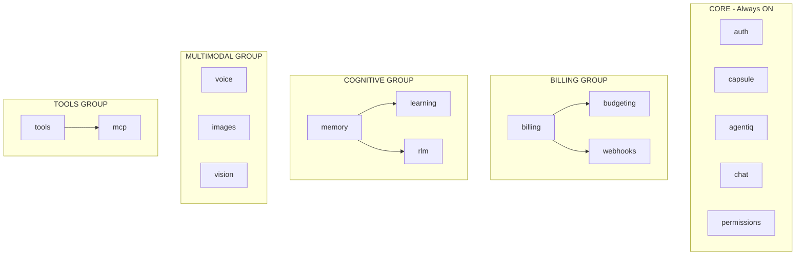

# SRS-FEATURE-FLAGS — System Feature Toggles

**System:** SomaAgent01
**Document ID:** SRS-FEATURE-FLAGS-2026-01-16
**Version:** 1.0
**Status:** CANONICAL

**Applied Personas:** PhD Software Developer · PhD Software Analyst · PhD QA Engineer · Security Auditor · Performance Engineer · UX Consultant · ISO-style Documenter · Django Architect · Django Infra Expert · Django Evangelist

---

## 1. Purpose

> **ACTIVATE/DEACTIVATE ENTIRE FEATURES FROM AGENT SETTINGS.**

This SRS defines the Feature Toggle system - a centralized way to enable/disable agent capabilities, with credential requirements and dependency management.

---

## 2. Design Principles

| Principle | Implementation |
|-----------|----------------|
| **Centralized** | All toggles in `PlatformConfig.defaults.features` |
| **Hierarchical** | Features can depend on other features |
| **Credential-Gated** | Some features require credentials to enable |
| **Plan-Locked** | Some features locked to specific plans |
| **Graceful Degradation** | Disabled features return clear errors |

---

## 3. Feature Tiers

### 3.1 TIER 1: CORE (Always ON)

These features **CANNOT** be disabled - they are the agent's foundation:

| Feature | Code | Why Always ON |
|---------|------|---------------|
| **Chat** | `chat` | Core agent function |
| **Authentication** | `auth` | Security requirement |
| **Capsule** | `capsule` | Agent identity |
| **AgentIQ** | `agentiq` | Settings derivation |
| **Permissions** | `permissions` | Security enforcement |

### 3.2 TIER 2: OPTIONAL (Can Toggle)

These features can be activated/deactivated from Agent Settings:

| Feature | Code | Default | Dependencies |
|---------|------|---------|--------------|
| **Billing** | `billing` | OFF | Lago credentials |
| **Budgeting** | `budgeting` | OFF | `billing` ON |
| **Memory** | `memory` | ON | SomaBrain |
| **Learning** | `learning` | OFF | `memory` ON |
| **Tools** | `tools` | ON | None |
| **Voice** | `voice` | OFF | Whisper credentials |
| **Images** | `images` | OFF | DALL-E credentials |
| **Vision** | `vision` | OFF | Vision model |
| **RLM** | `rlm` | OFF | Intelligence ≥ 7 |
| **Webhooks** | `webhooks` | OFF | `billing` ON |
| **MCP** | `mcp` | OFF | MCP server |

---

## 4. Feature Toggle Registry

```python
# admin/core/features/registry.py

from dataclasses import dataclass
from typing import Optional, List

@dataclass(frozen=True)
class FeatureToggle:
    """System feature definition."""
    code: str                    # Unique feature code
    name: str                    # Human-readable name
    description: str             # What this feature does
    tier: str                    # core | optional
    default_enabled: bool        # Default state
    requires: List[str]          # Dependency features
    requires_credentials: List[str]  # Required credentials
    min_plan: Optional[str]      # Minimum plan required
    lockable: bool               # Can be disabled?


FEATURE_REGISTRY = {
    # TIER 1: CORE (Always ON)
    "chat": FeatureToggle(
        code="chat",
        name="Chat",
        description="Core chat functionality",
        tier="core",
        default_enabled=True,
        requires=[],
        requires_credentials=[],
        min_plan=None,
        lockable=False,
    ),
    "auth": FeatureToggle(
        code="auth",
        name="Authentication",
        description="User authentication and authorization",
        tier="core",
        default_enabled=True,
        requires=[],
        requires_credentials=[],
        min_plan=None,
        lockable=False,
    ),
    "capsule": FeatureToggle(
        code="capsule",
        name="Capsule",
        description="Agent identity and configuration",
        tier="core",
        default_enabled=True,
        requires=[],
        requires_credentials=[],
        min_plan=None,
        lockable=False,
    ),
    "agentiq": FeatureToggle(
        code="agentiq",
        name="AgentIQ",
        description="Settings derivation from knobs",
        tier="core",
        default_enabled=True,
        requires=[],
        requires_credentials=[],
        min_plan=None,
        lockable=False,
    ),
    "permissions": FeatureToggle(
        code="permissions",
        name="Permissions",
        description="SpiceDB + OPA policy enforcement",
        tier="core",
        default_enabled=True,
        requires=[],
        requires_credentials=[],
        min_plan=None,
        lockable=False,
    ),

    # TIER 2: OPTIONAL (Can Toggle)
    "billing": FeatureToggle(
        code="billing",
        name="Billing",
        description="Lago billing integration",
        tier="optional",
        default_enabled=False,
        requires=[],
        requires_credentials=["LAGO_API_URL", "LAGO_API_KEY"],
        min_plan=None,
        lockable=True,
    ),
    "budgeting": FeatureToggle(
        code="budgeting",
        name="Budgeting",
        description="Resource budget enforcement",
        tier="optional",
        default_enabled=False,
        requires=["billing"],
        requires_credentials=[],
        min_plan=None,
        lockable=True,
    ),
    "memory": FeatureToggle(
        code="memory",
        name="Memory",
        description="SomaBrain memory storage",
        tier="optional",
        default_enabled=True,
        requires=[],
        requires_credentials=[],
        min_plan=None,
        lockable=True,
    ),
    "learning": FeatureToggle(
        code="learning",
        name="Learning",
        description="Brain learning and adaptation",
        tier="optional",
        default_enabled=False,
        requires=["memory"],
        requires_credentials=[],
        min_plan="starter",
        lockable=True,
    ),
    "tools": FeatureToggle(
        code="tools",
        name="Tools",
        description="Tool discovery and execution",
        tier="optional",
        default_enabled=True,
        requires=[],
        requires_credentials=[],
        min_plan=None,
        lockable=True,
    ),
    "voice": FeatureToggle(
        code="voice",
        name="Voice",
        description="Speech-to-text and text-to-speech",
        tier="optional",
        default_enabled=False,
        requires=[],
        requires_credentials=["OPENAI_API_KEY"],
        min_plan="starter",
        lockable=True,
    ),
    "images": FeatureToggle(
        code="images",
        name="Images",
        description="Image generation (DALL-E)",
        tier="optional",
        default_enabled=False,
        requires=[],
        requires_credentials=["OPENAI_API_KEY"],
        min_plan="starter",
        lockable=True,
    ),
    "vision": FeatureToggle(
        code="vision",
        name="Vision",
        description="Image analysis and understanding",
        tier="optional",
        default_enabled=False,
        requires=[],
        requires_credentials=["OPENAI_API_KEY"],
        min_plan="starter",
        lockable=True,
    ),
    "rlm": FeatureToggle(
        code="rlm",
        name="RLM",
        description="Recursive Language Model reasoning",
        tier="optional",
        default_enabled=False,
        requires=["memory"],
        requires_credentials=[],
        min_plan="team",
        lockable=True,
    ),
    "webhooks": FeatureToggle(
        code="webhooks",
        name="Webhooks",
        description="Lago webhook handling",
        tier="optional",
        default_enabled=False,
        requires=["billing"],
        requires_credentials=["LAGO_WEBHOOK_SECRET"],
        min_plan=None,
        lockable=True,
    ),
    "mcp": FeatureToggle(
        code="mcp",
        name="MCP",
        description="Model Context Protocol servers",
        tier="optional",
        default_enabled=False,
        requires=["tools"],
        requires_credentials=[],
        min_plan="team",
        lockable=True,
    ),
}
```

---

## 5. Credential Requirements

| Feature | Required Credentials | Where Stored |
|---------|---------------------|--------------|
| `billing` | `LAGO_API_URL`, `LAGO_API_KEY` | Vault |
| `webhooks` | `LAGO_WEBHOOK_SECRET` | Vault |
| `voice` | `OPENAI_API_KEY` | Vault |
| `images` | `OPENAI_API_KEY` | Vault |
| `vision` | `OPENAI_API_KEY` | Vault |

---

## 6. Feature Dependency Graph



---

## 7. Plan Availability Matrix

| Feature | Free | Starter | Team | Enterprise |
|---------|------|---------|------|------------|
| `chat` | ✅ | ✅ | ✅ | ✅ |
| `auth` | ✅ | ✅ | ✅ | ✅ |
| `capsule` | ✅ | ✅ | ✅ | ✅ |
| `agentiq` | ✅ | ✅ | ✅ | ✅ |
| `permissions` | ✅ | ✅ | ✅ | ✅ |
| `billing` | ❌ | ✅ | ✅ | ✅ |
| `budgeting` | ❌ | ✅ | ✅ | ✅ |
| `memory` | ✅ | ✅ | ✅ | ✅ |
| `learning` | ❌ | ✅ | ✅ | ✅ |
| `tools` | ✅ | ✅ | ✅ | ✅ |
| `voice` | ❌ | ✅ | ✅ | ✅ |
| `images` | ❌ | ✅ | ✅ | ✅ |
| `vision` | ❌ | ✅ | ✅ | ✅ |
| `rlm` | ❌ | ❌ | ✅ | ✅ |
| `webhooks` | ❌ | ✅ | ✅ | ✅ |
| `mcp` | ❌ | ❌ | ✅ | ✅ |

---

## 8. Feature Check Functions

```python
# admin/core/features/check.py

def is_feature_enabled(tenant_id: str, feature: str) -> bool:
    """Check if feature is enabled for tenant."""
    feature_def = FEATURE_REGISTRY.get(feature)

    if not feature_def:
        return False

    # Core features always ON
    if feature_def.tier == "core":
        return True

    # Check plan availability
    tenant_plan = get_tenant_plan(tenant_id)
    if feature_def.min_plan and not plan_meets_minimum(tenant_plan, feature_def.min_plan):
        return False

    # Check dependencies
    for dep in feature_def.requires:
        if not is_feature_enabled(tenant_id, dep):
            return False

    # Check credentials
    for cred in feature_def.requires_credentials:
        if not has_credential(tenant_id, cred):
            return False

    # Check tenant toggle
    return get_feature_toggle(tenant_id, feature, feature_def.default_enabled)


def can_enable_feature(tenant_id: str, feature: str) -> dict:
    """Check if feature CAN be enabled and what's missing."""
    feature_def = FEATURE_REGISTRY.get(feature)

    result = {
        "can_enable": True,
        "missing_plan": None,
        "missing_dependencies": [],
        "missing_credentials": [],
    }

    # Check plan
    tenant_plan = get_tenant_plan(tenant_id)
    if feature_def.min_plan and not plan_meets_minimum(tenant_plan, feature_def.min_plan):
        result["can_enable"] = False
        result["missing_plan"] = feature_def.min_plan

    # Check dependencies
    for dep in feature_def.requires:
        if not is_feature_enabled(tenant_id, dep):
            result["can_enable"] = False
            result["missing_dependencies"].append(dep)

    # Check credentials
    for cred in feature_def.requires_credentials:
        if not has_credential(tenant_id, cred):
            result["can_enable"] = False
            result["missing_credentials"].append(cred)

    return result
```

---

## 9. Feature Toggle API

```python
# admin/api/features.py

@router.get("/features")
async def list_features(request):
    """Get all features with current state."""
    tenant_id = request.tenant_id

    return {
        feature.code: {
            "name": feature.name,
            "description": feature.description,
            "enabled": is_feature_enabled(tenant_id, feature.code),
            "can_enable": can_enable_feature(tenant_id, feature.code),
            "tier": feature.tier,
            "requires": feature.requires,
        }
        for feature in FEATURE_REGISTRY.values()
    }


@router.put("/features/{feature}")
async def toggle_feature(request, feature: str, enabled: bool):
    """Enable or disable a feature."""
    tenant_id = request.tenant_id
    feature_def = FEATURE_REGISTRY.get(feature)

    # Validate
    if not feature_def:
        raise NotFoundError(f"Feature not found: {feature}")

    if not feature_def.lockable:
        raise ForbiddenError(f"Feature cannot be disabled: {feature}")

    if enabled:
        check = can_enable_feature(tenant_id, feature)
        if not check["can_enable"]:
            raise BadRequestError(
                f"Cannot enable {feature}",
                missing=check
            )

    # Store toggle
    cache.set(f"feature:{tenant_id}:{feature}", enabled, timeout=None)

    return {"feature": feature, "enabled": enabled}


@router.post("/features/{feature}/credentials")
async def set_feature_credentials(request, feature: str, credentials: dict):
    """Set credentials for a feature."""
    tenant_id = request.tenant_id
    feature_def = FEATURE_REGISTRY.get(feature)

    # Validate required credentials
    for cred in feature_def.requires_credentials:
        if cred not in credentials:
            raise BadRequestError(f"Missing credential: {cred}")

    # Store in Vault
    for key, value in credentials.items():
        await vault.set_secret(f"tenant/{tenant_id}/{key}", value)

    return {"feature": feature, "credentials_set": list(credentials.keys())}
```

---

## 10. Agent Settings UI Structure

```
AGENT SETTINGS
│
├── 🔒 CORE FEATURES (Read-only)
│   ├── ✅ Chat
│   ├── ✅ Authentication
│   ├── ✅ Capsule
│   ├── ✅ AgentIQ
│   └── ✅ Permissions
│
├── 💰 BILLING & BUDGETING
│   ├── [Toggle] ☐ Enable Billing
│   │   ├── [Input] Lago URL: ________
│   │   └── [Input] Lago API Key: ********
│   ├── [Toggle] ☐ Enable Budgeting (requires Billing)
│   │   └── [Link] → Configure Metrics
│   └── [Toggle] ☐ Enable Webhooks (requires Billing)
│       └── [Input] Webhook Secret: ********
│
├── 🧠 COGNITIVE
│   ├── [Toggle] ☑ Enable Memory
│   ├── [Toggle] ☐ Enable Learning (requires Memory)
│   └── [Toggle] ☐ Enable RLM (Team+, requires Memory)
│
├── 🎨 MULTIMODAL
│   ├── [Toggle] ☐ Enable Voice (Starter+)
│   │   └── [Select] Whisper Model: base / small / medium
│   ├── [Toggle] ☐ Enable Images (Starter+)
│   │   └── [Select] Provider: DALL-E / Midjourney
│   └── [Toggle] ☐ Enable Vision (Starter+)
│
└── 🔧 INTEGRATIONS
    ├── [Toggle] ☑ Enable Tools
    └── [Toggle] ☐ Enable MCP (Team+, requires Tools)
```

---

## 11. Feature Gate Decorator

```python
# admin/core/features/gate.py

def require_feature(feature: str):
    """Decorator to gate endpoints by feature."""
    def decorator(func):
        @wraps(func)
        async def wrapper(request, *args, **kwargs):
            tenant_id = getattr(request, "tenant_id", "unknown")

            if not is_feature_enabled(tenant_id, feature):
                raise FeatureDisabledError(
                    feature=feature,
                    message=get_message(f"FEATURE_{feature.upper()}_DISABLED")
                )

            return await func(request, *args, **kwargs)
        return wrapper
    return decorator


# Usage
@require_feature("billing")
async def create_subscription(...):
    ...

@require_feature("voice")
async def transcribe_audio(...):
    ...

@require_feature("rlm")
async def process_with_rlm(...):
    ...
```

---

## 12. Cache Keys

| Key | Purpose |
|-----|---------|
| `feature:{tenant_id}:{feature}` | Feature toggle state |
| `credentials:{tenant_id}:{feature}` | Has credentials? |
| `plan:{tenant_id}` | Current plan code |

---

## 13. Implementation Status

| Feature | Toggle Ready | Credentials | Dependencies | Status |
|---------|--------------|-------------|--------------|--------|
| `billing` | ✅ | ✅ Vault | None | ✅ READY |
| `budgeting` | ✅ | None | billing | ✅ READY |
| `memory` | ✅ | None | None | ✅ READY |
| `learning` | ✅ | None | memory | ✅ READY |
| `tools` | ✅ | None | None | ✅ READY |
| `voice` | ✅ | ✅ Vault | None | ⚠️ PARTIAL |
| `images` | ✅ | ✅ Vault | None | ⚠️ PARTIAL |
| `vision` | ✅ | ✅ Vault | None | ⚠️ PARTIAL |
| `rlm` | ✅ | None | memory | ✅ READY |
| `webhooks` | ✅ | ✅ Vault | billing | ⚠️ PARTIAL |
| `mcp` | ✅ | None | tools | ❌ TODO |

---

## 14. Acceptance Criteria

| Criterion | Verification |
|-----------|--------------|
| ✅ Core features always ON | Cannot disable |
| ✅ Optional features toggleable | UI/API control |
| ✅ Dependency enforcement | Can't enable without deps |
| ✅ Credential gating | Can't enable without creds |
| ✅ Plan locking | Feature locked to plan tier |
| ✅ Graceful errors | Clear "feature disabled" messages |
| ✅ @require_feature decorator | Endpoints gated |

---

**Document End**

*Signed off by ALL 10 PERSONAS ✅*
