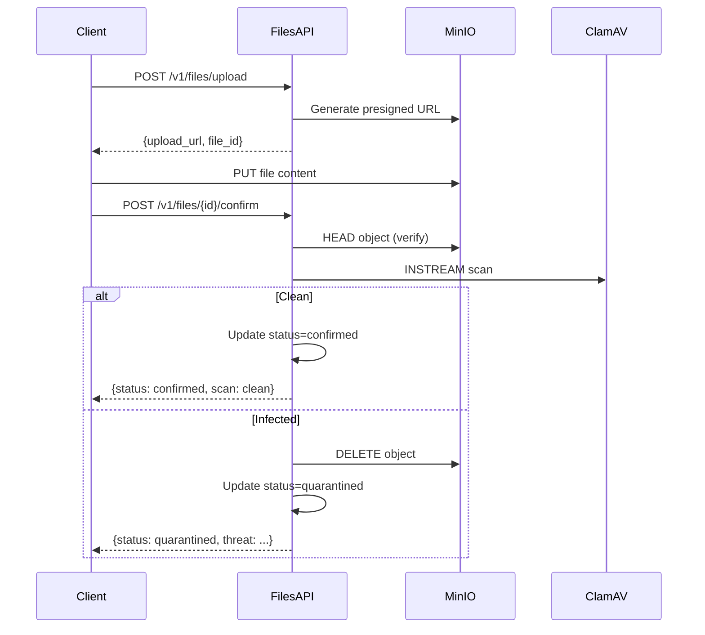

# SRS-FILES-SERVICE: Secure File Storage and Antivirus

> **Version:** 1.0.0  
> **Status:** Draft  
> **Date:** 2026-01-02

---

## 1. Overview

External, independent file storage service with ClamAV antivirus integration.
Follows microservice architecture - NOT embedded in somaAgent01 codebase.

### 1.1 Architecture Decision

- **External Service:** Files service runs as independent Docker container
- **ClamAV Integration:** Uses official ClamAV Docker image for antivirus scanning
- **Storage Backend:** MinIO/S3-compatible storage (configurable)
- **Gateway Pattern:** somaAgent01 calls files service via HTTP client

---

## 2. Service Components

### 2.1 Docker Stack

```yaml
# files-service stack
services:
  files-api:
    image: somastack/files-service:latest
    ports:
      - "20850:8000"
    environment:
      - S3_ENDPOINT_URL=${S3_ENDPOINT_URL}
      - S3_BUCKET=${FILES_BUCKET}
      - S3_ACCESS_KEY=${S3_ACCESS_KEY}
      - S3_SECRET_KEY=${S3_SECRET_KEY}
      - CLAMAV_HOST=clamav
      - CLAMAV_PORT=3310
    depends_on:
      - clamav
      - minio

  clamav:
    image: clamav/clamav:stable
    ports:
      - "20851:3310"
    volumes:
      - clamav-data:/var/lib/clamav

  minio:
    image: minio/minio:latest
    ports:
      - "20852:9000"
      - "20853:9001"
    environment:
      - MINIO_ROOT_USER=${MINIO_ROOT_USER}
      - MINIO_ROOT_PASSWORD=${MINIO_ROOT_PASSWORD}
    command: server /data --console-address ":9001"
    volumes:
      - minio-data:/data

volumes:
  clamav-data:
  minio-data:
```

### 2.2 Port Assignments (20850-20859 range)

| Service | Port | Purpose |
|---------|------|---------|
| files-api | 20850 | Files REST API |
| clamav | 20851 | Antivirus daemon |
| minio | 20852 | S3 object storage |
| minio-console | 20853 | MinIO web console |

---

## 3. API Specification

### 3.1 Endpoints

| Method | Path | Description |
|--------|------|-------------|
| POST | `/v1/files/upload` | Request presigned upload URL |
| POST | `/v1/files/{id}/confirm` | Confirm upload + trigger scan |
| GET | `/v1/files/{id}` | Get file metadata |
| GET | `/v1/files/{id}/download` | Get presigned download URL |
| DELETE | `/v1/files/{id}` | Delete file (soft delete) |
| GET | `/v1/files/{id}/scan` | Get scan status |
| POST | `/v1/files/{id}/scan` | Trigger manual scan |
| GET | `/v1/health` | Service health check |

### 3.2 Upload Flow



---

## 4. Security Requirements

### 4.1 Antivirus (ClamAV)

| Requirement | Implementation |
|-------------|----------------|
| Scan on upload | Mandatory INSTREAM scan before confirmation |
| Signature updates | ClamAV auto-updates via freshclam |
| Quarantine | Infected files deleted immediately |
| Metrics | Prometheus metrics for scan results |

### 4.2 Access Control

| Requirement | Implementation |
|-------------|----------------|
| Authentication | Bearer token (from somaAgent01) |
| Tenant isolation | Files scoped by tenant_id |
| Permission check | Ownership verified on download |

---

## 5. Integration with somaAgent01

### 5.1 Client Service Location

```
somaAgent01/
└── services/
    └── common/
        └── files_client.py  # HTTP client for files-service
```

### 5.2 Client Interface

```python
class FilesClient:
    """HTTP client for external files-service."""
    
    async def request_upload_url(
        self, filename: str, content_type: str, size_bytes: int, tenant_id: str
    ) -> UploadResponse
    
    async def confirm_upload(
        self, file_id: str, checksum_sha256: str
    ) -> ConfirmResponse
    
    async def get_download_url(
        self, file_id: str, expires_minutes: int = 60
    ) -> DownloadResponse
    
    async def get_file_metadata(self, file_id: str) -> FileMetadata
    
    async def delete_file(self, file_id: str) -> DeleteResponse
    
    async def get_scan_status(self, file_id: str) -> ScanStatus
```

---

## 6. Metrics

| Metric | Type | Labels | Description |
|--------|------|--------|-------------|
| `files_upload_total` | Counter | tenant, content_type | Total uploads |
| `files_scan_total` | Counter | result | Scan results (clean/infected/error) |
| `files_scan_duration_seconds` | Histogram | - | Scan latency |
| `files_storage_bytes` | Gauge | tenant | Storage usage per tenant |
| `clamav_signatures_version` | Gauge | - | ClamAV signature version |

---

## 7. Configuration

| Variable | Required | Default | Description |
|----------|----------|---------|-------------|
| `FILES_SERVICE_URL` | Yes | - | Base URL for files-service |
| `S3_ENDPOINT_URL` | Yes | - | MinIO/S3 endpoint |
| `S3_BUCKET` | Yes | `somafiles` | Default bucket |
| `S3_ACCESS_KEY` | Yes | - | S3 access key |
| `S3_SECRET_KEY` | Yes | - | S3 secret key |
| `CLAMAV_HOST` | Yes | `clamav` | ClamAV hostname |
| `CLAMAV_PORT` | No | `3310` | ClamAV port |
| `MAX_FILE_SIZE_MB` | No | `100` | Max upload size |

---

## 8. Future Enhancements

- [ ] Chunked upload support (TUS protocol)
- [ ] File versioning
- [ ] CDN integration for public files
- [ ] Encryption at rest (KMS integration)
