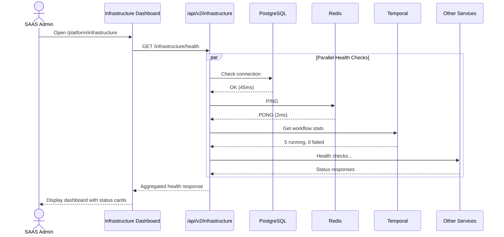
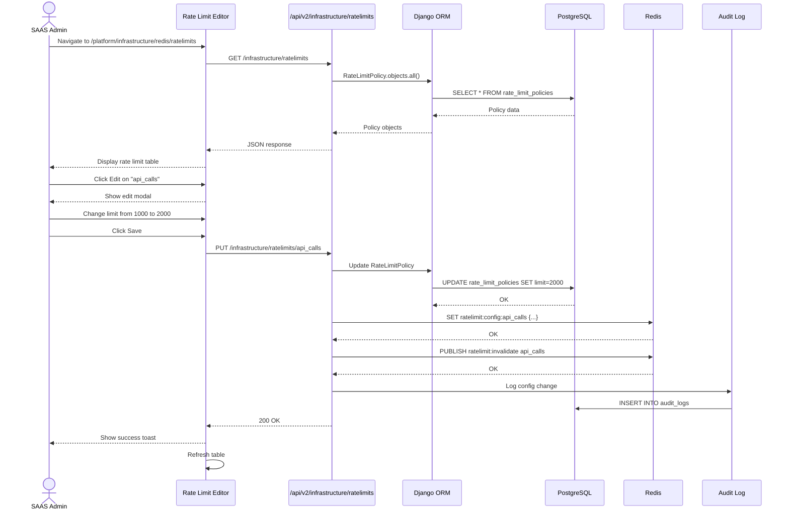
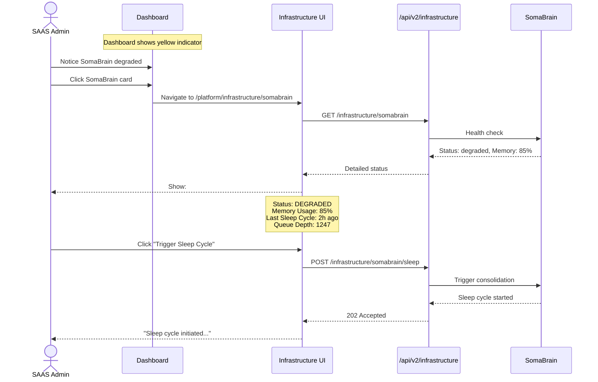

# SRS: Infrastructure Administration — User Journeys & Interfaces

**Document ID:** SA01-SRS-INFRASTRUCTURE-JOURNEYS-2025-12
**Purpose:** Define WHERE infrastructure admin fits in the system, user stories, and flow sequences
**Status:** CANONICAL REFERENCE

---

## 1. Navigation Context: Where Does Infrastructure Admin Live?

### 1.1 Platform Admin Navigation

```
┌─────────────────────────────────────────────────────────────────────────────┐
│  PLATFORM ADMIN (SAAS SysAdmin) - Main Navigation                           │
├─────────────────────────────────────────────────────────────────────────────┤
│                                                                             │
│  ┌─────────────┐   ┌─────────────┐   ┌─────────────┐   ┌─────────────┐     │
│  │  Dashboard  │   │  Tenants    │   │  Tiers      │   │ Permissions │     │
│  │  /platform  │   │  /tenants   │   │  /tiers     │   │ /permissions│     │
│  └─────────────┘   └─────────────┘   └─────────────┘   └─────────────┘     │
│                                                                             │
│  ┌─────────────┐   ┌─────────────┐   ┌─────────────┐   ┌─────────────┐     │
│  │   Billing   │   │   Audit     │   │  Features   │   │   Roles     │     │
│  │  /billing   │   │  /audit     │   │  /features  │   │  /roles     │     │
│  └─────────────┘   └─────────────┘   └─────────────┘   └─────────────┘     │
│                                                                             │
│  ┌─────────────────────────────────────────────────────────────────────┐   │
│  │                    ★ INFRASTRUCTURE ★                               │   │
│  │                    /platform/infrastructure                         │   │
│  │                                                                     │   │
│  │  This is a TOP-LEVEL navigation item in Platform Admin              │   │
│  └─────────────────────────────────────────────────────────────────────┘   │
│                                                                             │
└─────────────────────────────────────────────────────────────────────────────┘
```

### 1.2 Infrastructure Sub-Navigation

```
/platform/infrastructure
├── /database          # PostgreSQL
├── /redis             # Cache & Rate Limits
│   └── /ratelimits    # Visual Rate Limit Editor
├── /temporal          # Workflow Engine
├── /qdrant            # Vector Database
├── /auth              # Keycloak
├── /billing           # Lago
├── /somabrain         # Cognitive Memory
├── /voice             # Whisper & Kokoro
│   ├── /stt           # Speech-to-Text
│   └── /tts           # Text-to-Speech
├── /mcp               # MCP Servers
├── /storage           # S3/MinIO
└── /email             # SMTP
```

---

## 2. User Personas & Access

### 2.1 Who Accesses Infrastructure Admin?

| Persona | Access Level | What They Can Do |
|---------|--------------|------------------|
| **SAAS Super Admin** | FULL | All services, all configs, all actions |
| **DevOps Engineer** | Infrastructure | Services, no tenant data |
| **Security Auditor** | READ | View configs, export logs |
| **Tenant Admin** | NONE | No access to infrastructure |

### 2.2 Permission Matrix

| Route | Required Permission |
|-------|---------------------|
| `/platform/infrastructure` | `platform:read_metrics` |
| `/platform/infrastructure/*/config` | `platform:manage` |
| `/platform/infrastructure/ratelimits` | `platform:manage` |
| Any write operation | `platform:manage` |

---

## 3. User Stories (Agile Format)

### Story 1: View Infrastructure Health

```
AS A SAAS Administrator
I WANT TO see the health status of all infrastructure services at a glance
SO THAT I can quickly identify any issues affecting the platform

ACCEPTANCE CRITERIA:
- Dashboard shows all 12 services with health indicators
- Green = healthy, Yellow = degraded, Red = down
- Click on service card navigates to service detail
- Auto-refresh every 30 seconds
```

### Story 2: Configure Rate Limits

```
AS A SAAS Administrator
I WANT TO visually configure API rate limits
SO THAT I can prevent abuse without editing code or environment variables

ACCEPTANCE CRITERIA:
- Table view of all rate limit policies
- Edit modal with: limit, window, policy (HARD/SOFT)
- Per-tier override configuration
- Changes take effect immediately (pushed to Redis)
- Audit log entry created for every change
```

### Story 3: Monitor Workflows

```
AS A SAAS Administrator
I WANT TO view running Temporal workflows
SO THAT I can monitor long-running operations like tenant provisioning

ACCEPTANCE CRITERIA:
- List of workflow types with counts (running, pending, failed)
- Click to see individual workflow instances
- Ability to cancel stuck workflows
- View workflow history and failure reasons
```

### Story 4: Manage MCP Servers

```
AS A SAAS Administrator
I WANT TO register and configure MCP servers
SO THAT agents can use tool extensions

ACCEPTANCE CRITERIA:
- List of registered MCP servers with status
- Add/Edit/Remove MCP server registrations
- Test connection button
- Assign servers to tiers (which tiers can use which servers)
```

### Story 5: Configure Keycloak Realms

```
AS A SAAS Administrator
I WANT TO view and configure Keycloak realms
SO THAT I can manage authentication per tenant

ACCEPTANCE CRITERIA:
- List of realms with user counts
- Link to Keycloak admin console
- Create realm for new tenant (delegated to provisioning workflow)
- View realm settings summary
```

---

## 4. User Journey Flows

### Journey 1: Platform Startup Health Check



### Journey 2: Configure Rate Limits



### Journey 3: Investigate Service Degradation



---

## 5. Interface Screens (Wireframes)

### 5.1 Infrastructure Dashboard Screen

```
┌─────────────────────────────────────────────────────────────────────────────┐
│  Platform Admin > Infrastructure                                    🔄     │
├─────────────────────────────────────────────────────────────────────────────┤
│                                                                             │
│  SYSTEM HEALTH: 🟢 Operational (11/12 services healthy)    Last: 30s ago   │
│                                                                             │
│  ┌─────────────────────────────────────────────────────────────────────┐   │
│  │                         CORE SERVICES                               │   │
│  ├────────────────┬────────────────┬────────────────┬──────────────────┤   │
│  │                │                │                │                  │   │
│  │  PostgreSQL    │     Redis      │   Temporal     │    Qdrant        │   │
│  │  🟢 Healthy    │  🟢 Healthy    │  🟢 Healthy    │  🟢 Healthy      │   │
│  │  45ms          │  2ms           │  5 workflows   │  1.2M vectors    │   │
│  │                │                │                │                  │   │
│  └────────────────┴────────────────┴────────────────┴──────────────────┘   │
│                                                                             │
│  ┌─────────────────────────────────────────────────────────────────────┐   │
│  │                      EXTERNAL SERVICES                              │   │
│  ├────────────────┬────────────────┬────────────────┬──────────────────┤   │
│  │                │                │                │                  │   │
│  │   Keycloak     │     Lago       │   SomaBrain    │    Voice         │   │
│  │  🟢 Healthy    │  🟢 Healthy    │  🟡 Degraded   │  🟢 Healthy      │   │
│  │  3 realms      │  $12.4K MRR    │  85% memory    │  STT+TTS OK      │   │
│  │                │                │                │                  │   │
│  └────────────────┴────────────────┴────────────────┴──────────────────┘   │
│                                                                             │
│  ┌─────────────────────────────────────────────────────────────────────┐   │
│  │                      INFRASTRUCTURE                                 │   │
│  ├────────────────┬────────────────┬────────────────┬──────────────────┤   │
│  │                │                │                │                  │   │
│  │  MCP Servers   │    Storage     │     Email      │  Rate Limits     │   │
│  │  🟢 12 active  │  🟢 S3 OK      │  🟢 SMTP OK    │  🟢 Normal       │   │
│  │  [Manage]      │  [Manage]      │  [Manage]      │  [Configure]     │   │
│  │                │                │                │                  │   │
│  └────────────────┴────────────────┴────────────────┴──────────────────┘   │
│                                                                             │
│  ┌─────────────────────────────────────────────────────────────────────┐   │
│  │                         QUICK ACTIONS                               │   │
│  ├─────────────────────────────────────────────────────────────────────┤   │
│  │  [🔄 Refresh All]  [📊 Export Report]  [⚙️ Global Settings]        │   │
│  └─────────────────────────────────────────────────────────────────────┘   │
│                                                                             │
└─────────────────────────────────────────────────────────────────────────────┘
```

### 5.2 Rate Limit Configuration Screen

```
┌─────────────────────────────────────────────────────────────────────────────┐
│  Infrastructure > Redis > Rate Limits                          [+ Add]     │
├─────────────────────────────────────────────────────────────────────────────┤
│                                                                             │
│  ┌─────────────────────────────────────────────────────────────────────┐   │
│  │  Tab: [Global Limits] [Tier Overrides] [Tenant Overrides] [Metrics] │   │
│  └─────────────────────────────────────────────────────────────────────┘   │
│                                                                             │
│  ┌─────────────────────────────────────────────────────────────────────┐   │
│  │  GLOBAL RATE LIMITS                                                 │   │
│  ├─────────────────────────────────────────────────────────────────────┤   │
│  │                                                                     │   │
│  │  KEY              LIMIT      WINDOW     POLICY    STATUS  ACTIONS  │   │
│  │  ────────────────────────────────────────────────────────────────── │   │
│  │  api_calls        1,000      1 hour     HARD      🟢      [✏️][🗑️] │   │
│  │  voice_minutes    60         24 hours   SOFT      🟢      [✏️][🗑️] │   │
│  │  llm_tokens       100,000    24 hours   SOFT      🟢      [✏️][🗑️] │   │
│  │  file_uploads     50         1 hour     HARD      🟢      [✏️][🗑️] │   │
│  │  memory_queries   500        1 hour     SOFT      🟢      [✏️][🗑️] │   │
│  │  websocket_conn   100        -          HARD      🟢      [✏️][🗑️] │   │
│  │                                                                     │   │
│  └─────────────────────────────────────────────────────────────────────┘   │
│                                                                             │
│  ┌─────────────────────────────────────────────────────────────────────┐   │
│  │  RECENT CHANGES (Audit Trail)                                       │   │
│  ├─────────────────────────────────────────────────────────────────────┤   │
│  │  • Today 09:15 - admin@platform.io changed api_calls: 500 → 1000    │   │
│  │  • Yesterday - admin@platform.io added llm_tokens limit             │   │
│  └─────────────────────────────────────────────────────────────────────┘   │
│                                                                             │
└─────────────────────────────────────────────────────────────────────────────┘
```

---

## 6. Integration with Other Flows

### 6.1 How Infrastructure Admin Connects to Other Journeys

```
┌─────────────────────────────────────────────────────────────────────────────┐
│                         SYSTEM FLOW INTEGRATION                             │
├─────────────────────────────────────────────────────────────────────────────┤
│                                                                             │
│  TENANT CREATION FLOW                                                       │
│  ─────────────────────                                                      │
│  /platform/tenants/create → triggers:                                       │
│    • Keycloak realm creation (managed at /platform/infrastructure/auth)     │
│    • Lago customer creation (managed at /platform/infrastructure/billing)   │
│    • Default rate limits applied (from /platform/infrastructure/redis)      │
│                                                                             │
│  AGENT STARTUP FLOW                                                         │
│  ────────────────────                                                       │
│  /admin/agents/:id/start → checks:                                          │
│    • SomaBrain health (from /platform/infrastructure/somabrain)             │
│    • MCP servers available (from /platform/infrastructure/mcp)              │
│    • Voice services ready (from /platform/infrastructure/voice)             │
│                                                                             │
│  CHAT MESSAGE FLOW                                                          │
│  ────────────────────                                                       │
│  User sends message → enforces:                                             │
│    • Rate limits (configured at /platform/infrastructure/redis/ratelimits)  │
│    • LLM provider availability (monitored at /platform/infrastructure)      │
│    • Memory queries permitted (SomaBrain status)                            │
│                                                                             │
│  BILLING SYNC FLOW                                                          │
│  ────────────────────                                                       │
│  /platform/subscriptions → syncs with:                                      │
│    • Lago plans (managed at /platform/infrastructure/billing)               │
│    • Usage records pushed to Lago                                           │
│                                                                             │
└─────────────────────────────────────────────────────────────────────────────┘
```

### 6.2 Dependency Graph

```
                        ┌─────────────────┐
                        │  Chat/Memory    │
                        │  User Features  │
                        └────────┬────────┘
                                 │ depends on
          ┌──────────────────────┼──────────────────────┐
          │                      │                      │
          ▼                      ▼                      ▼
┌─────────────────┐   ┌─────────────────┐   ┌─────────────────┐
│    SomaBrain    │   │   LLM/Voice     │   │   Rate Limits   │
│    (Memory)     │   │   Services      │   │   (Redis)       │
└────────┬────────┘   └────────┬────────┘   └────────┬────────┘
         │                     │                     │
         │ depends on          │ depends on          │ depends on
         │                     │                     │
         ▼                     ▼                     ▼
┌─────────────────┐   ┌─────────────────┐   ┌─────────────────┐
│    Qdrant       │   │    API Keys     │   │    Quotas       │
│    (Vectors)    │   │   (Keycloak)    │   │    (Tier)       │
└────────┬────────┘   └────────┬────────┘   └────────┬────────┘
         │                     │                     │
         └──────────────────────┼──────────────────────┘
                                │
                                ▼
                        ┌─────────────────┐
                        │  Infrastructure │
                        │    Dashboard    │
                        └─────────────────┘
```

---

## 7. Lifecycle: When Infrastructure Admin is Used

| Phase | When | User Action | Infrastructure Screen |
|-------|------|-------------|----------------------|
| **Platform Setup** | Day 0 | Configure all connections | All screens |
| **Daily Operations** | Daily | Check health | Dashboard |
| **Capacity Planning** | Weekly | Review metrics | All service screens |
| **Incident Response** | On-demand | Investigate issues | Service detail screens |
| **Feature Rollout** | As needed | Enable services for tier | Tier integration |
| **Rate Limit Tuning** | Monthly | Adjust limits | Rate Limits screen |
| **Security Audit** | Quarterly | Export configs | All screens (read-only) |

---

## 8. Summary: Interface Hierarchy

```
PLATFORM ADMIN (/platform)
│
├── Dashboard
├── Tenants
├── Subscriptions/Tiers
├── Permissions
├── Roles
├── Billing
├── Audit
├── Features
│
└── ★ INFRASTRUCTURE ★
    │
    ├── Dashboard (health overview)
    │
    ├── Core Services
    │   ├── PostgreSQL (database)
    │   ├── Redis (cache + rate limits)
    │   │   └── Rate Limits (visual editor)
    │   ├── Temporal (workflows)
    │   └── Qdrant (vectors)
    │
    ├── External Services
    │   ├── Keycloak (auth)
    │   ├── Lago (billing)
    │   └── SomaBrain (memory)
    │
    ├── Voice
    │   ├── Whisper (STT)
    │   └── Kokoro (TTS)
    │
    └── Extensions
        ├── MCP Servers
        ├── Storage (S3/MinIO)
        └── Email (SMTP)
```

This is a **TOP-LEVEL** interface alongside Tenants, Tiers, and Billing.
It is NOT hidden in settings. It is the **control center** for the entire platform.
