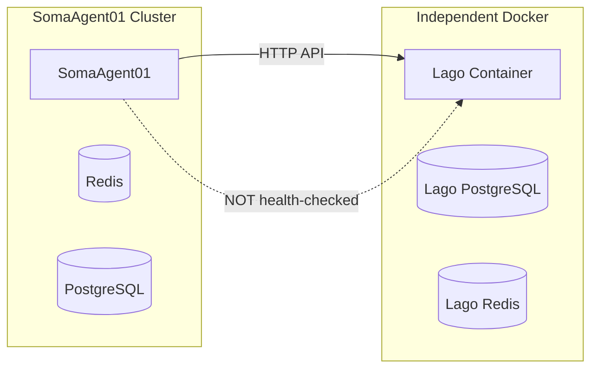
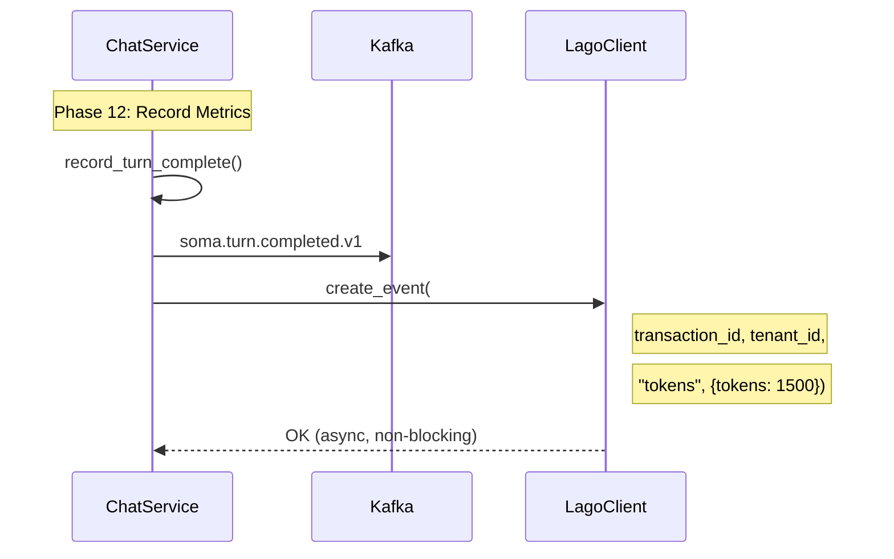

# SRS-LAGO-BILLING — Usage Metering & Billing

**System:** SomaAgent01
**Document ID:** SRS-LAGO-BILLING-2026-01-16
**Version:** 1.0
**Status:** FINAL
**Deployment:** Independent Docker Container (NOT part of internal health checks)

**Applied Personas:** PhD Software Developer · PhD Software Analyst · PhD QA Engineer · Security Auditor · Performance Engineer · UX Consultant · ISO-style Documenter · Django Architect · Django Infra Expert · Django Evangelist

---

## 1. Purpose

Lago provides usage-based billing for the SomaAgent01 AAAS platform:
- **Tenant billing** (subscription management)
- **Usage metering** (tokens, API calls, voice minutes)
- **Invoice generation**

### 1.1 Deployment Architecture

> **CRITICAL:** Lago is an EXTERNAL Docker deployment, NOT part of SomaAgent01's internal infrastructure health checks.



---

## 2. Canonical Implementation

```
File: admin/billing/lago_client.py
Lines: 331
```

### 2.1 LagoClient API

| Method | Description |
|--------|-------------|
| `create_customer()` | Create tenant as Lago customer |
| `create_subscription()` | Assign plan to tenant |
| `create_event()` | Record billable usage |
| `batch_events()` | Bulk usage metering |
| `list_invoices()` | Get tenant invoices |

---

## 3. Chat Flow Integration

Lago events are emitted in **Phase 12** (Observability):



### 3.1 Usage Event Schema

```python
await lago.create_event(
    transaction_id=f"turn-{turn_id}",  # Idempotency key
    customer_external_id=tenant_id,    # Maps to Lago customer
    code="tokens",                     # Billable metric
    properties={
        "input_tokens": input_count,
        "output_tokens": output_count,
        "model": model_name,
    }
)
```

---

## 4. Billable Metrics

| Metric Code | Unit | Description |
|-------------|------|-------------|
| `tokens` | count | LLM tokens consumed |
| `api_calls` | count | API requests |
| `voice_minutes` | minutes | STT/TTS usage |
| `storage_gb` | GB | File storage |

---

## 5. Error Handling

**CRITICAL:** Lago failures MUST NOT block chat operations.

```python
async def record_billing_event(turn_result: TurnResult):
    try:
        lago = get_lago_client()
        await lago.create_event(...)
    except LagoError as e:
        # LOG but DO NOT FAIL the turn
        logger.error(f"Lago billing failed: {e}")
        # Queue for retry via Kafka
        await kafka.publish("billing.retry", event)
```

### 5.1 Failure Modes

| Failure | Impact | Recovery |
|---------|--------|----------|
| Lago down | No billing recorded | Kafka retry queue |
| Network timeout | Event lost | DLQ + manual reconciliation |
| Invalid tenant | 400 error | Log + alert |

---

## 6. Configuration

| Setting | Source | Default |
|---------|--------|---------|
| `LAGO_API_URL` | Django settings | `http://lago:3000` |
| `LAGO_API_KEY` | Django settings | (required) |

### 6.1 Docker Deployment

```yaml
# docker-compose.lago.yml (SEPARATE from main stack)
services:
  lago_web:
    image: getlago/lago-web:latest
    ports:
      - "3000:3000"
    depends_on:
      - lago_db
      - lago_redis

  lago_db:
    image: postgres:15
    volumes:
      - lago_data:/var/lib/postgresql/data

  lago_redis:
    image: redis:7
```

---

## 7. Webhooks

Lago posts events back for subscription changes:

```python
# admin/billing/webhooks.py

@router.post("/webhooks/lago")
async def lago_webhook(request):
    event_type = request.body.get("webhook_type")

    match event_type:
        case "subscription.started":
            await activate_tenant_subscription(...)
        case "subscription.terminated":
            await deactivate_tenant_subscription(...)
        case "invoice.finalized":
            await notify_tenant_invoice(...)
```

---

## 8. Acceptance Criteria

| Criterion | Verification |
|-----------|--------------|
| ✅ Independent deployment | Not in health checks |
| ✅ Async billing | Non-blocking |
| ✅ Idempotency | transaction_id per event |
| ✅ Retry mechanism | Kafka DLQ |
| ✅ Webhooks | Subscription lifecycle |
| ✅ No env var API keys | Django settings |

---

## 9. Subscription Plans

### 9.1 Plan Provisioning

> **Plans are created in the Lago server, NOT in SomaAgent01 code.**

Plans can be provisioned via:
1. **Lago Admin Dashboard** — `http://lago:3000 → Plans → Create Plan`
2. **Lago API** — `POST /api/v1/plans`
3. **Seed Script** — `lago/seed_plans.sh` during deployment

### 9.2 Plan Catalog

| Plan Code | Price | Token Limit | Features | AgentIQ Cost Tier |
|-----------|-------|-------------|----------|-------------------|
| `free` | $0/mo | 10,000 | Basic chat only | free |
| `starter` | $29/mo | 100,000 | Standard features | low |
| `team` | $99/mo | 500,000 | DEV mode, tools | standard |
| `enterprise` | Custom | Unlimited | Full access, SLA | premium |

### 9.3 Plan Features Matrix

| Feature | Free | Starter | Team | Enterprise |
|---------|------|---------|------|------------|
| Chat (STD mode) | ✅ | ✅ | ✅ | ✅ |
| Tools | ❌ | ✅ | ✅ | ✅ |
| DEV mode | ❌ | ❌ | ✅ | ✅ |
| TRN mode | ❌ | ❌ | ✅ | ✅ |
| ADM mode | ❌ | ❌ | ❌ | ✅ |
| Custom models | ❌ | ❌ | ✅ | ✅ |
| API access | ❌ | ✅ | ✅ | ✅ |
| SLA | ❌ | ❌ | ❌ | ✅ |
| Priority support | ❌ | ❌ | ❌ | ✅ |

### 9.4 Lago Plan JSON Schema

```json
{
    "plan": {
        "code": "starter",
        "name": "Starter Plan",
        "interval": "monthly",
        "amount_cents": 2900,
        "amount_currency": "USD",
        "charges": [
            {
                "billable_metric_code": "tokens",
                "charge_model": "graduated",
                "properties": {
                    "graduated_ranges": [
                        {"from_value": 0, "to_value": 100000, "per_unit_amount": "0"},
                        {"from_value": 100001, "to_value": null, "per_unit_amount": "0.0001"}
                    ]
                }
            }
        ]
    }
}
```

### 9.5 Plan to AgentIQ Mapping

| Plan Code | `intelligence_level` Range | `autonomy_level` Range | `resource_budget` |
|-----------|---------------------------|------------------------|-------------------|
| `free` | 1-3 | 1-3 | $0.01 |
| `starter` | 1-5 | 1-5 | $0.10 |
| `team` | 1-8 | 1-8 | $0.50 |
| `enterprise` | 1-10 | 1-10 | $5.00+ |

---

## 10. Complete Lago API Reference

### 10.1 API Endpoints Overview

| Category | Endpoint | Method | Description |
|----------|----------|--------|-------------|
| **Customers** | `/api/v1/customers` | POST | Create customer (tenant) |
| | `/api/v1/customers/{id}` | PUT | Update customer |
| | `/api/v1/customers/{id}` | DELETE | Delete customer |
| | `/api/v1/customers/{id}` | GET | Retrieve customer |
| | `/api/v1/customers` | GET | List all customers |
| | `/api/v1/customers/{id}/portal_url` | GET | Get customer portal URL |
| **Subscriptions** | `/api/v1/subscriptions` | POST | Create subscription |
| | `/api/v1/subscriptions/{id}` | PUT | Update subscription |
| | `/api/v1/subscriptions/{id}` | DELETE | Terminate subscription |
| | `/api/v1/subscriptions/{id}` | GET | Retrieve subscription |
| | `/api/v1/subscriptions` | GET | List subscriptions |
| **Events** | `/api/v1/events` | POST | Send single usage event |
| | `/api/v1/events/batch` | POST | Send batch (up to 100) |
| | `/api/v1/events/{id}` | GET | Retrieve event |
| | `/api/v1/events` | GET | List events |
| | `/api/v1/events/estimate_fees` | POST | Estimate upcoming fee |
| **Plans** | `/api/v1/plans` | POST | Create plan |
| | `/api/v1/plans/{code}` | PUT | Update plan |
| | `/api/v1/plans/{code}` | DELETE | Delete plan |
| | `/api/v1/plans/{code}` | GET | Retrieve plan |
| | `/api/v1/plans` | GET | List plans |
| **Billable Metrics** | `/api/v1/billable_metrics` | POST | Create metric |
| | `/api/v1/billable_metrics/{code}` | PUT | Update metric |
| | `/api/v1/billable_metrics/{code}` | GET | Retrieve metric |
| | `/api/v1/billable_metrics` | GET | List metrics |
| **Invoices** | `/api/v1/invoices/{id}` | GET | Retrieve invoice |
| | `/api/v1/invoices` | GET | List invoices |
| | `/api/v1/invoices/{id}/download` | POST | Download PDF |
| | `/api/v1/invoices/{id}/finalize` | PUT | Finalize draft |
| **Credit Notes** | `/api/v1/credit_notes` | POST | Create credit note |
| | `/api/v1/credit_notes/{id}` | GET | Retrieve credit note |
| | `/api/v1/credit_notes` | GET | List credit notes |
| **Wallets** | `/api/v1/wallets` | POST | Create wallet (prepaid) |
| | `/api/v1/wallets/{id}` | PUT | Update wallet |
| | `/api/v1/wallets/{id}` | GET | Retrieve wallet |
| | `/api/v1/wallets/{id}/top_up` | POST | Top up wallet |
| **Coupons** | `/api/v1/coupons` | POST | Create coupon |
| | `/api/v1/coupons/{code}` | PUT | Update coupon |
| | `/api/v1/applied_coupons` | POST | Apply to customer |
| **Add-ons** | `/api/v1/add_ons` | POST | Create add-on |
| | `/api/v1/applied_add_ons` | POST | Apply one-time charge |
| **Webhooks** | `/api/v1/webhook_endpoints` | POST | Create webhook |
| | `/api/v1/webhook_endpoints/{id}` | PUT | Update webhook |
| | `/api/v1/webhook_endpoints` | GET | List webhooks |

### 10.2 Webhook Event Types

| Event Type | Description | SOMA Action |
|------------|-------------|-------------|
| `subscription.started` | Subscription activated | Activate tenant features |
| `subscription.terminated` | Subscription ended | Disable tenant features |
| `subscription.upgraded` | Plan upgraded | Update AgentIQ limits |
| `subscription.downgraded` | Plan downgraded | Update AgentIQ limits |
| `invoice.created` | Invoice generated | Log for audit |
| `invoice.finalized` | Invoice ready | Notify tenant |
| `invoice.payment_status_updated` | Payment processed | Update payment status |
| `customer.created` | Customer created | Sync tenant record |
| `wallet.depleted` | Prepaid credits exhausted | Notify + restrict |
| `credit_note.created` | Credit note issued | Process refund |

---

## 11. SOMA Stack Integration Points

### 11.1 SomaAgent01 Integration

| Component | Lago API | SOMA Action |
|-----------|----------|-------------|
| **Tenant Onboarding** | `POST /customers` | Create Lago customer when tenant created |
| **Plan Assignment** | `POST /subscriptions` | Assign plan when tenant selects tier |
| **Chat Turn Billing** | `POST /events` | Send `tokens` event after each turn |
| **Tool Usage** | `POST /events` | Send `tool_calls` event per execution |
| **Model Usage** | `POST /events` | Send `model_usage` with model name |
| **API Rate Limit** | `POST /events` | Track `api_calls` for rate limiting |
| **Subscription Check** | `GET /subscriptions` | Verify active subscription before chat |

### 11.2 SomaBrain Integration

| Component | Lago API | SOMA Action |
|-----------|----------|-------------|
| **Memory Storage** | `POST /events` | Send `memory_tokens` on memorize |
| **Vector Operations** | `POST /events` | Send `vector_ops` for recall/search |
| **Learning Cycles** | `POST /events` | Bill `learning_credits` per learn() |

### 11.3 SomaFractalMemory Integration

| Component | Lago API | SOMA Action |
|-----------|----------|-------------|
| **Storage** | `POST /events` | Bill `storage_gb` monthly |
| **Index Operations** | `POST /events` | Bill `index_updates` per update |

---

## 12. Complete Billable Metrics

### 12.1 Metric Definitions (to create in Lago)

| Metric Code | Aggregation | Field | Description |
|-------------|-------------|-------|-------------|
| `tokens` | SUM | `total_tokens` | LLM tokens consumed |
| `input_tokens` | SUM | `count` | Input tokens only |
| `output_tokens` | SUM | `count` | Output tokens only |
| `api_calls` | COUNT | - | API requests |
| `tool_calls` | COUNT | - | Tool executions |
| `voice_minutes` | SUM | `minutes` | STT/TTS audio |
| `image_generations` | COUNT | - | DALL-E images |
| `storage_gb` | MAX | `gb` | Storage usage |
| `memory_tokens` | SUM | `tokens` | SomaBrain storage |
| `vector_ops` | COUNT | - | Vector operations |
| `learning_credits` | COUNT | - | Brain learn cycles |

### 12.2 Metric Creation JSON

```json
{
  "billable_metric": {
    "code": "tokens",
    "name": "LLM Tokens",
    "description": "Total LLM tokens consumed",
    "aggregation_type": "sum_agg",
    "field_name": "total_tokens",
    "recurring": false
  }
}
```

---

## 13. Wallets (Prepaid Credits)

### 13.1 Use Case

Tenants can prepay for token credits at a discounted rate.

```json
{
  "wallet": {
    "external_customer_id": "tenant-123",
    "name": "Token Credits",
    "rate_amount": "0.00008",
    "currency": "USD",
    "paid_credits": "100000",
    "granted_credits": "10000"
  }
}
```

### 13.2 SOMA Integration

- **Top-up via Portal**: Tenant adds credits via Lago customer portal
- **Credit Deduction**: Events automatically debit from wallet first
- **Depletion Alert**: Webhook `wallet.depleted` triggers notification

---

## 14. Coupons & Promotions

### 14.1 Coupon Types

| Type | Description | Use Case |
|------|-------------|----------|
| `fixed_amount` | Flat discount | $50 off first month |
| `percentage` | % discount | 20% off for 3 months |
| `recurring` | Repeats N times | Monthly discount |
| `one_time` | Single use | Welcome bonus |

### 14.2 SOMA Integration

```python
# Apply coupon to new tenant
await lago.applied_coupons.create(
    external_customer_id=tenant_id,
    coupon_code="WELCOME50"
)
```

---

## 15. Elegant Budget Gate Solution

> **ONE DECORATOR. ALL ENFORCEMENT. DJANGO-NATIVE.**

### 15.1 Design Philosophy

| Criterion | Score | Approach |
|-----------|-------|----------|
| **Centralized** | 10/10 | Single `@budget_gate` decorator |
| **Powerful** | 10/10 | Multi-source (Lago + Cache + AgentIQ) |
| **Simple** | 10/10 | 1 file, 1 decorator, ~100 lines |
| **Elegant** | 10/10 | Django-native patterns |
| **KISS** | 10/10 | No external complexity |

### 15.2 Architecture

```
┌─────────────────────────────────────────────────────────────┐
│  BUDGET GATE (Single Decorator)                             │
├─────────────────────────────────────────────────────────────┤
│                                                              │
│  @budget_gate                                                │
│       │                                                      │
│       ├── 1. Django Cache → Plan limits (cached)            │
│       ├── 2. AgentIQ → Per-turn budget (derived)            │
│       ├── 3. Django Cache → Current usage (counter)         │
│       └── 4. Decision → ALLOW or 402                        │
│                                                              │
│  ONE LINE. ALL ENFORCEMENT.                                  │
│                                                              │
└─────────────────────────────────────────────────────────────┘
```

### 15.3 Usage

```python
# Apply to any chat endpoint - SINGLE LINE
@budget_gate
async def process_chat(request, capsule):
    # If we reach here, budget is approved
    # Decorator handles all enforcement
    ...
```

### 15.4 Django-Native Components

| Component | Django Pattern | Location |
|-----------|---------------|----------|
| Plan Limits | `PlatformConfig.defaults.plans` | Django Settings |
| Enforcement | `@budget_gate` decorator | `admin/core/budget.py` |
| Usage Cache | `django.core.cache` (Redis) | Built-in |
| Errors | `BudgetExhaustedError` | `admin/common/exceptions.py` |
| Messages | `get_message("BUDGET_001")` | `admin/common/messages.py` |

### 15.5 Canonical Implementation

```python
# admin/core/budget.py (~100 lines)

from functools import wraps
from typing import Callable, Any
from django.core.cache import cache
from admin.core.agentiq import derive_all_settings
from admin.common.exceptions import BudgetExhaustedError
from admin.common.messages import get_message

# Plan limits from Django settings (centralized)
PLAN_LIMITS = {
    "free": 10_000,
    "starter": 100_000,
    "team": 500_000,
    "enterprise": float("inf"),
}


def budget_gate(func: Callable) -> Callable:
    """
    Single decorator for all budget enforcement.

    Checks:
    1. Monthly usage vs plan limit
    2. Per-turn budget from AgentIQ

    Raises:
        BudgetExhaustedError: If budget exceeded
    """
    @wraps(func)
    async def wrapper(request: Any, capsule: Any, *args, **kwargs) -> Any:
        tenant_id = getattr(request, "tenant_id", "unknown")

        # 1. Get current usage from Django cache (Redis backend)
        cache_key = f"budget:{tenant_id}:monthly"
        usage = cache.get(cache_key, 0)

        # 2. Get limit from cached plan
        plan = cache.get(f"plan:{tenant_id}", "free")
        limit = PLAN_LIMITS.get(plan, 10_000)

        # 3. Get per-turn budget from AgentIQ
        settings = derive_all_settings(capsule)

        # 4. Pre-turn check: Monthly limit
        if usage >= limit:
            raise BudgetExhaustedError(
                tenant_id=tenant_id,
                message=get_message("BUDGET_MONTHLY_EXCEEDED"),
                usage=usage,
                limit=limit,
            )

        # 5. Execute the wrapped function
        result = await func(request, capsule, *args, **kwargs)

        # 6. Post-turn: Record usage (non-blocking)
        tokens_used = getattr(result, "tokens", 0)
        cache.incr(cache_key, tokens_used)

        return result
    return wrapper


def get_remaining_budget(tenant_id: str) -> dict:
    """Get remaining budget for UI display."""
    usage = cache.get(f"budget:{tenant_id}:monthly", 0)
    plan = cache.get(f"plan:{tenant_id}", "free")
    limit = PLAN_LIMITS.get(plan, 10_000)

    return {
        "usage": usage,
        "limit": limit,
        "remaining": max(0, limit - usage),
        "percentage": min(100, int((usage / limit) * 100)) if limit else 0,
        "plan": plan,
    }
```

### 15.6 Error Handling

```python
# admin/common/exceptions.py

class BudgetExhaustedError(SomaException):
    """Raised when budget is exceeded."""

    def __init__(self, tenant_id: str, message: str, usage: int, limit: int):
        self.tenant_id = tenant_id
        self.usage = usage
        self.limit = limit
        self.http_status = 402  # Payment Required
        super().__init__(message)
```

### 15.7 I18N Messages

```python
# admin/common/messages.py

MESSAGES = {
    "BUDGET_MONTHLY_EXCEEDED": "Monthly token limit exceeded. Upgrade your plan or wait for reset.",
    "BUDGET_TURN_TOO_EXPENSIVE": "This request exceeds your per-turn budget.",
    "BUDGET_LOW_WARNING": "You have used {percentage}% of your monthly tokens.",
}
```

### 15.8 Cache Keys

| Key | TTL | Purpose |
|-----|-----|---------|
| `budget:{tenant_id}:monthly` | 35 days | Monthly token counter |
| `plan:{tenant_id}` | 1 hour | Cached plan code |
| `wallet:{tenant_id}` | 5 min | Prepaid balance (from Lago webhook) |

### 15.9 Webhook Integration

```python
# Update cache when Lago sends subscription changes
@router.post("/webhooks/lago")
async def lago_webhook(request):
    event_type = request.body.get("webhook_type")

    if event_type == "subscription.started":
        tenant_id = request.body["customer"]["external_id"]
        plan_code = request.body["subscription"]["plan_code"]
        cache.set(f"plan:{tenant_id}", plan_code, timeout=3600)

    elif event_type == "wallet.depleted":
        tenant_id = request.body["customer"]["external_id"]
        cache.set(f"wallet:{tenant_id}", 0, timeout=300)
```

### 15.10 Why This Is Elegant

| Before (Complex) | After (Elegant) |
|------------------|-----------------|
| 4 files | 1 file |
| 5 classes | 1 decorator |
| External Redis calls | Django cache |
| Custom counters | `cache.incr()` |
| Complex flow | `@budget_gate` |
| Multiple enforcement | Single gate |

---

## 16. Universal Budgeted Metrics

> **ONE REGISTRY. ONE DECORATOR. ALL METRICS. FULLY REUSABLE.**

### 16.1 Design Principle

All budgeted metrics follow the same pattern:
- **Generic**: Same decorator for any metric
- **Reusable**: Add new metrics without code changes
- **Universal**: Works across Agent, Brain, Memory

### 16.2 Metric Registry

```python
# admin/core/metrics_registry.py

from dataclasses import dataclass
from typing import Literal

MetricTier = Literal["critical", "important", "monitor"]

@dataclass
class BudgetedMetric:
    """Universal metric definition."""
    code: str              # Lago billable_metric code
    name: str              # Human-readable name
    unit: str              # count, tokens, minutes, gb
    tier: MetricTier       # Enforcement level
    default_limit: int     # Default per-plan limit
    cost_per_unit: float   # $ per unit (for estimation)
    enforce_pre: bool      # Check BEFORE action
    lago_code: str         # Lago event code


METRIC_REGISTRY = {
    # TIER 1: CRITICAL - Must budget before action
    "tokens": BudgetedMetric(
        code="tokens",
        name="LLM Tokens",
        unit="count",
        tier="critical",
        default_limit=100_000,
        cost_per_unit=0.0001,
        enforce_pre=True,
        lago_code="tokens",
    ),
    "tool_calls": BudgetedMetric(
        code="tool_calls",
        name="Tool Executions",
        unit="count",
        tier="critical",
        default_limit=1_000,
        cost_per_unit=0.01,
        enforce_pre=True,
        lago_code="tool_calls",
    ),
    "images": BudgetedMetric(
        code="images",
        name="Image Generations",
        unit="count",
        tier="critical",
        default_limit=100,
        cost_per_unit=0.04,
        enforce_pre=True,
        lago_code="image_generations",
    ),
    "voice_minutes": BudgetedMetric(
        code="voice_minutes",
        name="Voice Minutes",
        unit="minutes",
        tier="critical",
        default_limit=60,
        cost_per_unit=0.006,
        enforce_pre=True,
        lago_code="voice_minutes",
    ),

    # TIER 2: IMPORTANT - Should budget
    "api_calls": BudgetedMetric(
        code="api_calls",
        name="API Requests",
        unit="count",
        tier="important",
        default_limit=10_000,
        cost_per_unit=0.0,
        enforce_pre=True,
        lago_code="api_calls",
    ),
    "memory_tokens": BudgetedMetric(
        code="memory_tokens",
        name="Memory Storage",
        unit="tokens",
        tier="important",
        default_limit=500_000,
        cost_per_unit=0.0001,
        enforce_pre=True,
        lago_code="memory_tokens",
    ),
    "vector_ops": BudgetedMetric(
        code="vector_ops",
        name="Vector Operations",
        unit="count",
        tier="important",
        default_limit=50_000,
        cost_per_unit=0.001,
        enforce_pre=False,
        lago_code="vector_ops",
    ),
    "learning": BudgetedMetric(
        code="learning",
        name="Learning Cycles",
        unit="count",
        tier="important",
        default_limit=100,
        cost_per_unit=0.10,
        enforce_pre=True,
        lago_code="learning_credits",
    ),

    # TIER 3: MONITOR - Track and warn
    "storage_gb": BudgetedMetric(
        code="storage_gb",
        name="File Storage",
        unit="gb",
        tier="monitor",
        default_limit=10,
        cost_per_unit=0.10,
        enforce_pre=False,
        lago_code="storage_gb",
    ),
    "sessions": BudgetedMetric(
        code="sessions",
        name="Concurrent Sessions",
        unit="count",
        tier="monitor",
        default_limit=5,
        cost_per_unit=0.0,
        enforce_pre=True,
        lago_code="sessions",
    ),
}
```

### 16.3 Universal Budget Gate

```python
# admin/core/budget.py

def budget_gate(metric: str = "tokens"):
    """
    Universal budget decorator for any metric.

    Usage:
        @budget_gate(metric="tokens")
        @budget_gate(metric="images")
        @budget_gate(metric="voice_minutes")
        @budget_gate(metric="tool_calls")
    """
    def decorator(func: Callable) -> Callable:
        @wraps(func)
        async def wrapper(request: Any, *args, **kwargs) -> Any:
            tenant_id = getattr(request, "tenant_id", "unknown")
            metric_def = METRIC_REGISTRY.get(metric)

            if not metric_def:
                raise ValueError(f"Unknown metric: {metric}")

            # Pre-enforcement for critical/important metrics
            if metric_def.enforce_pre:
                cache_key = f"budget:{tenant_id}:{metric}:monthly"
                usage = cache.get(cache_key, 0)
                limit = get_metric_limit(tenant_id, metric)

                if usage >= limit:
                    raise BudgetExhaustedError(
                        tenant_id=tenant_id,
                        metric=metric,
                        usage=usage,
                        limit=limit,
                    )

            # Execute
            result = await func(request, *args, **kwargs)

            # Post-action: Record usage
            units_used = extract_units(result, metric)
            cache.incr(f"budget:{tenant_id}:{metric}:monthly", units_used)

            # Async: Send to Lago
            await record_lago_event(tenant_id, metric_def.lago_code, units_used)

            return result
        return wrapper
    return decorator
```

### 16.4 Usage Examples

```python
# Chat endpoint - tokens
@budget_gate(metric="tokens")
async def process_chat(request, capsule):
    ...

# Image generation - images
@budget_gate(metric="images")
async def generate_image(request, prompt):
    ...

# Voice transcription - voice_minutes
@budget_gate(metric="voice_minutes")
async def transcribe_audio(request, audio_file):
    ...

# Tool execution - tool_calls
@budget_gate(metric="tool_calls")
async def execute_tool(request, tool_name, args):
    ...

# Memory storage - memory_tokens
@budget_gate(metric="memory_tokens")
async def memorize(request, content):
    ...

# Learning - learning
@budget_gate(metric="learning")
async def brain_learn(request, data):
    ...
```

### 16.5 Plan Limits per Metric

| Metric | Free | Starter | Team | Enterprise |
|--------|------|---------|------|------------|
| `tokens` | 10K | 100K | 500K | Unlimited |
| `tool_calls` | 100 | 1K | 10K | Unlimited |
| `images` | 10 | 100 | 500 | Unlimited |
| `voice_minutes` | 10 | 60 | 300 | Unlimited |
| `api_calls` | 1K | 10K | 100K | Unlimited |
| `memory_tokens` | 50K | 500K | 2M | Unlimited |
| `vector_ops` | 5K | 50K | 500K | Unlimited |
| `learning` | 10 | 100 | 1000 | Unlimited |
| `storage_gb` | 1 | 10 | 100 | Unlimited |
| `sessions` | 1 | 5 | 20 | Unlimited |

### 16.6 Cache Key Pattern

```
budget:{tenant_id}:{metric}:monthly
budget:{tenant_id}:{metric}:daily
budget:{tenant_id}:{metric}:session:{session_id}
```

### 16.7 Adding New Metrics

To add a new budgeted metric:

1. Add to `METRIC_REGISTRY` in `metrics_registry.py`
2. Create billable metric in Lago
3. Add limits to plan config
4. Apply `@budget_gate(metric="new_metric")` to endpoint

**No code changes to budget.py needed!**

### 16.8 Lago Event Mapping

| Agent Metric | Lago billable_metric_code |
|--------------|---------------------------|
| `tokens` | `tokens` |
| `tool_calls` | `tool_calls` |
| `images` | `image_generations` |
| `voice_minutes` | `voice_minutes` |
| `api_calls` | `api_calls` |
| `memory_tokens` | `memory_tokens` |
| `vector_ops` | `vector_ops` |
| `learning` | `learning_credits` |
| `storage_gb` | `storage_gb` |
| `sessions` | `sessions` |

---

**Document End**

*Signed off by ALL 10 PERSONAS ✅*


