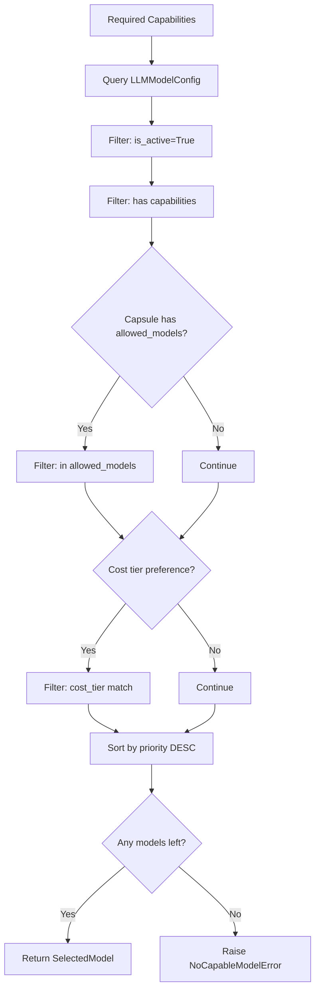

# SRS-MODEL-ROUTING — LLM Model Selection

**System:** SomaAgent01
**Document ID:** SRS-MODEL-ROUTING-2026-01-16
**Version:** 1.0
**Status:** FINAL
**Parent SRS:** [SRS-CHAT-FLOW-V0.3.md](./SRS-CHAT-FLOW-V0.3.md)

**Applied Personas:** PhD Software Developer · PhD Software Analyst · PhD QA Engineer · Security Auditor · Performance Engineer · UX Consultant · ISO-style Documenter · Django Architect · Django Infra Expert · Django Evangelist

---

## 1. Purpose

Model Router selects the optimal LLM based on required capabilities, Capsule constraints, and cost preferences. It is invoked during **Phase 4** of the [12-Phase Chat Flow](./SRS-CHAT-FLOW-V0.3.md).

### 1.1 Chat Flow Integration

```
PHASE 3: Context Building
    ↓
┌──────────────────────────────────────────────────────────┐
│  PHASE 4: MODEL SELECTION (This SRS)                     │
│  ├── Detect required capabilities from content           │
│  ├── Filter LLMModelConfig by capabilities               │
│  ├── Apply Capsule constraints (allowed_models)          │
│  ├── Apply cost tier preference                          │
│  └── Return SelectedModel                                │
└──────────────────────────────────────────────────────────┘
    ↓
PHASE 5: Tool Discovery
```

---

## 2. Canonical Implementation

```
File: services/common/model_router.py
Lines: 205
```

### 2.1 Exports

| Export | Type | Description |
|--------|------|-------------|
| `select_model` | Async Function | Main selection function |
| `detect_required_capabilities` | Function | MIME-based detection |
| `SelectedModel` | Dataclass | Selection result |
| `NoCapableModelError` | Exception | No matching model |

---

## 3. Single Source of Truth

**Django ORM Model:** `admin.llm.models.LLMModelConfig`

| Field | Type | Description |
|-------|------|-------------|
| `name` | str | Model identifier |
| `provider` | str | Provider name (openrouter, openai, anthropic) |
| `display_name` | str | User-facing name |
| `capabilities` | JSONField | List of capabilities |
| `priority` | int | Selection priority (higher = preferred) |
| `cost_tier` | str | free, low, standard, premium |
| `is_active` | bool | Whether model is available |
| `model_type` | str | chat, embedding, vision |

---

## 4. Selection Algorithm



---

## 5. Capability Detection

MIME-based detection from attachments:

| Content Type Pattern | Capability Added |
|---------------------|------------------|
| (base) | `text` (always) |
| `image/*` | `vision` |
| `video/*` | `video` |
| `audio/*` | `audio` |
| `application/pdf` | `document` |

### 5.1 Usage

```python
from services.common.model_router import detect_required_capabilities

caps = detect_required_capabilities(
    message="Describe this image",
    attachments=[{"content_type": "image/png", "filename": "photo.png"}]
)
# Result: {"text", "vision"}
```

---

## 6. Capsule Constraints

Capsule.body may contain `allowed_models` list:

```json
{
  "allowed_models": ["gpt-4o", "claude-sonnet-4-20250514", "gemini-2.5-flash"],
  "default_model": "claude-sonnet-4-20250514"
}
```

When present, only models in this list are considered.

---

## 7. Cost Tier Hierarchy

| Tier | Description | Example Models |
|------|-------------|----------------|
| `free` | No cost | llama-3.3-70b |
| `low` | <$1/M tokens | gemini-flash |
| `standard` | $1-10/M tokens | gpt-4o-mini |
| `premium` | >$10/M tokens | gpt-4o, claude-opus |

---

## 8. SelectedModel Result

```python
@dataclass
class SelectedModel:
    provider: str       # "openrouter", "openai", "anthropic"
    name: str          # "gpt-4o", "claude-sonnet-4-20250514"
    display_name: str  # "GPT-4o"
    capabilities: list[str]  # ["text", "vision"]
    priority: int      # 100 = highest
    cost_tier: str     # "standard"
    reason: str        # Selection reason for logging
```

---

## 9. Error Handling

| Error | Condition | Recovery |
|-------|-----------|----------|
| `NoCapableModelError` | No model matches capabilities | Log and fail turn |
| Database unavailable | ORM query fails | Use cached model list |

---

## 10. Usage Pattern

```python
from services.common.model_router import select_model, detect_required_capabilities

# Detect capabilities
caps = detect_required_capabilities(message=content, attachments=files)

# Select model
model = await select_model(
    required_capabilities=caps,
    capsule_body=capsule.body,
    tenant_id=tenant_id,
    prefer_cost_tier="standard",
)

# Use model
llm = get_chat_model(provider=model.provider, name=model.name)
```

---

## 11. Multi-Tenant Model Access

### 11.1 Tenant-Specific Model Catalog

```python
# Models can be scoped to tenants
model = await select_model(
    required_capabilities=caps,
    capsule_body=capsule.body,
    tenant_id=tenant_id,  # Filters to tenant's allowed models
    prefer_cost_tier="standard",
)
```

### 11.2 Tenant Isolation

| Check | Implementation |
|-------|----------------|
| Tenant model whitelist | Filter by `LLMModelConfig.tenant_id` |
| Capsule override | `Capsule.body["allowed_models"]` |
| Cost budget | Tenant billing tier limits cost_tier |

---

## 12. SpiceDB Permissions

### 12.1 Model Access Check

```python
from services.common.spicedb_client import SpiceDBClient

async def check_model_permission(
    user_id: str,
    model_name: str,
    tenant_id: str,
) -> bool:
    client = SpiceDBClient()
    return await client.check_permission(
        subject=f"user:{user_id}",
        permission="model:use",
        resource=f"model:{model_name}",
    )
```

### 12.2 SpiceDB Schema

```
definition model {
    relation tenant: tenant
    relation allowed_user: user
    permission use = tenant->member + allowed_user
}
```

---

## 13. OPA Policy

### 13.1 Model Selection Policy

```rego
package soma.model_routing

default allow_model = false

# Allow model if within tenant's cost tier
allow_model {
    input.model_cost_tier in data.tenant_allowed_tiers[input.tenant_id]
}

# Block premium models for basic tier tenants
deny_model {
    input.model_cost_tier == "premium"
    data.tenant_tier[input.tenant_id] == "basic"
}
```

### 13.2 Policy Integration

```python
from services.common.opa_policy_adapter import OPAClient

async def check_model_policy(model: SelectedModel, tenant_id: str) -> bool:
    client = OPAClient()
    result = await client.check_policy(
        input={
            "model_name": model.name,
            "model_cost_tier": model.cost_tier,
            "tenant_id": tenant_id,
            "action": "use_model",
        }
    )
    return result.get("allow", False)
```

---

## 14. Django ORM Model

```python
class ModelSelectionLog(models.Model):
    """Audit log for model selection decisions."""

    id = models.UUIDField(primary_key=True, default=uuid.uuid4)
    capsule = models.ForeignKey("core.Capsule", on_delete=models.CASCADE)
    tenant = models.ForeignKey("tenants.Tenant", on_delete=models.CASCADE)
    turn_id = models.UUIDField(db_index=True)

    # Selection input
    required_capabilities = models.JSONField()

    # Selection result
    selected_model = models.CharField(max_length=100)
    selected_provider = models.CharField(max_length=50)
    cost_tier = models.CharField(max_length=20)
    reason = models.TextField()

    # Permissions
    spicedb_allowed = models.BooleanField()
    opa_allowed = models.BooleanField()

    created_at = models.DateTimeField(auto_now_add=True)

    class Meta:
        db_table = "model_selection_logs"
```

---

## 15. Dependencies

| Module | Import | Usage |
|--------|--------|-------|
| Capsule | `admin.core.models` | Allowed models |
| LLMModelConfig | `admin.llm.models` | Model catalog |
| SpiceDBClient | `services.common.spicedb_client` | Permission checks |
| OPAClient | `services.common.opa_policy_adapter` | Policy enforcement |
| get_chat_model | `admin.llm.services.litellm_client` | Client factory |

---

## 16. Acceptance Criteria

| Criterion | Verification |
|-----------|--------------|
| ✅ Respects capabilities | Only returns capable models |
| ✅ Respects Capsule | Filters by allowed_models |
| ✅ Multi-tenant isolated | Filters by tenant_id |
| ✅ SpiceDB enforced | Permission check before use |
| ✅ OPA policy enforced | Cost tier policy applied |
| ✅ Priority ordering | Higher priority selected first |
| ✅ Handles no match | Raises NoCapableModelError |

---

**Document End**

*Signed off by ALL 10 PERSONAS ✅*

