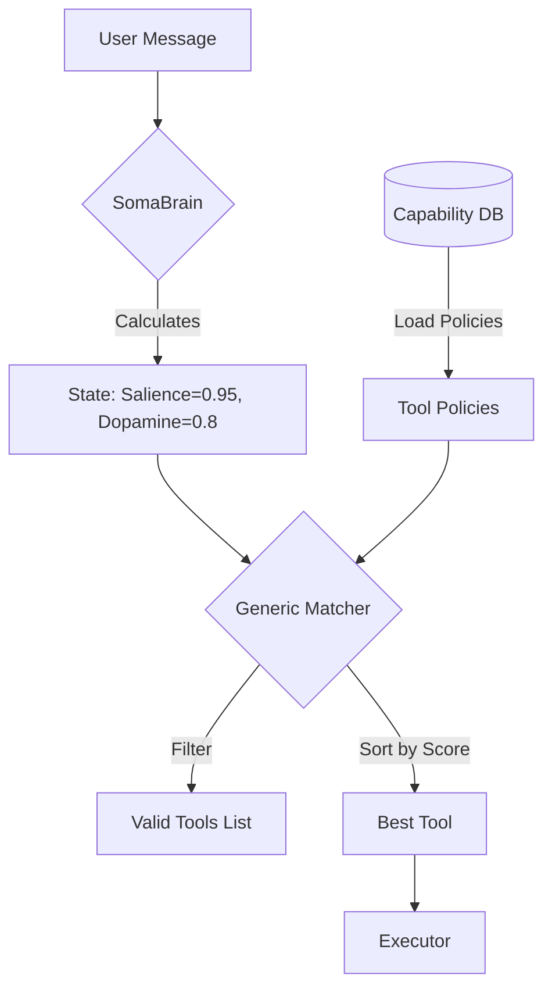

# SRS: Multimodal Agent Capabilities V2.2

**Document ID:** SA01-SRS-MULTIMODAL-2026-04
**Version:** 2.2
**Status:** CANONICAL REFERENCE
**Compliance:** ISO/IEC 29148:2018
**Reference:** `SRS-CHAT-FLOW-V0.3.md` (Unified Governance)

---

## 1. The "Brain-Driven" Multimodal Architecture (Dynamic)

This system implements **Database-Driven Dynamic Selection**.
**ABSOLUTELY NO HARDCODED THRESHOLDS.**

All selection logic is defined in the `Capability` database records. The Code is merely a generic evaluator.



---

## 2. Database-Driven Selection Data Structure

The logic lives in `Capability.config` (JSONField).

### 2.1 Capability Config Schema (In Postgres)

```json
// Example: "Pro Video Generator" Capability
{
  "name": "sora_video_gen",
  "config": {
    "selection_policy": {
      "min_salience": 0.85,          // Brain must be highly attentive
      "required_intent": "video",    // Intent must match
      "neuromodulator_affinity": {
        "dopamine": { "min": 0.6 }   // Needs high creativity
      },
      "cost_tier": "expensive"
    }
  }
}
```

```json
// Example: "Quick GIF Maker" Capability
{
  "name": "quick_gif",
  "config": {
    "selection_policy": {
      "min_salience": 0.1,           // Available even if low attention
      "max_salience": 0.6,           // Don't use for high-stakes tasks
      "required_intent": "video",
      "cost_tier": "cheap"
    }
  }
}
```

---

## 3. The Generic Selection Algorithm (The Code)

This code processes *data*, it contains no business rules itself.

```python
def select_perfect_tool(brain_state, capabilities):
    candidates = []

    for tool in capabilities:
        policy = tool.config.get("selection_policy", {})

        # 1. Intent Check (Data Driven)
        if policy.get("required_intent") != brain_state.intent_class:
            continue

        # 2. Salience Check (Data Driven)
        if brain_state.salience < policy.get("min_salience", 0.0):
            continue
        if brain_state.salience > policy.get("max_salience", 1.0):
            continue

        # 3. Neuromodulator Check (Data Driven)
        if not check_neuro_affinity(brain_state.neuromodulators, policy.get("neuro_affinity")):
            continue

        candidates.append(tool)

    # Sort by "Fit Score" (Inverse distance to current state)
    return sorted(candidates, key=lambda t: calculate_fit(brain_state, t))[0]
```

---

## 4. The Persistence Mandate (Rule 91)

Attributes generated by this process are strictly persisted.

| Artifact Type | Storage | Metadata (MemoryReplica) |
|---------------|---------|--------------------------|
| **Image** | S3/Blob | `{"provider": "dalle-3", "salience": 0.95, "policy_used": "v1"}` |
| **Video** | S3/Blob | `{"duration": "10s", "model": "sora", "brain_state_snapshot": {...}}` |

---

## 5. Governance & Permissions (Unified Matrix)

Aligned with **SRS-CHAT-FLOW-V0.3 Section 2**.

| Feature | Permission Required | Role Access (Default) |
|---------|---------------------|-----------------------|
| **Generate Image** | `tool:execute` AND `capability:image` | User, Operator, Owner, Admin |
| **Render Diagram** | `tool:execute` AND `capability:diagram` | User, Operator, Owner, Admin |
| **Capture Page** | `tool:execute` AND `capability:screenshot` | User, Operator, Owner, Admin |
| **View Artifacts** | `chat:history` | Reader, User, Operator, Owner, Admin |

### 5.1 "SaaS Admin Mode" Override
A user with `SA` (Super Admin) role bypasses Quota checks but **MUST** still generate Audit logs and Memory Replicas.

**End of Specification**
