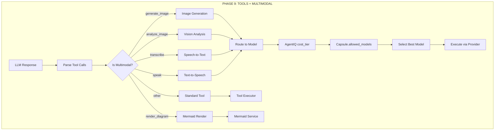
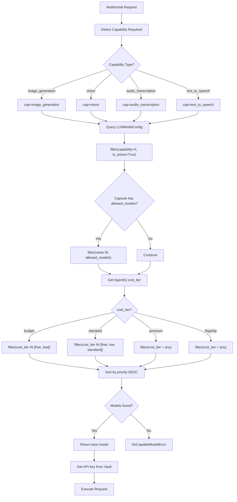
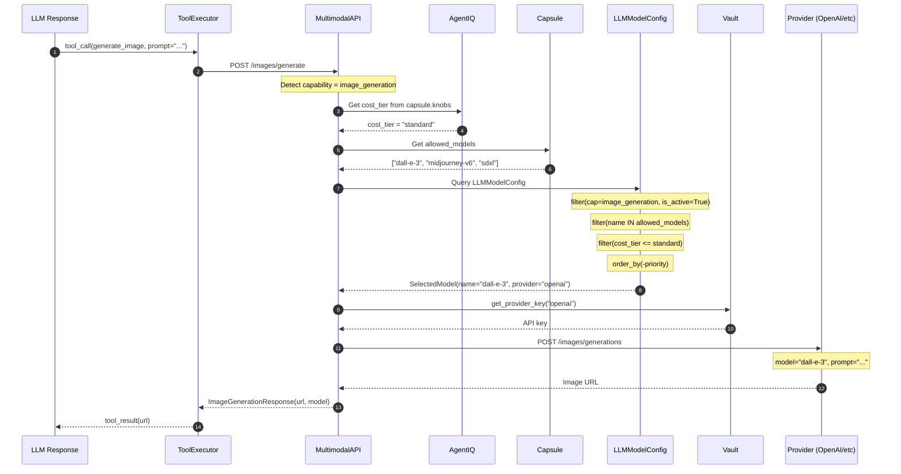
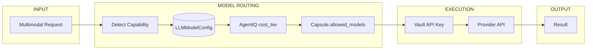
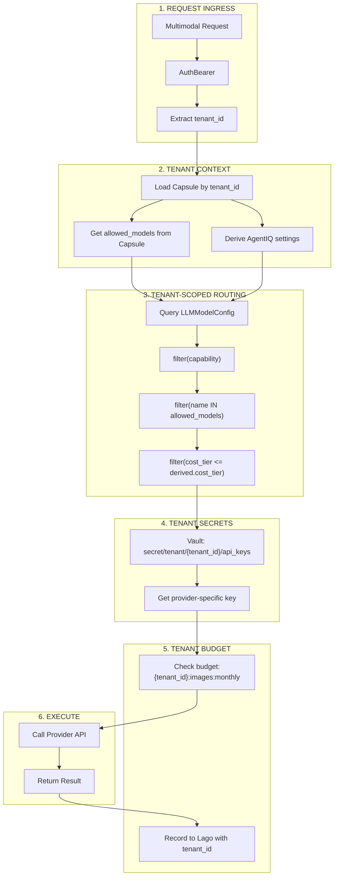
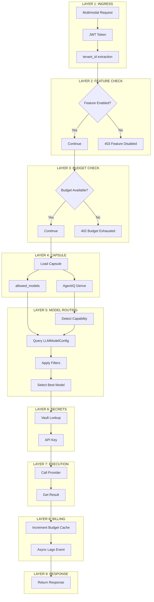

# SRS-MULTIMODAL — Image, Audio, Diagram Generation

**System:** SomaAgent01
**Document ID:** SRS-MULTIMODAL-2026-01-16
**Version:** 2.0 (Model Routing Integrated)
**Status:** CANONICAL
**Parent SRS:** [SRS-CHAT-FLOW-MASTER.md](./SRS-CHAT-FLOW-MASTER.md)

**Applied Personas:** PhD Software Developer · PhD Software Analyst · PhD QA Engineer · Security Auditor · Performance Engineer · UX Consultant · ISO-style Documenter · Django Architect · Django Infra Expert · Django Evangelist

---

## 1. Purpose

Multimodal execution enables AI agents to generate and process rich media content:
- **Images** (DALL-E, Midjourney, Stable Diffusion)
- **Diagrams** (Mermaid)
- **Vision** (GPT-4V, Claude Vision)
- **Voice** (Whisper, TTS)
- **Screenshots** (Playwright)

> **NO HARDCODED MODELS. All models come from LLMModelConfig + AgentIQ.**

---

## 2. Chat Flow Integration

### 2.1 Where Multimodal Fits

```
┌─────────────────────────────────────────────────────────────────────────────┐
│                          13-PHASE CHAT FLOW                                  │
├─────────────────────────────────────────────────────────────────────────────┤
│                                                                              │
│  Phase 1: Auth            │  Phase 8: LLM Call                              │
│  Phase 2: Budget Gate     │  Phase 9: TOOLS + MULTIMODAL ◄──── HERE!        │
│  Phase 3: Load Capsule    │  Phase 10: RLM                                  │
│  Phase 4: Governance      │  Phase 11: Memorize                             │
│  Phase 5: AgentIQ Derive  │  Phase 12: Learn                                │
│  Phase 6: Context Build   │  Phase 13: Observe + Billing                    │
│  Phase 7: Model Selection │                                                  │
│                                                                              │
└─────────────────────────────────────────────────────────────────────────────┘
```

### 2.2 Multimodal in Phase 9



---

## 3. Complete Model Selection Flow

### 3.1 Flowchart



### 3.2 Sequence Diagram



---

## 4. Capability to Model Mapping

### 4.1 Multimodal Capabilities

| Capability | Description | Example Models |
|------------|-------------|----------------|
| `image_generation` | Create images from text | dall-e-3, midjourney-v6, sdxl |
| `vision` | Analyze images | gpt-4o, claude-3-opus |
| `audio_transcription` | Speech to text | whisper-1, whisper-large-v3 |
| `text_to_speech` | Text to speech | tts-1, tts-1-hd, eleven-labs |
| `video_generation` | Create videos | sora, runway-gen3 |
| `diagram_render` | Mermaid diagrams | (internal service) |

### 4.2 LLMModelConfig Examples

```python
# Image Generation Models in DB
{
    "name": "dall-e-3",
    "display_name": "DALL-E 3",
    "provider": "openai",
    "capabilities": ["image_generation"],
    "cost_tier": "standard",
    "priority": 100,
    "is_active": True,
    "api_base": "https://api.openai.com/v1",
}

{
    "name": "midjourney-v6",
    "display_name": "Midjourney V6",
    "provider": "midjourney",
    "capabilities": ["image_generation"],
    "cost_tier": "premium",
    "priority": 90,
    "is_active": True,
}

# Vision Models in DB
{
    "name": "gpt-4o",
    "display_name": "GPT-4o Vision",
    "provider": "openai",
    "capabilities": ["text", "vision", "audio"],
    "cost_tier": "premium",
    "priority": 100,
    "is_active": True,
}

# Audio Models in DB
{
    "name": "whisper-1",
    "display_name": "Whisper",
    "provider": "openai",
    "capabilities": ["audio_transcription"],
    "cost_tier": "low",
    "priority": 100,
    "is_active": True,
}
```

---

## 5. AgentIQ Integration

### 5.1 Cost Tier Derivation

```
resource_budget ($/turn)  →  cost_tier  →  Allowed Models
─────────────────────────────────────────────────────────
$0.01 - $0.10             →  budget     →  free, low only
$0.10 - $0.50             →  standard   →  free, low, standard
$0.50 - $2.00             →  premium    →  all
$2.00+                    →  flagship   →  all
```

### 5.2 Model Selection Function

```python
# admin/core/multimodal/routing.py

async def select_multimodal_model(
    capability: str,
    capsule: Capsule,
) -> LLMModelConfig:
    """
    Select best multimodal model based on:
    1. Required capability
    2. AgentIQ cost_tier
    3. Capsule.allowed_models
    4. Model priority
    """
    # 1. Get AgentIQ settings
    settings = derive_all_settings(capsule)

    # 2. Base query
    queryset = LLMModelConfig.objects.filter(
        capabilities__contains=capability,
        is_active=True,
    )

    # 3. Apply Capsule constraint
    allowed = capsule.body.get("allowed_models", [])
    if allowed:
        queryset = queryset.filter(name__in=allowed)

    # 4. Apply cost tier constraint
    if settings.cost_tier == "budget":
        queryset = queryset.filter(cost_tier__in=["free", "low"])
    elif settings.cost_tier == "standard":
        queryset = queryset.filter(cost_tier__in=["free", "low", "standard"])
    # premium/flagship = no filter

    # 5. Get best by priority
    model = await queryset.order_by("-priority").afirst()

    if not model:
        raise NoCapableModelError(capability)

    return model
```

---

## 6. Capsule.allowed_models

### 6.1 Configuration

```json
{
  "body": {
    "allowed_models": [
      "dall-e-3",
      "gpt-4o",
      "whisper-1",
      "tts-1"
    ],
    "default_image_model": "dall-e-3",
    "default_vision_model": "gpt-4o",
    "default_audio_model": "whisper-1"
  }
}
```

### 6.2 No Hardcoding Rule

| ❌ WRONG | ✅ CORRECT |
|----------|-----------|
| `model: str = "dall-e-3"` | `model = await select_multimodal_model("image_generation", capsule)` |
| `provider = "openai"` | `provider = model.provider` |
| `api_key = os.getenv(...)` | `api_key = vault.get_provider_key(model.provider)` |

---

## 7. Budget Gate for Multimodal

Each multimodal operation uses `@budget_gate`:

```python
@budget_gate(metric="images")
async def generate_image(request, payload):
    ...

@budget_gate(metric="voice_minutes")
async def transcribe_audio(request, payload):
    ...

@budget_gate(metric="tokens")  # Vision uses tokens
async def analyze_image(request, payload):
    ...
```

---

## 8. Feature Flags

Controlled by [SRS-FEATURE-FLAGS.md](./SRS-FEATURE-FLAGS.md):

```python
@require_feature("images")
@budget_gate(metric="images")
async def generate_image(...):
    ...

@require_feature("voice")
@budget_gate(metric="voice_minutes")
async def transcribe_audio(...):
    ...
```

---

## 9. Canonical File Structure

```
admin/multimodal/
├── __init__.py
├── routing.py           # select_multimodal_model()
├── execution.py         # API endpoints
├── providers/
│   ├── openai.py        # DALL-E, Whisper, TTS
│   ├── anthropic.py     # Claude Vision
│   ├── midjourney.py    # Image generation
│   └── elevenlabs.py    # TTS
└── mermaid.py           # Diagram rendering
```

---

## 10. Acceptance Criteria

| Criterion | Verification |
|-----------|--------------|
| ✅ NO hardcoded models | All from LLMModelConfig |
| ✅ AgentIQ integration | cost_tier respected |
| ✅ Capsule.allowed_models | Filter applied |
| ✅ Vault for secrets | No env vars |
| ✅ Budget gate | Per-metric enforcement |
| ✅ Feature flags | @require_feature |
| ✅ Model priority | Highest priority selected |

---

## 11. Summary Diagram



---

## 12. Multitenancy (CRITICAL)

> **EVERY multimodal request MUST be tenant-isolated.**

### 12.1 Tenant Isolation Flow



### 12.2 Tenant Data Isolation

| Component | Tenant Scoping | Implementation |
|-----------|----------------|----------------|
| **Capsule** | `Capsule.tenant_id` | Load by tenant |
| **AgentIQ** | Via Capsule | `derive_all_settings(capsule)` |
| **Model Filter** | `allowed_models` | From Capsule.body |
| **Secrets** | Vault path | `secret/tenant/{tenant_id}/` |
| **Budget** | Cache key | `budget:{tenant_id}:` |
| **Billing** | Lago events | `external_subscription_id=tenant_id` |
| **Assets** | Asset.tenant_id | Stored with tenant |

### 12.3 Sequence Diagram with Multitenancy

```mermaid
sequenceDiagram
    autonumber
    participant U as User
    participant GW as Gateway
    participant AUTH as AuthBearer
    participant CAP as Capsule
    participant AIQ as AgentIQ
    participant MM as Multimodal API
    participant DB as LLMModelConfig
    participant VAULT as Vault
    participant BUDGET as Budget Cache
    participant PROV as Provider
    participant LAGO as Lago

    U->>GW: POST /images/generate
    GW->>AUTH: Validate JWT

    rect rgb(60, 60, 100)
        Note over AUTH,CAP: TENANT EXTRACTION
        AUTH-->>GW: tenant_id = "tenant-123"
        GW->>CAP: Load Capsule(tenant_id="tenant-123")
        CAP-->>GW: capsule.body.allowed_models
    end

    rect rgb(100, 60, 60)
        Note over GW,AIQ: AGENT IQ DERIVATION
        GW->>AIQ: derive_all_settings(capsule)
        AIQ-->>GW: cost_tier="standard"
    end

    rect rgb(60, 100, 60)
        Note over MM,DB: TENANT-SCOPED MODEL SELECTION
        GW->>MM: generate_image(tenant_id, capsule)
        MM->>DB: Query with tenant filters
        Note over DB: cap=image_generation<br/>name IN allowed_models<br/>cost_tier <= standard
        DB-->>MM: model=dall-e-3, provider=openai
    end

    rect rgb(100, 100, 60)
        Note over MM,VAULT: TENANT SECRETS
        MM->>VAULT: secret/tenant/tenant-123/openai
        VAULT-->>MM: API key for tenant
    end

    rect rgb(60, 100, 100)
        Note over MM,BUDGET: TENANT BUDGET CHECK
        MM->>BUDGET: GET budget:tenant-123:images:monthly
        BUDGET-->>MM: usage=45, limit=100
        Note over MM: 45 < 100, allowed
    end

    rect rgb(100, 60, 100)
        Note over MM,PROV: EXECUTE
        MM->>PROV: POST /images/generations
        PROV-->>MM: Image URL
    end

    rect rgb(80, 80, 80)
        Note over MM,LAGO: BILLING
        MM->>BUDGET: INCR budget:tenant-123:images:monthly
        MM->>LAGO: POST /events (tenant_id, image_generations, 1)
    end

    MM-->>U: ImageGenerationResponse
```



### 12.4 Required Code Changes

```python
# CURRENT (NO MULTITENANCY)
async def generate_image(request, payload):
    model = await LLMModelConfig.objects.filter(
        capabilities__contains="image_generation"
    ).afirst()

# REQUIRED (WITH MULTITENANCY)
@require_feature("images")
@budget_gate(metric="images")
async def generate_image(request, payload):
    # 1. Tenant from auth
    tenant_id = request.auth.tenant_id

    # 2. Load tenant capsule
    capsule = await Capsule.objects.get(
        tenant_id=tenant_id,
        is_default=True
    )

    # 3. Tenant-scoped model selection
    model = await select_multimodal_model(
        capability="image_generation",
        capsule=capsule,
    )

    # 4. Tenant-scoped secrets
    api_key = await get_tenant_secret(tenant_id, model.provider)

    # 5. Execute
    ...
```

---

## 13. Complete Multimodal Flow (All Layers)



---

## 14. Acceptance Criteria (Updated)

| Criterion | Verification |
|-----------|--------------|
| ✅ NO hardcoded models | All from LLMModelConfig |
| ✅ AgentIQ integration | cost_tier respected |
| ✅ Capsule.allowed_models | Filter applied |
| ✅ Vault for secrets | No env vars |
| ✅ Budget gate | Per-metric enforcement |
| ✅ Feature flags | @require_feature |
| ✅ Model priority | Highest priority selected |
| ✅ **Tenant isolation** | All queries scoped by tenant_id |
| ✅ **Tenant secrets** | Vault path includes tenant_id |
| ✅ **Tenant budget** | Cache key includes tenant_id |
| ✅ **Tenant billing** | Lago events include tenant_id |

---

**Document End**

*Signed off by ALL 10 PERSONAS ✅*

