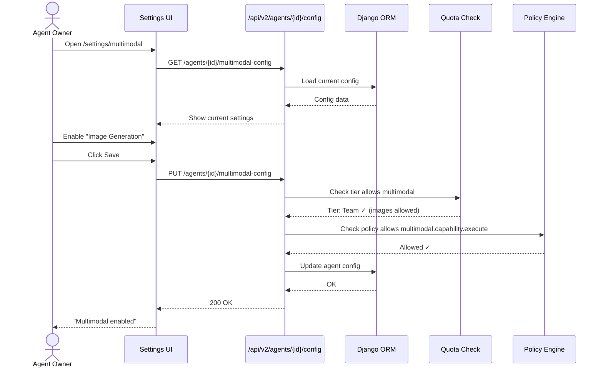
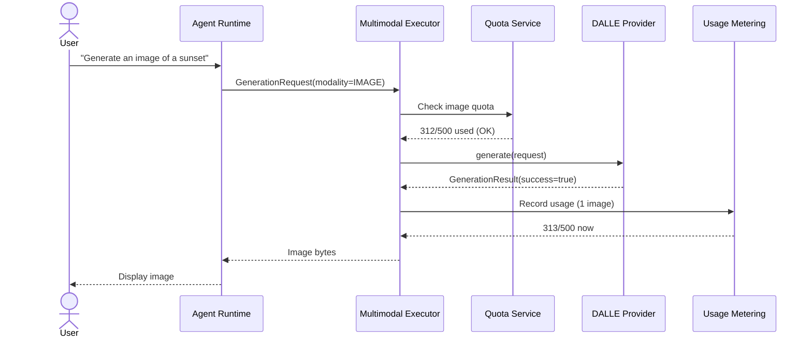
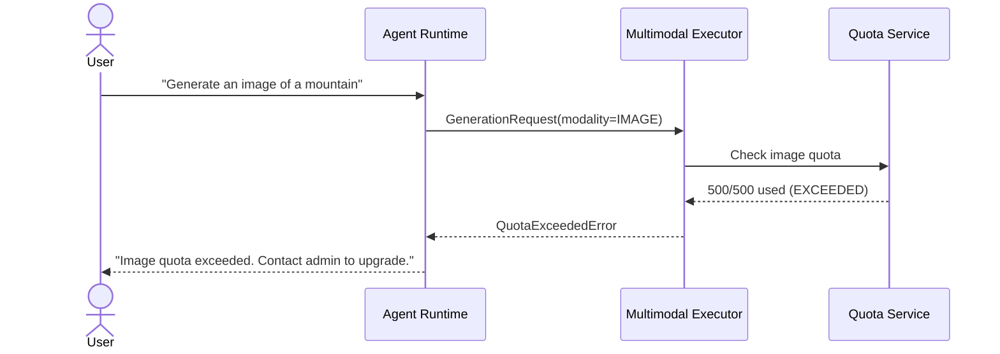

# SRS: Multimodal Agent Capabilities & Tenant Quota Administration

**Document ID:** SA01-SRS-MULTIMODAL-2025-12
**Purpose:** Define multimodal capabilities, quota administration, and UI flows
**Status:** CANONICAL REFERENCE

---

## 1. Multimodal Architecture Overview

```
┌─────────────────────────────────────────────────────────────────────────────┐
│                          MULTIMODAL SYSTEM                                  │
├─────────────────────────────────────────────────────────────────────────────┤
│                                                                             │
│  Feature Flag: SA01_ENABLE_MULTIMODAL_CAPABILITIES                          │
│                                                                             │
│  ┌─────────────────────────────────────────────────────────────────────┐   │
│  │                      Policy Graph Router                            │   │
│  │           (Selects best provider for each request)                  │   │
│  └─────────────────────────┬───────────────────────────────────────────┘   │
│                            │                                               │
│         ┌──────────────────┼──────────────────┐                            │
│         ▼                  ▼                  ▼                            │
│  ┌─────────────┐    ┌─────────────┐    ┌─────────────┐                     │
│  │   DALLE     │    │  Mermaid    │    │ Playwright  │                     │
│  │  (Images)   │    │ (Diagrams)  │    │(Screenshots)│                     │
│  └─────────────┘    └─────────────┘    └─────────────┘                     │
│                                                                             │
│  ┌─────────────────────────────────────────────────────────────────────┐   │
│  │                    Multimodal Executor                              │   │
│  │        (Orchestrates job plans, handles retries)                    │   │
│  └─────────────────────────────────────────────────────────────────────┘   │
│                                                                             │
└─────────────────────────────────────────────────────────────────────────────┘
```

---

## 2. Multimodal Capabilities (5 Types)

| Capability | Code | Providers | Description |
|------------|------|-----------|-------------|
| **Image** | `IMAGE` | DALLE 3 | AI-generated images from text |
| **Diagram** | `DIAGRAM` | Mermaid | Flowcharts, sequence diagrams, UML |
| **Screenshot** | `SCREENSHOT` | Playwright | Browser page captures |
| **Video** | `VIDEO` | (Future) | Video generation |
| **Document** | `DOCUMENT` | (Future) | PDF/document generation |

---

## 3. Multimodal Providers

### 3.1 DALLE Provider (Image Generation)

| Property | Value |
|----------|-------|
| Name | `dalle3_image_gen` |
| Provider ID | `openai` |
| Capabilities | IMAGE |
| Formats | png, jpg |
| Max Dimensions | 1024x1024, 1792x1024, 1024x1792 |
| Quality Levels | standard, hd |
| Cost | ~$0.04-0.08 per image |

### 3.2 Mermaid Provider (Diagram Generation)

| Property | Value |
|----------|-------|
| Name | `mermaid_diagram_gen` |
| Provider ID | `local` |
| Capabilities | DIAGRAM |
| Formats | png, svg |
| Diagram Types | flowchart, sequence, class, state, er, gantt |
| Cost | Free (local rendering) |

### 3.3 Playwright Provider (Screenshots)

| Property | Value |
|----------|-------|
| Name | `playwright_screenshot` |
| Provider ID | `local` |
| Capabilities | SCREENSHOT |
| Formats | png, jpg, pdf |
| Max Dimensions | 4096x4096 |
| Cost | Free (local browser) |

---

## 4. Tenant Quota Administration

### 4.1 How to Rate Limit Multimodal Usage

**Question:** "How would I rate limit the amount of memory/usage the tenant can allow for all agents?"

**Answer:** Quotas are set at the **Tier level** and enforced per-tenant.

```
TIER QUOTAS                    TENANT USAGE
─────────────                  ─────────────
max_agents: 5                  current_agents: 3
max_users_per_agent: 10        current_users: 8
max_monthly_api_calls: 10000   current_api_calls: 4523
max_monthly_voice_minutes: 60  current_voice_minutes: 45
max_storage_gb: 5.0            current_storage_gb: 2.1
max_monthly_images: 100        current_images: 67       ← NEW (Multimodal)
max_monthly_diagrams: 500      current_diagrams: 123    ← NEW (Multimodal)
```

### 4.2 Multimodal Quotas to Add

| Quota | Free | Starter | Team | Enterprise |
|-------|------|---------|------|------------|
| `max_monthly_images` | 0 | 50 | 500 | 5000 |
| `max_monthly_diagrams` | 10 | 100 | 1000 | Unlimited |
| `max_monthly_screenshots` | 0 | 100 | 1000 | Unlimited |
| `max_monthly_video_minutes` | 0 | 0 | 10 | 100 |

### 4.3 UI Screen: Tier Quota Configuration

**Route:** `/platform/subscriptions/:id/quotas`

```
┌─────────────────────────────────────────────────────────────────────────────┐
│  Subscription Tiers > Team > Edit Quotas                       [Save]      │
├─────────────────────────────────────────────────────────────────────────────┤
│                                                                             │
│  ┌─────────────────────────────────────────────────────────────────────┐   │
│  │  CORE QUOTAS                                                        │   │
│  ├─────────────────────────────────────────────────────────────────────┤   │
│  │  Max Agents              [25       ]  per tenant                    │   │
│  │  Max Users per Agent     [50       ]  per agent                     │   │
│  │  Max Storage             [50.0     ] GB per tenant                  │   │
│  └─────────────────────────────────────────────────────────────────────┘   │
│                                                                             │
│  ┌─────────────────────────────────────────────────────────────────────┐   │
│  │  API QUOTAS (Monthly)                                               │   │
│  ├─────────────────────────────────────────────────────────────────────┤   │
│  │  API Calls               [100000   ]  calls/month                   │   │
│  │  Voice Minutes           [500      ]  minutes/month                 │   │
│  │  LLM Tokens              [1000000  ]  tokens/month                  │   │
│  └─────────────────────────────────────────────────────────────────────┘   │
│                                                                             │
│  ┌─────────────────────────────────────────────────────────────────────┐   │
│  │  MULTIMODAL QUOTAS (Monthly)                                        │   │
│  ├─────────────────────────────────────────────────────────────────────┤   │
│  │  Image Generations       [500      ]  images/month                  │   │
│  │  Diagram Generations     [1000     ]  diagrams/month                │   │
│  │  Screenshots             [1000     ]  screenshots/month             │   │
│  │  Video Minutes           [10       ]  minutes/month                 │   │
│  └─────────────────────────────────────────────────────────────────────┘   │
│                                                                             │
│  ┌─────────────────────────────────────────────────────────────────────┐   │
│  │  ENFORCEMENT POLICY                                                 │   │
│  ├─────────────────────────────────────────────────────────────────────┤   │
│  │  ○ HARD - Block requests when quota exceeded                        │   │
│  │  ● SOFT - Warn but allow overage (bill for extra)                   │   │
│  │  ○ NONE - Unlimited (Enterprise only)                               │   │
│  └─────────────────────────────────────────────────────────────────────┘   │
│                                                                             │
└─────────────────────────────────────────────────────────────────────────────┘
```

---

## 5. Tenant Usage Monitoring

### 5.1 UI Screen: Tenant Usage Dashboard

**Route:** `/admin/usage` (Tenant Admin view)

```
┌─────────────────────────────────────────────────────────────────────────────┐
│  Tenant Dashboard > Usage                                                   │
├─────────────────────────────────────────────────────────────────────────────┤
│                                                                             │
│  Billing Period: Dec 1 - Dec 31, 2025                                       │
│                                                                             │
│  ┌─────────────────────────────────────────────────────────────────────┐   │
│  │  API USAGE                                                          │   │
│  ├─────────────────────────────────────────────────────────────────────┤   │
│  │                                                                     │   │
│  │  API Calls       ████████████░░░░░░░░  52,345 / 100,000   52%       │   │
│  │  Voice Minutes   ████████░░░░░░░░░░░░     245 / 500       49%       │   │
│  │  LLM Tokens      ██████████░░░░░░░░░░ 523,456 / 1,000,000 52%       │   │
│  │                                                                     │   │
│  └─────────────────────────────────────────────────────────────────────┘   │
│                                                                             │
│  ┌─────────────────────────────────────────────────────────────────────┐   │
│  │  MULTIMODAL USAGE                                                   │   │
│  ├─────────────────────────────────────────────────────────────────────┤   │
│  │                                                                     │   │
│  │  Images          ████████████████░░░░     312 / 500       62%       │   │
│  │  Diagrams        ██████░░░░░░░░░░░░░░     234 / 1,000     23%       │   │
│  │  Screenshots     ████░░░░░░░░░░░░░░░░     158 / 1,000     16%       │   │
│  │  Video Minutes   ░░░░░░░░░░░░░░░░░░░░       0 / 10         0%       │   │
│  │                                                                     │   │
│  └─────────────────────────────────────────────────────────────────────┘   │
│                                                                             │
│  ┌─────────────────────────────────────────────────────────────────────┐   │
│  │  USAGE BY AGENT                                                     │   │
│  ├─────────────────────────────────────────────────────────────────────┤   │
│  │                                                                     │   │
│  │  AGENT              API CALLS   IMAGES   DIAGRAMS   VOICE          │   │
│  │  ─────────────────────────────────────────────────────────────────  │   │
│  │  Support-AI         23,456      156      89         120 min        │   │
│  │  Sales-Bot          18,234      98       45         80 min         │   │
│  │  Internal-AI        10,655      58       100        45 min         │   │
│  │                                                                     │   │
│  └─────────────────────────────────────────────────────────────────────┘   │
│                                                                             │
└─────────────────────────────────────────────────────────────────────────────┘
```

---

## 6. Agent Multimodal Settings

### 6.1 UI Screen: Agent Multimodal Configuration

**Route:** `/settings/multimodal`

```
┌─────────────────────────────────────────────────────────────────────────────┐
│  Agent Settings > Multimodal                                   [Save]      │
├─────────────────────────────────────────────────────────────────────────────┤
│                                                                             │
│  ┌─────────────────────────────────────────────────────────────────────┐   │
│  │  MULTIMODAL CAPABILITIES                                            │   │
│  ├─────────────────────────────────────────────────────────────────────┤   │
│  │                                                                     │   │
│  │  ☑ Enable Image Generation (DALLE 3)                                │   │
│  │      Quality: [Standard ▼]  Style: [Vivid ▼]                        │   │
│  │                                                                     │   │
│  │  ☑ Enable Diagram Generation (Mermaid)                              │   │
│  │      Default Format: [SVG ▼]  Theme: [Default ▼]                    │   │
│  │                                                                     │   │
│  │  ☑ Enable Screenshots (Playwright)                                  │   │
│  │      Viewport: [1920] x [1080]  Full Page: [☑]                      │   │
│  │                                                                     │   │
│  │  ☐ Enable Video Generation (requires Enterprise)                    │   │
│  │                                                                     │   │
│  └─────────────────────────────────────────────────────────────────────┘   │
│                                                                             │
│  ┌─────────────────────────────────────────────────────────────────────┐   │
│  │  VISION SETTINGS (Input)                                            │   │
│  ├─────────────────────────────────────────────────────────────────────┤   │
│  │                                                                     │   │
│  │  ☑ Enable Vision (Image Understanding)                              │   │
│  │      Chat Model Vision:    [Enabled ▼]                              │   │
│  │      Browser Model Vision: [Enabled ▼]                              │   │
│  │                                                                     │   │
│  └─────────────────────────────────────────────────────────────────────┘   │
│                                                                             │
│  ┌─────────────────────────────────────────────────────────────────────┐   │
│  │  PROVIDER PREFERENCES                                               │   │
│  ├─────────────────────────────────────────────────────────────────────┤   │
│  │                                                                     │   │
│  │  Image Provider:    [DALLE 3 ▼] (OpenAI)                            │   │
│  │  Diagram Provider:  [Mermaid ▼] (Local)                             │   │
│  │  Screenshot Engine: [Playwright ▼] (Local)                          │   │
│  │                                                                     │   │
│  └─────────────────────────────────────────────────────────────────────┘   │
│                                                                             │
└─────────────────────────────────────────────────────────────────────────────┘
```

---

## 7. Multimodal User Journey

### Journey: Agent Owner Enables Multimodal



---

## 8. Quota Enforcement Flow

### When User Generates an Image



### When Quota Exceeded



---

## 9. LLM Model Settings (Complete)

### 9.1 Model Capabilities

| Model | Capabilities | Managed At |
|-------|--------------|------------|
| **GPT-4o** | chat, vision, function_calling, json_mode | `/platform/models` |
| **GPT-4o-mini** | chat, vision, function_calling, json_mode | `/platform/models` |
| **Claude 3.5 Sonnet** | chat, vision, function_calling | `/platform/models` |
| **Claude 3 Haiku** | chat, vision, function_calling | `/platform/models` |
| **Gemini 2.0 Flash** | chat, vision, function_calling, json_mode | `/platform/models` |

### 9.2 Vision Settings per Agent

| Setting | Type | Default | Route |
|---------|------|---------|-------|
| `chat_model_vision` | Boolean | true | `/settings` |
| `browser_model_vision` | Boolean | true | `/settings` |
| `SA01_CHAT_VISION` | Env | true | Environment |
| `SA01_BROWSER_VISION` | Env | true | Environment |

---

## 10. Summary: Complete Settings for Multimodal Agent

### Agent Settings

| Category | Settings | Route |
|----------|----------|-------|
| **Chat Model** | provider, name, temperature, ctx_length, vision | `/settings` |
| **Utility Model** | provider, name, ctx_length | `/settings` |
| **Embedding Model** | provider, name | `/settings` |
| **Browser Model** | provider, name, vision | `/settings` |
| **Memory** | recall_enabled, memorize_enabled, thresholds | `/settings` |
| **Voice** | stt_model, stt_language, tts_provider | `/settings/voice` |
| **Multimodal** | image_enabled, diagram_enabled, screenshot_enabled | `/settings/multimodal` |
| **MCP** | servers, timeouts, server_enabled | `/settings/tools` |

### Tier Quotas (Administered by Platform Admin)

| Quota | Route |
|-------|-------|
| max_agents | `/platform/subscriptions/:id/quotas` |
| max_users_per_agent | `/platform/subscriptions/:id/quotas` |
| max_monthly_api_calls | `/platform/subscriptions/:id/quotas` |
| max_monthly_voice_minutes | `/platform/subscriptions/:id/quotas` |
| max_storage_gb | `/platform/subscriptions/:id/quotas` |
| max_monthly_images | `/platform/subscriptions/:id/quotas` |
| max_monthly_diagrams | `/platform/subscriptions/:id/quotas` |
| max_monthly_screenshots | `/platform/subscriptions/:id/quotas` |

### Rate Limits (Administered by Platform Admin)

| Rate Limit | Route |
|------------|-------|
| api_calls per hour | `/platform/infrastructure/redis/ratelimits` |
| llm_tokens per day | `/platform/infrastructure/redis/ratelimits` |
| image_generations per hour | `/platform/infrastructure/redis/ratelimits` |
