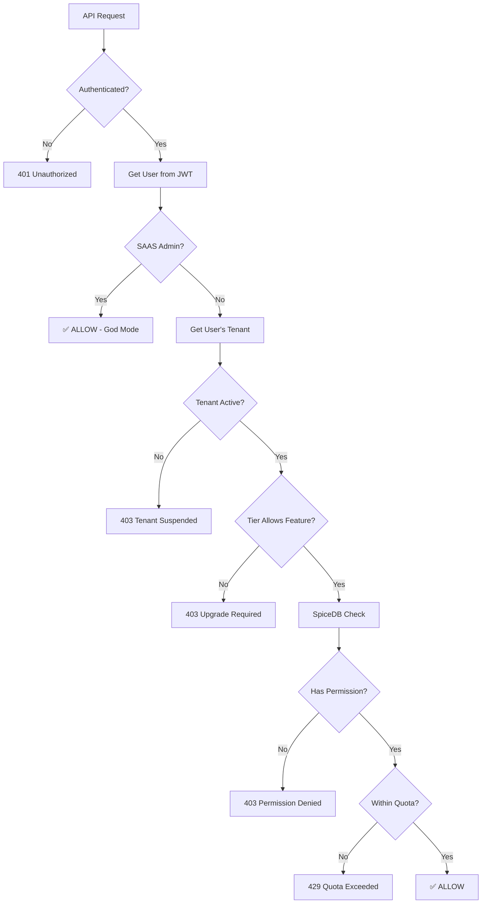
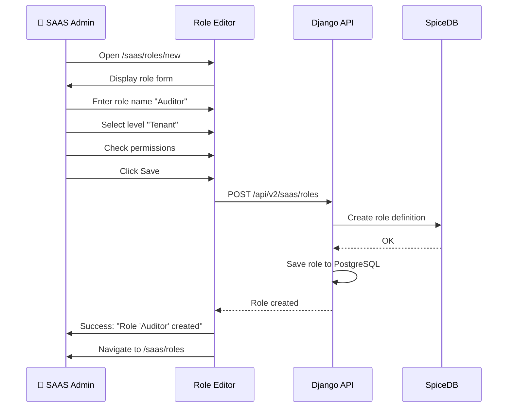

# SRS: Permission Matrix & Role Administration

**Document ID:** SA01-SRS-PERMISSIONS-2025-12  
**Role:** 🔴 SAAS SysAdmin (manages all)  
**Routes:** `/saas/roles/*`, `/saas/permissions/*`  
**Status:** CANONICAL

---

## 0. SaaS-Wide Permission Architecture

### 0.1 Permission Cascade Model

Permissions flow **top-down** through a strict hierarchy:

```
┌─────────────────────────────────────────────────────────────────────────────┐
│                         🔴 SAAS PLATFORM (God Mode)                          │
│                                                                             │
│  • Manages ALL tenants, subscriptions, roles, permissions                   │
│  • Can create/modify ANY role at ANY level                                  │
│  • Defines TIER features (what tenants can access)                          │
│  • Sets GLOBAL limits and quotas                                            │
│                                                                             │
│  SpiceDB: definition platform {}                                            │
│           definition saas_admin { relation platform: platform }             │
├─────────────────────────────────────────────────────────────────────────────┤
                                    │
                                    ▼ (Tier Limits Apply)
┌─────────────────────────────────────────────────────────────────────────────┐
│                         🟠 TENANT LEVEL                                      │
│                                                                             │
│  • Bound by subscription tier limits                                        │
│  • Can assign roles ONLY within their tenant                                │
│  • Can configure agents ONLY within their quota                             │
│  • CANNOT exceed tier limits (enforced by SAAS)                             │
│                                                                             │
│  SpiceDB: definition tenant {                                               │
│               relation subscription: subscription_tier                      │
│               relation sysadmin: user                                       │
│           }                                                                 │
├─────────────────────────────────────────────────────────────────────────────┤
                                    │
                                    ▼ (Agent Limits Apply)
┌─────────────────────────────────────────────────────────────────────────────┐
│                         🟢 AGENT LEVEL                                       │
│                                                                             │
│  • Bound by tenant's agent quota                                            │
│  • Mode access depends on user's tenant role                                │
│  • Features depend on tier (e.g., DEV mode = Team+ only)                    │
│                                                                             │
│  SpiceDB: definition agent {                                                │
│               relation tenant: tenant                                       │
│               permission configure = owner + tenant->administrate           │
│           }                                                                 │
└─────────────────────────────────────────────────────────────────────────────┘
```

---

### 0.2 Permission Inheritance Rules

| Rule | Description | Example |
|------|-------------|---------|
| **Cascade Down** | Higher level can ALWAYS access lower | 🔴 SAAS Admin → can access ANY tenant |
| **Tier Gating** | Features gated by subscription | DEV mode requires Team tier |
| **Quota Enforcement** | Operations blocked at limit | "Max 10 agents reached" |
| **Role Scoping** | Roles only valid in scope | Tenant Admin can't manage other tenants |
| **Impersonation** | Only 🔴 can impersonate | SAAS Admin can "become" any Tenant Admin |

---

### 0.3 SaaS-Wide Permission Categories

```
┌─────────────────────────────────────────────────────────────────────────────┐
│ LEVEL 0: PLATFORM PERMISSIONS (🔴 Only)                                      │
├─────────────────────────────────────────────────────────────────────────────┤
│ platform:manage          │ Full platform control                            │
│ platform:manage_tenants  │ Create/suspend/delete tenants                   │
│ platform:manage_tiers    │ Create/edit subscription tiers                  │
│ platform:manage_roles    │ Create/edit/delete roles at ANY level           │
│ platform:view_billing    │ View ALL billing across platform                │
│ platform:impersonate     │ Become any tenant user                          │
│ platform:configure       │ Platform-wide settings                          │
└─────────────────────────────────────────────────────────────────────────────┘
                                    │
                                    ▼
┌─────────────────────────────────────────────────────────────────────────────┐
│ LEVEL 1: TENANT PERMISSIONS (🟠🟡 within their tenant)                       │
├─────────────────────────────────────────────────────────────────────────────┤
│ tenant:manage            │ Full tenant control (SysAdmin only)             │
│ tenant:administrate      │ User/agent management                           │
│ tenant:create_agent      │ Create agents (within quota)                    │
│ tenant:delete_agent      │ Delete agents                                   │
│ tenant:view_billing      │ View tenant billing                             │
│ tenant:manage_api_keys   │ Create/revoke API keys                          │
│ tenant:assign_roles      │ Assign roles to users (within tenant)           │
└─────────────────────────────────────────────────────────────────────────────┘
                                    │
                                    ▼
┌─────────────────────────────────────────────────────────────────────────────┐
│ LEVEL 2: AGENT PERMISSIONS (🟢🔵🟣⚪⚫ per agent)                            │
├─────────────────────────────────────────────────────────────────────────────┤
│ agent:configure          │ Agent settings, models, features                │
│ agent:activate_adm       │ Enable ADM mode (Owner/Admin only)              │
│ agent:activate_dev       │ Enable DEV mode (requires tier)                 │
│ agent:activate_trn       │ Enable TRN mode (requires tier)                 │
│ agent:activate_std       │ Enable STD mode (default)                       │
│ agent:activate_ro        │ Enable RO mode (view only)                      │
│ agent:manage_users       │ Add/remove users from agent                     │
└─────────────────────────────────────────────────────────────────────────────┘
                                    │
                                    ▼
┌─────────────────────────────────────────────────────────────────────────────┐
│ LEVEL 3: RESOURCE PERMISSIONS (within agent context)                        │
├─────────────────────────────────────────────────────────────────────────────┤
│ chat:send                │ Send messages                                   │
│ chat:view                │ View chat history                               │
│ chat:delete              │ Delete conversations                            │
│ memory:read              │ Read memories                                   │
│ memory:write             │ Create memories                                 │
│ memory:delete            │ Delete memories                                 │
│ tools:execute            │ Run tools                                       │
│ cognitive:view           │ View cognitive state                            │
│ cognitive:edit           │ Modify neuromodulators                          │
│ voice:use                │ Use voice features                              │
│ voice:configure          │ Configure voice settings                        │
└─────────────────────────────────────────────────────────────────────────────┘
```

---

### 0.4 Tier-Gated Features

| Feature | Free | Starter | Team | Enterprise |
|---------|------|---------|------|------------|
| STD Mode | ✅ | ✅ | ✅ | ✅ |
| RO Mode | ✅ | ✅ | ✅ | ✅ |
| **DEV Mode** | ❌ | ❌ | ✅ | ✅ |
| **TRN Mode** | ❌ | ❌ | ✅ | ✅ |
| **ADM Mode** | ❌ | ✅ | ✅ | ✅ |
| Voice | ❌ | ✅ | ✅ | ✅ |
| API Access | ❌ | ✅ | ✅ | ✅ |
| Custom LLM | ❌ | ❌ | ❌ | ✅ |
| SSO | ❌ | ❌ | ❌ | ✅ |
| SLA | ❌ | ❌ | ❌ | ✅ |

---

### 0.5 Permission Check Flow



---

## 1. Complete Permission Matrix — By User Journey

### Legend
| Symbol | Meaning |
|--------|---------|
| ✅ | Full access |
| 👁️ | View only |
| ⚠️ | Conditional (quota/ownership) |
| ❌ | No access |

---

### 1.1 User Journey Permissions

| Journey | 🔴 SAAS Admin | 🟠 Tenant SysAdmin | 🟡 Tenant Admin | 🟢 Agent Owner | 🔵 Developer | 🟣 Trainer | ⚪ User | ⚫ Viewer |
|---------|---------------|-------------------|-----------------|----------------|--------------|------------|---------|----------|
| **UC-01** Chat with Agent | ✅ | ✅ | ✅ | ✅ | ✅ | ✅ | ✅ | 👁️ |
| **UC-02** Create Conversation | ✅ | ✅ | ✅ | ✅ | ✅ | ✅ | ✅ | ❌ |
| **UC-03** Upload File | ✅ | ✅ | ✅ | ✅ | ✅ | ✅ | ⚠️ | ❌ |
| **UC-04** Voice Chat | ✅ | ✅ | ✅ | ✅ | ✅ | ✅ | ⚠️ | ❌ |
| **UC-05** View Memories | ✅ | ✅ | ✅ | ✅ | ✅ | ✅ | 👁️ | 👁️ |
| **UC-06** Configure Agent | ✅ | ✅ | ✅ | ✅ | ❌ | ❌ | ❌ | ❌ |
| **UC-07** Manage Users | ✅ | ✅ | ⚠️ | ❌ | ❌ | ❌ | ❌ | ❌ |
| **UC-08** View Billing | ✅ | ✅ | ❌ | ❌ | ❌ | ❌ | ❌ | ❌ |
| **UC-09** Create Tenant | ✅ | ❌ | ❌ | ❌ | ❌ | ❌ | ❌ | ❌ |
| **UC-10** Suspend Tenant | ✅ | ❌ | ❌ | ❌ | ❌ | ❌ | ❌ | ❌ |
| **UC-11** Manage Subscriptions | ✅ | ❌ | ❌ | ❌ | ❌ | ❌ | ❌ | ❌ |
| **UC-12** Platform Metrics | ✅ | ❌ | ❌ | ❌ | ❌ | ❌ | ❌ | ❌ |
| **UC-13** Tool Execution | ✅ | ✅ | ✅ | ✅ | ✅ | ✅ | ⚠️ | ❌ |
| **UC-14** Store Memory | ✅ | ✅ | ✅ | ✅ | ✅ | ✅ | ⚠️ | ❌ |
| **UC-15** API Integration | ✅ | ✅ | ⚠️ | ⚠️ | ⚠️ | ❌ | ❌ | ❌ |

---

### 1.2 Screen Access Permissions

| Screen | Route | 🔴 SAAS | 🟠 TSysAdmin | 🟡 TAdmin | 🟢 Owner | 🔵 Dev | 🟣 Trn | ⚪ User | ⚫ View |
|--------|-------|---------|--------------|-----------|----------|--------|--------|---------|--------|
| **PLATFORM** |
| Platform Dashboard | `/saas` | ✅ | ❌ | ❌ | ❌ | ❌ | ❌ | ❌ | ❌ |
| Tenant List | `/saas/tenants` | ✅ | ❌ | ❌ | ❌ | ❌ | ❌ | ❌ | ❌ |
| Create Tenant | `/saas/tenants/new` | ✅ | ❌ | ❌ | ❌ | ❌ | ❌ | ❌ | ❌ |
| Subscription Tiers | `/saas/subscriptions` | ✅ | ❌ | ❌ | ❌ | ❌ | ❌ | ❌ | ❌ |
| Platform Billing | `/saas/billing` | ✅ | ❌ | ❌ | ❌ | ❌ | ❌ | ❌ | ❌ |
| Platform Health | `/saas/health` | ✅ | ❌ | ❌ | ❌ | ❌ | ❌ | ❌ | ❌ |
| **Role Admin** | `/saas/roles` | ✅ | ❌ | ❌ | ❌ | ❌ | ❌ | ❌ | ❌ |
| **Permission Browser** | `/saas/permissions` | ✅ | ❌ | ❌ | ❌ | ❌ | ❌ | ❌ | ❌ |
| **TENANT** |
| Tenant Dashboard | `/admin` | ✅ | ✅ | ✅ | ❌ | ❌ | ❌ | ❌ | ❌ |
| User Management | `/admin/users` | ✅ | ✅ | ⚠️ | ❌ | ❌ | ❌ | ❌ | ❌ |
| Agent List | `/admin/agents` | ✅ | ✅ | ✅ | ❌ | ❌ | ❌ | ❌ | ❌ |
| Create Agent | `/admin/agents/new` | ✅ | ✅ | ❌ | ❌ | ❌ | ❌ | ❌ | ❌ |
| Tenant Settings | `/admin/settings` | ✅ | ✅ | ❌ | ❌ | ❌ | ❌ | ❌ | ❌ |
| Tenant Billing | `/admin/billing` | ✅ | ✅ | ❌ | ❌ | ❌ | ❌ | ❌ | ❌ |
| API Keys | `/admin/api-keys` | ✅ | ✅ | ❌ | ❌ | ❌ | ❌ | ❌ | ❌ |
| Audit Log | `/admin/audit` | ✅ | ✅ | ✅ | ❌ | ❌ | ❌ | ❌ | ❌ |
| Tenant Roles | `/admin/roles` | ✅ | ✅ | ❌ | ❌ | ❌ | ❌ | ❌ | ❌ |
| **AGENT** |
| Agent Overview | `/agent/:id` | ✅ | ✅ | ✅ | ✅ | ❌ | ❌ | ❌ | ❌ |
| Agent Config | `/agent/:id/config` | ✅ | ✅ | ✅ | ✅ | ❌ | ❌ | ❌ | ❌ |
| Agent Users | `/agent/:id/users` | ✅ | ✅ | ✅ | ✅ | ❌ | ❌ | ❌ | ❌ |
| **DEV MODE** |
| Debug Console | `/dev/console` | ✅ | ✅ | ❌ | ✅ | ✅ | ❌ | ❌ | ❌ |
| API Logs | `/dev/logs` | ✅ | ✅ | ❌ | ✅ | ✅ | ❌ | ❌ | ❌ |
| MCP Inspector | `/dev/mcp` | ✅ | ✅ | ❌ | ✅ | ✅ | ❌ | ❌ | ❌ |
| **TRN MODE** |
| Cognitive Panel | `/trn/cognitive` | ✅ | ✅ | ❌ | ✅ | ❌ | ✅ | ❌ | ❌ |
| Neuromodulators | `/trn/neuro` | ✅ | ✅ | ❌ | ✅ | ❌ | ✅ | ❌ | ❌ |
| Sleep Control | `/trn/sleep` | ✅ | ✅ | ❌ | ✅ | ❌ | ✅ | ❌ | ❌ |
| **STD MODE** |
| Chat View | `/chat` | ✅ | ✅ | ✅ | ✅ | ✅ | ✅ | ✅ | 👁️ |
| Memory Browser | `/memory` | ✅ | ✅ | ✅ | ✅ | ✅ | ✅ | 👁️ | 👁️ |
| Tools | `/tools` | ✅ | ✅ | ✅ | ✅ | ✅ | ✅ | ⚠️ | ❌ |
| Profile | `/profile` | ✅ | ✅ | ✅ | ✅ | ✅ | ✅ | ✅ | ✅ |
| Settings | `/settings` | ✅ | ✅ | ✅ | ✅ | ✅ | ✅ | ✅ | 👁️ |

---

### 1.3 API Endpoint Permissions

| Endpoint | Method | 🔴 SAAS | 🟠 TSys | 🟡 TAdm | 🟢 Own | 🔵 Dev | 🟣 Trn | ⚪ Usr | ⚫ View |
|----------|--------|---------|---------|---------|--------|--------|--------|--------|--------|
| **SAAS** |
| `/api/v2/saas/tenants` | GET | ✅ | ❌ | ❌ | ❌ | ❌ | ❌ | ❌ | ❌ |
| `/api/v2/saas/tenants` | POST | ✅ | ❌ | ❌ | ❌ | ❌ | ❌ | ❌ | ❌ |
| `/api/v2/saas/tenants/{id}` | DELETE | ✅ | ❌ | ❌ | ❌ | ❌ | ❌ | ❌ | ❌ |
| `/api/v2/saas/subscriptions` | GET/PUT | ✅ | ❌ | ❌ | ❌ | ❌ | ❌ | ❌ | ❌ |
| `/api/v2/saas/roles` | GET | ✅ | ❌ | ❌ | ❌ | ❌ | ❌ | ❌ | ❌ |
| `/api/v2/saas/roles` | POST/PUT/DEL | ✅ | ❌ | ❌ | ❌ | ❌ | ❌ | ❌ | ❌ |
| `/api/v2/saas/permissions` | GET | ✅ | ❌ | ❌ | ❌ | ❌ | ❌ | ❌ | ❌ |
| **TENANT ADMIN** |
| `/api/v2/admin/users` | GET | ✅ | ✅ | ✅ | ❌ | ❌ | ❌ | ❌ | ❌ |
| `/api/v2/admin/users` | POST | ✅ | ✅ | ✅ | ❌ | ❌ | ❌ | ❌ | ❌ |
| `/api/v2/admin/users/{id}` | PUT | ✅ | ✅ | ⚠️ | ❌ | ❌ | ❌ | ❌ | ❌ |
| `/api/v2/admin/users/{id}` | DELETE | ✅ | ✅ | ⚠️ | ❌ | ❌ | ❌ | ❌ | ❌ |
| `/api/v2/admin/agents` | GET | ✅ | ✅ | ✅ | ❌ | ❌ | ❌ | ❌ | ❌ |
| `/api/v2/admin/agents` | POST | ✅ | ✅ | ❌ | ❌ | ❌ | ❌ | ❌ | ❌ |
| `/api/v2/admin/agents/{id}` | DELETE | ✅ | ✅ | ❌ | ❌ | ❌ | ❌ | ❌ | ❌ |
| `/api/v2/admin/billing` | GET | ✅ | ✅ | ❌ | ❌ | ❌ | ❌ | ❌ | ❌ |
| `/api/v2/admin/roles` | GET/POST/PUT | ✅ | ✅ | ❌ | ❌ | ❌ | ❌ | ❌ | ❌ |
| **AGENT** |
| `/api/v2/agent/{id}/config` | GET | ✅ | ✅ | ✅ | ✅ | ❌ | ❌ | ❌ | ❌ |
| `/api/v2/agent/{id}/config` | PUT | ✅ | ✅ | ✅ | ✅ | ❌ | ❌ | ❌ | ❌ |
| `/api/v2/agent/{id}/users` | GET/POST | ✅ | ✅ | ✅ | ✅ | ❌ | ❌ | ❌ | ❌ |
| **CHAT** |
| `/api/v2/chat/conversations` | GET | ✅ | ✅ | ✅ | ✅ | ✅ | ✅ | ✅ | ✅ |
| `/api/v2/chat/conversations` | POST | ✅ | ✅ | ✅ | ✅ | ✅ | ✅ | ✅ | ❌ |
| `/api/v2/chat/messages` | POST | ✅ | ✅ | ✅ | ✅ | ✅ | ✅ | ✅ | ❌ |
| **MEMORY** |
| `/api/v2/memory` | GET | ✅ | ✅ | ✅ | ✅ | ✅ | ✅ | ✅ | ✅ |
| `/api/v2/memory` | POST | ✅ | ✅ | ✅ | ✅ | ✅ | ✅ | ⚠️ | ❌ |
| `/api/v2/memory/{id}` | DELETE | ✅ | ✅ | ✅ | ✅ | ✅ | ✅ | ❌ | ❌ |
| **COGNITIVE** |
| `/api/v2/cognitive/*` | GET | ✅ | ✅ | ❌ | ✅ | ❌ | ✅ | ❌ | ❌ |
| `/api/v2/cognitive/*` | PUT | ✅ | ✅ | ❌ | ✅ | ❌ | ✅ | ❌ | ❌ |
| **VOICE** |
| `/api/v2/voice/transcribe` | POST | ✅ | ✅ | ✅ | ✅ | ✅ | ✅ | ⚠️ | ❌ |
| `/api/v2/voice/synthesize` | POST | ✅ | ✅ | ✅ | ✅ | ✅ | ✅ | ⚠️ | ❌ |

---

## 2. Role Administration Screens (Eye of God)

### 2.1 Role List (`/saas/roles`)

**Purpose:** View and manage all system roles

```
┌─────────────────────────────────────────────────────────────────────────────┐
│ 🔴 Role Management                                         [+ Create Role]  │
├─────────────────────────────────────────────────────────────────────────────┤
│ [System Roles]  [Custom Roles]  [Role Templates]                            │
│                                                                             │
│ ┌─────────────────────────────────────────────────────────────────────────┐ │
│ │ Role               │ Level    │ Users │ Tenants │ Actions              │ │
│ ├─────────────────────────────────────────────────────────────────────────┤ │
│ │ 🔴 SAAS SysAdmin   │ Platform │ 3     │ ALL     │ [View] 🔒            │ │
│ │ 🟠 Tenant SysAdmin │ Tenant   │ 156   │ 156     │ [View] [Edit]        │ │
│ │ 🟡 Tenant Admin    │ Tenant   │ 234   │ 98      │ [View] [Edit]        │ │
│ │ 🟢 Agent Owner     │ Agent    │ 445   │ 120     │ [View] [Edit]        │ │
│ │ 🔵 Developer       │ Agent    │ 892   │ 87      │ [View] [Edit]        │ │
│ │ 🟣 Trainer         │ Agent    │ 234   │ 45      │ [View] [Edit]        │ │
│ │ ⚪ User            │ Agent    │ 4,567 │ 145     │ [View] [Edit]        │ │
│ │ ⚫ Viewer          │ Agent    │ 1,234 │ 78      │ [View] [Edit]        │ │
│ │ 🟤 Auditor (Custom)│ Tenant   │ 45    │ 12      │ [View] [Edit] [Del]  │ │
│ └─────────────────────────────────────────────────────────────────────────┘ │
│                                                                             │
│ 📊 Total: 9 roles | 7,810 users assigned                                    │
└─────────────────────────────────────────────────────────────────────────────┘
```

**API:**
```
GET /api/v2/saas/roles
POST /api/v2/saas/roles
PUT /api/v2/saas/roles/{id}
DELETE /api/v2/saas/roles/{id}
```

---

### 2.2 Role Editor (`/saas/roles/:id`)

**Purpose:** Edit role permissions

```
┌─────────────────────────────────────────────────────────────────────────────┐
│ 🔴 Edit Role: Tenant Admin                                    [Cancel] [Save]│
├─────────────────────────────────────────────────────────────────────────────┤
│                                                                             │
│ Role Name: [Tenant Admin_________]    Level: [Tenant ▼]                     │
│ Description: [Manages tenant users and agents without billing access]       │
│                                                                             │
│ ─────────────────────────────────────────────────────────────────────────── │
│                                                                             │
│ PERMISSIONS                                                    [Expand All] │
│                                                                             │
│ ┌─────────────────────────────────────────────────────────────────────────┐ │
│ │ 📁 TENANT MANAGEMENT                                                    │ │
│ │    ☑ tenant:view           View tenant dashboard                       │ │
│ │    ☑ tenant:administrate   Manage users and agents                     │ │
│ │    ☐ tenant:manage         Full tenant control (billing, settings)     │ │
│ │    ☐ tenant:delete         Delete tenant                               │ │
│ ├─────────────────────────────────────────────────────────────────────────┤ │
│ │ 📁 USER MANAGEMENT                                                      │ │
│ │    ☑ user:view             View user list                              │ │
│ │    ☑ user:invite           Invite new users                            │ │
│ │    ☑ user:edit             Edit user roles (except SysAdmin)           │ │
│ │    ☐ user:delete_sysadmin  Remove SysAdmin users                       │ │
│ ├─────────────────────────────────────────────────────────────────────────┤ │
│ │ 📁 AGENT MANAGEMENT                                                     │ │
│ │    ☑ agent:view            View agent list                             │ │
│ │    ☑ agent:configure       Configure agent settings                    │ │
│ │    ☐ agent:create          Create new agents                           │ │
│ │    ☐ agent:delete          Delete agents                               │ │
│ ├─────────────────────────────────────────────────────────────────────────┤ │
│ │ 📁 BILLING (All disabled for this role)                                │ │
│ │    ☐ billing:view          View billing dashboard                      │ │
│ │    ☐ billing:manage        Manage subscriptions                        │ │
│ └─────────────────────────────────────────────────────────────────────────┘ │
│                                                                             │
│ ⚠️ Changes affect 234 users across 98 tenants                              │
└─────────────────────────────────────────────────────────────────────────────┘
```

---

### 2.3 Permission Browser (`/saas/permissions`)

**Purpose:** View all SpiceDB permissions

```
┌─────────────────────────────────────────────────────────────────────────────┐
│ 🔴 Permission Browser                              [Search permissions...]   │
├─────────────────────────────────────────────────────────────────────────────┤
│ [Platform] [Tenant] [Agent] [Chat] [Memory] [Cognitive] [Voice]             │
│                                                                             │
│ PLATFORM PERMISSIONS                                                        │
│ ┌─────────────────────────────────────────────────────────────────────────┐ │
│ │ Permission              │ Description                    │ Roles       │ │
│ ├─────────────────────────────────────────────────────────────────────────┤ │
│ │ platform->manage        │ Full platform control          │ 🔴 SAAS     │ │
│ │ platform->manage_tenants│ Create/delete tenants          │ 🔴 SAAS     │ │
│ │ platform->view_billing  │ View platform revenue          │ 🔴 SAAS     │ │
│ │ platform->configure     │ Platform settings              │ 🔴 SAAS     │ │
│ │ platform->impersonate   │ Impersonate any tenant         │ 🔴 SAAS     │ │
│ │ platform->manage_roles  │ Create/edit/delete roles       │ 🔴 SAAS     │ │
│ └─────────────────────────────────────────────────────────────────────────┘ │
│                                                                             │
│ TENANT PERMISSIONS                                                          │
│ ┌─────────────────────────────────────────────────────────────────────────┐ │
│ │ Permission              │ Description                    │ Roles       │ │
│ ├─────────────────────────────────────────────────────────────────────────┤ │
│ │ tenant->manage          │ Full tenant control            │ 🟠 TSys     │ │
│ │ tenant->administrate    │ User/agent management          │ 🟠🟡       │ │
│ │ tenant->create_agent    │ Create new agents              │ 🟠          │ │
│ │ tenant->view_billing    │ View tenant billing            │ 🟠          │ │
│ └─────────────────────────────────────────────────────────────────────────┘ │
│                                                                             │
│ AGENT PERMISSIONS                                                           │
│ ┌─────────────────────────────────────────────────────────────────────────┐ │
│ │ agent->configure        │ Configure agent                │ 🟢🟠🟡     │ │
│ │ agent->activate_dev     │ Enable DEV mode                │ 🔵🟢🟠     │ │
│ │ agent->activate_trn     │ Enable TRN mode                │ 🟣🟢🟠     │ │
│ │ agent->activate_std     │ Enable STD mode                │ ⚪🟣🔵🟢🟠🟡│ │
│ │ agent->activate_ro      │ Enable RO mode                 │ ⚫ +all    │ │
│ └─────────────────────────────────────────────────────────────────────────┘ │
└─────────────────────────────────────────────────────────────────────────────┘
```

---

### 2.4 Subscription Tier Builder (`/saas/subscriptions/builder`)

**Purpose:** Configure tier limits and features

```
┌─────────────────────────────────────────────────────────────────────────────┐
│ 🔴 Subscription Tier Builder                                                │
├─────────────────────────────────────────────────────────────────────────────┤
│                                                                             │
│ ┌───────────────┐ ┌───────────────┐ ┌───────────────┐ ┌───────────────┐    │
│ │     FREE      │ │    STARTER    │ │     TEAM      │ │  ENTERPRISE   │    │
│ │     $0/mo     │ │    $49/mo     │ │   $199/mo     │ │   Custom      │    │
│ ├───────────────┤ ├───────────────┤ ├───────────────┤ ├───────────────┤    │
│ │ Agents: 1     │ │ Agents: 3     │ │ Agents: 10    │ │ Agents: ∞     │    │
│ │ Users: 3      │ │ Users: 10     │ │ Users: 50     │ │ Users: ∞      │    │
│ │ Tokens: 100K  │ │ Tokens: 1M    │ │ Tokens: 10M   │ │ Tokens: ∞     │    │
│ │ Storage: 1GB  │ │ Storage: 10GB │ │ Storage: 100GB│ │ Storage: ∞    │    │
│ ├───────────────┤ ├───────────────┤ ├───────────────┤ ├───────────────┤    │
│ │ FEATURES:     │ │ FEATURES:     │ │ FEATURES:     │ │ FEATURES:     │    │
│ │ ☐ Voice       │ │ ☑ Voice       │ │ ☑ Voice       │ │ ☑ Voice       │    │
│ │ ☐ DEV Mode    │ │ ☐ DEV Mode    │ │ ☑ DEV Mode    │ │ ☑ DEV Mode    │    │
│ │ ☐ TRN Mode    │ │ ☐ TRN Mode    │ │ ☑ TRN Mode    │ │ ☑ TRN Mode    │    │
│ │ ☐ Custom LLM  │ │ ☐ Custom LLM  │ │ ☐ Custom LLM  │ │ ☑ Custom LLM  │    │
│ │ ☐ API Access  │ │ ☑ API Access  │ │ ☑ API Access  │ │ ☑ API Access  │    │
│ │ ☐ SSO         │ │ ☐ SSO         │ │ ☐ SSO         │ │ ☑ SSO         │    │
│ │ ☐ SLA         │ │ ☐ SLA         │ │ ☐ SLA         │ │ ☑ SLA         │    │
│ └───────────────┘ └───────────────┘ └───────────────┘ └───────────────┘    │
│                                                                             │
│ [Edit Free] [Edit Starter] [Edit Team] [Edit Enterprise] [+ New Tier]       │
│                                                                             │
│ Active Tenants: Free(32) Starter(67) Team(45) Enterprise(12)                │
└─────────────────────────────────────────────────────────────────────────────┘
```

---

## 3. SpiceDB Schema — Complete

```zed
// ======================
// PLATFORM LEVEL (GOD MODE)
// ======================
definition platform {}

definition saas_admin {
    relation platform: platform
    
    // Core platform permissions
    permission manage = platform
    permission manage_tenants = platform
    permission view_billing = platform
    permission configure = platform
    permission impersonate = platform
    
    // NEW: Role management
    permission manage_roles = platform
    permission manage_permissions = platform
    permission manage_tiers = platform
}

// ======================
// TENANT LEVEL
// ======================
definition tenant {
    relation sysadmin: user
    relation admin: user
    relation developer: user
    relation trainer: user
    relation member: user
    relation viewer: user
    relation subscription: subscription_tier
    
    // Hierarchical permissions
    permission manage = sysadmin
    permission administrate = sysadmin + admin
    permission create_agent = sysadmin
    permission delete_agent = sysadmin
    permission view_billing = sysadmin
    permission manage_api_keys = sysadmin
    
    // Agent access inheritance
    permission develop = sysadmin + admin + developer
    permission train = sysadmin + admin + trainer
    permission use = sysadmin + admin + developer + trainer + member
    permission view = sysadmin + admin + developer + trainer + member + viewer
    
    // NEW: Tenant-level role management
    permission manage_tenant_roles = sysadmin
}

// ======================
// AGENT LEVEL
// ======================
definition agent {
    relation tenant: tenant
    relation owner: user
    relation admin: user
    relation developer: user
    relation trainer: user
    relation user: user
    relation viewer: user
    
    // Mode activation
    permission configure = owner + admin + tenant->administrate
    permission activate_adm = owner + admin
    permission activate_dev = owner + admin + developer + tenant->develop
    permission activate_trn = owner + admin + trainer + tenant->train
    permission activate_std = owner + admin + developer + trainer + user + tenant->use
    permission activate_ro = owner + admin + developer + trainer + user + viewer + tenant->view
    
    permission view = activate_ro
}

// ======================
// SUBSCRIPTION TIER
// ======================
definition subscription_tier {
    relation owner: tenant
    // Limit enforcement handled in Django
}

// ======================
// FEATURE FLAGS
// ======================
definition feature {
    relation enabled_for: subscription_tier
    relation enabled_for_tenant: tenant
    
    permission use = enabled_for->owner + enabled_for_tenant
}
```

---

## 4. User Journey: Create Custom Role



---

## 5. Edge Cases

| Scenario | System Response |
|----------|-----------------|
| Delete role with users | ⚠️ "45 users have role 'Auditor'. Reassign first." |
| Edit system role | 🔒 "System roles cannot be modified" |
| Create duplicate role | ❌ "Role 'Auditor' already exists" |
| Remove last SysAdmin | ❌ "Cannot remove last SAAS SysAdmin" |
| Reduce tier limits below usage | ⚠️ "12 tenants exceed new limits. Grandfather?" |

---

**Next:** Update [SRS-SAAS-ADMIN.md](./SRS-SAAS-ADMIN.md) with these screens

# SRS: Permission-Gated Journey Map

**Document ID:** SA01-SRS-PERMISSION-JOURNEYS-2025-12
**Purpose:** Connect EVERY screen and action to required permissions
**Status:** CANONICAL REFERENCE

---

## 1. Permission Matrix Integration

This document ensures **every screen, API endpoint, and action** is gated by the correct permission from our 78-permission matrix.

---

## 2. Platform Admin Screens — Permission Requirements

### 2.1 Dashboard & Overview

| Route | Required Permissions | Fallback |
|-------|---------------------|----------|
| `/platform` | `platform:read_metrics` | Redirect to login |
| `/platform/tenants` | `tenant:read` | 403 Forbidden |
| `/platform/tenants/:id` | `tenant:read` | 403 Forbidden |
| `/platform/tenants/create` | `tenant:create` | Button hidden |
| `/platform/subscriptions` | `platform:manage_billing` | 403 Forbidden |
| `/platform/subscriptions/:id` | `platform:manage_billing` | 403 Forbidden |
| `/platform/subscriptions/:id/quotas` | `platform:manage_billing` | 403 Forbidden |

### 2.2 Permissions & Roles

| Route | Required Permissions | Fallback |
|-------|---------------------|----------|
| `/platform/permissions` | `platform:manage` | 403 Forbidden |
| `/platform/roles` | `platform:manage` | 403 Forbidden |
| `/platform/roles/create` | `platform:manage` | Button hidden |

### 2.3 Infrastructure

| Route | Required Permissions | Fallback |
|-------|---------------------|----------|
| `/platform/infrastructure` | `infra:view` | 403 Forbidden |
| `/platform/infrastructure/*` (view) | `infra:view` | 403 Forbidden |
| `/platform/infrastructure/*` (edit) | `infra:configure` | Edit disabled |
| `/platform/infrastructure/redis/ratelimits` | `infra:ratelimit` | 403 Forbidden |

### 2.4 Metrics & Observability

| Route | Required Permissions | Fallback |
|-------|---------------------|----------|
| `/platform/metrics` | `platform:read_metrics` | 403 Forbidden |
| `/platform/metrics/llm` | `platform:read_metrics` | 403 Forbidden |
| `/platform/metrics/tools` | `platform:read_metrics` | 403 Forbidden |
| `/platform/metrics/memory` | `platform:read_metrics` | 403 Forbidden |
| `/platform/metrics/sla` | `platform:read_metrics` | 403 Forbidden |

### 2.5 Features & Models

| Route | Required Permissions | Fallback |
|-------|---------------------|----------|
| `/platform/features` | `platform:manage_features` | 403 Forbidden |
| `/platform/models` | `platform:manage` | 403 Forbidden |

### 2.6 Audit

| Route | Required Permissions | Fallback |
|-------|---------------------|----------|
| `/platform/audit` | `audit:read` | 403 Forbidden |

---

## 3. Tenant Admin Screens — Permission Requirements

### 3.1 Dashboard & Users

| Route | Required Permissions | Fallback |
|-------|---------------------|----------|
| `/admin` | `tenant:read` | Redirect to login |
| `/admin/users` | `user:read` | 403 Forbidden |
| `/admin/users/:id` | `user:read` | 403 Forbidden |
| `/admin/users/invite` | `user:create` | Button hidden |
| Edit user | `user:update` | Edit disabled |
| Delete user | `user:delete` | Button hidden |
| Assign role | `user:assign_roles` | Action hidden |

### 3.2 Agents

| Route | Required Permissions | Fallback |
|-------|---------------------|----------|
| `/admin/agents` | `agent:read` | 403 Forbidden |
| `/admin/agents/:id` | `agent:read` | 403 Forbidden |
| `/admin/agents/create` | `agent:create` | Button hidden |
| Start agent | `agent:start` | Button hidden |
| Stop agent | `agent:stop` | Button hidden |
| Delete agent | `agent:delete` | Button hidden |

### 3.3 Usage & Billing

| Route | Required Permissions | Fallback |
|-------|---------------------|----------|
| `/admin/usage` | `billing:view_usage` | 403 Forbidden |
| `/admin/billing` | `billing:view_invoices` | 403 Forbidden |
| Change plan | `billing:change_plan` | Button hidden |
| Manage payment | `billing:manage_payment` | Button hidden |

### 3.4 Settings

| Route | Required Permissions | Fallback |
|-------|---------------------|----------|
| `/admin/settings` | `tenant:update` | 403 Forbidden |
| `/admin/settings/api-keys` | `apikey:read` | 403 Forbidden |
| Create API key | `apikey:create` | Button hidden |
| Revoke API key | `apikey:revoke` | Button hidden |
| `/admin/settings/integrations` | `integration:read` | 403 Forbidden |

### 3.5 Audit

| Route | Required Permissions | Fallback |
|-------|---------------------|----------|
| `/admin/audit` | `audit:read` | 403 Forbidden |

### 3.6 Metrics

| Route | Required Permissions | Fallback |
|-------|---------------------|----------|
| `/admin/metrics` | `tenant:read` | 403 Forbidden |
| `/admin/metrics/agents` | `agent:read` | 403 Forbidden |

---

## 4. Agent User Screens — Permission Requirements

### 4.1 Chat

| Route | Required Permissions | Fallback |
|-------|---------------------|----------|
| `/chat` | `conversation:read` | 403 Forbidden |
| `/chat/:conversationId` | `conversation:read` | 403 Forbidden |
| Send message | `conversation:send_message` | Input disabled |
| Create conversation | `conversation:create` | Button hidden |
| Delete conversation | `conversation:delete` | Button hidden |
| Export conversation | `conversation:export` | Button hidden |

### 4.2 Memory

| Route | Required Permissions | Fallback |
|-------|---------------------|----------|
| `/memory` | `memory:read` | 403 Forbidden |
| `/memory/:id` | `memory:read` | 403 Forbidden |
| Search memory | `memory:search` | Search hidden |
| Delete memory | `memory:delete` | Button hidden |
| Export memory | `memory:export` | Button hidden |

### 4.3 Settings

| Route | Required Permissions | Fallback |
|-------|---------------------|----------|
| `/settings` | `agent:read` | 403 Forbidden |
| `/settings/models` | `agent:configure_*` OR `agent:update` | 403 Forbidden |
| `/settings/memory` | `agent:configure_*` OR `agent:update` | 403 Forbidden |
| `/settings/voice` | `agent:configure_*` OR `agent:update` | 403 Forbidden |
| `/settings/tools` | `agent:configure_tools` | 403 Forbidden |
| `/settings/multimodal` | `agent:update` | 403 Forbidden |
| Save settings | `agent:update` | Save disabled |

### 4.4 Profile

| Route | Required Permissions | Fallback |
|-------|---------------------|----------|
| `/profile` | `user:read` (self) | 403 Forbidden |
| Update profile | `user:update` (self) | Save disabled |

---

## 5. Developer Mode — Permission Requirements

| Route | Required Permissions | Additional |
|-------|---------------------|------------|
| `/dev/console` | `agent:view_logs` | DEV mode enabled |
| `/dev/mcp` | `tool:read` | DEV mode enabled |
| `/dev/logs` | `agent:view_logs` | DEV mode enabled |
| `/dev/metrics` | `agent:read` | DEV mode enabled |

---

## 6. Trainer Mode — Permission Requirements

| Route | Required Permissions | Additional |
|-------|---------------------|------------|
| `/trn/cognitive` | `agent:configure_personality` | TRN mode enabled |
| `/trn/memory` | `memory:update` | TRN mode enabled |

---

## 7. API Endpoint Permission Matrix

### 7.1 Infrastructure APIs

| Endpoint | Method | Permission |
|----------|--------|------------|
| `/api/v2/infrastructure/health` | GET | `infra:view` |
| `/api/v2/infrastructure/{service}/config` | GET | `infra:view` |
| `/api/v2/infrastructure/{service}/config` | PUT | `infra:configure` |
| `/api/v2/infrastructure/ratelimits` | GET | `infra:view` |
| `/api/v2/infrastructure/ratelimits` | POST | `infra:ratelimit` |
| `/api/v2/infrastructure/ratelimits/{key}` | PUT | `infra:ratelimit` |
| `/api/v2/infrastructure/ratelimits/{key}` | DELETE | `infra:ratelimit` |

### 7.2 Tenant APIs

| Endpoint | Method | Permission |
|----------|--------|------------|
| `/api/v2/tenants` | GET | `tenant:read` |
| `/api/v2/tenants` | POST | `tenant:create` |
| `/api/v2/tenants/{id}` | GET | `tenant:read` |
| `/api/v2/tenants/{id}` | PUT | `tenant:update` |
| `/api/v2/tenants/{id}` | DELETE | `tenant:delete` |
| `/api/v2/tenants/{id}/suspend` | POST | `tenant:suspend` |
| `/api/v2/tenants/{id}/usage` | GET | `billing:view_usage` |

### 7.3 User APIs

| Endpoint | Method | Permission |
|----------|--------|------------|
| `/api/v2/users` | GET | `user:read` |
| `/api/v2/users` | POST | `user:create` |
| `/api/v2/users/{id}` | GET | `user:read` |
| `/api/v2/users/{id}` | PUT | `user:update` |
| `/api/v2/users/{id}` | DELETE | `user:delete` |
| `/api/v2/users/{id}/roles` | PUT | `user:assign_roles` |

### 7.4 Agent APIs

| Endpoint | Method | Permission |
|----------|--------|------------|
| `/api/v2/agents` | GET | `agent:read` |
| `/api/v2/agents` | POST | `agent:create` |
| `/api/v2/agents/{id}` | GET | `agent:read` |
| `/api/v2/agents/{id}` | PUT | `agent:update` |
| `/api/v2/agents/{id}` | DELETE | `agent:delete` |
| `/api/v2/agents/{id}/start` | POST | `agent:start` |
| `/api/v2/agents/{id}/stop` | POST | `agent:stop` |
| `/api/v2/agents/{id}/config` | GET | `agent:read` |
| `/api/v2/agents/{id}/config` | PUT | `agent:update` |
| `/api/v2/agents/{id}/config/models` | PUT | `agent:configure_*` |
| `/api/v2/agents/{id}/multimodal` | PUT | `agent:update` |

### 7.5 Conversation APIs

| Endpoint | Method | Permission |
|----------|--------|------------|
| `/api/v2/conversations` | GET | `conversation:read` |
| `/api/v2/conversations` | POST | `conversation:create` |
| `/api/v2/conversations/{id}` | GET | `conversation:read` |
| `/api/v2/conversations/{id}` | DELETE | `conversation:delete` |
| `/api/v2/conversations/{id}/messages` | POST | `conversation:send_message` |
| `/api/v2/conversations/{id}/export` | GET | `conversation:export` |

### 7.6 Memory APIs

| Endpoint | Method | Permission |
|----------|--------|------------|
| `/api/v2/memory` | GET | `memory:read` |
| `/api/v2/memory/search` | POST | `memory:search` |
| `/api/v2/memory/{id}` | GET | `memory:read` |
| `/api/v2/memory/{id}` | DELETE | `memory:delete` |
| `/api/v2/memory/export` | GET | `memory:export` |

### 7.7 Observability APIs

| Endpoint | Method | Permission |
|----------|--------|------------|
| `/api/v2/observability/health` | GET | `platform:read_metrics` |
| `/api/v2/observability/metrics/*` | GET | `platform:read_metrics` |
| `/api/v2/observability/sla` | GET | `platform:read_metrics` |

---

## 8. Role → Permission → Screen Mapping

### 8.1 SAAS Super Admin

```
Permissions: * (ALL)
Screens: ALL 66 screens accessible
```

### 8.2 Tenant Admin

```
Permissions:
  - tenant:read, tenant:update
  - user:*, agent:*, conversation:*, memory:*
  - tool:*, file:*, apikey:*, integration:*
  - audit:read, backup:read, billing:view_*

Screens:
  ✅ /admin/* (all)
  ✅ /chat, /memory, /settings (all)
  ❌ /platform/* (none)
```

### 8.3 Agent Owner

```
Permissions:
  - agent:read, agent:update, agent:start, agent:stop
  - agent:configure_*, agent:view_logs, agent:export
  - conversation:*, memory:*
  - tool:read, tool:execute
  - file:upload, file:read

Screens:
  ✅ /chat, /memory (all)
  ✅ /settings (all, edit enabled)
  ❌ /admin/* (none)
  ❌ /platform/* (none)
```

### 8.4 Agent Operator

```
Permissions:
  - agent:read, agent:start, agent:stop, agent:view_logs
  - conversation:*, memory:read, memory:search
  - tool:read, tool:execute
  - file:upload, file:read

Screens:
  ✅ /chat (full)
  ✅ /memory (read-only)
  ⚠️ /settings (read-only)
  ❌ /admin/*
  ❌ /platform/*
```

### 8.5 Standard User

```
Permissions:
  - agent:read
  - conversation:create, conversation:read, conversation:send_message, conversation:view_history
  - memory:read
  - file:upload, file:read

Screens:
  ✅ /chat (limited)
  ⚠️ /memory (read-only)
  ❌ /settings
  ❌ /admin/*
  ❌ /platform/*
```

### 8.6 Viewer

```
Permissions:
  - agent:read
  - conversation:read
  - memory:read
  - file:read

Screens:
  ⚠️ /chat (read-only, no send)
  ⚠️ /memory (read-only)
  ❌ /settings
  ❌ /admin/*
  ❌ /platform/*
```

---

## 9. Frontend Permission Enforcement

### 9.1 Route Guard

```typescript
// webui/src/guards/permission-guard.ts

const ROUTE_PERMISSIONS = {
  '/platform': ['platform:read_metrics'],
  '/platform/infrastructure': ['infra:view'],
  '/platform/infrastructure/redis/ratelimits': ['infra:ratelimit'],
  '/admin': ['tenant:read'],
  '/admin/users': ['user:read'],
  '/settings': ['agent:read'],
  // ... all routes
};

function checkRoute(route: string, userPermissions: string[]): boolean {
  const required = ROUTE_PERMISSIONS[route];
  return required.some(p => userPermissions.includes(p) || userPermissions.includes('*'));
}
```

### 9.2 Action Guard

```typescript
// webui/src/guards/action-guard.ts

function canPerformAction(action: string, userPermissions: string[]): boolean {
  const actionPermissions = {
    'create_tenant': 'tenant:create',
    'delete_user': 'user:delete',
    'configure_ratelimits': 'infra:ratelimit',
    // ... all actions
  };
  const required = actionPermissions[action];
  return userPermissions.includes(required) || userPermissions.includes('*');
}
```

---

## 10. Backend Permission Enforcement

### 10.1 Django Ninja Auth

```python
# admin/core/permissions.py

from functools import wraps
from ninja import Router
from ninja.errors import HttpError

def require_permission(*permissions):
    def decorator(func):
        @wraps(func)
        async def wrapper(request, *args, **kwargs):
            user_perms = get_user_permissions(request.auth)
            if '*' in user_perms:
                return await func(request, *args, **kwargs)
            if not any(p in user_perms for p in permissions):
                raise HttpError(403, "Permission denied")
            return await func(request, *args, **kwargs)
        return wrapper
    return decorator

# Usage:
@router.get("/infrastructure/health")
@require_permission("infra:view")
async def get_health(request):
    ...
```

---

## 11. Implementation Checklist

- [ ] Frontend route guards with permission checks
- [ ] Backend API permission decorators
- [ ] Permission caching (Redis)
- [ ] Permission inheritance (role → permissions)
- [ ] Permission UI (conditionally show/hide buttons)
- [ ] Permission audit logging
