# SRS-RLM-ENGINE — Recursive Language Model

**System:** SomaAgent01
**Document ID:** SRS-RLM-ENGINE-2026-01-16
**Version:** 5.0 (AAAS Direct Calls Enforced)
**Status:** CANONICAL

**Applied Personas:** ALL 10 ✅

---

## 0. AAAS Direct Call Rule

> **RLMEngine and SomaBrain.ask() use DIRECT IMPORTS — ZERO HTTP LATENCY**

```python
# ✅ AAAS MODE
from admin.agents.services.rlm_engine import RLMEngine
from somabrain.cognitive import CognitiveCore

engine = RLMEngine(brain=CognitiveCore(db=django_db))
result = await engine.execute(capsule, task)  # All internal calls = 0ms
```

---

## 1. Theoretical Foundation

Based on **MIT CSAIL "RLM: Scaling LLM Reasoning via Reinforcement Learning"**


---

## 2. Capsule Integration

**RLM derives ALL settings from `capsule.body.persona.knobs.intelligence_level`**

```mermaid
flowchart TD
    subgraph CAPSULE ["🧊 Capsule.body"]
        K[persona.knobs.intelligence_level]
    end

    K --> D[derive_rlm_settings]

    D --> MAX_ITER[max_iterations]
    D --> MAX_DEP[max_depth]
    D --> TOK[thinking_tokens]
    D --> RECALL[memory_recall_limit]
    D --> BRAIN[brain_query_enabled]
```



### Derivation Table

| INTELLIGENCE | max_iter | max_depth | think_tokens | brain_enabled |
|--------------|----------|-----------|--------------|---------------|
| 1-3 | 1 | 1 | 512 | false |
| 4-6 | 2 | 2 | 1024 | true |
| 7-8 | 3 | 3 | 2048 | true |
| 9-10 | 5 | 5 | 4096 | true |

---

## 3. Mind-Body Architecture


---

## 4. Brain.ask() — Sub-LM Integration

```python
class RLMEngine:
    async def brain_ask(
        self,
        question: str,
        capsule: Capsule
    ) -> str:
        """Query SomaBrain as Sub-LM when uncertain."""

        # Check if enabled by intelligence level
        settings = derive_rlm_settings(capsule.body["persona"]["knobs"])
        if not settings["brain_query_enabled"]:
            return "Brain queries disabled at this intelligence level"

        # Query brain with capsule context
        return await self.brain_client.ask(
            question=question,
            capsule_id=capsule.id,
            memory_config=capsule.body["persona"]["memory"]
        )
```

---

## 5. Complete Capsule.body.persona.knobs

```json
{
    "persona": {
        "knobs": {
            "intelligence_level": 7,
            "autonomy_level": 5,
            "resource_budget": 0.50
        }
    }
}
```

### All Derivations from Knobs

| Source Knob | Derives |
|-------------|---------|
| **INTELLIGENCE** | RLM iter/depth, brain_ask, memory recall, model tier |
| **AUTONOMY** | HITL thresholds, tool approval, egress limits |
| **RESOURCE** | Token budget, cost tier, thinking tokens |

---

## 6. RLM State in Capsule.body.learned

```json
{
    "learned": {
        "rlm_preferences": {
            "preferred_depth": 3,
            "brain_query_success_rate": 0.85,
            "avg_iterations": 2.3
        }
    }
}
```

---

## 7. Chat Flow Integration

RLM executes in **Phase 8** of 12-phase flow:

```
Phase 7: LLM Generate
    ↓
Phase 8: RLM Execute (if complex task)
    - derive_settings(capsule.knobs)
    - Mind proposes
    - Body executes
    - Brain.ask() if uncertain
    - Loop until complete
    ↓
Phase 9: SomaBrain Learn
```

---

## 8. Django ORM Reference

```python
# RLM reads from Capsule, never hardcoded
capsule = await Capsule.objects.aget(id=capsule_id)
knobs = capsule.body["persona"]["knobs"]
settings = derive_rlm_settings(knobs["intelligence_level"])

# No hardcoded values
engine = RLMEngine(
    max_iterations=settings["max_iterations"],  # Derived
    max_depth=settings["max_depth"],            # Derived
    thinking_tokens=settings["thinking_tokens"] # Derived
)
```

---

## 9. Temporal Workflow Orchestration

RLM execution is orchestrated via **Temporal** for durability and compensation.

### 9.1 Workflow Definition

```python
# services/conversation_worker/temporal_worker.py

@workflow.defn
class ConversationWorkflow:
    @workflow.run
    async def run(self, event: dict) -> dict:
        return await workflow.execute_activity(
            process_message_activity,
            event,
            schedule_to_close_timeout=timedelta(seconds=300),
        )
```

### 9.2 Activity

```python
@activity.defn
async def process_message_activity(event: dict) -> dict:
    proc, dlq = _build_use_case()
    try:
        res = await proc.execute(ProcessMessageInput(...))
        return {"success": res.success, "error": res.error}
    except Exception as exc:
        await compensate_event(event)  # SAGA compensation
        await dlq.send_to_dlq(event, exc)  # Dead Letter Queue
        return {"success": False, "error": str(exc)}
```

### 9.3 Temporal Integration

| Component | Setting | Source |
|-----------|---------|--------|
| Host | `SA01_TEMPORAL_HOST` | `temporal:7233` |
| Queue | `SA01_TEMPORAL_CONVERSATION_QUEUE` | `conversation` |
| Timeout | 300s | Workflow config |

### 9.4 Flow Diagram


---

## 10. Acceptance Criteria

| Criterion | Verification |
|-----------|--------------|
| ✅ Settings from capsule.knobs | No hardcoded values |
| ✅ Brain.ask() integrated | Sub-LM via SomaBrain |
| ✅ Mind-Body loop | MIT CSAIL compliant |
| ✅ Learned preferences saved | capsule.body.learned |
| ✅ Phase 8 integration | Chat flow aligned |
| ✅ Temporal orchestration | ConversationWorkflow |
| ✅ SAGA compensation | compensate_event() |
| ✅ Dead Letter Queue | dlq.send_to_dlq() |

---

**Document End**

*Signed off by ALL 10 PERSONAS ✅*
