# SRS-SECURITY-MULTITENANCY — Security & Tenant Isolation

**System:** SomaAgent01
**Document ID:** SRS-SECURITY-MULTITENANCY-2026-01-16
**Version:** 1.0
**Status:** CANONICAL

**Applied Personas:** ALL 10 ✅

---

## 1. Multi-Tenant Architecture

### 1.1 Isolation Hierarchy

```mermaid
flowchart TD
    subgraph PLATFORM ["🔴 Platform Level"]
        AAAS[AAAS Admin]
        VAULT[HashiCorp Vault]
        SPICE[SpiceDB]
    end

    subgraph TENANT ["🟠 Tenant Level"]
        T1[Tenant A]
        T2[Tenant B]
        T3[Tenant C]
    end

    subgraph CAPSULE ["🟢 Capsule Level"]
        C1[Agent 1]
        C2[Agent 2]
        C3[Agent 3]
    end

    AAAS --> T1
    AAAS --> T2
    AAAS --> T3
    T1 --> C1
    T1 --> C2
    T2 --> C3
```



### 1.2 Data Isolation

| Resource | Isolation Method |
|----------|------------------|
| PostgreSQL | `tenant_id` column on ALL tables |
| Milvus | Collection per tenant |
| Redis | Key prefix: `tenant:{id}:*` |
| Kafka | Topic per tenant: `soma.{tenant}.events` |
| Vault | Path isolation: `secret/tenants/{id}/*` |

---

## 2. Authentication

### 2.1 Keycloak Integration

```python
# Phase 1: JWT Validation
async def validate_jwt(token: str) -> AuthContext:
    # Keycloak validates signature
    claims = await keycloak.verify(token)

    return AuthContext(
        user_id=claims["sub"],
        tenant_id=claims["tenant_id"],  # CRITICAL: Always present
        roles=claims["realm_access"]["roles"],
    )
```

### 2.2 Token Propagation

Every request carries:
```
Authorization: Bearer <jwt>
X-Tenant-ID: <tenant_uuid>
X-Trace-ID: <otel_trace_id>
```

---

## 3. Authorization (SpiceDB)

### 3.1 Permission Check Flow


### 3.2 SpiceDB Schema

```zed
definition tenant {
    relation sysadmin: user
    relation admin: user
    relation member: user

    permission manage = sysadmin
    permission administrate = sysadmin + admin
    permission view = sysadmin + admin + member
}

definition capsule {
    relation tenant: tenant
    relation owner: user

    permission configure = owner + tenant->administrate
    permission chat = owner + tenant->view
}
```

---

## 4. Secret Management (Vault)

### 4.1 Secret Hierarchy

```
secret/
├── platform/
│   ├── llm_providers/      # OpenAI, Anthropic keys
│   └── infrastructure/     # Redis, Kafka passwords
├── tenants/
│   └── {tenant_id}/
│       ├── api_keys/       # Tenant-specific keys
│       └── integrations/   # Zendesk, Slack, etc.
└── capsules/
    └── {capsule_id}/
        └── custom_secrets/ # Per-agent secrets
```

### 4.2 Access Policy

```python
# UnifiedSecretManager - Rule 164 Compliant
from services.common.unified_secret_manager import get_secret_manager

sm = get_secret_manager()

# Tenant-scoped access
key = sm.get_tenant_secret(tenant_id, "api_keys/openai")

# Provider keys (platform level)
provider_key = sm.get_provider_key("openai")
```

---

## 5. Data Security

### 5.1 Encryption

| Layer | Method |
|-------|--------|
| **At Rest** | PostgreSQL TDE, Milvus encryption |
| **In Transit** | TLS 1.3 everywhere |
| **Keys** | Vault auto-unseal with AWS KMS |
| **PII** | Presidio redaction before storage |

### 5.2 PII Handling

```python
# ContextBuilder PII redaction
from presidio_analyzer import AnalyzerEngine
from presidio_anonymizer import AnonymizerEngine

def redact_pii(text: str) -> str:
    analyzer = AnalyzerEngine()
    anonymizer = AnonymizerEngine()

    results = analyzer.analyze(text, language="en")
    return anonymizer.anonymize(text, results).text
```

---

## 6. Audit Trail

### 6.1 Event Schema

```python
class AuditEvent:
    event_id: UUID
    timestamp: datetime
    tenant_id: UUID
    user_id: UUID
    action: str          # "chat.send", "capsule.configure"
    resource_type: str   # "conversation", "capsule"
    resource_id: UUID
    changes: dict        # Before/after for mutations
    ip_address: str
    user_agent: str
```

### 6.2 Storage

- **Hot:** PostgreSQL (30 days)
- **Cold:** S3/MinIO (7 years for compliance)
- **Search:** Kafka → ElasticSearch

---

## 7. Security Patterns

### 7.1 Fail-Closed Principle

```python
# OPA fallback = DENY ALL
async def check_permission(user, action, resource) -> bool:
    try:
        return await spicedb.check(user, action, resource)
    except SpiceDBUnavailable:
        logger.warning("SpiceDB down, using fail-closed")
        return False  # DENY on failure
```

### 7.2 Rate Limiting (Per Tenant)

```python
# Redis rate limiter
limits = {
    "free": {"requests": 100, "per": "minute"},
    "starter": {"requests": 1000, "per": "minute"},
    "team": {"requests": 10000, "per": "minute"},
    "enterprise": {"requests": "unlimited"},
}
```

---

## 8. Cross-Reference

| Topic | SRS Document |
|-------|--------------|
| Permission roles | SRS-PERMISSION-MATRIX |
| Resilience | SRS-CHAT-FLOW-MASTER |
| Capsule governance | SRS-CAPSULE-PORTABILITY |

---

## 9. Acceptance Criteria

| Criterion | Verification |
|-----------|--------------|
| ✅ Tenant isolation | `tenant_id` on every query |
| ✅ SpiceDB auth | Fine-grained permissions |
| ✅ Vault secrets | No env var API keys |
| ✅ PII redaction | Presidio integration |
| ✅ Audit trail | All actions logged |
| ✅ Fail-closed | DENY on auth failure |

---

**Document End**

*Signed off by ALL 10 PERSONAS ✅*
