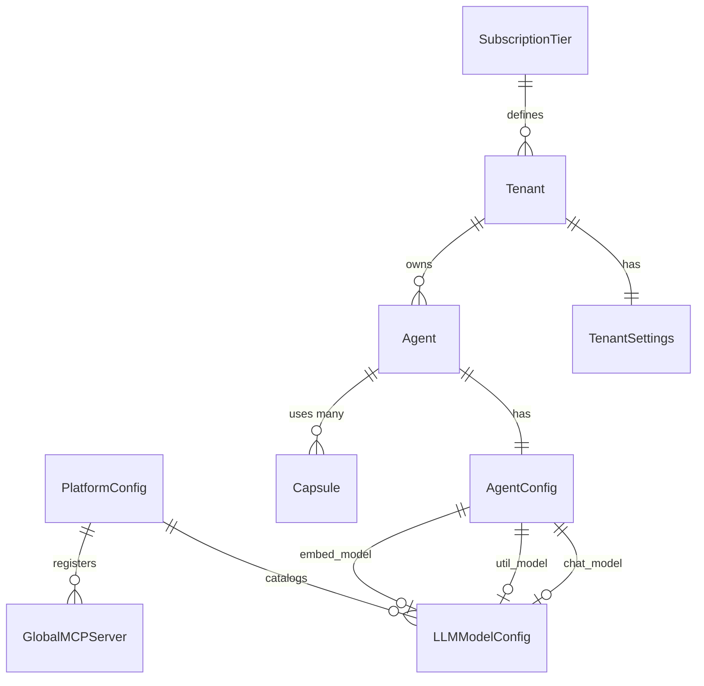

# SRS: Settings Centralization Architecture

**Document ID:** SA01-SRS-SETTINGS-CENTRAL-2026-01
**Purpose:** Unified settings management with hot-reload for the SOMA Stack
**Status:** CANONICAL DESIGN
**ISO Compliance:** IEC 29148:2018

---

## 1. Overview

| Requirement | Solution |
|-------------|----------|
| **Centralized Settings** | Single Django ORM schema |
| **Hot-Reload** | DB Change Notifications + Cache Invalidation |
| **Secrets Management** | Vault integration, never in DB |
| **Hierarchy** | Platform → Tier → Tenant → Agent → User |

---

## 2. Complete Settings Inventory

### 2.1 Layer 0: Platform (God Mode 🔴)

| Category | Setting | Model | Hot-Reload |
|----------|---------|-------|------------|
| **Infra Services** | | | |
| │ | `whisper_url` | `PlatformConfig` | ✅ |
| │ | `kokoro_url` | `PlatformConfig` | ✅ |
| │ | `kokoro_tts_url` | `PlatformConfig` | ✅ |
| │ | `searxng_url` | `PlatformConfig` | ✅ |
| │ | `somabrain_url` | `PlatformConfig` | ✅ |
| │ | `milvus_url` | `PlatformConfig` | ✅ |
| **Model Catalog** | | | |
| │ | LLM Models | `LLMModelConfig` | ✅ |
| │ | Voice Models | `VoiceModel` | ✅ |
| **MCP Registry** | | | |
| │ | Global Servers | `GlobalMCPServer` | ✅ |
| **Permissions** | | | |
| │ | Roles | `Role` (SpiceDB sync) | ⚠️ |
| │ | Permissions | `Permission` | ⚠️ |

### 2.2 Layer 1: Subscription Tier

| Setting | Field | Model |
|---------|-------|-------|
| `max_agents` | IntegerField | `SubscriptionTier` |
| `max_users_per_agent` | IntegerField | `SubscriptionTier` |
| `max_monthly_api_calls` | IntegerField | `SubscriptionTier` |
| `max_monthly_voice_minutes` | IntegerField | `SubscriptionTier` |
| `max_storage_gb` | DecimalField | `SubscriptionTier` |
| `memory_retention_days` | IntegerField | `SubscriptionTier` |
| Feature Gates (JSON) | `feature_gates` | `SubscriptionTier` |

### 2.3 Layer 2: Tenant

| Setting | Field | Model |
|---------|-------|-------|
| `feature_overrides` | JSONField | `TenantSettings` |
| `logo_url` | URLField | `TenantSettings` |
| `primary_color` | CharField | `TenantSettings` |
| `mfa_policy` | CharField | `TenantSettings` |
| `sso_enabled` | BooleanField | `TenantSettings` |
| `keycloak_realm` | CharField | `Tenant` |

### 2.4 Layer 3: Agent (60+ Fields)

```python
class AgentConfig(models.Model):
    """All agent settings in one structured model."""

    agent = OneToOneField('saas.Agent', primary_key=True)

    # ═══ CHAT MODEL ═══
    chat_model = ForeignKey('llm.LLMModelConfig', null=True)
    chat_temperature = FloatField(default=0.0)
    chat_ctx_length = IntegerField(default=100000)
    chat_ctx_history_ratio = FloatField(default=0.7)
    chat_vision_enabled = BooleanField(default=True)
    chat_rate_limit_requests = IntegerField(default=0)
    chat_rate_limit_input = IntegerField(default=0)
    chat_rate_limit_output = IntegerField(default=0)

    # ═══ UTILITY MODEL ═══
    util_model = ForeignKey('llm.LLMModelConfig', null=True)
    util_temperature = FloatField(default=0.0)
    util_ctx_length = IntegerField(default=100000)

    # ═══ EMBEDDING MODEL ═══
    embed_model = ForeignKey('llm.LLMModelConfig', null=True)

    # ═══ BROWSER MODEL ═══
    browser_model = ForeignKey('llm.LLMModelConfig', null=True)
    browser_vision_enabled = BooleanField(default=True)

    # ═══ MEMORY (SomaBrain) ═══
    memory_enabled = BooleanField(default=True)
    memory_recall_enabled = BooleanField(default=True)
    memory_recall_interval = IntegerField(default=3)
    memory_similarity_threshold = FloatField(default=0.7)
    memory_max_search = IntegerField(default=12)
    memory_max_result = IntegerField(default=5)
    memory_consolidation_enabled = BooleanField(default=True)
    memory_replace_threshold = FloatField(default=0.9)

    # ═══ STT (Whisper) ═══
    stt_model_size = CharField(default="base")  # tiny|base|small|medium|large
    stt_language = CharField(default="en")
    stt_silence_threshold = FloatField(default=0.3)
    stt_silence_duration = IntegerField(default=1000)  # ms
    stt_waiting_timeout = IntegerField(default=2000)   # ms

    # ═══ TTS (Kokoro) ═══
    tts_enabled = BooleanField(default=False)
    tts_kokoro_enabled = BooleanField(default=False)
    tts_voice = CharField(default="verse")

    # ═══ REALTIME VOICE ═══
    realtime_enabled = BooleanField(default=False)
    realtime_model = CharField(default="gpt-4o-realtime-preview")
    realtime_voice = CharField(default="verse")

    # ═══ MCP ═══
    mcp_servers = JSONField(default=dict)
    mcp_init_timeout = IntegerField(default=10)
    mcp_tool_timeout = IntegerField(default=120)
    mcp_server_enabled = BooleanField(default=False)

    # ═══ A2A ═══
    a2a_server_enabled = BooleanField(default=False)

    # ═══ SHELL/RFC ═══
    shell_interface = CharField(default="local")  # local|docker|ssh
    rfc_auto_docker = BooleanField(default=True)
    rfc_url = CharField(default="localhost")
    rfc_port_http = IntegerField(default=55080)
    rfc_port_ssh = IntegerField(default=55022)

    # ═══ FEATURES ═══
    code_execution_enabled = BooleanField(default=False)
    filesystem_enabled = BooleanField(default=False)
    browser_agent_enabled = BooleanField(default=False)

    # Timestamps
    created_at = DateTimeField(auto_now_add=True)
    updated_at = DateTimeField(auto_now=True)
```

---

## 3. Hot-Reload Architecture

```
┌─────────────────────────────────────────────────────────────────┐
│                     ADMIN UI / API                               │
│                  (Update AgentConfig)                            │
└────────────────────────────┬────────────────────────────────────┘
                             │
                             ▼
┌─────────────────────────────────────────────────────────────────┐
│                     PostgreSQL                                   │
│              ┌─────────────────────────┐                        │
│              │ NOTIFY config_changed   │ ← Trigger on UPDATE    │
│              │ PAYLOAD: {agent_id: X}  │                        │
│              └─────────────────────────┘                        │
└────────────────────────────┬────────────────────────────────────┘
                             │
              ┌──────────────┼──────────────┐
              ▼              ▼              ▼
      ┌──────────────┐ ┌──────────────┐ ┌──────────────┐
      │   Worker 1   │ │   Worker 2   │ │   Worker N   │
      │   LISTEN     │ │   LISTEN     │ │   LISTEN     │
      │ config_change│ │ config_change│ │ config_change│
      ├──────────────┤ ├──────────────┤ ├──────────────┤
      │ Invalidate   │ │ Invalidate   │ │ Invalidate   │
      │ Local Cache  │ │ Local Cache  │ │ Local Cache  │
      └──────────────┘ └──────────────┘ └──────────────┘
```

### Implementation

```python
# PostgreSQL Trigger
CREATE TRIGGER agent_config_notify
AFTER UPDATE ON agent_configs
FOR EACH ROW
EXECUTE FUNCTION notify_config_change();

# Django Signal
@receiver(post_save, sender=AgentConfig)
def invalidate_cache(sender, instance, **kwargs):
    cache.delete(f"agent_config:{instance.agent_id}")
    channel_layer.group_send(
        f"config_{instance.agent_id}",
        {"type": "config.reload"}
    )
```

---

## 4. Secrets Management

| Secret Type | Storage | Never In DB |
|-------------|---------|-------------|
| API Keys | HashiCorp Vault | ✅ |
| OAuth Tokens | Vault | ✅ |
| Encryption Keys | Vault | ✅ |
| MCP Credentials | Vault | ✅ |

```python
class AgentSecrets:
    """Vault-backed secrets - never stored in PostgreSQL."""

    def get(self, agent_id: str, key: str) -> str:
        return vault.read(f"secret/agent/{agent_id}/{key}")

    def set(self, agent_id: str, key: str, value: str):
        vault.write(f"secret/agent/{agent_id}/{key}", value)
```

---

## 5. Permission Dependencies

Mode activation requires tier + permission:

| Mode | Tier Required | Permission |
|------|---------------|------------|
| STD | Free+ | `agent:activate_std` |
| RO | Free+ | `agent:activate_ro` |
| ADM | Starter+ | `agent:activate_adm` |
| DEV | Team+ | `agent:activate_dev` |
| TRN | Team+ | `agent:activate_trn` |

---

## 6. Migration Path

1. **Create Models**: `AgentConfig`, `PlatformConfig`
2. **Migrate Data**: `AgentSetting` → `AgentConfig`
3. **Update `get_default_settings()`**: Read from structured model
4. **Add Triggers**: PostgreSQL NOTIFY on config changes
5. **Implement Listeners**: Cache invalidation in workers

---

## 7. Complete ER Diagram


