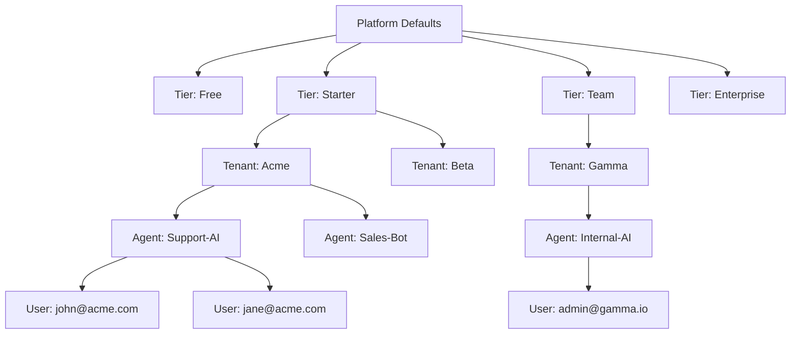

# SRS: Complete Hierarchical Settings Tree

**Document ID:** SA01-SRS-SETTINGS-TREE-2025-12
**Purpose:** Definitive hierarchical structure of ALL settings with inheritance flows
**Status:** CANONICAL REFERENCE

---

## 1. System Hierarchy Overview

```
┌─────────────────────────────────────────────────────────────────────────────┐
│                              PLATFORM                                       │
│  Global Catalogs, Integrations, Default Policies                            │
│  Route: /saas/*, /platform/*                                                │
├─────────────────────────────────────────────────────────────────────────────┤
│                                                                             │
│  ┌─────────────────────────────────────────────────────────────────────┐   │
│  │                        SUBSCRIPTION TIER                             │   │
│  │  Quotas, Feature Gates, Default Configs                              │   │
│  │  Route: /platform/subscriptions                                      │   │
│  ├─────────────────────────────────────────────────────────────────────┤   │
│  │                                                                       │   │
│  │  ┌───────────────────────────────────────────────────────────────┐   │   │
│  │  │                         TENANT                                 │   │   │
│  │  │  Feature Overrides, Users, Billing                             │   │   │
│  │  │  Route: /admin/*                                               │   │   │
│  │  ├───────────────────────────────────────────────────────────────┤   │   │
│  │  │                                                                 │   │   │
│  │  │  ┌─────────────────────────────────────────────────────────┐   │   │   │
│  │  │  │                      AGENT                               │   │   │   │
│  │  │  │  Config, Personality, Tools, Memory                      │   │   │   │
│  │  │  │  Route: /settings, /agent/*                              │   │   │   │
│  │  │  ├─────────────────────────────────────────────────────────┤   │   │   │
│  │  │  │                                                           │   │   │   │
│  │  │  │  ┌─────────────────────────────────────────────────┐     │   │   │   │
│  │  │  │  │                  USER                            │     │   │   │   │
│  │  │  │  │  Profile, Preferences, Session                   │     │   │   │   │
│  │  │  │  │  Route: /profile                                 │     │   │   │   │
│  │  │  │  └─────────────────────────────────────────────────┘     │   │   │   │
│  │  │  └─────────────────────────────────────────────────────────┘   │   │   │
│  │  └───────────────────────────────────────────────────────────────┘   │   │
│  └─────────────────────────────────────────────────────────────────────┘   │
└─────────────────────────────────────────────────────────────────────────────┘
```

---

## 2. Platform Level (SAAS Admin)

### 2.1 Global Catalogs

| Catalog | Description | Managed At | Inherits To |
|---------|-------------|------------|-------------|
| **Model Registry** | LLM provider configurations | `/platform/models` | Tier → Tenant → Agent |
| **Tool Registry** | Available tools and MCP servers | `/platform/tools` | Tier → Tenant → Agent |
| **Voice Registry** | TTS/STT providers and voices | `/platform/voices` | Tier → Tenant → Agent |
| **Permission Catalog** | 45+ granular permissions | `/platform/permissions` | Role Templates |
| **Feature Catalog** | 9 feature categories | `/platform/features` | Tier → Tenant |
| **Compliance Frameworks** | HIPAA, GDPR, SOC2 | `/platform/compliance` | Tier → Tenant |

### 2.2 Platform Settings

| Setting | Type | Default | Route |
|---------|------|---------|-------|
| Platform Name | String | "SomaAgent" | Django Admin |
| Default Timezone | String | "UTC" | Django Admin |
| Maintenance Mode | Boolean | false | Django Admin |
| Global Rate Limits | JSON | {} | Django Admin |
| Allowed Domains | List | [] | Django Admin |

### 2.3 Integration Connections

| Integration | Settings | Route |
|-------------|----------|-------|
| **Keycloak** | URL, Admin Credentials, Default Realm | `/saas/settings/integrations/auth` |
| **Lago** | API URL, API Key, Webhook Secret | `/saas/settings/integrations/billing` |
| **SMTP** | Host, Port, Credentials, From Address | `/saas/settings/integrations/email` |
| **OpenAI** | API Key (Platform-wide fallback) | `/saas/settings/integrations/llm` |
| **Anthropic** | API Key (Platform-wide fallback) | `/saas/settings/integrations/llm` |
| **Google Vertex** | Project, Credentials | `/saas/settings/integrations/llm` |
| **Whisper** | Service URL, Model Size | `/saas/settings/integrations/voice` |
| **Kokoro** | Service URL | `/saas/settings/integrations/voice` |
| **Qdrant** | URL, API Key | Django Admin |
| **PostgreSQL** | Connection String | Django Settings |
| **Redis** | Connection String | Django Settings |
| **S3/MinIO** | Endpoint, Bucket, Credentials | Django Admin |

---

## 3. Subscription Tier Level

### 3.1 Tier Definitions

| Tier | Slug | Base Price | Lago Plan Code |
|------|------|------------|----------------|
| Free | free | $0 | `soma_free` |
| Starter | starter | $29/mo | `soma_starter` |
| Team | team | $99/mo | `soma_team` |
| Enterprise | enterprise | Custom | `soma_enterprise` |

### 3.2 Quota Settings (Per Tier)

| Quota | Free | Starter | Team | Enterprise | Enforcement |
|-------|------|---------|------|------------|-------------|
| Max Agents | 1 | 5 | 25 | Unlimited | HARD |
| Max Users/Agent | 3 | 10 | 50 | Unlimited | HARD |
| Voice Minutes/Month | 0 | 60 | 500 | 5000 | SOFT |
| API Calls/Month | 100 | 10,000 | 100,000 | Unlimited | SOFT |
| Storage (GB) | 0.5 | 5 | 50 | 500 | HARD |
| Memory Retention (Days) | 7 | 30 | 90 | 365 | SOFT |

### 3.3 Feature Gates (Per Tier)

| Feature | Free | Starter | Team | Enterprise |
|---------|------|---------|------|------------|
| `memory` | ❌ | ✅ | ✅ | ✅ |
| `voice` | ❌ | ❌ | ✅ | ✅ |
| `mcp` | ❌ | ✅ | ✅ | ✅ |
| `browser_agent` | ❌ | ❌ | ✅ | ✅ |
| `code_execution` | ❌ | ❌ | ✅ | ✅ |
| `vision` | ❌ | ✅ | ✅ | ✅ |
| `delegation` | ❌ | ❌ | ❌ | ✅ |
| `file_upload` | ✅ | ✅ | ✅ | ✅ |
| `export` | ❌ | ✅ | ✅ | ✅ |
| `custom_domain` | ❌ | ❌ | ✅ | ✅ |
| `sso` | ❌ | ❌ | ❌ | ✅ |
| `audit_log` | ❌ | 7 days | 30 days | 365 days |
| `api_access` | ❌ | ✅ | ✅ | ✅ |
| `priority_support` | ❌ | ❌ | ✅ | ✅ |

---

## 4. Tenant Level

### 4.1 Tenant Status Lifecycle

```
PENDING → ACTIVE → SUSPENDED → CHURNED
    ↓         ↓          ↓
  Setup    Running    Inactive
```

### 4.2 Tenant Settings

| Setting | Type | Inherits From | Override? | Route |
|---------|------|---------------|-----------|-------|
| Name | String | - | N/A | `/admin/settings/general` |
| Slug | String | - | N/A | Generated |
| Tier | FK | - | N/A | `/platform/tenants/:id` |
| Status | Enum | - | N/A | `/platform/tenants/:id` |
| Billing Email | Email | - | N/A | `/admin/settings/general` |
| Keycloak Realm | String | Platform | Yes | Auto-generated |
| Lago Customer ID | String | - | N/A | Auto-generated |
| Feature Overrides | JSONB | Tier Defaults | Yes | `/admin/settings/features` |
| Metadata | JSONB | - | N/A | API Only |
| Trial Ends At | DateTime | - | N/A | `/platform/tenants/:id` |

### 4.3 Tenant Roles

| Role | Code | Capabilities | Assigned At |
|------|------|--------------|-------------|
| Owner | `owner` | Full control, billing, delete tenant | `/platform/tenants/:id/users` |
| Admin | `admin` | Manage users, agents, settings | `/admin/users` |
| Member | `member` | Use agents, view data | `/admin/users` |
| Viewer | `viewer` | Read-only access | `/admin/users` |

---

## 5. Agent Level

### 5.1 Agent Status Lifecycle

```
ACTIVE ↔ PAUSED → ARCHIVED
   ↓        ↓
Running  Stopped
```

### 5.2 Agent Settings

| Setting | Type | Inherits From | Override? | Route |
|---------|------|---------------|-----------|-------|
| Name | String | - | N/A | `/admin/agents/:id` |
| Slug | String | - | N/A | `/admin/agents/:id` |
| Status | Enum | - | N/A | `/admin/agents/:id` |
| Description | Text | - | N/A | `/admin/agents/:id` |
| Skin ID | UUID | - | N/A | `/admin/agents/:id` |
| **Config (JSONB)** | - | - | - | - |
| └ chat_model_provider | String | Tenant/Platform | Yes | `/settings` |
| └ chat_model_name | String | Tenant/Platform | Yes | `/settings` |
| └ chat_model_temperature | Float | 0.0 | Yes | `/settings` |
| └ chat_model_ctx_length | Int | 100000 | Yes | `/settings` |
| └ system_prompt | Text | - | N/A | `/settings` |
| └ personality | JSONB | - | N/A | `/settings` |
| **Feature Settings (JSONB)** | - | - | - | - |
| └ memory_enabled | Boolean | Tier Gate | Yes | `/settings` |
| └ voice_enabled | Boolean | Tier Gate | Yes | `/settings` |
| └ mcp_servers | JSON | Platform Registry | Yes | `/settings` |
| └ tools_enabled | List | Tier Gate | Yes | `/settings` |

### 5.3 Agent Roles

| Role | Code | Capabilities | Assigned At |
|------|------|--------------|-------------|
| Manager | `manager` | Full agent control | `/admin/agents/:id/users` |
| Operator | `operator` | Start/stop, chat, view logs | `/admin/agents/:id/users` |
| Viewer | `viewer` | Read-only | `/admin/agents/:id/users` |

---

## 6. User Level

### 6.1 User Settings (Per-User Profile)

| Setting | Type | Scope | Route |
|---------|------|-------|-------|
| Display Name | String | User | `/profile` |
| Avatar | URL | User | `/profile` |
| Theme | Enum | User | `/profile` |
| Language | String | User | `/profile` |
| Timezone | String | User | `/profile` |
| MFA Enabled | Boolean | User | `/settings/mfa` |
| Notification Prefs | JSONB | User | `/profile/notifications` |
| Last Login | DateTime | System | Read-only |

---

## 7. Settings Inheritance Flow



### 7.1 Inheritance Rules

1. **Platform Defaults** → Apply to ALL unless overridden
2. **Tier Quotas** → HARD limits cannot be exceeded
3. **Tier Feature Gates** → Features not enabled at tier are UNAVAILABLE
4. **Tenant Overrides** → Can restrict (not expand) tier features
5. **Agent Config** → Inherits from tenant, can customize within limits
6. **User Preferences** → Personal settings only, no security impact

### 7.2 Override Example

```
Platform: chat_model_provider = "openai"
Tier (Team): chat_models_allowed = ["openai", "anthropic"]
Tenant (Acme): feature_overrides.chat_model_provider = "anthropic"
Agent (Support-AI): config.chat_model_provider = "anthropic" ← Inherited
Agent (Sales-Bot): config.chat_model_provider = "openai" ← Explicit Override
```

---

## 8. API Endpoints by Level

### 8.1 Platform Level APIs

| Endpoint | Method | Purpose |
|----------|--------|---------|
| `/api/v2/saas/dashboard` | GET | Platform metrics |
| `/api/v2/saas/tenants` | GET, POST | Tenant management |
| `/api/v2/saas/tiers` | GET, POST, PUT, DELETE | Tier management |
| `/api/v2/saas/features` | GET, POST | Feature catalog |
| `/api/v2/saas/audit` | GET | Platform audit log |
| `/api/v2/saas/billing` | GET | Platform billing overview |
| `/api/v2/saas/health` | GET | Infrastructure health |
| `/api/v2/saas/settings` | GET, PUT | Platform settings |

### 8.2 Tenant Level APIs

| Endpoint | Method | Purpose |
|----------|--------|---------|
| `/api/v2/admin/users` | GET, POST, PUT, DELETE | User management |
| `/api/v2/admin/agents` | GET, POST, PUT, DELETE | Agent management |
| `/api/v2/admin/billing` | GET | Tenant billing |
| `/api/v2/admin/audit` | GET | Tenant audit log |
| `/api/v2/admin/settings` | GET, PUT | Tenant settings |

### 8.3 Agent Level APIs

| Endpoint | Method | Purpose |
|----------|--------|---------|
| `/api/v2/agents/{id}` | GET, PUT | Agent details |
| `/api/v2/agents/{id}/config` | GET, PUT | Agent config |
| `/api/v2/agents/{id}/start` | POST | Start agent |
| `/api/v2/agents/{id}/stop` | POST | Stop agent |
| `/api/v2/agents/{id}/users` | GET, POST, DELETE | Agent user assignment |

---

## 9. Complete UI Route Map

| Route | Level | Purpose | Roles |
|-------|-------|---------|-------|
| `/saas/dashboard` | Platform | Overview metrics | SAAS Admin |
| `/platform/tenants` | Platform | Tenant list | SAAS Admin |
| `/platform/tenants/:id` | Platform | Tenant detail | SAAS Admin |
| `/platform/subscriptions` | Platform | Tier builder | SAAS Admin |
| `/platform/permissions` | Platform | Permission browser | SAAS Admin |
| `/platform/roles` | Platform | Role management | SAAS Admin |
| `/platform/models` | Platform | Model catalog | SAAS Admin |
| `/platform/audit` | Platform | Global audit | SAAS Admin |
| `/platform/billing` | Platform | Global billing | SAAS Admin |
| `/admin/dashboard` | Tenant | Tenant overview | Tenant Admin |
| `/admin/users` | Tenant | User list | Tenant Admin |
| `/admin/agents` | Tenant | Agent list | Tenant Admin |
| `/admin/agents/:id` | Tenant | Agent detail | Tenant Admin |
| `/admin/billing` | Tenant | Tenant billing | Tenant Admin |
| `/admin/audit` | Tenant | Tenant audit | Tenant Admin |
| `/admin/settings` | Tenant | Tenant settings | Tenant Admin |
| `/settings` | Agent | Agent config | Agent Owner |
| `/dev/console` | Agent | Debug console | Developer |
| `/dev/mcp` | Agent | MCP inspector | Developer |
| `/trn/cognitive` | Agent | Neuromodulators | Trainer |
| `/chat` | Agent | Chat interface | All Users |
| `/memory` | Agent | Memory browser | All Users |
| `/profile` | User | User profile | Self |

---

## 10. Django Admin Required Items

These items are **ONLY** manageable via Django Admin (not custom UI):

| Model | Reason |
|-------|--------|
| Platform Settings | Infrastructure-level |
| Database Connections | Security-critical |
| Redis Configuration | Infrastructure-level |
| S3/Storage Config | Security-critical |
| Qdrant Config | Infrastructure-level |
| Rate Limit Policies | Platform-wide |
| SAAS Super Admin Users | Security-critical |
| Backup Schedules | Infrastructure-level |

---

## 11. Summary Statistics

| Category | Count |
|----------|-------|
| Django App Modules | 62 |
| Granular Permissions | 45+ |
| Predefined Roles | 9 |
| Agent Settings | 60+ |
| Tier Quotas | 7 |
| Feature Categories | 9 |
| Integration Types | 12 |
| UI Routes | 25+ |
| API Endpoints | 80+ |
