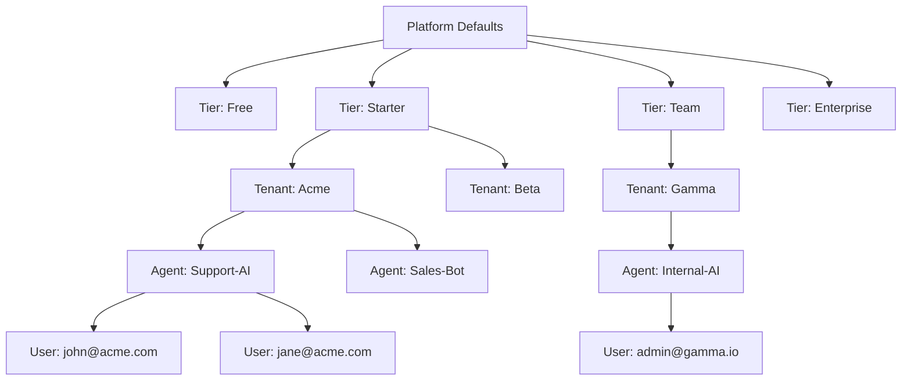

# SRS: Complete Hierarchical Settings Tree

**Document ID:** SA01-SRS-SETTINGS-TREE-2025-12
**Purpose:** Definitive hierarchical structure of ALL settings with inheritance flows
**Status:** CANONICAL REFERENCE

---

## 1. System Hierarchy Overview

```
┌─────────────────────────────────────────────────────────────────────────────┐
│                              PLATFORM                                       │
│  Global Catalogs, Integrations, Default Policies                            │
│  Route: /saas/*, /platform/*                                                │
├─────────────────────────────────────────────────────────────────────────────┤
│                                                                             │
│  ┌─────────────────────────────────────────────────────────────────────┐   │
│  │                        SUBSCRIPTION TIER                             │   │
│  │  Quotas, Feature Gates, Default Configs                              │   │
│  │  Route: /platform/subscriptions                                      │   │
│  ├─────────────────────────────────────────────────────────────────────┤   │
│  │                                                                       │   │
│  │  ┌───────────────────────────────────────────────────────────────┐   │   │
│  │  │                         TENANT                                 │   │   │
│  │  │  Feature Overrides, Users, Billing                             │   │   │
│  │  │  Route: /admin/*                                               │   │   │
│  │  ├───────────────────────────────────────────────────────────────┤   │   │
│  │  │                                                                 │   │   │
│  │  │  ┌─────────────────────────────────────────────────────────┐   │   │   │
│  │  │  │                      AGENT                               │   │   │   │
│  │  │  │  Config, Personality, Tools, Memory                      │   │   │   │
│  │  │  │  Route: /settings, /agent/*                              │   │   │   │
│  │  │  ├─────────────────────────────────────────────────────────┤   │   │   │
│  │  │  │                                                           │   │   │   │
│  │  │  │  ┌─────────────────────────────────────────────────┐     │   │   │   │
│  │  │  │  │                  USER                            │     │   │   │   │
│  │  │  │  │  Profile, Preferences, Session                   │     │   │   │   │
│  │  │  │  │  Route: /profile                                 │     │   │   │   │
│  │  │  │  └─────────────────────────────────────────────────┘     │   │   │   │
│  │  │  └─────────────────────────────────────────────────────────┘   │   │   │
│  │  └───────────────────────────────────────────────────────────────┘   │   │
│  └─────────────────────────────────────────────────────────────────────┘   │
└─────────────────────────────────────────────────────────────────────────────┘
```

---

## 2. Platform Level (SAAS Admin)

### 2.1 Global Catalogs

| Catalog | Description | Managed At | Inherits To |
|---------|-------------|------------|-------------|
| **Model Registry** | LLM provider configurations | `/platform/models` | Tier → Tenant → Agent |
| **Tool Registry** | Available tools and MCP servers | `/platform/tools` | Tier → Tenant → Agent |
| **Voice Registry** | TTS/STT providers and voices | `/platform/voices` | Tier → Tenant → Agent |
| **Permission Catalog** | 45+ granular permissions | `/platform/permissions` | Role Templates |
| **Feature Catalog** | 9 feature categories | `/platform/features` | Tier → Tenant |
| **Compliance Frameworks** | HIPAA, GDPR, SOC2 | `/platform/compliance` | Tier → Tenant |

### 2.2 Platform Defaults (GlobalDefault Model)

Platform defaults are stored in `admin/saas/models/profiles.py:GlobalDefault`. This singleton model provides the master blueprint for new tenants through `_initial_defaults()`:

```python
def _initial_defaults() -> Dict[str, Any]:
    return {
        "models": [
            {"id": "gpt-4o", "provider": "openai", "enabled": True},
            {"id": "claude-3-5-sonnet", "provider": "anthropic", "enabled": True},
        ],
        "roles": [
            {"id": "admin", "permissions": ["*"]},
            {"id": "member", "permissions": ["read"]},
        ],
        "dev_sandbox_defaults": {
            "max_agents": 2,
            "max_users": 1,
            "enable_code_interpreter": False,
            "enable_filesystem": False,
            "rate_limits_multiplier": 0.5,
        },
        "dev_live_defaults": {
            "max_agents": 10,
            "max_users": 5,
            "enable_code_interpreter": True,
            "enable_filesystem": True,
            "rate_limits_multiplier": 1.0,
        },
    }
```

### 2.3 Code-Level Defaults (SettingsModel)

The Pydantic model `admin/core/helpers/settings_model.py:SettingsModel` provides code-level defaults as the fallback cascade:

| Setting | Code Default | Setting Location |
|---------|--------------|------------------|
| `chat_model_provider` | `"openrouter"` | settings_model.py:23 |
| `chat_model_name` | `"openai/gpt-4.1"` | settings_model.py:24 |
| `util_model_provider` | `"openrouter"` | settings_model.py:31 |
| `util_model_name` | `"openai/gpt-4.1-mini"` | settings_model.py:32 |
| `embed_model_provider` | `"huggingface"` | settings_model.py:39 |
| `embed_model_name` | `"sentence-transformers/all-MiniLM-L6-v2"` | settings_model.py:40 |
| `browser_model_provider` | `"openrouter"` | settings_model.py:47 |

### 2.4 Settings Resolution Priority

Settings are resolved in this order (fallback cascade):

```
1. AgentConfig (Django ORM) → AgentSetting model per agent
2. Environment Variables → SA01_CHAT_PROVIDER, SA01_CHAT_MODEL, etc.
3. Tenant Settings → tenant.feature_overrides.* if configured
4. Platform Defaults → GlobalDefault._initial_defaults()
5. Code Defaults → SettingsModel Pydantic defaults (ultimate fallback)
```

This is implemented in `admin/core/helpers/settings_defaults.py:get_default_settings()` via `_env_or_db()` resolver.

### 2.3 Integration Connections

| Integration | Settings | Route |
|-------------|----------|-------|
| **Keycloak** | URL, Admin Credentials, Default Realm | `/saas/settings/integrations/auth` |
| **Lago** | API URL, API Key, Webhook Secret | `/saas/settings/integrations/billing` |
| **SMTP** | Host, Port, Credentials, From Address | `/saas/settings/integrations/email` |
| **OpenAI** | API Key (Platform-wide fallback) | `/saas/settings/integrations/llm` |
| **Anthropic** | API Key (Platform-wide fallback) | `/saas/settings/integrations/llm` |
| **Google Vertex** | Project, Credentials | `/saas/settings/integrations/llm` |
| **Whisper** | Service URL, Model Size | `/saas/settings/integrations/voice` |
| **Kokoro** | Service URL | `/saas/settings/integrations/voice` |
| **Qdrant** | URL, API Key | Django Admin |
| **PostgreSQL** | Connection String | Django Settings |
| **Redis** | Connection String | Django Settings |
| **S3/MinIO** | Endpoint, Bucket, Credentials | Django Admin |

---

## 3. Subscription Tier Level

### 3.1 Tier Definitions

| Tier | Slug | Base Price | Lago Plan Code |
|------|------|------------|----------------|
| Free | free | $0 | `soma_free` |
| Starter | starter | $29/mo | `soma_starter` |
| Team | team | $99/mo | `soma_team` |
| Enterprise | enterprise | Custom | `soma_enterprise` |

### 3.2 Quota Settings (Per Tier)

| Quota | Free | Starter | Team | Enterprise | Enforcement |
|-------|------|---------|------|------------|-------------|
| Max Agents | 1 | 5 | 25 | Unlimited | HARD |
| Max Users/Agent | 3 | 10 | 50 | Unlimited | HARD |
| Voice Minutes/Month | 0 | 60 | 500 | 5000 | SOFT |
| API Calls/Month | 100 | 10,000 | 100,000 | Unlimited | SOFT |
| Storage (GB) | 0.5 | 5 | 50 | 500 | HARD |
| Memory Retention (Days) | 7 | 30 | 90 | 365 | SOFT |

### 3.3 Feature Gates (Per Tier)

| Feature | Free | Starter | Team | Enterprise |
|---------|------|---------|------|------------|
| `memory` | ❌ | ✅ | ✅ | ✅ |
| `voice` | ❌ | ❌ | ✅ | ✅ |
| `mcp` | ❌ | ✅ | ✅ | ✅ |
| `browser_agent` | ❌ | ❌ | ✅ | ✅ |
| `code_execution` | ❌ | ❌ | ✅ | ✅ |
| `vision` | ❌ | ✅ | ✅ | ✅ |
| `delegation` | ❌ | ❌ | ❌ | ✅ |
| `file_upload` | ✅ | ✅ | ✅ | ✅ |
| `export` | ❌ | ✅ | ✅ | ✅ |
| `custom_domain` | ❌ | ❌ | ✅ | ✅ |
| `sso` | ❌ | ❌ | ❌ | ✅ |
| `audit_log` | ❌ | 7 days | 30 days | 365 days |
| `api_access` | ❌ | ✅ | ✅ | ✅ |
| `priority_support` | ❌ | ❌ | ✅ | ✅ |

---

## 4. Tenant Level

### 4.1 Tenant Status Lifecycle

```
PENDING → ACTIVE → SUSPENDED → CHURNED
    ↓         ↓          ↓
  Setup    Running    Inactive
```

### 4.2 Tenant Settings

| Setting | Type | Inherits From | Override? | Route |
|---------|------|---------------|-----------|-------|
| Name | String | - | N/A | `/admin/settings/general` |
| Slug | String | - | N/A | Generated |
| Tier | FK | - | N/A | `/platform/tenants/:id` |
| Status | Enum | - | N/A | `/platform/tenants/:id` |
| Billing Email | Email | - | N/A | `/admin/settings/general` |
| Keycloak Realm | String | Platform | Yes | Auto-generated |
| Lago Customer ID | String | - | N/A | Auto-generated |
| Feature Overrides | JSONB | Tier Defaults | Yes | `/admin/settings/features` |
| Metadata | JSONB | - | N/A | API Only |
| Trial Ends At | DateTime | - | N/A | `/platform/tenants/:id` |

### 4.3 Tenant Roles

| Role | Code | Capabilities | Assigned At |
|------|------|--------------|-------------|
| Owner | `owner` | Full control, billing, delete tenant | `/platform/tenants/:id/users` |
| Admin | `admin` | Manage users, agents, settings | `/admin/users` |
| Member | `member` | Use agents, view data | `/admin/users` |
| Viewer | `viewer` | Read-only access | `/admin/users` |

---

## 5. Agent Level

### 5.1 Complete SettingsModel Fields

All agent settings are defined in `admin/core/helpers/settings_model.py:SettingsModel`. This is the canonical field definition:

| Category | Field | Type | Default | Description |
|----------|-------|------|---------|-------------|
| **Core** | `version` | str | `"unknown"` | Git version tag from git.get_git_info() |
| **Chat** | `chat_model_provider` | str | `"openrouter"` | Model provider for chat (e.g., openai, anthropic) |
| **Chat** | `chat_model_name` | str | `"openai/gpt-4.1"` | Specific model identifier |
| **Chat** | `chat_model_api_base` | str | `""` | Custom API endpoint URL |
| **Chat** | `chat_model_kwargs` | Dict | `{}` | Additional args (temperature, etc.) |
| **Chat** | `chat_model_ctx_length` | int | 100000 | Max context window tokens |
| **Chat** | `chat_model_ctx_history` | float | 0.7 | History inclusion ratio (0-1) |
| **Chat** | `chat_model_vision` | bool | True | Enable vision/multimodal |
| **Chat** | `chat_model_rl_requests` | int | 0 | Rate limit: requests |
| **Chat** | `chat_model_rl_input` | int | 0 | Rate limit: input tokens |
| **Chat** | `chat_model_rl_output` | int | 0 | Rate limit: output tokens |
| **Utility** | `util_model_provider` | str | `"openrouter"` | Provider for utility tasks |
| **Utility** | `util_model_name` | str | `"openai/gpt-4.1-mini"` | Utility model identifier |
| **Utility** | `util_model_api_base` | str | `""` | Custom utility endpoint URL |
| **Utility** | `util_model_ctx_length` | int | 100000 | Max context length |
| **Utility** | `util_model_ctx_input` | float | 0.7 | Input context ratio |
| **Utility** | `util_model_kwargs` | Dict | `{}` | Additional utility args |
| **Utility** | `util_model_rl_requests` | int | 0 | Rate limit: requests |
| **Utility** | `util_model_rl_input` | int | 0 | Rate limit: input tokens |
| **Utility** | `util_model_rl_output` | int | 0 | Rate limit: output tokens |
| **Embedding** | `embed_model_provider` | str | `"huggingface"` | Embedding provider |
| **Embedding** | `embed_model_name` | str | `"sentence-transformers/all-MiniLM-L6-v2"` | Model for vector embeddings |
| **Embedding** | `embed_model_api_base` | str | `""` | Custom embedding endpoint |
| **Embedding** | `embed_model_kwargs` | Dict | `{}` | Additional embedding args |
| **Embedding** | `embed_model_rl_requests` | int | 0 | Rate limit: requests |
| **Embedding** | `embed_model_rl_input` | int | 0 | Rate limit: input tokens |
| **Embedding** | `embed_model_rl_output` | int | 0 | Rate limit: output tokens |
| **Browser** | `browser_model_provider` | str | `"openrouter"` | Browser tool model provider |
| **Browser** | `browser_model_name` | str | `"openai/gpt-4.1"` | Browser tool model |
| **Browser** | `browser_model_api_base` | str | `""` | Custom browser endpoint |
| **Browser** | `browser_model_vision` | bool | True | Enable browser vision |
| **Browser** | `browser_model_kwargs` | Dict | `{}` | Browser tool args |
| **Browser** | `browser_http_headers` | Dict | `{}` | Custom HTTP headers for browser |
| **Memory** | `memory_recall_enabled` | bool | True | Enable memory recall |
| **Memory** | `memory_recall_delayed` | bool | False | Delay recall until after generation |
| **Memory** | `memory_recall_interval` | int | 3 | Recall every N turns |
| **Memory** | `memory_recall_history_len` | int | 10000 | History context tokens |
| **Memory** | `memory_recall_memories_max_search` | int | 12 | Max memories to search |
| **Memory** | `memory_recall_solutions_max_search` | int | 8 | Max solutions to search |
| **Memory** | `memory_recall_memories_max_result` | int | 5 | Max memories to retrieve |
| **Memory** | `memory_recall_solutions_max_result` | int | 3 | Max solutions to retrieve |
| **Memory** | `memory_recall_similarity_threshold` | float | 0.7 | Min similarity score (0-1) |
| **Memory** | `memory_recall_query_prep` | bool | True | Pre-process queries |
| **Memory** | `memory_recall_post_filter` | bool | True | Filter results after retrieval |
| **Memory** | `memory_memorize_enabled` | bool | True | Enable memory storage |
| **Memory** | `memory_memorize_consolidation` | bool | True | Enable consolidation |
| **Memory** | `memory_memorize_replace_threshold` | float | 0.9 | Replace if similarity > N |
| **Auth** | `api_keys` | Dict | `{}` | Provider API keys mapping |
| **Auth** | `auth_login` | str | `""` | Agent login username |
| **Auth** | `auth_password` | str | `""` | Agent password |
| **Auth** | `root_password` | str | `""` | Root access password |
| **Profile** | `agent_profile` | str | `"agent0"` | Agent profile type |
| **Profile** | `agent_memory_subdir` | str | `"default"` | Memory storage subdirectory |
| **Profile** | `agent_knowledge_subdir` | str | `"custom"` | Knowledge base subdirectory |
| **RFC/Docker** | `rfc_auto_docker` | bool | True | Auto-start Docker tunnel |
| **RFC/Docker** | `rfc_url` | str | `"localhost"` | RFC/Docker host URL |
| **RFC/Docker** | `rfc_password` | str | `""` | RFC/Docker tunnel password |
| **RFC/Docker** | `rfc_port_http` | int | 55080 | HTTP tunnel port |
| **RFC/Docker** | `rfc_port_ssh` | int | 55022 | SSH tunnel port |
| **Shell** | `shell_interface` | str | `"local"` | Shell type (local, docker, ssh) |
| **Speech/STT** | `stt_model_size` | str | `"base"` | Whisper model size |
| **Speech/STT** | `stt_language` | str | `"en"` | Speech recognition language |
| **Speech/STT** | `stt_silence_threshold` | float | 0.3 | Silence detection threshold |
| **Speech/STT** | `stt_silence_duration` | int | 1000 | Silence duration ms |
| **Speech/STT** | `stt_waiting_timeout` | int | 2000 | Wait for speech start ms |
| **STT** | `speech_provider` | str | `"browser"` | Speech provider |
| **Realtime** | `speech_realtime_enabled` | bool | False | Enable realtime voice |
| **Realtime** | `speech_realtime_model` | str | `"gpt-4o-realtime-preview"` | Realtime model |
| **Realtime** | `speech_realtime_voice` | str | `"verse"` | Realtime voice preset |
| **Realtime** | `speech_realtime_endpoint` | str | `"https://api.openai.com/v1/realtime/sessions"` | Realtime endpoint URL |
| **TTS** | `tts_kokoro` | bool | False | Use Kokoro TTS engine |
| **MCP** | `mcp_servers` | str | `'{"mcpServers": {}}'` | MCP server config JSON |
| **MCP** | `mcp_client_init_timeout` | int | 10 | MCP init timeout seconds |
| **MCP** | `mcp_client_tool_timeout` | int | 120 | MCP tool timeout seconds |
| **MCP** | `mcp_server_enabled` | bool | False | Enable MCP server mode |
| **MCP** | `mcp_server_token` | str | `""` | MCP server auth token |
| **A2A** | `a2a_server_enabled` | bool | False | Enable A2A server mode |
| **Misc** | `variables` | str | `""` | User-defined variables JSON |
| **Misc** | `secrets` | str | `""` | User-defined secrets JSON |
| **Misc** | `litellm_global_kwargs` | Dict | `{}` | Global LiteLLM args |
| **Misc** | `USE_LLM` | bool | True | Enable LLM usage |
| **SomaBrain** | `somabrain_enabled` | bool | True | Enable L3 Cognitive Brain |
| **SomaBrain** | `cognitive_salience_threshold` | float | 0.6 | Min salience for action |
| **SomaBrain** | `cognitive_learning_rate` | float | 0.01 | Adaptation rate (alpha) |
| **SomaBrain** | `neuromodulator_baseline_dopamine` | float | 0.5 | Default creativity level |
| **SomaBrain** | `neuromodulator_baseline_serotonin` | float | 0.5 | Default stability level |
| **SomaBrain** | `sleep_auto_schedule` | bool | True | Auto-trigger sleep cycles |
| **SomaBrain** | `sleep_cycle_duration` | int | 300 | Sleep duration in seconds |
| **SomaBrain** | `sleep_deep_consolidation` | bool | True | Use deep vector consolidation |
| **SomaBrain** | `dream_simulation` | bool | False | Enable generative dreaming |

### 5.2 Agent Status Lifecycle

```
ACTIVE ↔ PAUSED → ARCHIVED
   ↓        ↓
Running  Stopped
```

### 5.2 Agent Settings

| Setting | Type | Inherits From | Override? | Route |
|---------|------|---------------|-----------|-------|
| Name | String | - | N/A | `/admin/agents/:id` |
| Slug | String | - | N/A | `/admin/agents/:id` |
| Status | Enum | - | N/A | `/admin/agents/:id` |
| Description | Text | - | N/A | `/admin/agents/:id` |
| Skin ID | UUID | - | N/A | `/admin/agents/:id` |
| **Config (JSONB)** | - | - | - | - |
| └ chat_model_provider | String | Tenant/Platform | Yes | `/settings` |
| └ chat_model_name | String | Tenant/Platform | Yes | `/settings` |
| └ chat_model_temperature | Float | 0.0 | Yes | `/settings` |
| └ chat_model_ctx_length | Int | 100000 | Yes | `/settings` |
| └ system_prompt | Text | - | N/A | `/settings` |
| └ personality | JSONB | - | N/A | `/settings` |
| **Feature Settings (JSONB)** | - | - | - | - |
| └ memory_enabled | Boolean | Tier Gate | Yes | `/settings` |
| └ voice_enabled | Boolean | Tier Gate | Yes | `/settings` |
| └ mcp_servers | JSON | Platform Registry | Yes | `/settings` |
| └ tools_enabled | List | Tier Gate | Yes | `/settings` |

### 5.3 Agent Roles

| Role | Code | Capabilities | Assigned At |
|------|------|--------------|-------------|
| Manager | `manager` | Full agent control | `/admin/agents/:id/users` |
| Operator | `operator` | Start/stop, chat, view logs | `/admin/agents/:id/users` |
| Viewer | `viewer` | Read-only | `/admin/agents/:id/users` |

---

## 6. User Level

### 6.1 User Settings (Per-User Profile)

| Setting | Type | Scope | Route |
|---------|------|-------|-------|
| Display Name | String | User | `/profile` |
| Avatar | URL | User | `/profile` |
| Theme | Enum | User | `/profile` |
| Language | String | User | `/profile` |
| Timezone | String | User | `/profile` |
| MFA Enabled | Boolean | User | `/settings/mfa` |
| Notification Prefs | JSONB | User | `/profile/notifications` |
| Last Login | DateTime | System | Read-only |

---

## 7. Settings Inheritance Flow



### 7.1 Inheritance Rules

1. **Agent Config (AgentSetting ORM)** → Primary source, highest priority
2. **Environment Variables** → Override DB values for dev/ops control
3. **Tenant Overrides** → Can restrict (not expand) tier features
4. **Tier Quotas** → HARD limits cannot be exceeded
5. **Tier Feature Gates** → Features not enabled at tier are UNAVAILABLE
6. **Platform Defaults (GlobalDefault)** → Apply to ALL unless overridden
7. **Code Defaults (SettingsModel)** → Ultimate fallback if all else fails

Settings resolution is implemented in `admin/core/helpers/settings_defaults.py`:
- `_env_or_db()` resolves environment → database → fallback
- `get_default_settings()` builds full Settings object from ORM
- Priority: ENV > DB > Platform Default > Code Default

### 7.2 Override Example (Actual Implementation Flow)

```
Resolution Priority for chat_model_provider:
┌─────────────────────────────────────────────────────────┐
│ 1. AgentSetting (ORM)                                   │
│    SELECT value FROM admin_user_agent_setting           │
│    WHERE agent_id='...' AND key='chat_model_provider'   │
│    Result: "anthropic" ← USE THIS                      │
├─────────────────────────────────────────────────────────┤
│ 2. Environment Variable                                 │
│    os.environ.get("SA01_CHAT_PROVIDER")                 │
│    Result: None (not set)                                │
├─────────────────────────────────────────────────────────┤
│ 3. Tenant Settings (TenantSettings JSONB)              │
│    t.feature_overrides.chat_model_provider              │
│    Result: None (not configured)                         │
├─────────────────────────────────────────────────────────┤
│ 4. Platform Defaults (GlobalDefault)                    │
│    GlobalDefault._initial_defaults().models[0].provider  │
│    Result: "openai" (from model catalog)               │
├─────────────────────────────────────────────────────────┤
│ 5. Code Default (SettingsModel)                         │
│    SettingsModel.chat_model_provider (Pydantic default) │
│    Result: "openrouter" ← ULTIMATE FALLBACK             │
└─────────────────────────────────────────────────────────┘

Final resolved value for agent Support-AI: "anthropic"

For agent Sales-Bot with no AgentSetting:
→ Falls through to Platform Default: "openai"
→ Or Code Default: "openrouter" if no platform config
```

---

## 8. API Endpoints by Level

### 8.1 Platform (SAAS) Level APIs

All platform APIs are in `admin/saas/api/` using Django Ninja.

| Module | Route | Method | Purpose | File |
|--------|-------|--------|---------|------|
| **Dashboard** | `/api/v2/saas/dashboard` | GET | Platform metrics, tenants, agents, MRR | `dashboard.py:21` |
| **Tenants** | `/api/v2/saas/tenants` | GET, POST, PUT, DELETE | Full tenant CRUD with filters | `tenants.py` |
| **Tenants** | `/api/v2/saas/tenants/check-slug` | GET | Slug availability with suggestions | `tenants.py:20` |
| **Tenants** | `/api/v2/saas/tenant-agents` | GET | List tenant agents | `tenant_agents.py` |
| **Users** | `/api/v2/saas/users` | GET, POST, PUT, DELETE | User management across tenants | `users.py` |
| **Users** | `/api/v2/saas/users/{id}/reset-password` | POST | Reset user password | `users.py:352` |
| **Users** | `/api/v2/saas/users/{id}/invite` | POST, DELETE | User invitation management | `users.py:374,396` |
| **Users** | `/api/v2/saas/users/{id}/impersonate` | PUT | Start/stop impersonation | `users.py:443,510` |
| **Tiers** | `/api/v2/saas/tiers` | GET, POST, PATCH, DELETE | Subscription tier management | `tiers.py` |
| **Tiers** | `/api/v2/saas/tiers/{tier_id}` | GET, PATCH, DELETE | Individual tier operations | `tiers.py:64,105,150` |
| **Features** | `/api/v2/saas/features` | GET, POST | List and create features | `features.py:30,68` |
| **Features** | `/api/v2/saas/features/{feature_id}` | GET | Feature details | `features.py:52` |
| **Features** | `/api/v2/saas/features/{code}/providers` | GET | List feature providers | `features.py:83` |
| **Settings** | `/api/v2/saas/settings` | GET, PUT | Platform-wide settings | `settings.py` |
| **Settings** | `/api/v2/saas/settings/api-keys` | GET, POST, DELETE | API key management | `settings.py:26,44,63` |
| **Settings** | `/api/v2/saas/settings/models` | GET, PATCH | Model configuration | `settings.py` |
| **Settings** | `/api/v2/saas/settings/roles` | GET, PATCH | Role definitions | `settings.py` |
| **Settings** | `/api/v2/saas/settings/sso` | GET, PUT, POST | SSO configuration | `settings.py` |
| **Integrations** | `/api/v2/saas/integrations` | GET | List all integrations | `integrations.py:149` |
| **Integrations** | `/api/v2/saas/integrations/{provider}` | GET, PUT | Integration config per provider | `integrations.py:172,198` |
| **Billing** | `/api/v2/saas/billing` | GET | Billing dashboard, MRR, ARPU | `billing.py:26` |
| **Billing** | `/api/v2/saas/billing/invoices` | GET | Paginated invoices from Lago | `billing.py:73` |
| **Billing** | `/api/v2/saas/billing/usage` | GET | Platform-wide usage metrics | `billing.py:95` |
| **Audit** | `/api/v2/saas/audit` | GET | Platform audit log with filters | `audit.py:91` |
| **Audit** | `/api/v2/saas/audit/export` | GET | Export audit log as CSV | `audit.py:145` |
| **Health** | `/api/v2/saas/health` | GET | SAAS component health checks | `health.py` |

### 8.2 Core/API Level APIs

Core APIs in `admin/core/api/` provide UI settings, health, sessions, memory.

| Module | Route | Method | Purpose | File |
|--------|-------|--------|---------|------|
| **Health** | `/api/v2/core/health` | GET | Full infrastructure health check | `health.py:110` |
| **Health** | `/api/v2/core/health/quick` | GET | Quick liveness probe | `health.py:184` |
| **Health** | `/api/v2/core/health/ready` | GET | Readiness probe | `health.py:193` |
| **General** | `/api/v2/core/ping` | GET | Server ping/heartbeat | `general.py:21` |
| **UI Settings** | `/api/v2/api/settings` | GET | Get UI settings schema | `ui_settings.py:57` |
| **UI Settings** | `/api/v2/api/settings/sections` | GET | Get settings sections | `ui_settings.py:101` |
| **UI Settings** | `/api/v2/api/settings/sections` | PUT | Save settings from UI | `ui_settings.py:108` |
| **UI Settings** | `/api/v2/api/settings/test-connection` | POST | Test LLM connection | `ui_settings.py:156` |
| **UI Settings** | `/api/v2/api/settings/{key}` | GET | Get single setting | `ui_settings.py:187` |
| **UI Settings** | `/api/v2/api/settings/{key}` | PUT | Set single setting | `ui_settings.py:196` |
| **Sessions** | `/api/v2/api/sessions` | GET | List recent sessions | `sessions.py:153` |
| **Sessions** | `/api/v2/api/sessions/{session_id}` | GET | Get session details | `sessions.py:167` |
| **Sessions** | `/api/v2/api/sessions/{session_id}/history` | GET | Get session history | `sessions.py:183` |
| **Sessions** | `/api/v2/api/sessions/{session_id}/events` | GET | Session events (SSE or JSON) | `sessions.py:205` |
| **Sessions** | `/api/v2/api/sessions/message` | POST | Post user message | `sessions.py:234` |
| **Sessions** | `/api/v2/api/sessions/terminate/{workflow_id}` | POST | Terminate workflow | `sessions.py:274` |
| **Memory** | `/api/v2/api/memory/search` | GET | Search memories | `memory.py:99` |
| **Memory** | `/api/v2/api/memory/consolidate` | POST | Consolidate memories | `memory.py:143` |
| **Memory** | `/api/v2/api/memory/prune` | POST | Prune old memories | `memory.py:165` |
| **Kafka** | `/api/v2/api/kafka/topics` | GET | List Kafka topics | `kafka.py:69` |
| **Kafka** | `/api/v2/api/kafka/publish` | POST | Publish event to Kafka | `kafka.py:124` |

### 8.3 Gateway Integration APIs

Gateway APIs in `admin/gateway/api/gateway.py` for A2A, delegation, workflows.

| Route | Method | Purpose | File |
|-------|--------|---------|------|
| `/api/v2/gateway/a2a/execute` | POST | Start A2A delegation workflow | `gateway.py:52` |
| `/api/v2/gateway/a2a/terminate/{workflow_id}` | POST | Cancel A2A workflow | `gateway.py:71` |
| `/api/v2/gateway/describe/{workflow_id}` | GET | Describe workflow status | `gateway.py:89` |
| `/api/v2/gateway/keys/generate` | POST | Generate API key | `gateway.py` |
| `/api/v2/gateway/constitution/validate` | POST | Validate constitution | `gateway.py` |

### 8.4 Agent Level APIs

Agent APIs in `admin/agents/api/` manage agent lifecycle, configuration, deployment.

| Module | Route | Method | Purpose | File |
|--------|-------|--------|---------|------|
| **Agents** | `/api/v2/agents` | GET, POST, PUT, DELETE | Agent CRUD operations | `agents.py` |
| **Agents** | `/api/v2/agents/{id}` | GET, PUT, DELETE | Individual agent operations | `agents.py` |
| **Agents** | `/api/v2/agents/{id}/start` | POST | Start an agent | `agents.py` |
| **Agents** | `/api/v2/agents/{id}/stop` | POST | Stop an agent | `agents.py` |
| **Agents** | `/api/v2/agents/{id}/deploy` | POST | Deploy agent to runtime | `agents.py` |
| **Agents** | `/api/v2/agents/{id}/config` | GET, PUT | Get/set agent configuration | `agents.py` |
| **Agents** | `/api/v2/agents/{id}/logs` | GET | Get agent logs | `agents.py` |
| **Core** | `/api/v2/agents/core/health` | GET | Agent core health | `core.py` |

### 8.5 API Response Format

All APIs follow Django Ninja with Pydantic schemas:

```python
from ninja import Router
from pydantic import BaseModel

class ResponseSchema(BaseModel):
    status: str
    data: Optional[dict] = None
    message: Optional[str] = None

router = Router()

@router.get("/endpoint", response=ResponseSchema)
def get_endpoint(request):
    return ResponseSchema(status="ok", data={}, message="Success")
```

Error responses use `admin.common.exceptions.ServiceError`, `NotFoundError`:

```python
raise ServiceError("Something failed", code="SOME_ERROR")
```

---

## 9. Complete UI Route Map

| Route | Level | Purpose | Roles |
|-------|-------|---------|-------|
| `/saas/dashboard` | Platform | Overview metrics | SAAS Admin |
| `/platform/tenants` | Platform | Tenant list | SAAS Admin |
| `/platform/tenants/:id` | Platform | Tenant detail | SAAS Admin |
| `/platform/subscriptions` | Platform | Tier builder | SAAS Admin |
| `/platform/permissions` | Platform | Permission browser | SAAS Admin |
| `/platform/roles` | Platform | Role management | SAAS Admin |
| `/platform/models` | Platform | Model catalog | SAAS Admin |
| `/platform/audit` | Platform | Global audit | SAAS Admin |
| `/platform/billing` | Platform | Global billing | SAAS Admin |
| `/admin/dashboard` | Tenant | Tenant overview | Tenant Admin |
| `/admin/users` | Tenant | User list | Tenant Admin |
| `/admin/agents` | Tenant | Agent list | Tenant Admin |
| `/admin/agents/:id` | Tenant | Agent detail | Tenant Admin |
| `/admin/billing` | Tenant | Tenant billing | Tenant Admin |
| `/admin/audit` | Tenant | Tenant audit | Tenant Admin |
| `/admin/settings` | Tenant | Tenant settings | Tenant Admin |
| `/settings` | Agent | Agent config | Agent Owner |
| `/dev/console` | Agent | Debug console | Developer |
| `/dev/mcp` | Agent | MCP inspector | Developer |
| `/trn/cognitive` | Agent | Neuromodulators | Trainer |
| `/chat` | Agent | Chat interface | All Users |
| `/memory` | Agent | Memory browser | All Users |
| `/profile` | User | User profile | Self |
| `/settings/brain` | Agent | Brain Tuning (Bio-params) | Agent Owner |
| `/dashboard/brain` | Agent | Live fMRI & Chemistry | Agent Owner |

---

## 10. Django Admin Required Items

These items are **ONLY** manageable via Django Admin (not custom UI):

| Model | Reason |
|-------|--------|
| Platform Settings | Infrastructure-level |
| Database Connections | Security-critical |
| Redis Configuration | Infrastructure-level |
| S3/Storage Config | Security-critical |
| Qdrant Config | Infrastructure-level |
| Rate Limit Policies | Platform-wide |
| SAAS Super Admin Users | Security-critical |
| Backup Schedules | Infrastructure-level |

---

## 11. Summary Statistics

| Category | Count |
|----------|-------|
| Django App Modules | 62 |
| Granular Permissions | 45+ |
| Predefined Roles | 9 |
| Agent Settings | 60+ |
| Tier Quotas | 7 |
| Feature Categories | 9 |
| Integration Types | 12 |
| UI Routes | 25+ |
| API Endpoints | 80+ |
