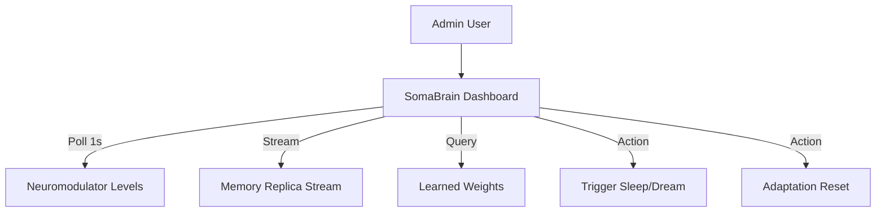

# SRS: SomaBrain Administration Dashboard

**Document ID:** SA01-SRS-DASHBOARD-2026-01
**Purpose:** Visualization and Control of the Agent's Cognitive State
**Compliance:** ISO/IEC 29148:2018

---

## 1. Dashboard Overview: "The fMRI of the Agent"

The **SomaBrain Dashboard** is not just a log viewer. It must visualize the *biological* and *cognitive* processes of the agent in real-time.



## 2. Core Modules (Views)

### 2.1 The Chemical Panel (Real-Time Graphs)

**Endpoint**: `GET /v1/neuromodulators`
**Visualization**: Live Line Charts & Gauges

| Metric | Range | Meaning | Visual Indicator |
|--------|-------|---------|------------------|
| **Dopamine** | 0.0 - 1.0 | Reward seeking, creativity | 🟢 Green - Creative<br>🔴 Red - Depleted |
| **Serotonin** | 0.0 - 1.0 | Stability, inhibition | 🔵 Blue - Stable<br>⚫ Grey - Volatile |
| **Norepinephrine** | 0.0 - 1.0 | Alertness, stress | ⚡ Yellow - Alert<br>⚪ White - Calm |

**UI Layout**:
```
┌────────────────────────────────────────────────────────┐
│  🧠 COGNITIVE CHEMISTRY (Last 1 Hour)                  │
│                                                        │
│  Dopamine: 0.82 🟢 [||||||||||||····] CREATIVE MODE    │
│  Serotonin: 0.45 🔵 [||||||··········] BALANCED        │
│                                                        │
│  [Graph: Multi-line chart updating every 1s]           │
└────────────────────────────────────────────────────────┘
```

### 2.2 Memory Cortex (The Stream of Consciousness)

**Endpoint**: `GET /v1/context/evaluate` (Simulated trace)
**Visualization**: timeline with "Salience" Heatmap.

*   High Salience (>0.8) events are **Bright/Bold**.
*   Low Salience (<0.3) events are Dim/Faded.

**UI Layout**:
```
┌────────────────────────────────────────────────────────┐
│  📜 MEMORY STREAM                                    │
│                                                        │
│  12:45:01 [VISUAL] "User asked for sunset image" (S:0.95) 🔥
│  12:45:02 [THOUGHT] "Requires DALL-E 3..." (S:0.75)    │
│  12:45:05 [ACTION]  Calling tool:image_gen... (S:0.88) │
│  12:45:09 [RESULT]  Image URL generated. (S:0.90)      │
│  12:46:00 [SYSTEM]  Background cleanup... (S:0.10) 🌑  │
└────────────────────────────────────────────────────────┘
```

### 2.3 Dream Laboratory (Sleep & Consolidation)

**Endpoint**: `POST /v1/brain/sleep`
**Function**: Manually trigger memory consolidation cycles to "Bake" short-term memory into long-term vectors.

**Controls**:
*   [ 💤 FORCE SLEEP ] - Triggers immediate consolidation.
*   [ 🌙 SCHEDULE DREAM ] - Sets next sleep cycle (e.g., 2 AM).

**Visualization**: "Dreaming" state shows active vector re-indexing progress.

### 2.4 Synaptic Weights (Learning)

**Endpoint**: `GET /v1/weights`
**Visualization**: Bar chart of Model/Provider affinities.

*   Shows which tools the brain *prefers* based on past rewards.
*   Example: `DALL-E 3: 0.9`, `StableDiff: 0.4`.

---

## 3. Integration Requirements

1.  **Frontend**: React + Recharts (or D3.js) for high-performance visualization.
2.  **Backend**: `admin/somabrain/core_brain.py` (Existing) provides all necessary endpoints.
3.  **Security**: Restricted to `SA` (SaaS Admin) role via `admin/core/permissions.py`.

**End of Specification**
