# SRS-SOMABRAIN-INTEGRATION — L3 Cognitive Engine

**System:** SomaAgent01
**Document ID:** SRS-SOMABRAIN-INTEGRATION-2026-01-16
**Version:** 5.0 (SaaS Direct Calls Enforced)
**Status:** CANONICAL

**Applied Personas:** ALL 10 ✅

---

## 0. SaaS Direct Call Rule

> **In SaaS mode, SomaBrain is DIRECTLY IMPORTED — ZERO HTTP LATENCY**

```python
# ✅ SAAS MODE — Direct import (0ms)
from somabrain.cognitive import CognitiveCore
brain = CognitiveCore(db=django_db)
await brain.recall(query, capsule)  # Direct call

# ❌ STANDALONE MODE — HTTP client
brain = SomaBrainHTTPClient(settings.SOMABRAIN_URL)
await brain.recall(query, capsule)  # HTTP overhead
```

---

## 1. Core Principle

> SomaBrain is the Layer 3 Cognitive Engine. It provides memory and learning. ALL configuration comes from `capsule.body.persona.memory`.

---

## 2. Three Operations

```mermaid
flowchart LR
    subgraph BRAIN ["🧠 SomaBrain"]
        R[recall] --> |memories| CTX[Context]
        M[memorize] --> |store| DB[(Memory)]
        L[learn] --> |update| CAPS[Capsule.body.learned]
    end
```



| Operation | Purpose | Reads From |
|-----------|---------|------------|
| **recall** | Get memories | `capsule.body.persona.memory.recall_*` |
| **memorize** | Store memories | `capsule.body.persona.memory.memorize_*` |
| **learn** | Update preferences | `capsule.body.learned.*` |

---

## 3. Capsule Integration

### 3.1 Memory Config in Capsule.body

```json
{
    "persona": {
        "memory": {
            "recall_limit": 20,
            "history_limit": 30,
            "similarity_threshold": 0.7,
            "somabrain_settings": {
                "recall_mode": "semantic",
                "memorize_mode": "auto",
                "embedding_model": "text-embedding-ada-002"
            }
        }
    }
}
```

### 3.2 Learned Preferences in Capsule.body

```json
{
    "learned": {
        "lane_preferences": {
            "system": 0.15,
            "history": 0.30,
            "memory": 0.25,
            "tools": 0.20,
            "buffer": 0.10
        },
        "tool_preferences": {
            "calculator": 0.9,
            "search": 0.7
        },
        "model_preferences": {
            "gpt-4o": 0.8
        },
        "neuromodulator_state": {
            "dopamine": 0.1,
            "serotonin": 0.05
        }
    }
}
```

---

## 4. Chat Flow Integration


---

## 5. learn() — Update Capsule.body.learned

```python
async def learn(
    self,
    result: dict,
    feedback: dict,
    capsule: Capsule
) -> None:
    """Update capsule.body.learned based on interaction."""

    learned = capsule.body.get("learned", {})

    # Update lane preferences based on success
    if feedback.get("success"):
        lanes = learned.get("lane_preferences", {})
        used_lane = result.get("primary_lane")
        if used_lane:
            lanes[used_lane] = min(1.0, lanes.get(used_lane, 0.5) + 0.05)
            learned["lane_preferences"] = lanes

    # Update tool preferences
    tools_used = result.get("tools_used", [])
    tool_prefs = learned.get("tool_preferences", {})
    for tool in tools_used:
        if feedback.get("success"):
            tool_prefs[tool] = min(1.0, tool_prefs.get(tool, 0.5) + 0.1)
        else:
            tool_prefs[tool] = max(0.0, tool_prefs.get(tool, 0.5) - 0.1)
    learned["tool_preferences"] = tool_prefs

    # Update neuromodulators
    neuro = learned.get("neuromodulator_state", {})
    if feedback.get("success"):
        neuro["dopamine"] = min(1.0, neuro.get("dopamine", 0) + 0.05)
    learned["neuromodulator_state"] = neuro

    # Persist to capsule
    capsule.body["learned"] = learned
    await capsule.asave(update_fields=["body"])
```

---

## 6. ask() — Sub-LM for RLM

```python
async def ask(
    self,
    question: str,
    capsule: Capsule
) -> str:
    """Answer Sub-LM query from RLM when uncertain."""

    # 1. Recall relevant memories
    memories = await self.recall(
        query=question,
        capsule=capsule
    )

    # 2. Augment with capsule context
    context = {
        "question": question,
        "memories": memories,
        "personality": capsule.body["persona"]["core"]["personality_traits"]
    }

    # 3. Generate answer
    return await self.llm.generate(
        prompt=self._build_ask_prompt(context),
        model=capsule.body["persona"]["models"]["chat_model_id"]
    )
```

---

## 7. Deployment Mode Matrix

| Mode | SomaBrain | OPA | SpiceDB | Milvus |
|------|-----------|-----|---------|--------|
| **SAAS** | Direct import (0ms) | In-memory cache (0ms) | gRPC pool (2ms) | gRPC (5ms) |
| **STANDALONE** | HTTP client (10-50ms) | HTTP server | gRPC single | gRPC |

```python
# ✅ SAAS MODE — Direct Python import
if settings.SA01_DEPLOYMENT_MODE == "SAAS":
    from somabrain.cognitive import CognitiveCore
    brain = CognitiveCore(db=django_db)  # 0ms latency
else:
    # STANDALONE — HTTP to external
    brain = SomaBrainHTTPClient(settings.SOMABRAIN_URL)
```

---

## 8. OTEL Tracing

```python
@tracer.start_as_current_span("somabrain.learn")
async def learn(self, result, feedback, capsule):
    span = trace.get_current_span()
    span.set_attribute("capsule_id", str(capsule.id))
    span.set_attribute("success", feedback.get("success", False))
    # ... rest of method
```

---

## 9. Acceptance Criteria

| Criterion | Verification |
|-----------|--------------|
| ✅ recall() uses capsule.memory | No hardcoded limits |
| ✅ memorize() uses capsule.memory | No hardcoded thresholds |
| ✅ learn() updates capsule.learned | Persistent learning |
| ✅ ask() integrates with RLM | Sub-LM queries |
| ✅ OTEL tracing | All operations traced |

---

**Document End**

*Signed off by ALL 10 PERSONAS ✅*
