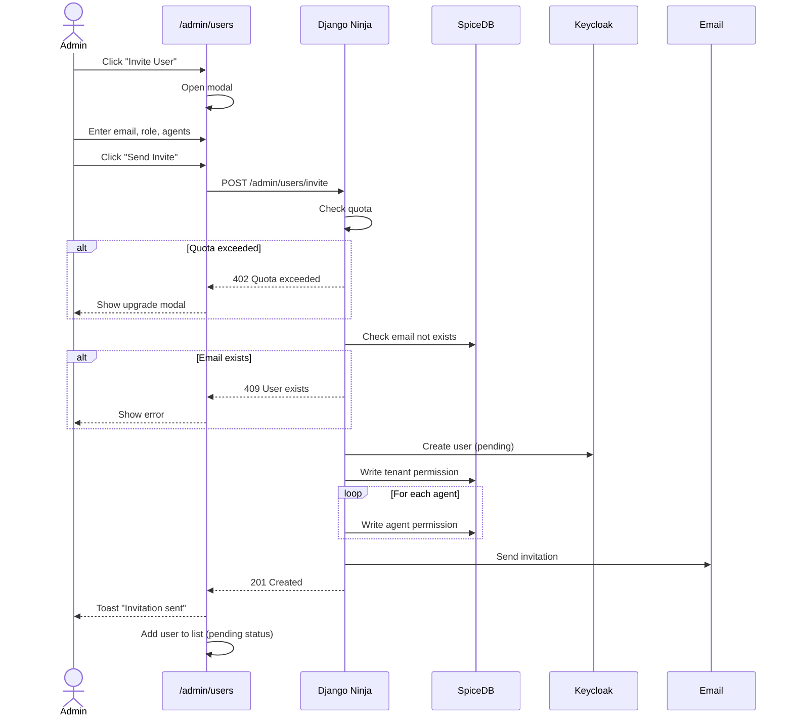
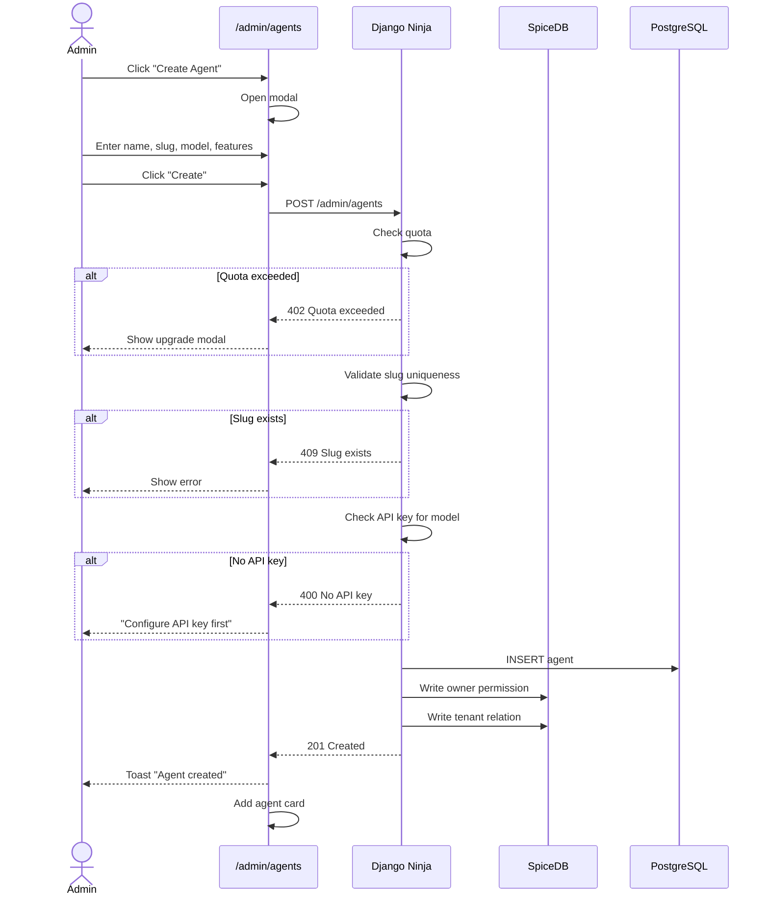

# SRS: Tenant Administration

**Document ID:** SA01-SRS-TENANT-ADMIN-2025-12  
**Roles:** 🟠 Tenant SysAdmin, 🟡 Tenant Admin  
**Permission:** `tenant->manage`, `tenant->administrate`  
**Routes:** `/admin/*`

---

## 1. Role Comparison

**Source:** `admin/saas/models/choices.py:20-26` (TenantRole enum)

| Capability | 🟠 SysAdmin (OWNER) | 🟡 Admin (ADMIN) | 🟢 Member (MEMBER) | 🔵 Viewer (VIEWER) |
|------------|---------------------|------------------|--------------------|---------------------|
| View Dashboard | ✅ | ✅ | ✅ | ✅ |
| Manage ALL Users | ✅ | ⚠️ Except SysAdmins | ❌ | ❌ |
| Create Agents | ✅ | ⚠️ If permitted | ❌ | ❌ |
| Delete Agents | ✅ | ⚠️ If permitted | ❌ | ❌ |
| Configure Agents | ✅ | ✅ | ❌ | ❌ |
| View Billing | ✅ | ⚠️ If permitted | ❌ | ❌ |
| Edit API Keys | ✅ | ⚠️ If permitted | ❌ | ❌ |
| Tenant Settings | ✅ | ❌ | ❌ | ❌ |
| View Audit Log | ✅ | ✅ | ❌ | ❌ |

**Note:** Actual role permissions enforced via SpiceDB. This table shows default behavior.

---

## 2. Screens

### 2.1 Tenant Dashboard (`/admin`)

**Purpose:** Tenant overview and quick actions

**Elements:**
| Element | Type | Description |
|---------|------|-------------|
| Quota Cards | Stats | Agents/Users/Tokens/Storage usage |
| Agent Grid | Cards | All tenant agents with status |
| Recent Activity | Timeline | User and agent events |
| Quick Actions | Buttons | Create Agent, Invite User |

**Edge Cases:**
| Scenario | System Response |
|----------|-----------------|
| Quota near limit | 🟡 "Using 9/10 agents. Upgrade for more." |
| Quota exceeded | 🔴 "Agent limit reached. Upgrade plan." |
| Agent in error state | 🔴 Show error badge with "Fix" button |
| No agents yet | 📦 Empty state: "Create your first agent" |

**API:**
```
GET /api/v2/admin/stats
GET /api/v2/admin/agents
GET /api/v2/admin/activity
```

---

### 2.2 User Management (`/admin/users`)

**Purpose:** Invite and manage tenant users

**Elements:**
| Element | Type | Actions |
|---------|------|---------|
| Quota Bar | Progress | "Using 12/50 user seats" |
| Search | Input | Filter by name/email |
| Role Filter | Dropdown | All roles |
| User Table | Table | Name, Email, Role, Status, Actions |
| Invite Button | Primary | Open invite modal |

**User Roles**
**Source:** `admin/saas/models/choices.py:20-26` (TenantRole enum)

| Role | Code | Description | Agent Access | Default Permissions |
|------|------|-------------|--------------|-------------------|
| Owner | `OWNER` | Full tenant control | All | Full control (including deletion) |
| Admin | `ADMIN` | Administrative privileges | Most | Manage users and settings (cannot delete tenant) |
| Member | `MEMBER` | Standard tenant user | Limited | Standard user access |
| Viewer | `VIEWER` | Read-only access | Read-only | View-only permissions |

**Note:** These are database-level roles. Fine-grained permissions enforced via SpiceDB.

**Edge Cases:**
| Scenario | System Response |
|----------|-----------------|
| Invite existing email | ❌ "User already exists in this tenant" |
| Invite to different tenant | ⚠️ "User exists in another tenant. Proceed?" |
| Remove last SysAdmin | ❌ "Cannot remove the last SysAdmin" |
| Change own role | ❌ "Cannot change your own role" |
| User quota exceeded | ❌ "User limit reached. Upgrade your plan." |
| Invited user not accepting | 🟡 "Invitation pending" + Resend button |

**API:**
```
GET /api/v2/admin/users
POST /api/v2/admin/users/invite
PUT /api/v2/admin/users/{id}/role
DELETE /api/v2/admin/users/{id}
POST /api/v2/admin/users/{id}/resend-invite
```

---

### 2.3 Invite User Modal

```
┌─────────────────────────────────────────────────────────────┐
│  Invite New User                                          ✕ │
├─────────────────────────────────────────────────────────────┤
│                                                             │
│  Email Address *                                            │
│  ┌─────────────────────────────────────────────────────┐   │
│  │ newuser@example.com                                 │   │
│  └─────────────────────────────────────────────────────┘   │
│                                                             │
│  Role *                                                     │
│  ┌─────────────────────────────────────────────────────┐   │
│  │ Developer                                       ▼   │   │
│  └─────────────────────────────────────────────────────┘   │
│                                                             │
│  ┌─────────────────────────────────────────────────────┐   │
│  │ 👨‍💻 DEVELOPER                                        │   │
│  │                                                     │   │
│  │ Can access:                                         │   │
│  │ ✅ DEV mode (debugging, logs, tools)               │   │
│  │ ✅ STD mode (chat, memory)                         │   │
│  │ ✅ View settings                                   │   │
│  │                                                     │   │
│  │ Cannot access:                                      │   │
│  │ ❌ ADM mode (user management)                      │   │
│  │ ❌ TRN mode (cognitive parameters)                 │   │
│  │ ❌ Billing or API keys                             │   │
│  └─────────────────────────────────────────────────────┘   │
│                                                             │
│  Agent Access (select which agents this user can access)    │
│  ┌─────────────────────────────────────────────────────┐   │
│  │ ☑ Support-AI    (developer access)                  │   │
│  │ ☑ Sales-Bot     (developer access)                  │   │
│  │ ☐ Internal-AI   (no access)                         │   │
│  └─────────────────────────────────────────────────────┘   │
│                                                             │
├─────────────────────────────────────────────────────────────┤
│  [Cancel]                                  [Send Invite]    │
└─────────────────────────────────────────────────────────────┘
```

---

### 2.4 Agent Management (`/admin/agents`)

**Purpose:** Create and manage agents

**Elements:**
| Element | Type | Description |
|---------|------|-------------|
| Quota Bar | Progress | "Using 5/10 agents" |
| Agent Cards | Grid | Name, Status, Model, Features, Sessions |
| Create Button | Primary | SysAdmin only |

**Agent Card Actions:**
| Action | Permission | Description |
|--------|------------|-------------|
| Configure | `agent->configure` | Open config page |
| Users | `agent->configure` | Manage agent users |
| Start/Stop | `agent->configure` | Toggle agent |
| Delete | `tenant->manage` | SysAdmin only |

**Edge Cases:**
| Scenario | System Response |
|----------|-----------------|
| Agent quota reached | ❌ "Agent limit reached. Upgrade plan." |
| Delete agent with data | ⚠️ "This will delete X conversations and X memories. Confirm?" |
| Agent start fails | 🔴 "Failed to start: [error]. Check model API key." |
| No API key for model | 🔴 "No API key configured for OpenAI. Add key first." |
| Agent in error state | Show error details + "View Logs" + "Restart" |

**API:**
```
GET /api/v2/admin/agents
POST /api/v2/admin/agents
GET /api/v2/admin/agents/{id}
PUT /api/v2/admin/agents/{id}
DELETE /api/v2/admin/agents/{id}
POST /api/v2/admin/agents/{id}/start
POST /api/v2/admin/agents/{id}/stop
```

---

### 2.5 Create Agent Modal

```
┌─────────────────────────────────────────────────────────────┐
│  Create New Agent                                         ✕ │
├─────────────────────────────────────────────────────────────┤
│                                                             │
│  Agent Name *                                               │
│  ┌─────────────────────────────────────────────────────┐   │
│  │ Customer Support AI                                 │   │
│  └─────────────────────────────────────────────────────┘   │
│                                                             │
│  Slug (URL identifier) *                                    │
│  ┌─────────────────────────────────────────────────────┐   │
│  │ customer-support-ai                                 │   │
│  └─────────────────────────────────────────────────────┘   │
│  URL: acme.somaagent.io/agent/customer-support-ai          │
│                                                             │
│  Chat Model *                                               │
│  ┌─────────────────────────────────────────────────────┐   │
│  │ GPT-4o (OpenAI)                                 ▼   │   │
│  └─────────────────────────────────────────────────────┘   │
│  ⚠️ Requires OpenAI API key (configured ✅)                │
│                                                             │
│  Features                                                   │
│  ┌─────────────────────────────────────────────────────┐   │
│  │ ☑ Memory Integration (SomaBrain)                    │   │
│  │ ☐ Voice Integration (AgentVoiceBox)                 │   │
│  │ ☑ Browser Agent                                     │   │
│  │ ☑ Code Execution                                    │   │
│  │ ☐ MCP Server Mode                                   │   │
│  └─────────────────────────────────────────────────────┘   │
│                                                             │
│  Agent Owner *                                              │
│  ┌─────────────────────────────────────────────────────┐   │
│  │ john@acme.com (You)                             ▼   │   │
│  └─────────────────────────────────────────────────────┘   │
│                                                             │
├─────────────────────────────────────────────────────────────┤
│  [Cancel]                                  [Create Agent]   │
└─────────────────────────────────────────────────────────────┘
```

---

### 2.6 Tenant Settings (`/admin/settings`)

**Permission:** 🟠 SysAdmin only

**Tabs:**
| Tab | Settings |
|-----|----------|
| General | Org name, Contact email, Timezone |
| Branding | Logo, Theme, Custom domain |
| Security | MFA requirement, Session timeout, IP allowlist |
| API | API keys, Webhooks, Rate limits |
| Danger Zone | Export data, Delete tenant |

**Edge Cases:**
| Scenario | System Response |
|----------|-----------------|
| Change org name | ⚠️ "This affects all invoices. Confirm?" |
| Enable MFA requirement | ⚠️ "Users without MFA will be locked out" |
| Delete tenant | ⚠️ Multi-step confirmation with typed slug |
| Custom domain SSL | 🔄 "Provisioning certificate..." (async) |

---

### 2.7 Billing (`/admin/billing`)

**Permission:** 🟠 SysAdmin only

**Elements:**
| Element | Type | Description |
|---------|------|-------------|
| Current Plan | Card | Tier, Price, Renewal date |
| Usage Meters | Charts | Tokens, Storage, API calls |
| Invoice History | Table | Date, Amount, Status, Download |
| Payment Method | Card | Current card, Update button |
| Upgrade Button | CTA | Available tiers |

**Edge Cases:**
| Scenario | System Response |
|----------|-----------------|
| Payment failed | 🔴 "Payment failed. Update card to continue." |
| Downgrade with excess usage | ⚠️ "Current usage exceeds new limits" |
| Cancel subscription | ⚠️ "Service will end on [date]. Data retained 30 days." |
| Lago unavailable | 🟡 "Billing sync delayed. Cached data shown." |

**API:**
```
GET /api/v2/admin/billing
GET /api/v2/admin/billing/invoices
GET /api/v2/admin/billing/usage
POST /api/v2/admin/billing/upgrade
POST /api/v2/admin/billing/cancel
```

---

### 2.8 Audit Log (`/admin/audit`)

**Purpose:** View all tenant activity

**Columns:**
| Column | Type | Filterable |
|--------|------|------------|
| Timestamp | DateTime | Date range |
| User | Email | Yes |
| Action | Enum | Yes |
| Resource | String | Yes |
| Details | JSON | Expandable |
| IP Address | String | No |

**Action Types:**
- `user.invite`, `user.remove`, `user.role_change`
- `agent.create`, `agent.delete`, `agent.configure`, `agent.start`, `agent.stop`
- `settings.update`, `billing.upgrade`, `billing.downgrade`
- `auth.login`, `auth.logout`, `auth.password_change`
- `memory.delete`, `memory.export`

**API:**
```
GET /api/v2/admin/audit?user=&action=&from=&to=
GET /api/v2/admin/audit/export
```

---

## 3. User Journey Flows

### 3.1 Invite User Flow



### 3.2 Create Agent Flow



---

## 4. Error States

### 4.1 Empty States

| Screen | Empty State |
|--------|-------------|
| Users | "No users yet. Invite your first team member." |
| Agents | "No agents yet. Create your first AI agent." |
| Audit | "No activity yet. Events will appear here." |
| Billing | "No invoices yet." |

### 4.2 Loading States

All tables/cards show skeleton loaders during fetch.

### 4.3 Error Recovery

| Error | Recovery |
|-------|----------|
| Network error | "Check connection. [Retry]" |
| Server error | "Something went wrong. [Retry] [Contact Support]" |
| Permission denied | Redirect to appropriate dashboard |
| Session expired | Redirect to login |

---

**Next:** [SRS-AGENT-USER.md](./SRS-AGENT-USER.md)
