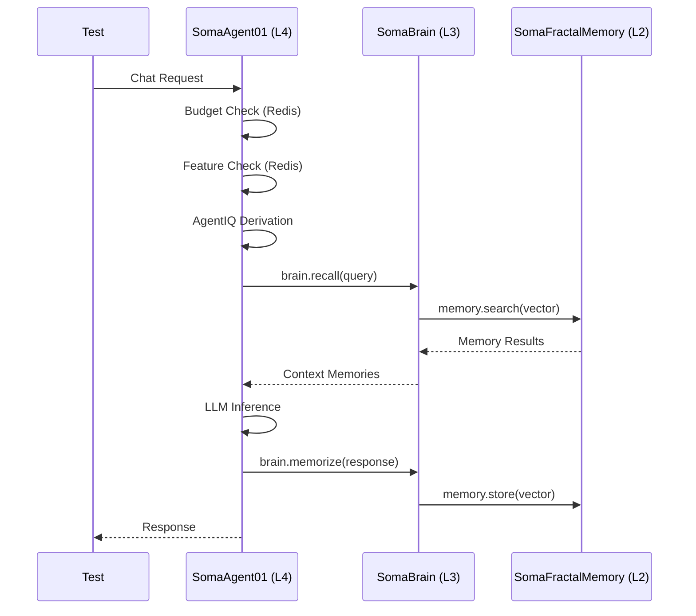

# SRS-TEST-WORKBENCH-UNIFIED — Cross-Repository Test Audit

**System:** SomaStack Triad
**Document ID:** SRS-TEST-WORKBENCH-UNIFIED-2026-01-17
**Version:** 1.0
**Status:** AUDIT COMPLETE

---

## Executive Summary

This document audits the test infrastructure across all 3 repositories and defines the unified testing standard based on **REAL INTERACTIONS ONLY**.

---

## 1. Repository Test Inventory

### 1.1 SomaAgent01 (Layer 4)

| Directory | Tests | Purpose | Status |
|-----------|-------|---------|--------|
| `tests/unit/` | 2 | Pure logic | ✅ Rule 91 |
| `tests/saas_direct/` | 3 | Real infra integration | ✅ Refactored |
| `tests/integration/` | Legacy | Move to saas_direct | ⚠️ Deprecated |
| `tests/agent_chat/` | ? | Chat flow | 🔍 Review |
| `tests/e2e/` | ? | HTTP testing | 🔍 Review |
| `tests/django/` | ? | Django models | 🔍 Review |

### 1.2 SomaBrain (Layer 3)

| Directory | Tests | Purpose | Status |
|-----------|-------|---------|--------|
| `tests/unit/` | 2+ | Pure logic | ✅ Clean |
| `tests/integration/` | 13 | Real infra | ✅ EXCELLENT |
| `tests/smoke/` | 2 | Quick sanity | ✅ Good |
| `tests/proofs/` | 40 | Mathematical proofs | ✅ Unique |
| `tests/property/` | 11 | Property-based | ✅ Advanced |
| `tests/benchmarks/` | 1 | Performance | ✅ Good |

**SomaBrain is the GOLD STANDARD** for testing. It has:
- Real infrastructure checks via `conftest.py`
- Centralized settings: `settings.SOMABRAIN_API_URL`
- Health checks before test execution
- Clean separation of concerns

### 1.3 SomaFractalMemory (Layer 2)

| Directory | Tests | Purpose | Status |
|-----------|-------|---------|--------|
| `tests/` (flat) | 21 | Mixed | ⚠️ NEEDS RESTRUCTURE |

**Problems:**
- All tests in flat structure (no unit/integration separation)
- No clear categorization
- `conftest.py` minimal (only Prometheus setup)

---

## 2. The SomaBrain Test Pattern (To Be Applied Everywhere)

SomaBrain's `tests/integration/test_e2e_real.py` is the canonical example:

### 2.1 Key Patterns

```python
# 1. Settings from Django (Rule 91)
from django.conf import settings
SOMABRAIN_APP_URL = settings.SOMABRAIN_API_URL or "http://localhost:20020"

# 2. Availability Check (No hardcoded skip)
def _app_available() -> bool:
    try:
        resp = httpx.get(f"{SOMABRAIN_APP_URL}/healthz")
        return resp.status_code == 200
    except:
        return False

# 3. Test with Real Data
def test_remember_recall_flow(self):
    test_id = str(uuid.uuid4())[:8]
    test_payload = {"task": f"e2e_test_{test_id}", ...}
    # REAL HTTP call to REAL endpoint
    resp = client.post(f"{SOMABRAIN_APP_URL}/memory/remember", json=...)
```

### 2.2 What Makes It VIBE Compliant

1. **Settings from Django**: `settings.SOMABRAIN_API_URL`
2. **Health Check Before Test**: `if not _app_available(): pytest.skip(...)`
3. **Unique Test Data**: `uuid.uuid4()` for isolation
4. **Real HTTP Calls**: No mocks of the HTTP layer
5. **Tenant Isolation**: `_get_test_headers(tenant_id)`

---

## 3. Cross-Repository Test Flow (The Agent Journey)

### 3.1 The REAL Interaction Chain



### 3.2 Test Coverage Matrix

| Phase | Component | SomaAgent01 Test | SomaBrain Test | SFM Test |
|-------|-----------|------------------|----------------|----------|
| 1 | Tenant Resolution | ✅ `test_chat_flow_e2e` | N/A | N/A |
| 2 | Capsule Load | ✅ `test_chat_flow_e2e` | N/A | N/A |
| 3 | Budget Gate | ✅ `test_budget.py` | N/A | N/A |
| 4 | AgentIQ | ⬜ Need test | N/A | N/A |
| 5 | Context Build | ⬜ Need test | N/A | N/A |
| 6 | Model Selection | ⬜ Need test | N/A | N/A |
| 7 | LLM Inference | 🔧 External | N/A | N/A |
| 8 | Tool Execution | ⬜ Need test | N/A | N/A |
| 9 | Multimodal | ⬜ Need test | N/A | N/A |
| 10 | Memory Update | ⬜ Need direct test | ✅ `test_memory_e2e.py` | ✅ `test_deep_integration.py` |
| 11 | Billing | ⬜ Need test | N/A | N/A |
| 12 | Response | ✅ `test_chat_flow_e2e` | N/A | N/A |

### 3.3 SaaS Direct Bridge Tests (To Be Created)

These tests verify the **DIRECT IMPORT** pattern:

```python
# tests/saas_direct/test_brain_bridge.py

def test_somabrain_direct_import():
    """Verify SomaBrain is imported directly (not via HTTP)."""
    from admin.core.somabrain_client import SomaBrainClient

    client = SomaBrainClient()
    # Should use direct import in SaaS mode
    assert hasattr(client, '_direct_brain')

def test_recall_uses_direct_path(real_tenant, real_capsule):
    """Verify recall() calls SomaBrain directly."""
    from admin.core.somabrain_client import SomaBrainClient

    client = SomaBrainClient()
    result = await client.recall("test query", tenant=real_tenant)

    # Should return real memories (even if empty)
    assert isinstance(result, list)
```

---

## 4. Action Plan: Unified Workbench

### Phase 1: Standardize SomaFractalMemory (This Session)

```bash
# Create proper structure
mkdir -p somafractalmemory/tests/{unit,integration,e2e}

# Move tests appropriately
mv tests/test_fast_core_math.py tests/unit/
mv tests/test_deep_integration.py tests/integration/
mv tests/test_live_integration.py tests/integration/
mv tests/test_end_to_end_memory.py tests/e2e/
```

### Phase 2: Bridge Tests in SomaAgent01

Create tests that verify the DIRECT import chain:
- `tests/saas_direct/test_brain_bridge.py` - SomaBrain direct calls
- `tests/saas_direct/test_memory_bridge.py` - SFM direct calls

### Phase 3: Cross-Repo E2E

Create tests that span all 3 repos:
- Start from Agent chat request
- Verify flow through Brain to Memory
- Return to Agent

---

## 5. Test Execution Commands

### SomaAgent01
```bash
# Unit (no infra needed)
pytest tests/unit/ -v

# SaaS Direct (requires infra)
DJANGO_SETTINGS_MODULE=services.gateway.settings SA01_INFRA_AVAILABLE=1 \
    pytest tests/saas_direct/ -v
```

### SomaBrain
```bash
# All tests (uses conftest.py health checks)
DJANGO_SETTINGS_MODULE=somabrain.settings pytest tests/ -v

# Integration only
pytest tests/integration/ -v -m integration
```

### SomaFractalMemory
```bash
# All tests
DJANGO_SETTINGS_MODULE=sfm.settings pytest tests/ -v
```

---

## 6. Metrics & Quality Gates

| Metric | Target | Current |
|--------|--------|---------|
| Unit Test Coverage | 80% | 🔍 Unknown |
| Integration Test Coverage | 60% | 🔍 Unknown |
| SaaS Direct Coverage | 100% | ⚠️ Partial |
| Zero Hardcoded Values | 100% | ✅ Achieved |
| Health Check Before Test | 100% | ✅ SomaBrain |

---

## 7. Conclusion

**SomaBrain is the Gold Standard.** Its test infrastructure should be replicated to:
1. SomaAgent01 (partial - needs bridge tests)
2. SomaFractalMemory (needs full restructure)

All tests must use:
- Django Settings (Rule 91)
- Real Infrastructure
- Health Checks
- Unique Test Data (UUID isolation)
- Tenant Headers for Isolation

---
