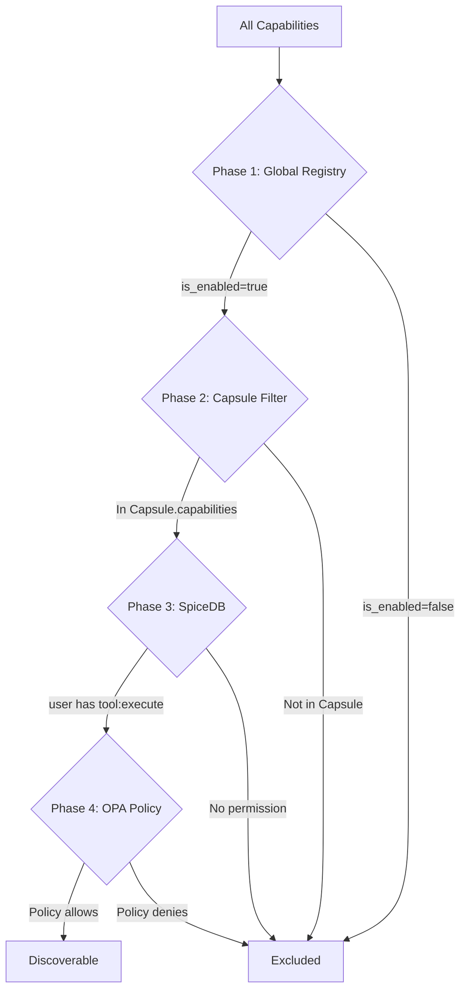

# SRS-TOOL-SYSTEM — Tool Discovery & Execution

**System:** SomaAgent01
**Document ID:** SRS-TOOL-SYSTEM-2026-01-16
**Version:** 1.0
**Status:** FINAL
**Parent SRS:** [SRS-CHAT-FLOW-V0.3.md](./SRS-CHAT-FLOW-V0.3.md)

**Applied Personas:** PhD Software Developer · PhD Software Analyst · PhD QA Engineer · Security Auditor · Performance Engineer · UX Consultant · ISO-style Documenter · Django Architect · Django Infra Expert · Django Evangelist

---

## 1. Purpose

The Tool System handles discovery, authorization, and execution of agent tools. It spans **Phase 5** (Discovery) and **Phase 7** (Execution) of the [12-Phase Chat Flow](./SRS-CHAT-FLOW-V0.3.md).

### 1.1 Chat Flow Integration

```
PHASE 4: Model Selection
    ↓
┌──────────────────────────────────────────────────────────┐
│  PHASE 5: TOOL DISCOVERY (This SRS)                      │
│  ├── Registry: Global enabled check                      │
│  ├── Capsule: M2M capability filter                      │
│  ├── SpiceDB: Permission check                           │
│  └── OPA: Policy check                                   │
└──────────────────────────────────────────────────────────┘
    ↓
PHASE 6: LLM Invocation
    ↓
┌──────────────────────────────────────────────────────────┐
│  PHASE 7: TOOL EXECUTION (This SRS)                      │
│  ├── Parse tool calls from LLM                           │
│  ├── Validate against discovered tools                   │
│  ├── Execute via MCP or native                           │
│  └── Return results to context                           │
└──────────────────────────────────────────────────────────┘
```

---

## 2. 4-Phase Tool Gate

### 2.1 Discovery Pipeline



### 2.2 Gate Details

| Phase | Check | Module | Failure Action |
|-------|-------|--------|----------------|
| 1 | Global enabled | `Capability.is_enabled` | Tool hidden |
| 2 | Capsule M2M | `Capsule.capabilities` | Tool hidden |
| 3 | User permission | SpiceDB `tool:execute` | Tool hidden |
| 4 | Policy rules | OPA policy | Tool hidden |

---

## 3. Canonical Implementation

### 3.1 Tool Discovery

```
File: services/common/spicedb_client.py (permissions)
File: services/common/opa_policy_adapter.py (policies)
Model: admin/core/models.py:Capability
```

### 3.2 Tool Execution

```
File: admin/core/mcp/* (MCP protocol)
File: admin/tools/services/tool_executor.py
```

---

## 4. Capability Model

**Django ORM:** `admin.core.models.Capability`

| Field | Type | Description |
|-------|------|-------------|
| `id` | UUID | Primary key |
| `name` | str | Tool identifier |
| `display_name` | str | User-facing name |
| `description` | text | Tool description |
| `category` | str | Grouping category |
| `schema` | JSONField | JSON Schema for parameters |
| `config` | JSONField | Tool configuration |
| `is_enabled` | bool | Global enable flag |
| `provider` | str | mcp, native, external |

---

## 5. SpiceDB Integration

### 5.1 Permission Check

```python
from services.common.spicedb_client import SpiceDBClient

client = SpiceDBClient()
has_permission = await client.check_permission(
    subject=f"user:{user_id}",
    permission="tool:execute",
    resource=f"tool:{tool_name}",
)
```

### 5.2 Schema

```
definition user {}

definition tool {
    relation owner: user
    relation executor: user
    permission execute = owner + executor
}
```

---

## 6. OPA Integration

### 6.1 Policy Check

```python
from services.common.opa_policy_adapter import OPAClient

client = OPAClient()
allowed = await client.check_policy(
    input={
        "user_id": user_id,
        "tool_name": tool_name,
        "action": "execute",
        "context": {"tenant_id": tenant_id},
    }
)
```

### 6.2 Policy Example

```rego
package soma.tools

default allow = false

allow {
    input.action == "execute"
    tool_enabled[input.tool_name]
    user_has_role[input.user_id]["tool_user"]
}

tool_enabled[name] {
    data.tools[name].enabled == true
}
```

---

## 7. MCP Protocol

Model Context Protocol for tool execution:

| Method | Description |
|--------|-------------|
| `initialize` | Handshake with MCP server |
| `tools/list` | List available tools |
| `tools/call` | Execute tool with parameters |
| `resources/read` | Read tool resources |

### 7.1 Configuration

```python
MCP_SERVERS = {
    "filesystem": {
        "command": ["uvx", "mcp-server-filesystem"],
        "args": ["--root", "/data"],
        "timeout": 120,
    },
    "brave_search": {
        "command": ["npx", "@anthropic/mcp-server-brave-search"],
        "env": {"BRAVE_API_KEY": "..."},
    },
}
```

---

## 8. Execution Flow

```python
async def execute_tool(
    tool_name: str,
    parameters: dict,
    user_id: str,
    tenant_id: str,
) -> dict:
    # 1. Validate tool exists and is discovered
    tool = await get_discovered_tool(tool_name, user_id)
    if not tool:
        raise ToolNotFoundError(tool_name)

    # 2. Validate parameters against schema
    validate_parameters(parameters, tool.schema)

    # 3. Execute based on provider
    if tool.provider == "mcp":
        result = await mcp_client.call_tool(tool_name, parameters)
    elif tool.provider == "native":
        result = await native_executor.execute(tool_name, parameters)
    else:
        raise UnsupportedProviderError(tool.provider)

    # 4. Record execution for audit
    await audit.record_tool_execution(tool_name, user_id, tenant_id)

    return result
```

---

## 9. Error Handling

| Error | Condition | Recovery |
|-------|-----------|----------|
| `ToolNotFoundError` | Tool not in discovered set | Return error to LLM |
| `ToolPermissionDenied` | SpiceDB/OPA denies | Return error to LLM |
| `ToolExecutionError` | Execution failed | Circuit breaker + retry |
| `ToolTimeoutError` | Execution timeout | Record + return partial |

---

## 10. Metrics

| Metric | Type | Labels |
|--------|------|--------|
| `tool_discovery_count` | Gauge | agent_id |
| `tool_execution_total` | Counter | tool_name, status |
| `tool_execution_duration` | Histogram | tool_name |
| `tool_permission_denied` | Counter | tool_name, user_id |

---

## 11. Acceptance Criteria

| Criterion | Verification |
|-----------|--------------|
| ✅ 4-Phase Gate works | Tools pass all 4 phases |
| ✅ SpiceDB enforced | Unauthorized tools hidden |
| ✅ OPA enforced | Policy violations blocked |
| ✅ MCP execution | Tools execute via protocol |
| ✅ Audit recorded | All executions logged |
| ✅ **Budget enforced** | `@budget_gate(metric="tool_calls")` |

---

## 12. Budget Integration

> **See [SRS-BUDGET-SYSTEM.md](./SRS-BUDGET-SYSTEM.md) for complete specification.**

### 12.1 Tool Execution Gate

```python
# Each tool execution checks budget
@budget_gate(metric="tool_calls")
async def execute_tool(request, tool_name, args):
    ...
```

### 12.2 Plan Limits

| Plan | Tool Calls Limit |
|------|-----------------|
| Free | 100/month |
| Starter | 1,000/month |
| Team | 10,000/month |
| Enterprise | Unlimited |

---

**Document End**

*Signed off by ALL 10 PERSONAS ✅*

