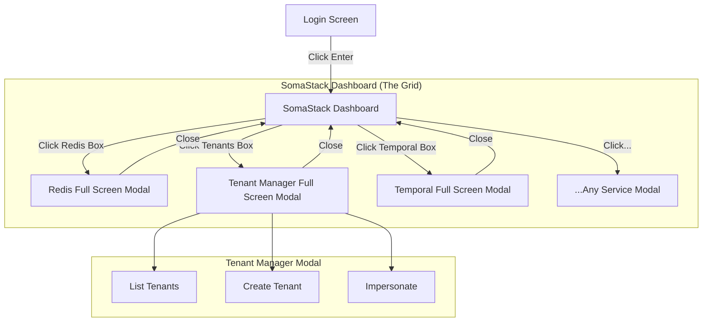

# SRS: SAAS Platform Admin (SomaStack Dashboard)

**Document ID:** SA01-SRS-SAAS-ADMIN-2026-01  
**Role:** 🔴 SAAS SysAdmin  
**Permission:** `platform->manage`  
**Routes:** `/saas/*`

---

## 1. Screen 1: Login (`/login`)
*Pre-loaded credentials, click-to-enter.*

**Elements:**
- **Credentials:** Pre-filled (or easily selectable) superadmin credentials.
- **Auth Provider:** Keycloak Integration.
- **Action:** Single prominent "Login" button.

---

## 2. Screen 2: Universal SaaS Setup (`/platform/setup`)
*The "Day 0" Mandatory Configuration Screen.*

**Visual Layout:**
- **Header:** Title "Universal SaaS Setup" + User Profile Pill (System Admin).
- **Two-Column Grid:**
    - **Left Column:** "Infrastructure" (Redis, Postgres, Keycloak, etc.).
    - **Right Column:** "Tenants" (Acme Corp, Beta Industries, Gamma Solutions).
- **Footer:** Massive "LAUNCH SYSTEM" action bar.

**Component Architecture:**
- **Service Card (`saas-service-card`):**
    - **Visual:** Box with Title (e.g., "Redis") and Status LED (Green "Connected").
    - **Interaction:** Click opens **Full Screen Modal** for configuration.
- **Tenant Card (`saas-tenant-card`):**
    - **Visual:** Box with Logo, Name, and Domain.
    - **Interaction:** Click opens **Tenant Detail Modal**.
- **Launch Button (`saas-launch-button`):**
    - **Visual:** Large, full-width black bar at bottom.
    - **Logic:** Disabled until ALL Infrastructure cards are Green.

**Modal Specifications:**
- **Infrastructure Modal:** Form fields (API Key, Region, Channels) + "Save" button.
- **Tenant Modal:** Full tenant CRUD operations.

**API Mapping:**
- `GET /api/v2/setup/status` -> Returns JSON for all cards (status, connection state).
- `POST /api/v2/setup/configure/{service}` -> Saves modal form data.
- `POST /api/v2/setup/launch` -> Final commits, removes "Setup" lock, redirects to Dashboard.

---

## 3. Modal Specifications (The "Full Window")
*When a box is clicked, it does NOT navigate away. It opens a modal that covers 90-100% of the viewport.*

### 3.1 Tenant Manager Modal
**Route:** Virtual (Overlay on `/platform/stack`)
**Features:**
- **List View:** Datagrid of all tenants (Sortable, Filterable).
- **Actions:** Context menu for Suspend/Delete/Impersonate.
- **Creation:** "Create Tenant" button triggers a sub-flow or side-sheet within the modal.
- **Fields:** Org Name, Slug, Owner Email, Tier, Initial Agent.

### 3.2 Infrastructure Modals (Generic Pattern)
**Route:** Virtual (Overlay on `/platform/stack`)
**Features:**
- **Header:** Service Status (Green/Red LED), Uptime, Version.
- **Tabs:** Overview | Configuration | Logs | Maintenance.
- **Config:** `saas-settings-form` (JSON Schema generated) to tune env vars/settings.
- **Actions:** "Restart Service", "Clear Cache", "Rotate Keys".

---

## 4. User Journey Flow (Audio Aligned)

---

## 5. API Requirements
- `GET /api/v2/stack/summary`: Returns status/health for ALL boxes to render the grid.
- `GET /api/v2/stack/{service}/config`: Get detailed config for a specific modal.
- `GET /api/v2/tenants/`: List all tenants.
- `POST /api/v2/tenants/`: Create new tenant.
- `PUT /api/v2/tenants/{tenant_id}`: Update tenant.
- `DELETE /api/v2/tenants/{tenant_id}`: Delete tenant.
- `POST /api/v2/tenants/{tenant_id}/impersonate`: Impersonate tenant admin.

---

## 6. Data Model References

**Source Files:**
- `admin/saas/models/tenants.py:11-113` (Tenant model)
- `admin/saas/models/tenants.py:116-170` (TenantUser model)
- `admin/saas/models/profiles.py:140-239` (TenantSettings model)
- `admin/saas/models/tiers.py` (SubscriptionTier model)

### 6.1 Tenant Model
**File:** `admin/saas/models/tenants.py:11-113`

| Field | Type | Constraints | UI Display |
|-------|------|-------------|------------|
| `id` | UUIDField | Primary Key | Hidden |
| `name` | CharField | max_length=100 | Tenant Card Title |
| `slug` | CharField | Unique, max_length=100 | Tenant URL Identifier |
| `tier` | ForeignKey | To: SubscriptionTier | Subscription Tier Badge |
| `status` | CharField | Choices: Active/Pending/Suspended/Terminated | Status Indicator |
| `keycloak_realm` | CharField | max_length=100, Blank | Auth Realm Display |
| `lago_customer_id` | CharField | Indexed, Blank | Billing Customer ID |
| `lago_subscription_id` | CharField | Blank | Subscription ID |
| `billing_email` | EmailField | Blank | Contact Email |
| `feature_overrides` | JSONField | Default: dict | Feature Matrix |
| `metadata` | JSONField | Default: dict | Integration Metadata |
| `created_at` | DateTimeField | auto_now_add | Audit Field |
| `updated_at` | DateTimeField | auto_now | Audit Field |
| `trial_ends_at` | DateTimeField | Null, Blank | Trial Countdown |

**Indexes:** `slug`, `status`, `lago_customer_id`, `-created_at`

### 6.2 TenantSettings Model
**File:** `admin/saas/models/profiles.py:140-239`

One-to-one extension for configuration and branding (displayed in Tenant Modal).

| Category | Field | Type | Default | UI Element |
|----------|-------|------|---------|------------|
| **PK** | `tenant` | OneToOneField | - | Foreign Key |
| **Branding** | `logo_url` | URLField | "" | Logo Image |
| | `primary_color` | CharField | "#2563eb" | Brand Color Picker |
| | `accent_color` | CharField | "#3b82f6" | Accent Color Picker |
| | `custom_domain` | CharField | "" | White-label Domain Input |
| **Security** | `mfa_policy` | CharField | "optional" | MFA Dropdown (Off/Optional/Required) |
| | `sso_enabled` | BooleanField | false | SSO Toggle |
| | `sso_config` | JSONField | dict | SSO Configuration Form |
| | `session_timeout` | IntegerField | 30 | Session Timeout Input (minutes) |
| **Features** | `feature_overrides` | JSONField | dict | Feature Flag Matrix |
| **SRS** | `compliance` | JSONField | dict | Compliance Settings Form |
| | `compute` | JSONField | dict | Compute Settings Form |
| | `auth` | JSONField | dict | Auth Settings Form |
| **Meta** | `timezone` | CharField | "UTC" | Timezone Dropdown |
| | `language` | CharField | "en" | Language Dropdown |
| **Timestamps** | `created_at` | DateTimeField | auto_now_add | Audit Field |
| | `updated_at` | DateTimeField | auto_now | Audit Field |

**Table:** `saas_tenant_settings`

### 6.3 TenantUser Model
**File:** `admin/saas/models/tenants.py:116-170`

Links Keycloak users to tenants with role-based access.

| Field | Type | Constraints | UI Display |
|-------|------|-------------|------------|
| `id` | UUIDField | Primary Key | Hidden |
| `tenant` | ForeignKey |CASCADE, related_name="users" | Tenant Reference |
| `user_id` | UUIDField | Indexed | Keycloak User ID |
| `email` | EmailField | Indexed | User Email Display |
| `display_name` | CharField | max_length=200, Blank | User Name |
| `role` | CharField | Choices: Owner/Admin/Member/Billing | Role Badge |
| `is_active` | BooleanField | Default: true, Indexed | Active Status |
| `last_login_at` | DateTimeField | Null, Blank | Last Login Display |
| `created_at` | DateTimeField | auto_now_add | Audit Field |
| `updated_at` | DateTimeField | auto_now | Audit Field |

**Role Choices (from `admin/saas/models/choices.py:20-26`):**
- `OWNER`: Full control, can delete tenant
- `ADMIN`: Manage users and settings
- `MEMBER`: Standard user access
- `BILLING`: Billing access only

**Unique Constraint:** `tenant` + `user_id` (prevent duplicates)

### 6.4 SubscriptionTier Model
**File:** `admin/saas/models/tiers.py`

Defines subscription tiers with feature limits and pricing.

| Field | Type | Description |
|-------|------|-------------|
| `id` | UUIDField | Primary Key |
| `name` | CharField | Tier display name (Free, Standard, Enterprise) |
| `slug` | CharField | URL-safe tier identifier |
| `description` | TextField | Tier description |
| `price_monthly` | DecimalField | Monthly price in USD |
| `price_yearly` | DecimalField | Yearly price in USD |
| `features` | JSONField | Feature entitlements dictionary |
| `quotas` | JSONField | Resource quotas (agents, users, storage) |
| `is_active` | BooleanField | Tier availability |
| `tier_order` | IntegerField | Display order hierarchy |

---
