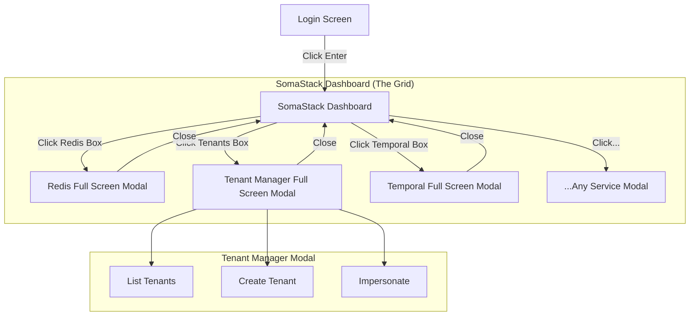

# SRS: SAAS Platform Admin (SomaStack Dashboard)

**Document ID:** SA01-SRS-SAAS-ADMIN-2026-01  
**Role:** 🔴 SAAS SysAdmin  
**Permission:** `platform->manage`  
**Routes:** `/saas/*`

---

## 1. Screen 1: Login (`/login`)
*Pre-loaded credentials, click-to-enter.*

**Elements:**
- **Credentials:** Pre-filled (or easily selectable) superadmin credentials.
- **Auth Provider:** Keycloak Integration.
- **Action:** Single prominent "Login" button.

---

## 2. Screen 2: Universal SaaS Setup (`/platform/setup`)
*The "Day 0" Mandatory Configuration Screen.*

**Visual Layout:**
- **Header:** Title "Universal SaaS Setup" + User Profile Pill (System Admin).
- **Two-Column Grid:**
    - **Left Column:** "Infrastructure" (Redis, Postgres, Keycloak, etc.).
    - **Right Column:** "Tenants" (Acme Corp, Beta Industries, Gamma Solutions).
- **Footer:** Massive "LAUNCH SYSTEM" action bar.

**Component Architecture:**
- **Service Card (`saas-service-card`):**
    - **Visual:** Box with Title (e.g., "Redis") and Status LED (Green "Connected").
    - **Interaction:** Click opens **Full Screen Modal** for configuration.
- **Tenant Card (`saas-tenant-card`):**
    - **Visual:** Box with Logo, Name, and Domain.
    - **Interaction:** Click opens **Tenant Detail Modal**.
- **Launch Button (`saas-launch-button`):**
    - **Visual:** Large, full-width black bar at bottom.
    - **Logic:** Disabled until ALL Infrastructure cards are Green.

**Modal Specifications:**
- **Infrastructure Modal:** Form fields (API Key, Region, Channels) + "Save" button.
- **Tenant Modal:** Full tenant CRUD operations.

**API Mapping:**
- `GET /api/v2/setup/status` -> Returns JSON for all cards (status, connection state).
- `POST /api/v2/setup/configure/{service}` -> Saves modal form data.
- `POST /api/v2/setup/launch` -> Final commits, removes "Setup" lock, redirects to Dashboard.

---

## 3. Modal Specifications (The "Full Window")
*When a box is clicked, it does NOT navigate away. It opens a modal that covers 90-100% of the viewport.*

### 3.1 Tenant Manager Modal
**Route:** Virtual (Overlay on `/platform/stack`)
**Features:**
- **List View:** Datagrid of all tenants (Sortable, Filterable).
- **Actions:** Context menu for Suspend/Delete/Impersonate.
- **Creation:** "Create Tenant" button triggers a sub-flow or side-sheet within the modal.
- **Fields:** Org Name, Slug, Owner Email, Tier, Initial Agent.

### 3.2 Infrastructure Modals (Generic Pattern)
**Route:** Virtual (Overlay on `/platform/stack`)
**Features:**
- **Header:** Service Status (Green/Red LED), Uptime, Version.
- **Tabs:** Overview | Configuration | Logs | Maintenance.
- **Config:** `saas-settings-form` (JSON Schema generated) to tune env vars/settings.
- **Actions:** "Restart Service", "Clear Cache", "Rotate Keys".

---

## 4. User Journey Flow (Audio Aligned)

---

## 5. API Requirements
- `GET /api/v2/stack/summary`: Returns status/health for ALL boxes to render the grid.
- `GET /api/v2/stack/{service}/config`: Get detailed config for a specific modal.
- `PUT /api/v2/stack/{service}/config`: Save tuning parameters.
- `POST /api/v2/stack/{service}/restart`: Restart the service.

---

**Next:** [SRS-TENANT-ADMIN.md](./SRS-TENANT-ADMIN.md)
