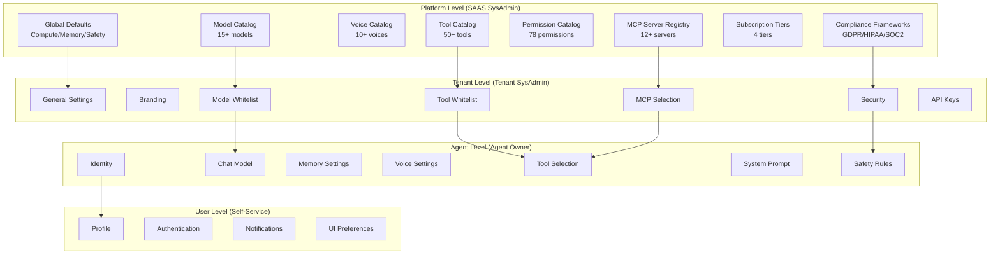
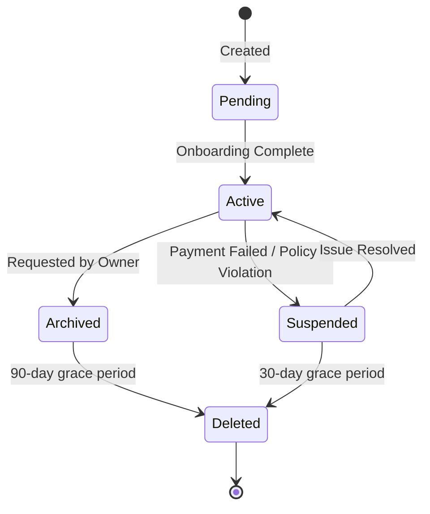
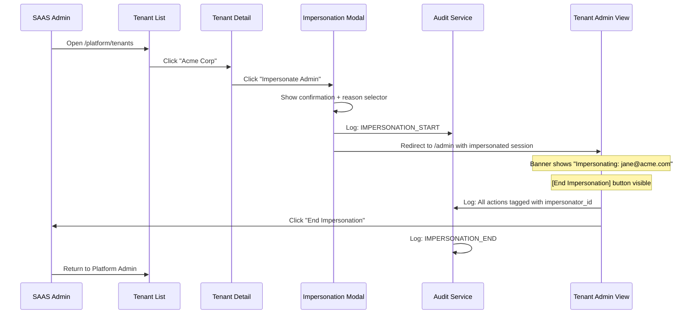

# SRS: Universal SaaS SomaStack — Complete Screen Flow & Navigation Architecture

**Document ID:** SA01-SRS-SOMA-STACK-FLOWS-2025-12-25  
**Purpose:** Comprehensive screen flow, navigation hierarchy, all catalogs, user/profile management, reusable components  
**Status:** CANONICAL MASTER REFERENCE FOR UI IMPLEMENTATION

---

## PERSONAS APPLIED

This document was created by simultaneously embodying:

| Persona | Focus Area Applied |
|---------|-------------------|
| 🧑‍💻 PhD Software Developer | Architecture, component design, API contracts |
| 📊 PhD Software Analyst | Data flow analysis, state management |
| ✅ PhD QA Engineer | Edge cases, validation rules, error states |
| 📚 ISO-style Documenter | Structure, clarity, traceability |
| 🔒 Security Auditor | Permission gates, audit trails, impersonation safety |
| ⚡ Performance Engineer | Lazy loading, pagination, caching strategies |
| 🎨 UX Consultant | User flows, empty states, accessibility |
| 🏗️ Django Architect | ORM models, API structure, settings hierarchy |
| 🔧 Django Infra Expert | Service integration, health checks, rate limits |
| 📣 Django Evangelist | Pure Django/Ninja/Lit stack compliance |

---

## 1. Complete System Hierarchy

```
┌─────────────────────────────────────────────────────────────────────────────────────────┐
│                                   SOMA AGENT PLATFORM                                   │
├─────────────────────────────────────────────────────────────────────────────────────────┤
│                                                                                         │
│  LEVEL 0: AUTHENTICATION                                                                │
│  ├── /login                    ← OAuth2 (Keycloak + Google)                            │
│  ├── /register                 ← Self-service tenant signup                            │
│  ├── /forgot-password          ← Password reset flow                                   │
│  └── /logout                   ← Session termination                                   │
│                                                                                         │
│  LEVEL 1: PLATFORM ADMIN (Eye of God) — 32 Screens                                     │
│  ├── Dashboard & Overview      ← /platform                                             │
│  ├── Tenant Management         ← /platform/tenants                                     │
│  ├── Subscription Tiers        ← /platform/subscriptions                               │
│  ├── Access Control            ← /platform/roles, /platform/permissions                │
│  ├── Infrastructure            ← /platform/infrastructure/*                            │
│  ├── Observability             ← /platform/metrics/*                                   │
│  ├── Catalogs                  ← /platform/features, /platform/models, /platform/tools │
│  ├── Marketplace               ← /platform/marketplace                                 │
│  └── Profile                   ← /platform/profile                                     │
│                                                                                         │
│  LEVEL 2: TENANT ADMIN — 20 Screens                                                    │
│  ├── Dashboard                 ← /admin                                                │
│  ├── User Management           ← /admin/users                                          │
│  ├── Agent Management          ← /admin/agents                                         │
│  ├── Usage & Billing           ← /admin/usage, /admin/billing                          │
│  ├── Settings                  ← /admin/settings/*                                     │
│  ├── Audit                     ← /admin/audit                                          │
│  └── Profile                   ← /admin/profile                                        │
│                                                                                         │
│  LEVEL 3: AGENT OWNER — 12 Screens                                                     │
│  ├── Agent Settings            ← /settings/*                                           │
│  ├── Chat                      ← /chat                                                 │
│  ├── Memory                    ← /memory                                               │
│  └── Profile                   ← /profile                                              │
│                                                                                         │
│  LEVEL 4: SPECIALIZED MODES — 6 Screens                                                │
│  ├── Developer Console         ← /dev/*                                                │
│  └── Trainer Panel             ← /trn/*                                                │
│                                                                                         │
└─────────────────────────────────────────────────────────────────────────────────────────┘
```

---

## 2. Complete Settings Hierarchy (100+ Settings)

### 2.1 Settings Inheritance Tree



### 2.2 Platform-Level Settings Screens

| Route | Settings Count | Categories |
|-------|---------------|------------|
| `/platform/settings/models` | 15+ | LLM providers, cost/token, tier gates |
| `/platform/settings/tools` | 50+ | Risk levels, sandboxing, timeouts |
| `/platform/settings/voices` | 10+ | TTS providers, cloning policies |
| `/platform/settings/compliance` | 8 | GDPR, HIPAA, SOC2 toggles |
| `/platform/infrastructure/mcp` | 12+ | Server configs, mandatory flags |
| `/platform/permissions` | 78 | All granular permissions |
| `/platform/subscriptions` | 4 tiers | Features, quotas, pricing |

### 2.3 Settings UI Pattern

```
┌─────────────────────────────────────────────────────────────────────────────┐
│  Platform Settings > Models                                   [Save] [↺]    │
├─────────────────────────────────────────────────────────────────────────────┤
│                                                                             │
│  ┌───────────────────────────────────────────────────────────────────────┐ │
│  │  FILTER                                                               │ │
│  │  Provider: [All ▼]  Tier: [All ▼]  Capability: [All ▼]  [Search...] │ │
│  └───────────────────────────────────────────────────────────────────────┘ │
│                                                                             │
│  ┌───────────────────────────────────────────────────────────────────────┐ │
│  │  MODEL          PROVIDER   CTX     COST/1M    TIERS        ENABLED  │ │
│  ├───────────────────────────────────────────────────────────────────────┤ │
│  │  GPT-4o         OpenAI     128K    $5 / $15   All          [✓]      │ │
│  │  GPT-4o-mini    OpenAI     128K    $0.15      All          [✓]      │ │
│  │  Claude 3.5     Anthropic  200K    $3 / $15   Team+        [✓]      │ │
│  │  Claude 3 Haiku Anthropic  200K    $0.25      All          [✓]      │ │
│  │  Gemini 2.0     Google     1M      $0.30      Enterprise   [✓]      │ │
│  │  Llama 3.1 70B  Local      128K    Free       Team+        [ ]      │ │
│  └───────────────────────────────────────────────────────────────────────┘ │
│                                                                             │
│  Showing 6 of 15 models                                    [< 1 2 3 >]     │
│                                                                             │
└─────────────────────────────────────────────────────────────────────────────┘
```

---

## 3. Agent Marketplace

### 3.1 Route: `/platform/marketplace`

**Purpose:** Platform-managed agent templates for tenants to install

### 3.2 Wireframe

```
┌─────────────────────────────────────────────────────────────────────────────┐
│  🔴 Agent Marketplace                              [+ Submit Template]       │
├─────────────────────────────────────────────────────────────────────────────┤
│                                                                             │
│  ┌───────────────────────────────────────────────────────────────────────┐ │
│  │  CATEGORIES                                                           │ │
│  │  [All] [Customer Service] [Sales] [Research] [Data Analysis] [Dev]   │ │
│  └───────────────────────────────────────────────────────────────────────┘ │
│                                                                             │
│  ┌───────────────────────┐ ┌───────────────────────┐ ┌──────────────────┐ │
│  │  [🎧]                 │ │  [📊]                 │ │  [🔬]            │ │
│  │                       │ │                       │ │                  │ │
│  │  Support Agent        │ │  Data Analyst         │ │  Research Bot    │ │
│  │  ★★★★☆ (4.2)  234 inst│ │  ★★★★★ (4.8)  412 inst│ │  ★★★★☆ (4.5)    │ │
│  │                       │ │                       │ │                  │ │
│  │  Handle customer      │ │  SQL queries, viz,    │ │  Academic paper  │ │
│  │  inquiries with...    │ │  dashboards...        │ │  summarization..│ │
│  │                       │ │                       │ │                  │ │
│  │  Tools: 12  Voice: ✓  │ │  Tools: 8   Voice: ✗  │ │  Tools: 6       │ │
│  │  Tier: Starter+       │ │  Tier: Team+          │ │  Tier: All      │ │
│  │                       │ │                       │ │                  │ │
│  │  [View Details]       │ │  [View Details]       │ │  [View Details] │ │
│  └───────────────────────┘ └───────────────────────┘ └──────────────────┘ │
│                                                                             │
└─────────────────────────────────────────────────────────────────────────────┘
```

### 3.3 Template Detail Screen

```
┌─────────────────────────────────────────────────────────────────────────────┐
│  ← Back to Marketplace                                                       │
├─────────────────────────────────────────────────────────────────────────────┤
│                                                                             │
│  ┌─────────┐  Support Agent                                                 │
│  │  [🎧]   │  by SomaAgent Platform                                         │
│  │         │  ★★★★☆ (4.2) • 234 installations • Updated Dec 20, 2025        │
│  └─────────┘                                                                │
│                                                                             │
│  Tabs: [Overview] [Configuration] [Reviews] [Changelog]                     │
│  ───────────────────────────────────────────────────────────────────────────│
│                                                                             │
│  OVERVIEW                                                                   │
│  A production-ready customer support agent with multilingual capabilities,  │
│  ticket integration, and escalation workflows.                              │
│                                                                             │
│  INCLUDED FEATURES                                                          │
│  ┌─────────────────────────────────────────────────────────────────────┐   │
│  │  ✓ Multilingual support (EN, ES, FR, DE, PT)                        │   │
│  │  ✓ Zendesk/Freshdesk integration                                    │   │
│  │  ✓ Escalation to human agent                                        │   │
│  │  ✓ Sentiment analysis                                               │   │
│  │  ✓ Custom knowledge base RAG                                        │   │
│  │  ✓ Voice support (Whisper + Kokoro)                                 │   │
│  └─────────────────────────────────────────────────────────────────────┘   │
│                                                                             │
│  REQUIREMENTS                                                               │
│  • Tier: Starter or higher                                                  │
│  • Tools: browser_use, web_search, zendesk_api                              │
│  • MCP: somabrain, zendesk_mcp                                              │
│                                                                             │
│  [Install to Tenant ▼]                                                      │
│                                                                             │
└─────────────────────────────────────────────────────────────────────────────┘
```

### 3.4 Data Model

```python
class AgentTemplate(Model):
    """Platform-managed agent templates."""
    id: UUID
    name: str
    slug: str
    description: str
    category: str  # customer_service, sales, research, data, dev
    icon_url: str
    
    # Configuration
    system_prompt: str
    chat_model: str
    utility_model: str
    embedding_model: str
    
    # Tools & MCP
    required_tools: list[str]
    optional_tools: list[str]
    required_mcp: list[str]
    
    # Voice
    voice_enabled: bool
    voice_id: Optional[str]
    
    # Access
    tier_requirement: str  # free, starter, team, enterprise
    
    # Stats
    install_count: int
    rating_avg: float
    rating_count: int
    
    # Metadata
    version: str
    changelog: list[dict]
    created_by: UUID
    created_at: datetime
    updated_at: datetime
```

---

## 4. Custom Role Builder

### 4.1 Route: `/platform/roles/create`

**Purpose:** Visual permission picker for custom role creation

### 4.2 Wireframe

```
┌─────────────────────────────────────────────────────────────────────────────┐
│  Create Custom Role                                           [Cancel] [Save]│
├─────────────────────────────────────────────────────────────────────────────┤
│                                                                             │
│  Role Name:  [_________________________]                                    │
│  Description: [_________________________]                                   │
│  Scope: (○) Platform  (●) Tenant  (○) Agent                                │
│                                                                             │
│  ┌───────────────────────────────────────────────────────────────────────┐ │
│  │  PERMISSION PICKER                          Selected: 12 permissions   │ │
│  ├───────────────────────────────────────────────────────────────────────┤ │
│  │                                                                       │ │
│  │  ▼ TENANT MANAGEMENT                                                  │ │
│  │    ☑ tenant:read        ☑ tenant:update       ☐ tenant:create        │ │
│  │    ☐ tenant:delete      ☐ tenant:suspend      ☐ tenant:archive       │ │
│  │                                                                       │ │
│  │  ▼ USER MANAGEMENT                                                    │ │
│  │    ☑ user:read          ☑ user:create         ☑ user:update          │ │
│  │    ☐ user:delete        ☑ user:assign_roles   ☐ user:impersonate     │ │
│  │                                                                       │ │
│  │  ▼ AGENT MANAGEMENT                                                   │ │
│  │    ☑ agent:read         ☑ agent:create        ☑ agent:update         │ │
│  │    ☐ agent:delete       ☑ agent:start         ☑ agent:stop           │ │
│  │                                                                       │ │
│  │  ▼ BILLING                                                            │ │
│  │    ☑ billing:view_usage  ☐ billing:view_invoices  ☐ billing:manage   │ │
│  │                                                                       │ │
│  │  ▶ CONVERSATION (collapsed)                                           │ │
│  │  ▶ MEMORY (collapsed)                                                 │ │
│  │  ▶ TOOLS (collapsed)                                                  │ │
│  │  ▶ INFRASTRUCTURE (collapsed)                                         │ │
│  │  ▶ AUDIT (collapsed)                                                  │ │
│  │                                                                       │ │
│  └───────────────────────────────────────────────────────────────────────┘ │
│                                                                             │
│  ROLE TEMPLATES (Quick Start)                                               │
│  [Viewer] [Support Agent] [Developer] [Billing Admin] [Full Admin]         │
│                                                                             │
└─────────────────────────────────────────────────────────────────────────────┘
```

### 4.3 Permission Categories (78 Total)

| Category | Permissions |
|----------|-------------|
| **Tenant** | read, create, update, delete, suspend, archive |
| **User** | read, create, update, delete, assign_roles, impersonate |
| **Agent** | read, create, update, delete, start, stop, configure_* |
| **Billing** | view_usage, view_invoices, change_plan, manage_payment |
| **Conversation** | read, create, send_message, delete, export |
| **Memory** | read, search, create, update, delete, export |
| **Tools** | read, execute, configure |
| **Infrastructure** | view, configure, ratelimit |
| **Audit** | read, export |
| **Platform** | manage, manage_features, manage_billing, read_metrics |
| **API Key** | read, create, revoke |
| **Integration** | read, configure |

---

## 5. Tenant Lifecycle Management

### 5.1 Lifecycle States



### 5.2 Tenant Detail Actions Screen

```
┌─────────────────────────────────────────────────────────────────────────────┐
│  Tenant: Acme Corp                                                          │
├─────────────────────────────────────────────────────────────────────────────┤
│                                                                             │
│  Status: 🟢 Active                  Tier: Team ($299/mo)                   │
│  Created: Jan 15, 2025              Last Activity: 2 hours ago              │
│                                                                             │
│  Tabs: [Overview] [Users] [Agents] [Usage] [Billing] [Settings] [Actions]  │
│  ───────────────────────────────────────────────────────────────────────────│
│                                                                             │
│  ┌─────────────────────────────────────────────────────────────────────┐   │
│  │  ADMINISTRATIVE ACTIONS                                             │   │
│  ├─────────────────────────────────────────────────────────────────────┤   │
│  │                                                                     │   │
│  │  [👤 Impersonate Admin]     Log in as this tenant's SysAdmin        │   │
│  │                             Requires: platform:impersonate          │   │
│  │                                                                     │   │
│  │  [⏸️ Suspend Tenant]        Block all access temporarily            │   │
│  │                             Reason: [Payment ▼] [Policy ▼] [Other] │   │
│  │                                                                     │   │
│  │  [📦 Archive Tenant]        Disable tenant, retain data 90 days     │   │
│  │                             Sends: Archive notification email       │   │
│  │                                                                     │   │
│  │  [🗑️ Delete Tenant]         Permanently remove all data             │   │
│  │                             WARNING: Irreversible action            │   │
│  │                             Requires: 2FA confirmation              │   │
│  │                                                                     │   │
│  └─────────────────────────────────────────────────────────────────────┘   │
│                                                                             │
│  ┌─────────────────────────────────────────────────────────────────────┐   │
│  │  LIFECYCLE HISTORY                                                  │   │
│  ├─────────────────────────────────────────────────────────────────────┤   │
│  │  Dec 25, 2025  Upgraded from Starter to Team by admin@saas.io       │   │
│  │  Nov 15, 2025  Suspension lifted after payment resolved             │   │
│  │  Nov 10, 2025  Suspended due to failed payment                      │   │
│  │  Jan 15, 2025  Tenant created                                       │   │
│  └─────────────────────────────────────────────────────────────────────┘   │
│                                                                             │
└─────────────────────────────────────────────────────────────────────────────┘
```

---

## 6. Impersonation Flow

### 6.1 Sequence Diagram



### 6.2 Impersonation Banner Component

```
┌─────────────────────────────────────────────────────────────────────────────┐
│  ⚠️ IMPERSONATING: jane@acme.com (Acme Corp)                               │
│  Started: 10:45 AM • Reason: Support Request #1234     [End Impersonation] │
└─────────────────────────────────────────────────────────────────────────────┘
```

### 6.3 Security Requirements

| Requirement | Implementation |
|-------------|----------------|
| Permission check | `platform:impersonate` required |
| Reason required | Dropdown: Support, Investigation, Training, Other |
| Session isolation | New JWT with `impersonator_id` claim |
| Audit logging | Every action logged with original admin ID |
| Time limit | Sessions expire after 1 hour |
| 2FA required | Re-authenticate before impersonation |

---

## 7. MCP Server Registry

### 7.1 Route: `/platform/infrastructure/mcp`

### 7.2 Wireframe

```
┌─────────────────────────────────────────────────────────────────────────────┐
│  MCP Server Registry                                     [+ Register Server] │
├─────────────────────────────────────────────────────────────────────────────┤
│                                                                             │
│  ┌───────────────────────────────────────────────────────────────────────┐ │
│  │  MANDATORY SERVERS (Always Available)                                 │ │
│  ├───────────────────────────────────────────────────────────────────────┤ │
│  │                                                                       │ │
│  │  SERVER           TYPE      TOOLS   STATUS     ACTIONS                │ │
│  │  ─────────────────────────────────────────────────────────────────────│ │
│  │  somabrain        Local     5       🟢 Running  [Config] [Logs]       │ │
│  │  filesystem       Local     4       🟢 Running  [Config] [Logs]       │ │
│  │  browser_use      Local     3       🟢 Running  [Config] [Logs]       │ │
│  │  web_search       Remote    2       🟢 Healthy  [Config] [Test]       │ │
│  │                                                                       │ │
│  └───────────────────────────────────────────────────────────────────────┘ │
│                                                                             │
│  ┌───────────────────────────────────────────────────────────────────────┐ │
│  │  OPTIONAL SERVERS (Tenant Selectable)                                 │ │
│  ├───────────────────────────────────────────────────────────────────────┤ │
│  │                                                                       │ │
│  │  SERVER           TYPE      TOOLS   TIER        STATUS    ACTIONS    │ │
│  │  ─────────────────────────────────────────────────────────────────────│ │
│  │  zendesk_mcp      Remote    8       Team+       🟢 OK     [Config]   │ │
│  │  salesforce_mcp   Remote    12      Enterprise  🟢 OK     [Config]   │ │
│  │  github_mcp       Remote    6       Starter+    🟢 OK     [Config]   │ │
│  │  slack_mcp        Remote    4       All         🟢 OK     [Config]   │ │
│  │  notion_mcp       Remote    5       Starter+    🟡 Slow   [Config]   │ │
│  │  jira_mcp         Remote    7       Team+       🔴 Down   [Config]   │ │
│  │                                                                       │ │
│  └───────────────────────────────────────────────────────────────────────┘ │
│                                                                             │
└─────────────────────────────────────────────────────────────────────────────┘
```

### 7.3 MCP Server Config Modal

```
┌─────────────────────────────────────────────────────────────────────────────┐
│  Configure MCP Server: github_mcp                                      [X] │
├─────────────────────────────────────────────────────────────────────────────┤
│                                                                             │
│  ┌─────────────────────────────────────────────────────────────────────┐   │
│  │  CONNECTION                                                         │   │
│  ├─────────────────────────────────────────────────────────────────────┤   │
│  │  Type:        (●) Remote (HTTP)  (○) Local (Subprocess)             │   │
│  │  URL:         [https://mcp.github.somaagent.io/v1         ]         │   │
│  │  API Key:     [••••••••••••••••••••••••••••••]  [👁️]               │   │
│  │  Timeout:     [30] seconds                                          │   │
│  └─────────────────────────────────────────────────────────────────────┘   │
│                                                                             │
│  ┌─────────────────────────────────────────────────────────────────────┐   │
│  │  ACCESS                                                             │   │
│  ├─────────────────────────────────────────────────────────────────────┤   │
│  │  Mandatory:   [ ]  (Force enable for all tenants)                   │   │
│  │  Tier:        [Starter+ ▼]                                          │   │
│  │  Risk Level:  [Low ▼]  Low | Medium | High                          │   │
│  │  Sandboxed:   [✓]  Run in isolated environment                      │   │
│  └─────────────────────────────────────────────────────────────────────┘   │
│                                                                             │
│  ┌─────────────────────────────────────────────────────────────────────┐   │
│  │  TOOLS PROVIDED                                                     │   │
│  ├─────────────────────────────────────────────────────────────────────┤   │
│  │  ☑ github_search_repos          ☑ github_create_issue              │   │
│  │  ☑ github_list_prs              ☑ github_merge_pr                  │   │
│  │  ☑ github_read_file             ☑ github_commit_file               │   │
│  └─────────────────────────────────────────────────────────────────────┘   │
│                                                                             │
│                                           [Test Connection] [Save]          │
│                                                                             │
└─────────────────────────────────────────────────────────────────────────────┘
```

---

## 8. Voice Configuration

### 8.1 Route: `/settings/voice`

### 8.2 Wireframe

```
┌─────────────────────────────────────────────────────────────────────────────┐
│  Agent Settings > Voice                                        [Save]       │
├─────────────────────────────────────────────────────────────────────────────┤
│                                                                             │
│  ┌─────────────────────────────────────────────────────────────────────┐   │
│  │  VOICE INPUT (Speech-to-Text)                                       │   │
│  ├─────────────────────────────────────────────────────────────────────┤   │
│  │                                                                     │   │
│  │  [✓] Enable Voice Input                                             │   │
│  │                                                                     │   │
│  │  Provider:    [Whisper (Local) ▼]                                   │   │
│  │  Model:       [large-v3 ▼]       (Best accuracy, slower)            │   │
│  │  Language:    [Auto-detect ▼]    or specify: [en, es, fr...]        │   │
│  │                                                                     │   │
│  │  VAD Settings:                                                      │   │
│  │  Threshold:   [───●─────] 0.5    (Higher = less sensitive)          │   │
│  │  Silence:     [2.0] seconds      (Time before processing)           │   │
│  │                                                                     │   │
│  │  Monthly Usage: 245 / 500 minutes (49%)                             │   │
│  │                                                                     │   │
│  └─────────────────────────────────────────────────────────────────────┘   │
│                                                                             │
│  ┌─────────────────────────────────────────────────────────────────────┐   │
│  │  VOICE OUTPUT (Text-to-Speech)                                      │   │
│  ├─────────────────────────────────────────────────────────────────────┤   │
│  │                                                                     │   │
│  │  [✓] Enable Voice Output                                            │   │
│  │                                                                     │   │
│  │  Provider:    [Kokoro (Local) ▼]                                    │   │
│  │                                                                     │   │
│  │  Voice Selection:                                                   │   │
│  │  ┌───────┐ ┌───────┐ ┌───────┐ ┌───────┐ ┌───────┐                 │   │
│  │  │[●] af │ │[ ] am │ │[ ] bf │ │[ ] bm │ │[ ] af_│                 │   │
│  │  │ Bella │ │ Adam  │ │Nicole │ │George │ │Sky   │                  │   │
│  │  │ [▶️]   │ │ [▶️]   │ │ [▶️]   │ │ [▶️]   │ │ [▶️]   │                  │   │
│  │  └───────┘ └───────┘ └───────┘ └───────┘ └───────┘                 │   │
│  │                                                                     │   │
│  │  Speed:       [───────●───] 1.0x                                    │   │
│  │                                                                     │   │
│  └─────────────────────────────────────────────────────────────────────┘   │
│                                                                             │
└─────────────────────────────────────────────────────────────────────────────┘
```

---

## 9. Cognitive Panel (SomaBrain)

### 9.1 Route: `/trn/cognitive`

### 9.2 Wireframe

```
┌─────────────────────────────────────────────────────────────────────────────┐
│  Trainer Mode > Cognitive Panel                                [Save]       │
├─────────────────────────────────────────────────────────────────────────────┤
│                                                                             │
│  ┌─────────────────────────────────────────────────────────────────────┐   │
│  │  NEUROMODULATOR LEVELS                                              │   │
│  ├─────────────────────────────────────────────────────────────────────┤   │
│  │                                                                     │   │
│  │  Dopamine      [────────●──] 0.7    Motivation, reward-seeking      │   │
│  │  Serotonin     [──────●────] 0.5    Mood stability, patience        │   │
│  │  Norepinephrine[───────●───] 0.6    Alertness, focus                │   │
│  │  Acetylcholine [─────●─────] 0.4    Learning, memory formation      │   │
│  │                                                                     │   │
│  │  Current Blend: [Balanced ▼]  [Focused] [Creative] [Analytical]     │   │
│  │                                                                     │   │
│  └─────────────────────────────────────────────────────────────────────┘   │
│                                                                             │
│  ┌─────────────────────────────────────────────────────────────────────┐   │
│  │  MEMORY ARCHITECTURE                                                │   │
│  ├─────────────────────────────────────────────────────────────────────┤   │
│  │                                                                     │   │
│  │  Working Memory:    128 items    [Configure]                        │   │
│  │  Long-Term Memory:  1.2M vectors [Browse]                           │   │
│  │  Episodic Memory:   2,456 events [Review]                           │   │
│  │                                                                     │   │
│  │  Retention Policy:  [90 days ▼]                                     │   │
│  │  Consolidation:     [Automatic ▼]  (Sleep cycles)                   │   │
│  │                                                                     │   │
│  └─────────────────────────────────────────────────────────────────────┘   │
│                                                                             │
│  ┌─────────────────────────────────────────────────────────────────────┐   │
│  │  SLEEP CYCLES                                                       │   │
│  ├─────────────────────────────────────────────────────────────────────┤   │
│  │                                                                     │   │
│  │  [✓] Enable Sleep Mode                                              │   │
│  │                                                                     │   │
│  │  Schedule:    [02:00] - [06:00] UTC                                 │   │
│  │  Frequency:   [Daily ▼]                                             │   │
│  │                                                                     │   │
│  │  During sleep:                                                      │   │
│  │  ☑ Memory consolidation                                             │   │
│  │  ☑ Knowledge graph optimization                                     │   │
│  │  ☐ Full reindexing (resource intensive)                             │   │
│  │                                                                     │   │
│  │  Last Sleep: Dec 25, 2025 04:15 • Next: Dec 26, 2025 02:00          │   │
│  │                                                                     │   │
│  └─────────────────────────────────────────────────────────────────────┘   │
│                                                                             │
└─────────────────────────────────────────────────────────────────────────────┘
```

---

## 10. GDPR & Data Export

### 10.1 Route: `/admin/settings/data`

### 10.2 Wireframe

```
┌─────────────────────────────────────────────────────────────────────────────┐
│  Settings > Data Management                                                  │
├─────────────────────────────────────────────────────────────────────────────┤
│                                                                             │
│  ┌─────────────────────────────────────────────────────────────────────┐   │
│  │  DATA EXPORT                                                        │   │
│  ├─────────────────────────────────────────────────────────────────────┤   │
│  │                                                                     │   │
│  │  Export Type:  (●) Full Tenant Export  (○) User-Specific Export     │   │
│  │                                                                     │   │
│  │  Include:                                                           │   │
│  │  ☑ User profiles and settings                                       │   │
│  │  ☑ Conversation history                                             │   │
│  │  ☑ Memory data                                                      │   │
│  │  ☑ Agent configurations                                             │   │
│  │  ☐ Audit logs (admin only)                                          │   │
│  │  ☐ Raw embeddings (large)                                           │   │
│  │                                                                     │   │
│  │  Format:  [JSON ▼]                                                  │   │
│  │                                                                     │   │
│  │  [Request Export]                                                   │   │
│  │                                                                     │   │
│  │  Recent Exports:                                                    │   │
│  │  • Dec 25, 2025 - Full Export - 45MB - [Download] [Delete]          │   │
│  │  • Dec 10, 2025 - User Export - 2MB - [Download] [Delete]           │   │
│  │                                                                     │   │
│  └─────────────────────────────────────────────────────────────────────┘   │
│                                                                             │
│  ┌─────────────────────────────────────────────────────────────────────┐   │
│  │  DATA DELETION (Right to be Forgotten)                              │   │
│  ├─────────────────────────────────────────────────────────────────────┤   │
│  │                                                                     │   │
│  │  ⚠️ WARNING: Data deletion is irreversible                          │   │
│  │                                                                     │   │
│  │  User Email:  [___________________________]                         │   │
│  │                                                                     │   │
│  │  Delete:                                                            │   │
│  │  ☑ Conversation history                                             │   │
│  │  ☑ Memory entries                                                   │   │
│  │  ☑ User profile                                                     │   │
│  │  ☐ Audit logs (retained for compliance)                             │   │
│  │                                                                     │   │
│  │  [🗑️ Submit Deletion Request]                                       │   │
│  │                                                                     │   │
│  │  Pending Requests: 0                                                │   │
│  │                                                                     │   │
│  └─────────────────────────────────────────────────────────────────────┘   │
│                                                                             │
└─────────────────────────────────────────────────────────────────────────────┘
```

---

## 11. Reusable Lit Components (Complete Inventory)

### 11.1 Component Registry

| Component | Purpose | Props | Events |
|-----------|---------|-------|--------|
| `saas-sidebar` | Navigation | role, activeRoute, collapsed, tenant | navigate |
| `saas-header` | Top bar | title, breadcrumbs[], actions[] | action-click |
| `saas-stats-card` | Metric card | label, value, trend, icon, color | click |
| `saas-data-table` | Paginated table | columns[], data[], page, total, loading | page-change, row-click, sort |
| `saas-modal` | Dialog | open, title, size, closable | close, confirm |
| `saas-form-field` | Input wrapper | label, error, required, hint | - |
| `saas-toggle` | Boolean switch | checked, disabled, label | change |
| `saas-badge` | Status badge | variant, text, icon | - |
| `saas-avatar` | User avatar | src, name, size, status | click |
| `saas-toast` | Notification | type, message, duration, action | dismiss, action |
| `saas-empty-state` | Empty data | icon, title, description, action | action-click |
| `saas-permission-guard` | Permission gate | permission, fallback | - |
| `saas-quota-bar` | Usage bar | current, limit, label, warning | - |
| `saas-breadcrumb` | Navigation | items[] | navigate |
| `saas-impersonation-banner` | Impersonation | user, tenant, reason, startTime | end |
| `saas-confirm-dialog` | Confirmation | title, message, confirmLabel, dangerous | confirm, cancel |
| `saas-skeleton` | Loading state | type, count | - |
| `saas-search-input` | Search field | value, placeholder, debounce | search |
| `saas-filter-bar` | Filters | filters[], values | change |
| `saas-tabs` | Tab navigation | tabs[], active | tab-change |

### 11.2 Design Tokens (CSS Custom Properties)

> **Canonical Source:** [tokens.css](file:///Users/macbookpro201916i964gb1tb/Documents/GitHub/somaAgent01/webui/src/styles/tokens.css)

```css
/* ==========================================================================
   SAAS THEME TOKENS — Light Mode Default
   Canonical values from webui/src/styles/tokens.css
   ========================================================================== */

/* Backgrounds - Light Theme */
--saas-bg-page: #f5f5f5;
--saas-bg-card: #ffffff;
--saas-bg-sidebar: #ffffff;
--saas-bg-hover: #fafafa;
--saas-bg-active: #f0f0f0;

/* Text - Light Theme */
--saas-text-primary: #1a1a1a;
--saas-text-secondary: #666666;
--saas-text-muted: #999999;
--saas-text-inverse: #ffffff;

/* Borders - Light Theme */
--saas-border-light: #e0e0e0;
--saas-border-medium: #cccccc;
--saas-border-dark: #1a1a1a;

/* Status Colors (Universal) */
--saas-status-success: #22c55e;
--saas-status-warning: #f59e0b;
--saas-status-danger: #ef4444;
--saas-status-info: #3b82f6;

/* Accent - Primary Action (Light Theme) */
--saas-accent: #1a1a1a;
--saas-accent-hover: #333333;

/* Glassmorphism - Light */
--saas-glass-bg: rgba(255, 255, 255, 0.85);
--saas-glass-border: rgba(0, 0, 0, 0.08);

/* Typography */
--saas-font-sans: -apple-system, BlinkMacSystemFont, 'Segoe UI', Roboto, sans-serif;
--saas-font-mono: 'JetBrains Mono', 'Fira Code', 'SF Mono', Monaco, monospace;

/* Spacing */
--saas-space-xs: 4px;
--saas-space-sm: 8px;
--saas-space-md: 16px;
--saas-space-lg: 24px;
--saas-space-xl: 32px;

/* Border Radius */
--saas-radius-sm: 4px;
--saas-radius-md: 8px;
--saas-radius-lg: 12px;

/* Shadows - Light */
--saas-shadow-sm: 0 1px 2px rgba(0, 0, 0, 0.05);
--saas-shadow-md: 0 2px 8px rgba(0, 0, 0, 0.06);
--saas-shadow-lg: 0 8px 24px rgba(0, 0, 0, 0.1);

/* ==========================================================================
   SAAS DARK THEME
   ========================================================================== */

[data-theme="dark"] {
  --saas-bg-page: #0f0f0f;
  --saas-bg-card: #1a1a1a;
  --saas-bg-sidebar: #141414;
  --saas-bg-hover: #222222;
  --saas-text-primary: #e2e8f0;
  --saas-text-secondary: #94a3b8;
  --saas-accent: #3b82f6;
  --saas-accent-hover: #60a5fa;
}
```

---

## 12. Complete Route Registry

### 12.1 Platform Admin (32 Screens)

| Route | Component | Permission | Status |
|-------|-----------|------------|--------|
| `/platform` | platform-dashboard | platform:read_metrics | ✅ |
| `/platform/tenants` | tenant-list | tenant:read | ✅ |
| `/platform/tenants/new` | tenant-wizard | tenant:create | ✅ |
| `/platform/tenants/:id` | tenant-detail | tenant:read | ✅ |
| `/platform/tenants/:id/users` | tenant-users | tenant:read, user:read | 🔲 |
| `/platform/tenants/:id/actions` | tenant-lifecycle | tenant:update | 🔲 |
| `/platform/subscriptions` | tier-list | platform:manage_billing | ✅ |
| `/platform/subscriptions/:id` | tier-builder | platform:manage_billing | ✅ |
| `/platform/billing` | platform-billing | platform:manage_billing | 🔲 |
| `/platform/roles` | role-list | platform:manage | ✅ |
| `/platform/roles/create` | role-builder | platform:manage | 🔲 |
| `/platform/permissions` | permission-browser | platform:manage | ✅ |
| `/platform/infrastructure` | infra-dashboard | infra:view | ✅ |
| `/platform/infrastructure/mcp` | mcp-registry | infra:configure | 🔲 |
| `/platform/ratelimits` | rate-limits | infra:ratelimit | ✅ |
| `/platform/integrations` | integrations-hub | integration:configure | ✅ |
| `/platform/metrics` | platform-metrics | platform:read_metrics | ✅ |
| `/platform/audit` | audit-log | audit:read | ✅ |
| `/platform/features` | feature-catalog | platform:manage_features | ✅ |
| `/platform/models` | model-catalog | platform:manage_features | 🔲 |
| `/platform/tools` | tool-catalog | platform:manage_features | 🔲 |
| `/platform/marketplace` | marketplace | platform:manage_features | 🔲 |
| `/platform/profile` | admin-profile | - | 🔲 |

### 12.2 Tenant Admin (20 Screens)

| Route | Component | Permission | Status |
|-------|-----------|------------|--------|
| `/admin` | tenant-dashboard | tenant:read | ✅ |
| `/admin/users` | user-list | user:read | ✅ |
| `/admin/users/:id` | user-detail | user:read | 🔲 |
| `/admin/users/invite` | user-invite | user:create | 🔲 |
| `/admin/agents` | agent-list | agent:read | ✅ |
| `/admin/agents/:id` | agent-detail | agent:read | 🔲 |
| `/admin/agents/new` | agent-create | agent:create | 🔲 |
| `/admin/usage` | usage-analytics | billing:view_usage | ✅ |
| `/admin/billing` | tenant-billing | billing:view_invoices | 🔲 |
| `/admin/settings` | tenant-settings | tenant:update | 🔲 |
| `/admin/settings/api-keys` | api-keys | apikey:read | 🔲 |
| `/admin/settings/integrations` | tenant-integrations | integration:read | 🔲 |
| `/admin/settings/data` | data-management | tenant:update | 🔲 |
| `/admin/audit` | tenant-audit | audit:read | ✅ |
| `/admin/profile` | user-profile | - | 🔲 |

### 12.3 Agent Owner (12 Screens)

| Route | Component | Permission | Status |
|-------|-----------|------------|--------|
| `/chat` | chat-view | conversation:read | ✅ |
| `/memory` | memory-browser | memory:read | ✅ |
| `/settings` | agent-settings | agent:update | ✅ |
| `/settings/models` | model-settings | agent:configure_model | 🔲 |
| `/settings/memory` | memory-settings | agent:configure_memory | 🔲 |
| `/settings/voice` | voice-settings | agent:configure_voice | 🔲 |
| `/settings/tools` | tool-settings | agent:configure_tools | 🔲 |
| `/settings/multimodal` | multimodal-settings | agent:configure_multimodal | ✅ |
| `/profile` | user-profile | - | 🔲 |

### 12.4 Specialized Modes (6 Screens)

| Route | Component | Permission | Status |
|-------|-----------|------------|--------|
| `/dev/console` | debug-console | agent:dev_access | 🔲 |
| `/dev/mcp` | mcp-inspector | agent:dev_access | 🔲 |
| `/trn/cognitive` | cognitive-panel | agent:trn_access | 🔲 |
| `/trn/memory` | memory-trainer | agent:trn_access | 🔲 |

---

## 13. Implementation Priority Matrix

### Phase 1: Foundation (Week 1-2)
- [ ] Core reusable components (20 components)
- [ ] Design token system (CSS variables)
- [ ] Permission guard infrastructure
- [ ] Navigation sidebar for all roles

### Phase 2: Platform Admin Core (Week 3-4)
- [ ] Tenant lifecycle actions
- [ ] Impersonation flow
- [ ] Role builder with permission picker
- [ ] MCP server registry

### Phase 3: Catalogs (Week 5-6)
- [ ] Model catalog with tier gates
- [ ] Tool catalog with sandbox flags
- [ ] Agent marketplace
- [ ] Voice catalog

### Phase 4: Tenant Admin (Week 7-8)
- [ ] User detail with agent assignments
- [ ] User invite flow
- [ ] Data export (GDPR)
- [ ] Tenant settings complete

### Phase 5: Agent Settings (Week 9-10)
- [ ] Voice configuration
- [ ] Cognitive panel (SomaBrain)
- [ ] Model settings
- [ ] Memory settings

### Phase 6: Polish (Week 11-12)
- [ ] Empty states for all screens
- [ ] Loading skeletons
- [ ] Error handling
- [ ] Accessibility audit
- [ ] Performance optimization

---

## 14. Summary Metrics

| Category | Count |
|----------|-------|
| **Total Screens** | 70 |
| **Platform Admin** | 32 |
| **Tenant Admin** | 20 |
| **Agent Owner** | 12 |
| **Specialized** | 6 |
| **Reusable Components** | 20 |
| **CSS Custom Properties** | 35 |
| **Permissions** | 78 |
| **Roles** | 10 |
| **Settings (Total)** | 100+ |
| **API Endpoints** | ~60 |
