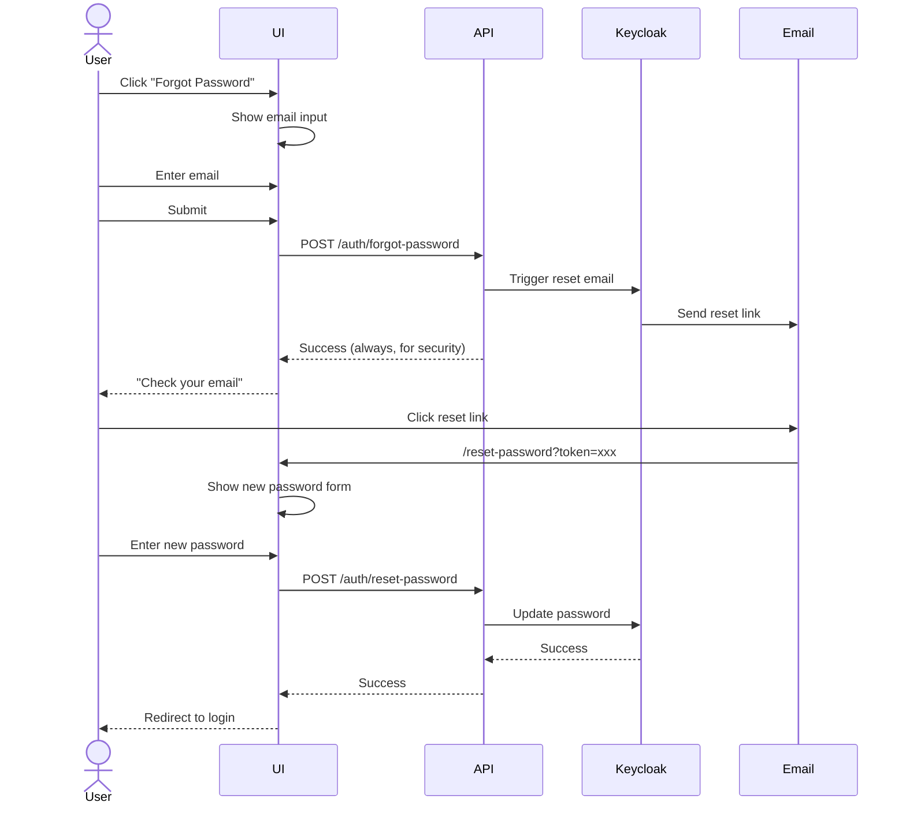
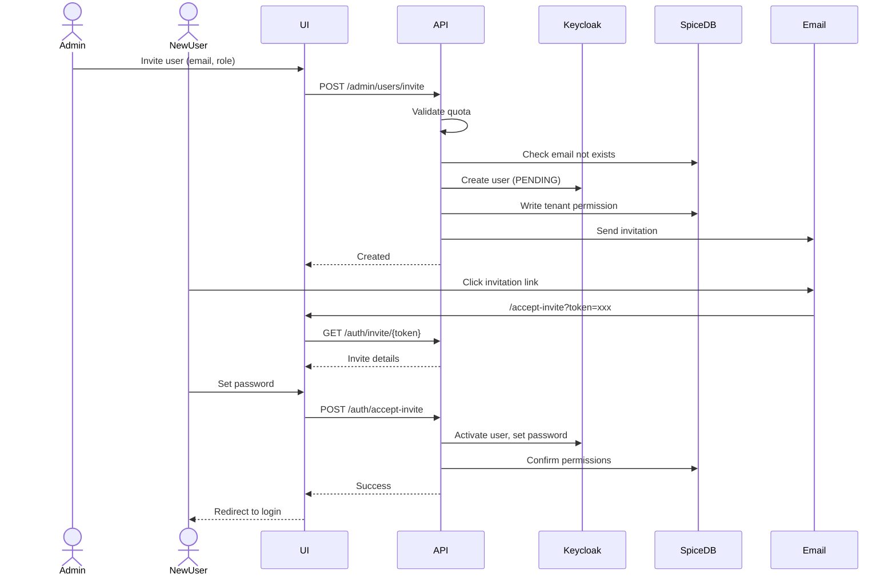

# SomaAgent01 — Merged Tasks & Requirements

**Document:** TASKS-MERGED-SOMAAGENT01.md  
**Version:** 1.0.0  
**Date:** 2026-01-03  
**Source:** Merged from all SRS files in somaAgent01

---

## Quick Reference

| Metric | Value |
|--------|-------|
| Total SRS Files | 35+ |
| Total UI Screens | 66 |
| Implemented | 12 (18%) |
| VIBE Compliance | 98% |
| Priority P0 Tasks | 18 |

---

## 1. Capsule System Tasks (P0)

### 1.1 AgentCapsuleCreator UI
| Task | Effort | Status |
|------|--------|--------|
| Create `<agent-capsule-creator>` root component | 1d | ❌ |
| Create `<capsule-identity-panel>` (Soul editor) | 1d | ❌ |
| Create `<capsule-capability-panel>` (Body editor) | 1d | ❌ |
| Create `<capsule-governance-panel>` (Constitution) | 0.5d | ❌ |
| Create `<capsule-preview-card>` (Summary) | 0.5d | ❌ |

### 1.2 Registry Service Tests
| Task | Effort | Status |
|------|--------|--------|
| Unit tests for `certify_capsule()` | 0.5d | ❌ |
| Unit tests for `verify_capsule_integrity()` | 0.5d | ❌ |
| Integration test: full signing flow | 1d | ❌ |

### 1.3 Security Improvements
| Task | Effort | Status |
|------|--------|--------|
| Vault integration for SOMA_REGISTRY_PRIVATE_KEY | 0.5d | ❌ |
| Add `parent_id` FK for version lineage | 0.5d | ❌ |
| Key rotation mechanism | 2d | ❌ |

---

## 2. Authentication Tasks (P0)

### 2.1 From SRS-AUTHENTICATION.md
| Task | Effort | Status |
|------|--------|--------|
| Complete SpiceDB permission decorators | 2h | ⚠️ Partial |
| Account lockout after 5 failures | 2h | ❌ |
| PKCE for OAuth code exchange | 2h | ❌ |
| Token blacklist on logout | 1h | ⚠️ Partial |

### 2.2 Session Management
| Task | Effort | Status |
|------|--------|--------|
| Redis-backed SessionManager | 3h | ❌ |
| Session statistics endpoint | 1h | ⚠️ Placeholder |
| Force logout all sessions | 1h | ⚠️ Placeholder |

---

## 3. Chat & Conversation Tasks (P0)

| Task | Effort | Status |
|------|--------|--------|
| Real ChatService with SomaBrain integration | 1d | ❌ |
| WebSocket consumer (Django Channels) | 2d | ❌ |
| Conversation persistence to PostgreSQL | 0.5d | ⚠️ Partial |
| Message streaming via SSE | 1d | ❌ |

---

## 4. Infrastructure UI Tasks (P1)

### 4.1 From SRS-MASTER-INDEX.md
| Screen | Route | Status |
|--------|-------|--------|
| Infrastructure Dashboard | `/platform/infrastructure` | ❌ |
| Redis Admin | `/platform/infrastructure/redis` | ❌ |
| Rate Limit Editor | `/platform/infrastructure/redis/ratelimits` | ❌ |
| Temporal Admin | `/platform/infrastructure/temporal` | ❌ |
| MCP Registry | `/platform/infrastructure/mcp` | ❌ |

### 4.2 Metrics Screens
| Screen | Route | Status |
|--------|-------|--------|
| Platform Metrics | `/platform/metrics` | ❌ |
| LLM Metrics | `/platform/metrics/llm` | ❌ |
| Tool Metrics | `/platform/metrics/tools` | ❌ |
| Memory Metrics | `/platform/metrics/memory` | ❌ |

---

## 5. Voice WebSocket (P1)

| Task | Effort | Status |
|------|--------|--------|
| Voice WebSocket consumer | 2d | ❌ Placeholder |
| Real-time audio streaming | 1d | ❌ |
| Whisper STT integration | 0.5d | ⚠️ |
| Kokoro TTS integration | 0.5d | ⚠️ |

---

## 6. Multi-tenant SaaS (P1)

### 6.1 From SRS-SAAS-TENANT-CREATION.md
| Task | Effort | Status |
|------|--------|--------|
| Tenant creation wizard (5 steps) | 2d | ⚠️ Partial |
| TenantSettings model | 0.5d | ❌ |
| Tenant usage tracking | 1d | ❌ |

### 6.2 From SRS-UNIFIED-SAAS.md
| Task | Effort | Status |
|------|--------|--------|
| StandAlone mode toggle | 0.5d | ✅ |
| SomaStackClusterMode detection | 0.5d | ✅ |
| Tenant isolation middleware | 1d | ✅ |

---

## 7. Implementation Phases

### Phase 1: Capsule System (Week 1-2)
- [ ] AgentCapsuleCreator UI components
- [ ] RegistryService tests
- [ ] Vault integration

### Phase 2: Auth Completion (Week 2-3)
- [ ] SessionManager
- [ ] SpiceDB decorators
- [ ] Account lockout

### Phase 3: Chat & Voice (Week 3-4)
- [ ] ChatService + WebSocket
- [ ] Voice streaming

### Phase 4: Infrastructure UI (Week 4-5)
- [ ] All `/platform/infrastructure/*` screens
- [ ] Metrics dashboards

---

## 8. Files to Create/Modify

| File | Action | Purpose |
|------|--------|---------|
| `webui/src/views/agent-capsule-creator.ts` | CREATE | Main UI |
| `admin/capsules/api/capsules.py` | IMPLEMENT | REST endpoints |
| `tests/unit/test_registry_service.py` | CREATE | Unit tests |
| `admin/common/session_manager.py` | CREATE | Redis sessions |
| `services/common/chat_service.py` | IMPLEMENT | SomaBrain integration |

---

**Total Effort Estimate:** 15-20 developer days

---

*END OF MERGED TASKS — SOMAAGENT01*
# Implementation Tasks — Phase 1: Foundation

**Phase:** 1 of 4  
**Priority:** P0 (Critical Path)  
**Duration:** 2-3 weeks

---

## 1. Database Schema (Django Models)

### 1.1 Core Models

| Task | Priority | Estimated | Dependencies |
|------|----------|-----------|--------------|
| Create `Tenant` model | P0 | 2h | None |
| Create `User` model extension | P0 | 2h | Tenant |
| Create `Agent` model | P0 | 3h | Tenant |
| Create `Subscription` model | P0 | 2h | Tenant |
| Create `SubscriptionTier` model | P0 | 1h | None |
| Create `AuditLog` model | P0 | 2h | User, Tenant |

### 1.2 Model Specifications

```python
# core/models.py

class Tenant(models.Model):
    id = models.UUIDField(primary_key=True, default=uuid.uuid4)
    name = models.CharField(max_length=100)
    slug = models.SlugField(unique=True)
    status = models.CharField(choices=TENANT_STATUS, default='active')
    subscription = models.ForeignKey('SubscriptionTier', on_delete=models.PROTECT)
    created_at = models.DateTimeField(auto_now_add=True)
    updated_at = models.DateTimeField(auto_now=True)
    settings = models.JSONField(default=dict)

class TenantUser(models.Model):
    user = models.ForeignKey('User', on_delete=models.CASCADE)
    tenant = models.ForeignKey('Tenant', on_delete=models.CASCADE)
    role = models.CharField(choices=TENANT_ROLES)
    status = models.CharField(choices=USER_STATUS)
    invited_by = models.ForeignKey('User', null=True)
    joined_at = models.DateTimeField(null=True)

class Agent(models.Model):
    id = models.UUIDField(primary_key=True, default=uuid.uuid4)
    tenant = models.ForeignKey('Tenant', on_delete=models.CASCADE)
    name = models.CharField(max_length=100)
    slug = models.SlugField()
    owner = models.ForeignKey('User', on_delete=models.PROTECT)
    status = models.CharField(choices=AGENT_STATUS)
    config = models.JSONField(default=dict)
    features = models.JSONField(default=dict)
    created_at = models.DateTimeField(auto_now_add=True)
    
    class Meta:
        unique_together = ['tenant', 'slug']

class SubscriptionTier(models.Model):
    """Actual implementation in admin/saas/models/tiers.py:15-135"""
    name = models.CharField(max_length=50, unique=True)
    slug = models.SlugField(max_length=50, unique=True)
    description = models.TextField(blank=True)
    base_price_cents = models.BigIntegerField(default=0)
    billing_interval = models.CharField(max_length=20, default='monthly')  # MONTHLY/YEARLY/WEEKLY
    lago_plan_code = models.CharField(max_length=100, blank=True)
    max_agents = models.IntegerField(default=1)
    max_users_per_agent = models.IntegerField(default=5)
    max_monthly_voice_minutes = models.IntegerField(default=60)
    max_monthly_api_calls = models.IntegerField(default=1000)
    max_storage_gb = models.DecimalField(max_digits=10, decimal_places=2, default=1.00)
    feature_defaults = models.JSONField(default=dict, blank=True)
    is_active = models.BooleanField(default=True)
    is_public = models.BooleanField(default=True)
    sort_order = models.IntegerField(default=0)
    created_at = models.DateTimeField(auto_now_add=True)
    updated_at = models.DateTimeField(auto_now=True)
```

### 1.3 Migrations

| Task | Priority | Files |
|------|----------|-------|
| Initial migration | P0 | `0001_initial.py` |
| Add indexes | P0 | `0002_add_indexes.py` |
| Add constraints | P0 | `0003_add_constraints.py` |

---

## 2. SpiceDB Schema

### 2.1 Schema Definition

| Task | Priority | Estimated |
|------|----------|-----------|
| Define platform schema | P0 | 1h |
| Define tenant schema | P0 | 2h |
| Define agent schema | P0 | 2h |
| Test permission checks | P0 | 3h |

### 2.2 Schema File

```zed
// spicedb/schema.zed

definition platform {}

definition saas_admin {
    relation platform: platform
    permission manage = platform
    permission manage_tenants = platform
    permission view_billing = platform
    permission configure = platform
    permission impersonate = platform
}

definition tenant {
    relation sysadmin: user
    relation admin: user
    relation developer: user
    relation trainer: user
    relation member: user
    relation viewer: user
    relation subscription: subscription_tier
    
    permission manage = sysadmin
    permission administrate = sysadmin + admin
    permission create_agent = sysadmin + admin
    permission develop = sysadmin + admin + developer
    permission train = sysadmin + admin + trainer
    permission use = develop + train + member
    permission view = use + viewer
}

definition agent {
    relation tenant: tenant
    relation owner: user
    relation admin: user
    relation developer: user
    relation trainer: user
    relation user: user
    relation viewer: user
    
    permission configure = owner + admin + tenant->administrate
    permission activate_adm = owner + admin
    permission activate_dev = configure + developer
    permission activate_trn = configure + trainer
    permission activate_std = activate_dev + activate_trn + user
    permission activate_ro = activate_std + viewer
    permission view = activate_ro
}
```

### 2.3 Integration

| Task | Priority | Estimated |
|------|----------|-----------|
| Create SpiceDB client wrapper | P0 | 2h |
| Create permission middleware | P0 | 3h |
| Create permission decorators | P0 | 2h |
| Write integration tests | P0 | 4h |

---

## 3. Keycloak Configuration

### 3.1 Realm Setup

| Task | Priority | Estimated |
|------|----------|-----------|
| Create `somaagent` realm | P0 | 1h |
| Configure Google OAuth | P0 | 1h |
| Configure GitHub OAuth | P0 | 1h |
| Enable MFA (TOTP) | P0 | 1h |
| Configure token lifetimes | P0 | 30m |
| Create client for Django | P0 | 1h |

### 3.2 Realm JSON

```json
{
  "realm": "somaagent",
  "enabled": true,
  "sslRequired": "external",
  "registrationAllowed": false,
  "loginWithEmailAllowed": true,
  "duplicateEmailsAllowed": false,
  "bruteForceProtected": true,
  "permanentLockout": false,
  "maxFailureWaitSeconds": 900,
  "minimumQuickLoginWaitSeconds": 60,
  "waitIncrementSeconds": 60,
  "quickLoginCheckMilliSeconds": 1000,
  "maxDeltaTimeSeconds": 43200,
  "failureFactor": 5,
  "accessTokenLifespan": 900,
  "accessTokenLifespanForImplicitFlow": 900,
  "ssoSessionIdleTimeout": 1800,
  "ssoSessionMaxLifespan": 36000,
  "offlineSessionIdleTimeout": 2592000,
  "accessCodeLifespan": 60,
  "accessCodeLifespanUserAction": 300,
  "accessCodeLifespanLogin": 1800,
  "requiredCredentials": ["password"],
  "otpPolicyType": "totp",
  "otpPolicyAlgorithm": "HmacSHA1",
  "otpPolicyDigits": 6,
  "otpPolicyPeriod": 30
}
```

---

## 4. Base Lit Components

### 4.1 Component Library

| Component | Priority | Estimated |
|-----------|----------|-----------|
| `saas-shell` (app shell) | P0 | 4h |
| `saas-nav` (navigation) | P0 | 3h |
| `saas-card` (stat card) | P0 | 2h |
| `saas-table` (data table) | P0 | 4h |
| `saas-modal` (dialog) | P0 | 3h |
| `saas-form` (form wrapper) | P0 | 3h |
| `saas-input` (form input) | P0 | 2h |
| `saas-button` (buttons) | P0 | 1h |
| `saas-toast` (notifications) | P0 | 2h |
| `saas-badge` (status badges) | P0 | 1h |

### 4.2 Design Tokens

> **Canonical Source:** [tokens.css](file:///Users/macbookpro201916i964gb1tb/Documents/GitHub/somaAgent01/webui/src/styles/tokens.css)

```css
/* somastack-tokens.css — aligned with canonical tokens.css */

:root {
  /* Backgrounds - Light Theme */
  --saas-bg-page: #f5f5f5;
  --saas-bg-card: #ffffff;
  --saas-bg-hover: #fafafa;
  
  /* Text - Light Theme */  
  --saas-text-primary: #1a1a1a;
  --saas-text-secondary: #666666;
  --saas-text-muted: #999999;
  
  /* Accent - Primary Action */
  --saas-accent: #1a1a1a;
  --saas-accent-hover: #333333;
  
  /* Status Colors */
  --saas-status-success: #22c55e;
  --saas-status-warning: #f59e0b;
  --saas-status-danger: #ef4444;
  --saas-status-info: #3b82f6;
  
  /* Spacing */
  --saas-space-xs: 4px;
  --saas-space-sm: 8px;
  --saas-space-md: 16px;
  --saas-space-lg: 24px;
  --saas-space-xl: 32px;
  
  /* Typography */
  --saas-font-sans: -apple-system, BlinkMacSystemFont, 'Segoe UI', Roboto, sans-serif;
  --saas-font-mono: 'JetBrains Mono', monospace;
  
  /* Borders */
  --saas-radius-sm: 4px;
  --saas-radius-md: 8px;
  --saas-radius-lg: 12px;
  --saas-radius-full: 9999px;
  --saas-border-color: #e2e8f0;
  
  /* Shadows */
  --saas-shadow-sm: 0 1px 2px 0 rgb(0 0 0 / 0.05);
  --saas-shadow-md: 0 4px 6px -1px rgb(0 0 0 / 0.1);
  --saas-shadow-lg: 0 10px 15px -3px rgb(0 0 0 / 0.1);
}
```

---

## 5. API Foundation

### 5.1 Django Ninja Setup

| Task | Priority | Estimated |
|------|----------|-----------|
| Create API app | P0 | 1h |
| Configure routers | P0 | 1h |
| Create auth middleware | P0 | 3h |
| Create error handlers | P0 | 2h |
| Create base schemas | P0 | 2h |
| Setup OpenAPI docs | P0 | 1h |

### 5.2 Base Configuration

```python
# api/main.py
from ninja import NinjaAPI
from ninja.security import HttpBearer

class JWTAuth(HttpBearer):
    async def authenticate(self, request, token):
        # Verify Keycloak JWT
        pass

api = NinjaAPI(
    title="SomaAgent API",
    version="2.0.0",
    auth=JWTAuth(),
    docs_url="/api/v2/docs",
)

# Include routers
api.add_router("/saas/", saas_router, tags=["Platform Admin"])
api.add_router("/admin/", admin_router, tags=["Tenant Admin"])
api.add_router("/agent/", agent_router, tags=["Agent Config"])
api.add_router("/chat/", chat_router, tags=["Chat"])
api.add_router("/memory/", memory_router, tags=["Memory"])
api.add_router("/voice/", voice_router, tags=["Voice"])
api.add_router("/auth/", auth_router, tags=["Authentication"])
```

---

## 6. Checklist

### Week 1
- [ ] Django project setup
- [ ] All models defined
- [ ] Initial migrations
- [ ] SpiceDB schema written
- [ ] SpiceDB client wrapper

### Week 2
- [ ] Keycloak realm configured
- [ ] OAuth providers setup
- [ ] JWT validation middleware
- [ ] Base API routers
- [ ] Error handling

### Week 3
- [ ] Base Lit components
- [ ] Design tokens CSS
- [ ] App shell component
- [ ] Navigation component
- [ ] Integration tests

---

**Next Phase:** [TASKS-PHASE2-AUTH.md](./TASKS-PHASE2-AUTH.md)
# Implementation Tasks — Phase 2: Authentication

**Phase:** 2 of 4  
**Priority:** P0 (Critical Path)  
**Duration:** 1-2 weeks  
**Dependencies:** Phase 1 complete

---

## 1. Login Flow

### 1.1 Backend Endpoints

| Endpoint | Method | Task | Estimated |
|----------|--------|------|-----------|
| `/auth/login` | POST | Email/password login | 3h |
| `/auth/logout` | POST | Revoke tokens | 2h |
| `/auth/refresh` | POST | Refresh access token | 2h |
| `/auth/me` | GET | Get current user | 1h |
| `/auth/google` | GET | Google OAuth redirect | 2h |
| `/auth/google/callback` | GET | Google OAuth callback | 3h |
| `/auth/github` | GET | GitHub OAuth redirect | 2h |
| `/auth/github/callback` | GET | GitHub OAuth callback | 3h |

### 1.2 Backend Implementation

```python
# api/routers/auth.py

@router.post("/login", response=TokenResponseSchema)
async def login(request, data: LoginSchema):
    """Email/password login via Keycloak."""
    try:
        tokens = await keycloak.token(
            grant_type="password",
            username=data.email,
            password=data.password,
        )
    except KeycloakAuthError as e:
        if e.error == "invalid_grant":
            raise AuthError("Invalid email or password")
        if e.error == "user_disabled":
            raise AuthError("Account disabled")
        raise
    
    # Set httpOnly cookies
    response = JSONResponse({"user": await get_user_info(tokens.access_token)})
    response.set_cookie(
        "access_token",
        tokens.access_token,
        httponly=True,
        secure=True,
        samesite="strict",
        max_age=900,
    )
    response.set_cookie(
        "refresh_token",
        tokens.refresh_token,
        httponly=True,
        secure=True,
        samesite="strict",
        max_age=604800,
    )
    return response

@router.post("/logout")
async def logout(request):
    """Logout and revoke tokens."""
    refresh_token = request.COOKIES.get("refresh_token")
    if refresh_token:
        await keycloak.logout(refresh_token)
    
    response = JSONResponse({"status": "logged_out"})
    response.delete_cookie("access_token")
    response.delete_cookie("refresh_token")
    return response
```

---

## 2. Frontend Login Component

### 2.1 Tasks

| Task | Priority | Estimated |
|------|----------|-----------|
| Create `saas-login.ts` component | P0 | 4h |
| Implement form validation | P0 | 2h |
| Add OAuth buttons | P0 | 2h |
| Handle error states | P0 | 2h |
| Add loading states | P0 | 1h |
| Implement remember me | P1 | 1h |

### 2.2 Component Structure

```typescript
// components/saas-login.ts
import { LitElement, html, css } from 'lit';
import { customElement, property, state } from 'lit/decorators.js';

@customElement('saas-login')
export class SaasLogin extends LitElement {
  @state() private loading = false;
  @state() private error = '';
  @property() redirectUrl = '/';
  
  static styles = css`
    :host {
      display: flex;
      align-items: center;
      justify-content: center;
      min-height: 100vh;
      background: var(--saas-bg-secondary);
    }
    
    .login-card {
      background: var(--saas-bg-primary);
      border-radius: var(--saas-radius-lg);
      box-shadow: var(--saas-shadow-lg);
      padding: var(--saas-space-8);
      width: 100%;
      max-width: 400px;
    }
    
    .error {
      background: #fef2f2;
      border: 1px solid #fecaca;
      color: #dc2626;
      padding: var(--saas-space-3);
      border-radius: var(--saas-radius-md);
      margin-bottom: var(--saas-space-4);
    }
  `;
  
  render() {
    return html`
      <div class="login-card">
        <h1>Sign in to SomaAgent</h1>
        
        ${this.error ? html`<div class="error">${this.error}</div>` : ''}
        
        <form @submit=${this.handleSubmit}>
          <saas-input
            type="email"
            name="email"
            label="Email"
            required
          ></saas-input>
          
          <saas-input
            type="password"
            name="password"
            label="Password"
            required
          ></saas-input>
          
          <label>
            <input type="checkbox" name="remember">
            Remember me
          </label>
          
          <saas-button type="submit" ?loading=${this.loading}>
            Sign In
          </saas-button>
        </form>
        
        <div class="divider">or</div>
        
        <saas-button variant="outline" @click=${this.handleGoogleLogin}>
          Sign in with Google
        </saas-button>
        
        <saas-button variant="outline" @click=${this.handleGithubLogin}>
          Sign in with GitHub
        </saas-button>
        
        <a href="/auth/forgot-password">Forgot password?</a>
      </div>
    `;
  }
  
  private async handleSubmit(e: Event) {
    e.preventDefault();
    this.loading = true;
    this.error = '';
    
    const form = e.target as HTMLFormElement;
    const data = new FormData(form);
    
    try {
      const response = await fetch('/api/v2/auth/login', {
        method: 'POST',
        headers: { 'Content-Type': 'application/json' },
        body: JSON.stringify({
          email: data.get('email'),
          password: data.get('password'),
        }),
      });
      
      if (!response.ok) {
        const error = await response.json();
        throw new Error(error.message || 'Login failed');
      }
      
      window.location.href = this.redirectUrl;
    } catch (err) {
      this.error = err.message;
    } finally {
      this.loading = false;
    }
  }
}
```

---

## 3. MFA Implementation

### 3.1 Tasks

| Task | Priority | Estimated |
|------|----------|-----------|
| Create MFA setup endpoint | P0 | 3h |
| Create MFA verify endpoint | P0 | 2h |
| Create `saas-mfa-setup.ts` | P0 | 4h |
| Create `saas-mfa-verify.ts` | P0 | 3h |
| Generate backup codes | P0 | 2h |
| Store backup codes (encrypted) | P0 | 2h |

### 3.2 Endpoints

```python
@router.get("/mfa/setup", response=MFASetupSchema)
async def mfa_setup(request):
    """Generate TOTP secret and QR code."""
    secret = pyotp.random_base32()
    totp = pyotp.TOTP(secret)
    
    # Generate QR code
    provisioning_uri = totp.provisioning_uri(
        name=request.user.email,
        issuer_name="SomaAgent"
    )
    
    qr = qrcode.make(provisioning_uri)
    qr_bytes = io.BytesIO()
    qr.save(qr_bytes, format='PNG')
    qr_b64 = base64.b64encode(qr_bytes.getvalue()).decode()
    
    # Store secret temporarily (not activated yet)
    await cache.set(f"mfa_pending:{request.user.id}", secret, ttl=600)
    
    return {
        "secret": secret,
        "qr_code": f"data:image/png;base64,{qr_b64}"
    }

@router.post("/mfa/verify", response=MFAVerifyResponseSchema)
async def mfa_verify(request, data: MFAVerifySchema):
    """Verify TOTP code and activate MFA."""
    secret = await cache.get(f"mfa_pending:{request.user.id}")
    if not secret:
        raise ValidationError("MFA setup expired. Start again.")
    
    totp = pyotp.TOTP(secret)
    if not totp.verify(data.code):
        raise ValidationError("Invalid code")
    
    # Activate MFA in Keycloak
    await keycloak.configure_totp(request.user.id, secret)
    
    # Generate backup codes
    backup_codes = [secrets.token_hex(4) for _ in range(10)]
    hashed_codes = [hashlib.sha256(c.encode()).hexdigest() for c in backup_codes]
    
    await User.objects.filter(id=request.user.id).update(
        mfa_enabled=True,
        mfa_backup_codes=hashed_codes,
    )
    
    await cache.delete(f"mfa_pending:{request.user.id}")
    
    return {
        "enabled": True,
        "backup_codes": backup_codes,  # Show once only!
    }
```

---

## 4. Session Management

### 4.1 Tasks

| Task | Priority | Estimated |
|------|----------|-----------|
| Create session store (Redis) | P0 | 2h |
| Token refresh middleware | P0 | 3h |
| Session invalidation | P0 | 2h |
| Active sessions list | P1 | 3h |
| Force logout other sessions | P1 | 2h |

### 4.2 Middleware

```python
# middleware/auth.py

class TokenRefreshMiddleware:
    """Automatically refresh expired access tokens."""
    
    async def __call__(self, request, call_next):
        access_token = request.COOKIES.get("access_token")
        refresh_token = request.COOKIES.get("refresh_token")
        
        if access_token:
            try:
                # Verify token
                claims = await verify_jwt(access_token)
                request.user = await get_user(claims["sub"])
            except TokenExpiredError:
                if refresh_token:
                    try:
                        # Refresh token
                        tokens = await keycloak.refresh(refresh_token)
                        claims = await verify_jwt(tokens.access_token)
                        request.user = await get_user(claims["sub"])
                        
                        # Update cookies in response
                        response = await call_next(request)
                        response.set_cookie("access_token", tokens.access_token, ...)
                        response.set_cookie("refresh_token", tokens.refresh_token, ...)
                        return response
                    except RefreshTokenExpiredError:
                        # Force re-login
                        return RedirectResponse("/login?expired=1")
                else:
                    return RedirectResponse("/login?expired=1")
        
        return await call_next(request)
```

---

## 5. Password Reset

### 5.1 Tasks

| Task | Priority | Estimated |
|------|----------|-----------|
| Create forgot password endpoint | P0 | 2h |
| Create reset password endpoint | P0 | 2h |
| Email template | P0 | 1h |
| Create `saas-forgot-password.ts` | P0 | 2h |
| Create `saas-reset-password.ts` | P0 | 2h |

### 5.2 Flow



---

## 6. Invitation Flow

### 6.1 Tasks

| Task | Priority | Estimated |
|------|----------|-----------|
| Create invitation endpoint | P0 | 3h |
| Create accept invitation endpoint | P0 | 3h |
| Invitation email template | P0 | 1h |
| Create `saas-accept-invite.ts` | P0 | 3h |
| Handle expired invitations | P0 | 1h |

### 6.2 Flow



---

## 7. Checklist

### Week 1
- [ ] Login endpoint (email/password)
- [ ] Google OAuth callback
- [ ] GitHub OAuth callback
- [ ] Logout endpoint
- [ ] Token refresh middleware
- [ ] `saas-login.ts` component

### Week 2
- [ ] MFA setup flow
- [ ] MFA verification
- [ ] Backup codes
- [ ] Password reset flow
- [ ] Invitation flow
- [ ] Session management

---

**Next Phase:** [TASKS-PHASE3-ADMIN.md](./TASKS-PHASE3-ADMIN.md)
# Implementation Tasks — Phase 3: Admin Interfaces

**Phase:** 3 of 4  
**Priority:** P0  
**Duration:** 2-3 weeks  
**Dependencies:** Phase 1-2 complete

---

## 1. SAAS Platform Admin

### 1.1 Endpoints

| Endpoint | Method | Task | Estimated |
|----------|--------|------|-----------|
| `/saas/stats` | GET | Platform statistics | 2h |
| `/saas/tenants` | GET | List tenants | 2h |
| `/saas/tenants` | POST | Create tenant | 4h |
| `/saas/tenants/{id}` | GET | Get tenant | 1h |
| `/saas/tenants/{id}` | PUT | Update tenant | 2h |
| `/saas/tenants/{id}` | DELETE | Delete tenant | 3h |
| `/saas/tenants/{id}/suspend` | POST | Suspend tenant | 2h |
| `/saas/tenants/{id}/impersonate` | POST | Impersonate | 3h |
| `/saas/subscriptions` | GET/PUT | Manage tiers | 3h |
| `/saas/billing/revenue` | GET | Revenue report | 3h |
| `/saas/health` | GET | System health | 2h |

### 1.2 Components

| Component | Screens | Estimated |
|-----------|---------|-----------|
| `saas-platform-dashboard.ts` | Dashboard | 6h |
| `saas-tenant-list.ts` | Tenant list | 4h |
| `saas-tenant-create.ts` | Create modal | 3h |
| `saas-tenant-detail.ts` | Tenant detail | 4h |
| `saas-subscription-tiers.ts` | Tier config | 4h |
| `saas-platform-health.ts` | Health dashboard | 4h |
| `saas-revenue-dashboard.ts` | Revenue charts | 5h |

---

## 2. Tenant Admin

### 2.1 Endpoints

| Endpoint | Method | Task | Estimated |
|----------|--------|------|-----------|
| `/admin/stats` | GET | Tenant stats | 2h |
| `/admin/users` | GET | List users | 2h |
| `/admin/users/invite` | POST | Invite user | 4h |
| `/admin/users/{id}` | GET/PUT/DELETE | User CRUD | 3h |
| `/admin/users/{id}/resend` | POST | Resend invite | 1h |
| `/admin/agents` | GET | List agents | 2h |
| `/admin/agents` | POST | Create agent | 5h |
| `/admin/agents/{id}` | GET/PUT | Agent config | 3h |
| `/admin/agents/{id}` | DELETE | Delete agent | 3h |
| `/admin/agents/{id}/start` | POST | Start agent | 2h |
| `/admin/agents/{id}/stop` | POST | Stop agent | 2h |
| `/admin/agents/{id}/users` | GET/POST/DELETE | Agent users | 3h |
| `/admin/settings` | GET/PUT | Tenant settings | 2h |
| `/admin/audit` | GET | Audit log | 3h |
| `/admin/usage` | GET | Usage stats | 3h |
| `/admin/billing` | GET | Billing info | 2h |
| `/admin/billing/upgrade` | POST | Upgrade plan | 4h |

### 2.2 Components

| Component | Screens | Estimated |
|-----------|---------|-----------|
| `saas-tenant-dashboard.ts` | Dashboard | 5h |
| `saas-users.ts` | User list | 4h |
| `saas-user-invite.ts` | Invite modal | 3h |
| `saas-user-detail.ts` | User detail | 3h |
| `saas-agents.ts` | Agent grid | 5h |
| `saas-agent-create.ts` | Create modal | 4h |
| `saas-agent-config.ts` | Config page | 6h |
| `saas-agent-users.ts` | Agent users | 3h |
| `saas-tenant-settings.ts` | Settings tabs | 5h |
| `saas-tenant-audit.ts` | Audit log | 4h |
| `saas-usage.ts` | Usage charts | 4h |
| `saas-tenant-billing.ts` | Billing page | 5h |

---

## 3. Quota Enforcement

### 3.1 Implementation

```python
# services/quota.py

class QuotaService:
    async def check_quota(
        self,
        tenant_id: str,
        resource: str,  # 'users', 'agents', 'tokens', 'storage'
    ) -> QuotaStatus:
        """Check if tenant is within quota limits."""
        tenant = await Tenant.objects.select_related('subscription').get(id=tenant_id)
        tier = tenant.subscription
        
        if resource == 'users':
            current = await TenantUser.objects.filter(tenant=tenant).count()
            limit = tier.max_users
        elif resource == 'agents':
            current = await Agent.objects.filter(tenant=tenant).count()
            limit = tier.max_agents
        elif resource == 'tokens':
            current = await self._get_token_usage(tenant_id)
            limit = tier.max_tokens_per_month
        elif resource == 'storage':
            current = await self._get_storage_usage(tenant_id)
            limit = tier.max_storage_gb * 1024 * 1024 * 1024  # bytes
        
        return QuotaStatus(
            resource=resource,
            current=current,
            limit=limit,
            exceeded=current >= limit,
            percentage=min(100, int(current / limit * 100)),
        )
    
    async def enforce_quota(self, tenant_id: str, resource: str):
        """Raise if quota exceeded."""
        status = await self.check_quota(tenant_id, resource)
        if status.exceeded:
            raise QuotaExceededError(
                f"{resource.title()} limit reached for your plan",
                current=status.current,
                limit=status.limit,
                upgrade_url="/admin/billing/upgrade",
            )
```

### 3.2 Tasks

| Task | Priority | Estimated |
|------|----------|-----------|
| QuotaService implementation | P0 | 4h |
| Integrate into user invite | P0 | 1h |
| Integrate into agent create | P0 | 1h |
| Quota warning UI component | P0 | 3h |
| Upgrade prompt modal | P0 | 2h |

---

## 4. Audit Logging

### 4.1 Implementation

```python
# services/audit.py

class AuditService:
    async def log(
        self,
        user_id: str,
        tenant_id: str,
        action: str,
        resource_type: str,
        resource_id: str,
        details: dict = None,
        ip_address: str = None,
    ):
        """Log an audit event."""
        await AuditLog.objects.create(
            id=uuid.uuid4(),
            user_id=user_id,
            tenant_id=tenant_id,
            action=action,
            resource_type=resource_type,
            resource_id=resource_id,
            details=details or {},
            ip_address=ip_address,
            timestamp=timezone.now(),
        )
        
        # Also emit to Kafka for real-time processing
        await kafka_producer.send(
            "audit-events",
            {
                "user_id": user_id,
                "tenant_id": tenant_id,
                "action": action,
                "resource": f"{resource_type}:{resource_id}",
                "timestamp": timezone.now().isoformat(),
            }
        )
```

### 4.2 Audit Actions

| Action | Trigger |
|--------|---------|
| `user.invite` | User invite sent |
| `user.accept` | User accepted invite |
| `user.remove` | User removed |
| `user.role_change` | Role changed |
| `agent.create` | Agent created |
| `agent.delete` | Agent deleted |
| `agent.configure` | Agent config changed |
| `agent.start` | Agent started |
| `agent.stop` | Agent stopped |
| `settings.update` | Settings changed |
| `billing.upgrade` | Plan upgraded |
| `billing.downgrade` | Plan downgraded |

---

## 5. Lago Billing Integration

### 5.1 Tasks

| Task | Priority | Estimated |
|------|----------|-----------|
| Lago API client | P0 | 4h |
| Create customer on tenant create | P0 | 2h |
| Subscribe to plan | P0 | 3h |
| Usage metering | P0 | 4h |
| Webhook receiver | P0 | 4h |
| Invoice display | P1 | 3h |
| Payment method update | P1 | 4h |

### 5.2 Webhook Handler

```python
# api/routers/webhooks.py

@router.post("/lago/webhook")
async def lago_webhook(request, data: dict):
    """Handle Lago billing events."""
    event_type = data.get("webhook_type")
    
    if event_type == "invoice.created":
        invoice = data["invoice"]
        tenant = await get_tenant_by_lago_customer(invoice["customer"]["external_id"])
        # Store invoice, send notification
        
    elif event_type == "invoice.payment_failed":
        invoice = data["invoice"]
        tenant = await get_tenant_by_lago_customer(invoice["customer"]["external_id"])
        # Send payment failed email
        # Start grace period
        
    elif event_type == "subscription.terminated":
        subscription = data["subscription"]
        tenant = await get_tenant_by_lago_customer(subscription["customer"]["external_id"])
        # Suspend tenant
        
    return {"status": "ok"}
```

---

## 6. Checklist

### Week 1
- [ ] SAAS platform dashboard
- [ ] Tenant list/create/edit
- [ ] Tenant suspend/delete
- [ ] Impersonation flow
- [ ] Health dashboard

### Week 2
- [ ] Tenant dashboard
- [ ] User management (list/invite/roles)
- [ ] Agent management (list/create)
- [ ] Agent config page
- [ ] Quota enforcement

### Week 3
- [ ] Tenant settings
- [ ] Audit log
- [ ] Billing page
- [ ] Lago integration
- [ ] Usage dashboard

---

**Next Phase:** [TASKS-PHASE4-AGENT.md](./TASKS-PHASE4-AGENT.md)
