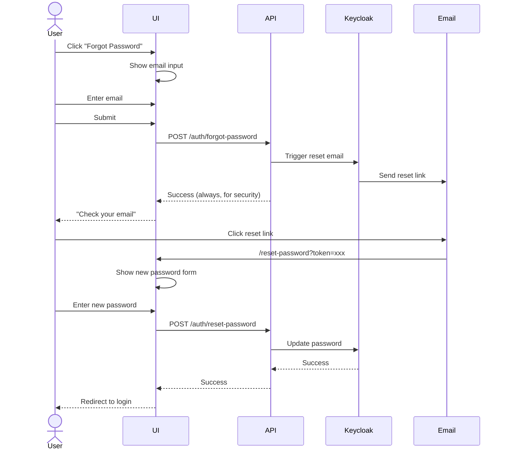
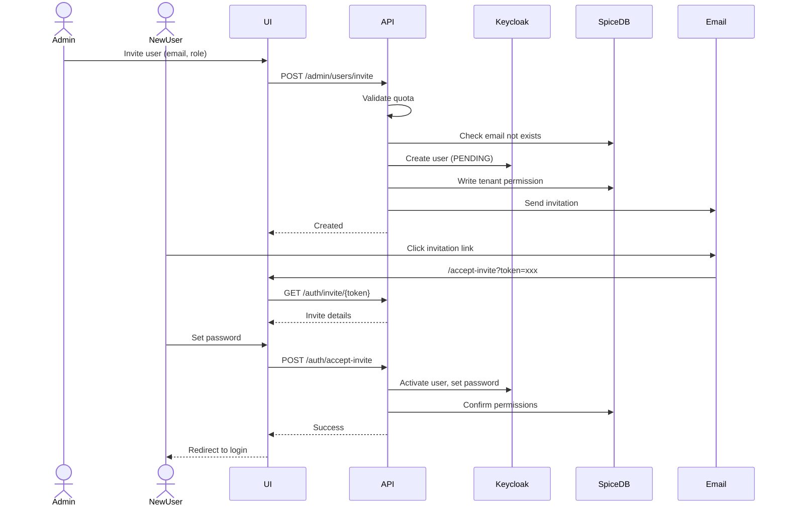

# Implementation Tasks — Phase 2: Authentication

**Phase:** 2 of 4  
**Priority:** P0 (Critical Path)  
**Duration:** 1-2 weeks  
**Dependencies:** Phase 1 complete

---

## 1. Login Flow

### 1.1 Backend Endpoints

| Endpoint | Method | Task | Estimated |
|----------|--------|------|-----------|
| `/auth/login` | POST | Email/password login | 3h |
| `/auth/logout` | POST | Revoke tokens | 2h |
| `/auth/refresh` | POST | Refresh access token | 2h |
| `/auth/me` | GET | Get current user | 1h |
| `/auth/google` | GET | Google OAuth redirect | 2h |
| `/auth/google/callback` | GET | Google OAuth callback | 3h |
| `/auth/github` | GET | GitHub OAuth redirect | 2h |
| `/auth/github/callback` | GET | GitHub OAuth callback | 3h |

### 1.2 Backend Implementation

```python
# api/routers/auth.py

@router.post("/login", response=TokenResponseSchema)
async def login(request, data: LoginSchema):
    """Email/password login via Keycloak."""
    try:
        tokens = await keycloak.token(
            grant_type="password",
            username=data.email,
            password=data.password,
        )
    except KeycloakAuthError as e:
        if e.error == "invalid_grant":
            raise AuthError("Invalid email or password")
        if e.error == "user_disabled":
            raise AuthError("Account disabled")
        raise
    
    # Set httpOnly cookies
    response = JSONResponse({"user": await get_user_info(tokens.access_token)})
    response.set_cookie(
        "access_token",
        tokens.access_token,
        httponly=True,
        secure=True,
        samesite="strict",
        max_age=900,
    )
    response.set_cookie(
        "refresh_token",
        tokens.refresh_token,
        httponly=True,
        secure=True,
        samesite="strict",
        max_age=604800,
    )
    return response

@router.post("/logout")
async def logout(request):
    """Logout and revoke tokens."""
    refresh_token = request.COOKIES.get("refresh_token")
    if refresh_token:
        await keycloak.logout(refresh_token)
    
    response = JSONResponse({"status": "logged_out"})
    response.delete_cookie("access_token")
    response.delete_cookie("refresh_token")
    return response
```

---

## 2. Frontend Login Component

### 2.1 Tasks

| Task | Priority | Estimated |
|------|----------|-----------|
| Create `saas-login.ts` component | P0 | 4h |
| Implement form validation | P0 | 2h |
| Add OAuth buttons | P0 | 2h |
| Handle error states | P0 | 2h |
| Add loading states | P0 | 1h |
| Implement remember me | P1 | 1h |

### 2.2 Component Structure

```typescript
// components/saas-login.ts
import { LitElement, html, css } from 'lit';
import { customElement, property, state } from 'lit/decorators.js';

@customElement('saas-login')
export class SaasLogin extends LitElement {
  @state() private loading = false;
  @state() private error = '';
  @property() redirectUrl = '/';
  
  static styles = css`
    :host {
      display: flex;
      align-items: center;
      justify-content: center;
      min-height: 100vh;
      background: var(--saas-bg-secondary);
    }
    
    .login-card {
      background: var(--saas-bg-primary);
      border-radius: var(--saas-radius-lg);
      box-shadow: var(--saas-shadow-lg);
      padding: var(--saas-space-8);
      width: 100%;
      max-width: 400px;
    }
    
    .error {
      background: #fef2f2;
      border: 1px solid #fecaca;
      color: #dc2626;
      padding: var(--saas-space-3);
      border-radius: var(--saas-radius-md);
      margin-bottom: var(--saas-space-4);
    }
  `;
  
  render() {
    return html`
      <div class="login-card">
        <h1>Sign in to SomaAgent</h1>
        
        ${this.error ? html`<div class="error">${this.error}</div>` : ''}
        
        <form @submit=${this.handleSubmit}>
          <saas-input
            type="email"
            name="email"
            label="Email"
            required
          ></saas-input>
          
          <saas-input
            type="password"
            name="password"
            label="Password"
            required
          ></saas-input>
          
          <label>
            <input type="checkbox" name="remember">
            Remember me
          </label>
          
          <saas-button type="submit" ?loading=${this.loading}>
            Sign In
          </saas-button>
        </form>
        
        <div class="divider">or</div>
        
        <saas-button variant="outline" @click=${this.handleGoogleLogin}>
          Sign in with Google
        </saas-button>
        
        <saas-button variant="outline" @click=${this.handleGithubLogin}>
          Sign in with GitHub
        </saas-button>
        
        <a href="/auth/forgot-password">Forgot password?</a>
      </div>
    `;
  }
  
  private async handleSubmit(e: Event) {
    e.preventDefault();
    this.loading = true;
    this.error = '';
    
    const form = e.target as HTMLFormElement;
    const data = new FormData(form);
    
    try {
      const response = await fetch('/api/v2/auth/login', {
        method: 'POST',
        headers: { 'Content-Type': 'application/json' },
        body: JSON.stringify({
          email: data.get('email'),
          password: data.get('password'),
        }),
      });
      
      if (!response.ok) {
        const error = await response.json();
        throw new Error(error.message || 'Login failed');
      }
      
      window.location.href = this.redirectUrl;
    } catch (err) {
      this.error = err.message;
    } finally {
      this.loading = false;
    }
  }
}
```

---

## 3. MFA Implementation

### 3.1 Tasks

| Task | Priority | Estimated |
|------|----------|-----------|
| Create MFA setup endpoint | P0 | 3h |
| Create MFA verify endpoint | P0 | 2h |
| Create `saas-mfa-setup.ts` | P0 | 4h |
| Create `saas-mfa-verify.ts` | P0 | 3h |
| Generate backup codes | P0 | 2h |
| Store backup codes (encrypted) | P0 | 2h |

### 3.2 Endpoints

```python
@router.get("/mfa/setup", response=MFASetupSchema)
async def mfa_setup(request):
    """Generate TOTP secret and QR code."""
    secret = pyotp.random_base32()
    totp = pyotp.TOTP(secret)
    
    # Generate QR code
    provisioning_uri = totp.provisioning_uri(
        name=request.user.email,
        issuer_name="SomaAgent"
    )
    
    qr = qrcode.make(provisioning_uri)
    qr_bytes = io.BytesIO()
    qr.save(qr_bytes, format='PNG')
    qr_b64 = base64.b64encode(qr_bytes.getvalue()).decode()
    
    # Store secret temporarily (not activated yet)
    await cache.set(f"mfa_pending:{request.user.id}", secret, ttl=600)
    
    return {
        "secret": secret,
        "qr_code": f"data:image/png;base64,{qr_b64}"
    }

@router.post("/mfa/verify", response=MFAVerifyResponseSchema)
async def mfa_verify(request, data: MFAVerifySchema):
    """Verify TOTP code and activate MFA."""
    secret = await cache.get(f"mfa_pending:{request.user.id}")
    if not secret:
        raise ValidationError("MFA setup expired. Start again.")
    
    totp = pyotp.TOTP(secret)
    if not totp.verify(data.code):
        raise ValidationError("Invalid code")
    
    # Activate MFA in Keycloak
    await keycloak.configure_totp(request.user.id, secret)
    
    # Generate backup codes
    backup_codes = [secrets.token_hex(4) for _ in range(10)]
    hashed_codes = [hashlib.sha256(c.encode()).hexdigest() for c in backup_codes]
    
    await User.objects.filter(id=request.user.id).update(
        mfa_enabled=True,
        mfa_backup_codes=hashed_codes,
    )
    
    await cache.delete(f"mfa_pending:{request.user.id}")
    
    return {
        "enabled": True,
        "backup_codes": backup_codes,  # Show once only!
    }
```

---

## 4. Session Management

### 4.1 Tasks

| Task | Priority | Estimated |
|------|----------|-----------|
| Create session store (Redis) | P0 | 2h |
| Token refresh middleware | P0 | 3h |
| Session invalidation | P0 | 2h |
| Active sessions list | P1 | 3h |
| Force logout other sessions | P1 | 2h |

### 4.2 Middleware

```python
# middleware/auth.py

class TokenRefreshMiddleware:
    """Automatically refresh expired access tokens."""
    
    async def __call__(self, request, call_next):
        access_token = request.COOKIES.get("access_token")
        refresh_token = request.COOKIES.get("refresh_token")
        
        if access_token:
            try:
                # Verify token
                claims = await verify_jwt(access_token)
                request.user = await get_user(claims["sub"])
            except TokenExpiredError:
                if refresh_token:
                    try:
                        # Refresh token
                        tokens = await keycloak.refresh(refresh_token)
                        claims = await verify_jwt(tokens.access_token)
                        request.user = await get_user(claims["sub"])
                        
                        # Update cookies in response
                        response = await call_next(request)
                        response.set_cookie("access_token", tokens.access_token, ...)
                        response.set_cookie("refresh_token", tokens.refresh_token, ...)
                        return response
                    except RefreshTokenExpiredError:
                        # Force re-login
                        return RedirectResponse("/login?expired=1")
                else:
                    return RedirectResponse("/login?expired=1")
        
        return await call_next(request)
```

---

## 5. Password Reset

### 5.1 Tasks

| Task | Priority | Estimated |
|------|----------|-----------|
| Create forgot password endpoint | P0 | 2h |
| Create reset password endpoint | P0 | 2h |
| Email template | P0 | 1h |
| Create `saas-forgot-password.ts` | P0 | 2h |
| Create `saas-reset-password.ts` | P0 | 2h |

### 5.2 Flow



---

## 6. Invitation Flow

### 6.1 Tasks

| Task | Priority | Estimated |
|------|----------|-----------|
| Create invitation endpoint | P0 | 3h |
| Create accept invitation endpoint | P0 | 3h |
| Invitation email template | P0 | 1h |
| Create `saas-accept-invite.ts` | P0 | 3h |
| Handle expired invitations | P0 | 1h |

### 6.2 Flow



---

## 7. Checklist

### Week 1
- [ ] Login endpoint (email/password)
- [ ] Google OAuth callback
- [ ] GitHub OAuth callback
- [ ] Logout endpoint
- [ ] Token refresh middleware
- [ ] `saas-login.ts` component

### Week 2
- [ ] MFA setup flow
- [ ] MFA verification
- [ ] Backup codes
- [ ] Password reset flow
- [ ] Invitation flow
- [ ] Session management

---

**Next Phase:** [TASKS-PHASE3-ADMIN.md](./TASKS-PHASE3-ADMIN.md)
