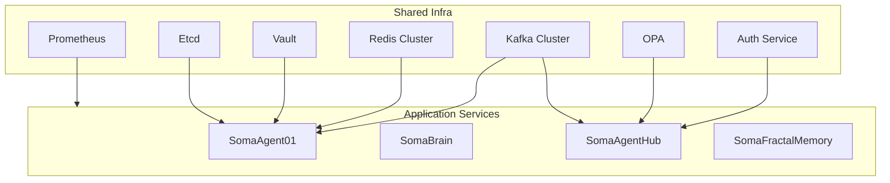

# SomaAgent01 Architecture Overview

This document captures the current service layout, target consolidation, and implementation roadmap for the Soma stack as of 2025-10-15. It supersedes earlier partial diagrams and aligns with code paths in `services/`, `common/`, and `infra/`.

## 1. Service Landscape Snapshot

| Alias | Repository components | Owner | Primary protocol | Typical ports | Status |
| ----- | --------------------- | ----- | ---------------- | ------------- | ------ |
| SA01 (SomaAgent01) | `agent.py`, `services/conversation_worker/main.py`, `services/gateway/main.py` | Agents | gRPC (high-throughput) | **50051** (planned) | gRPC stubs present; HTTP gateway on 8010 still active |
| SB (SomaBrain) | external HTTP API (`SOMA_BASE_URL`) | Memory | HTTP | **9696** | Externalized; services call SomaBrain directly |
| SAH (SomaAgentHub) | `services/ui/main.py`, `run_ui.py` | Experience | FastAPI (HTTP) | **8080** | Running via `agent-ui` and `gateway` services |
| SMF (SomaFractalMemory) | future `qdrant` add-on | Knowledge | Async HTTP | **50053** / **6333-6334** | Planned profile (not yet in compose) |
| Auth | `infra/helm/soma-infra/charts/auth` | Platform | HTTP | **8080** | Helm chart deployed cluster-wide |
| OPA | `services/common/policy_client.py`, compose `opa` service | Platform | HTTP | **8181** | Deployed in compose and Helm |
| Kafka | `docker-compose.yaml` | Platform | TCP | **9092** | Single node in compose, 3-node StatefulSet in Helm |
| Redis | `docker-compose.yaml` | Platform | TCP | **6379** | Single instance; cluster planned |
| Prometheus | `infra/observability/prometheus.yml` | Platform | HTTP | **9090** | Live in compose and Helm |
<!-- Grafana removed: dashboards live in external project -->
| Vault | future compose add-on | Platform | HTTP | **8200** | Dev mode compose; Helm chart forthcoming |
| Etcd | `infra/helm/soma-infra/charts/etcd` | Platform | HTTP | **2379** | Placeholder chart available |

The stack currently runs four application services plus twelve infrastructure containers under Docker Compose. Consolidation work reduces duplication between local and cluster deployments.

## 2. Shared Infrastructure Goal

### 2.1 Target State

Shared services (Auth, OPA, Kafka, Redis, Prometheus, Vault, Etcd) run once per cluster inside the `soma-infra` namespace. Applications reference them via Kubernetes DNS (`*.soma.svc.cluster.local`).

| Service | Deployment strategy | Repository anchor | Rationale |
| ------- | ------------------- | ----------------- | --------- |
| Auth | Deployment + Service | `infra/helm/soma-infra/charts/auth` | Centralize signing keys |
| OPA | Deployment with sidecar | `infra/helm/soma-infra/charts/opa` | Prevent policy drift |
| Kafka | StatefulSet (3 nodes) | `infra/helm/soma-infra/charts/kafka` | Shared event backbone |
| Redis | RedisCluster (6 pods) | `infra/helm/soma-infra/charts/redis` | Shared cache and rate limiting |
| Prometheus | Operator + Deployment | `infra/helm/soma-infra/charts/prometheus` | Metrics and alerting; dashboards external |
| Vault | Deployment + Agent injector | `infra/helm/soma-infra/charts/vault` | Single secret source |
| Etcd | StatefulSet | `infra/helm/soma-infra/charts/etcd` | Feature flag backend |

### 2.2 Resulting Footprint

- Application services: 4.
- Infra services: 7 shared deployments.
- Pods per environment: ~25 (down from 40).

## 3. Repository Alignment Plan

```
agent-zero/
  services/
    conversation_worker/
    gateway/
    # memory_service (deprecated; removed)
    tool_executor/
    ui/
  infra/
    docker-compose.yaml
    helm/
      soma-infra/
      soma-stack/
  docs/
    technical-manual/architecture.md (this file)
```

Planned adjustments:

1. Introduce service-specific subdirectories (`services/sa01`, etc.) as we modularize entrypoints.
2. Ensure `infra/helm/soma-stack` consumes the shared infra chart and removes duplicated settings.
3. Keep `common/` as the shared client library for configuration, telemetry, and memory access.

## 4. Configuration Baseline

All services load shared settings via `common/config/settings.py`. SA01 overrides live in `services/common/settings_sa01.py`.

**Key defaults:**
- Kafka: `kafka.soma.svc.cluster.local:9092`
- Redis: `redis.soma.svc.cluster.local:6379`
- Postgres: `postgres.soma.svc.cluster.local:5432`
- OPA: `http://opa.soma.svc.cluster.local:8181`
- Auth: `http://auth.soma.svc.cluster.local:8080`
- Etcd: `etcd.soma.svc.cluster.local:2379`
- Metrics: Prometheus scrape endpoints defined in `infra/observability/prometheus.yml`

## 5. Deployment Model

| Layer | Tooling | Outcome |
| ----- | ------- | ------- |
| Cluster | Managed Kubernetes (EKS/GKE/AKS) | Scalable, managed control plane |
| GitOps | Argo CD tracking `infra/helm` | Declarative rollouts, audit trail |
| Packaging | Helm chart `soma-stack` + `soma-infra` dependency | Single artifact per environment |
| Traffic | Istio weighted routing | Safe canaries and blue/green |
| CI/CD | `.github/workflows/ci.yml` | Lint, test, Kind-based Helm install |

## 6. Observability Stack

- Metrics: `/metrics` exposed on FastAPI workers, scraped by Prometheus.
- Tracing: OpenTelemetry exporters configured via `common/utils/trace.py` to Jaeger.
- Logging: JSON logs ingested by Loki via Promtail (Helm update pending).
- Alerting: Alertmanager rules for latency (>200 ms), error rate (>1%), Kafka lag (>5k).

## 7. Resource Footprint

| Category | Before | Target |
| -------- | ------ | ------ |
| Application services | 4 | 4 |
| Infra services | 12 | 7 |
| Pods | 30-40 | 20-25 |
| Helm releases | 16 | 5 |

## 8. Implementation Roadmap

1. Finish provider SDK skeleton under `common/provider_sdk/`.
2. Complete Vault and Etcd Helm charts with production values.
3. Extend CI to run Kind-based installs and smoke tests (`scripts/smoke_test.py`).
4. Update runbooks in the [Operations Manual](../development-manual/runbooks.md) after each deployment milestone.

## 9. Mermaid Diagram



## 10. Verification Checklist

- [ ] Diagram renders via MkDocs and linted with `markdownlint`.
- [ ] Service matrix matches `docker-compose.yaml`.
- [ ] Helm values align with `infra/helm/soma-infra`.
<!-- Roadmap items are tracked in release notes and changelog. -->
