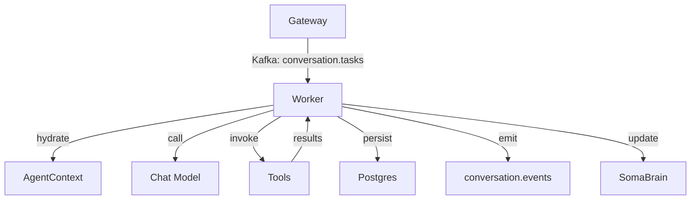
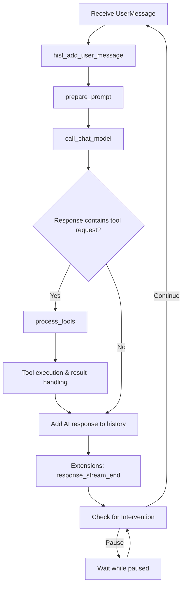
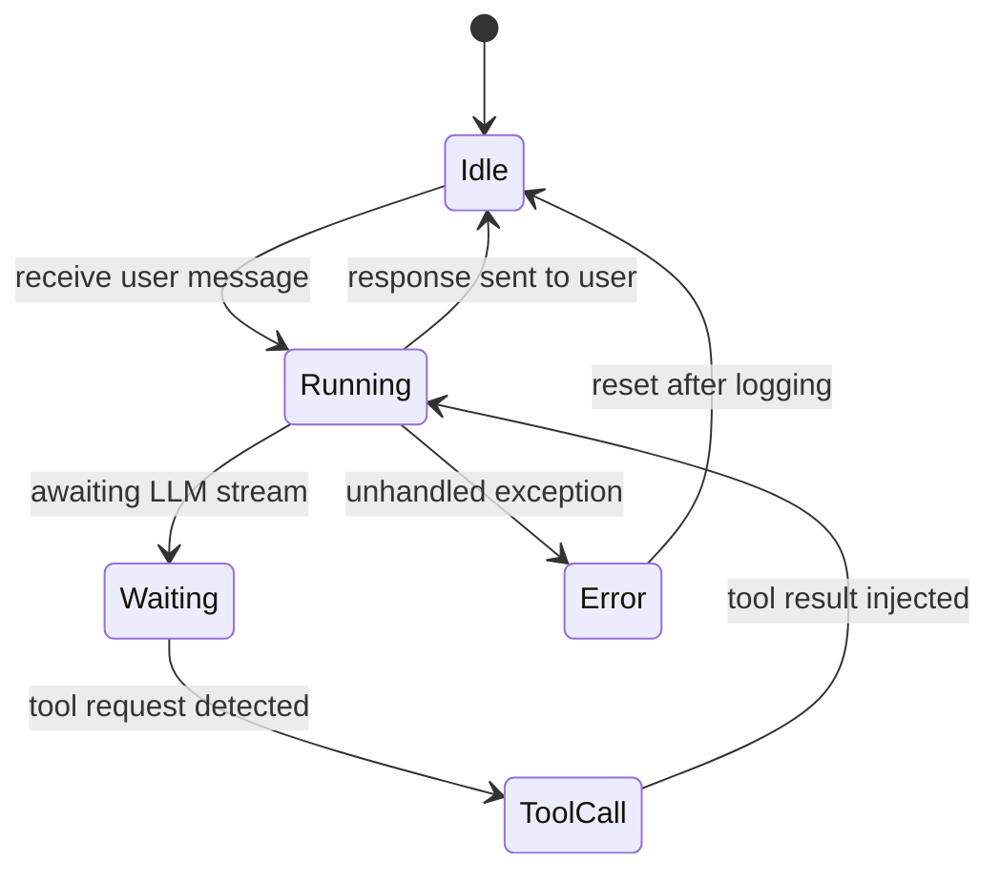

# Conversation Worker

## Mission

Process conversation tasks emitted by the Gateway, orchestrate tool execution, and persist responses back to the timeline while respecting rate limits and extension hooks.

## Module Layout

| Module | Description |
| --- | --- |
| `services/conversation_worker/main.py` | Async consumer loop, task deserialization, health probes |
| `agent.py` | Core monologue loop, extensions, agent context management |
| `python/helpers/rate_limiter.py` | Sliding-window limiter for requests and token budgets |
| `python/helpers/settings.py` | Provider configuration, tenant overrides |
| `python/helpers/extension.py` | Lifecycle hooks invoked around the loop |

## Message Loop Lifecycle

## Rate Limiting

- `RateLimiter` tracks configurable counters (`*_rl_requests`, `*_rl_input`, `*_rl_output`).
- Before each model invocation the worker calls `allow`/`wait` ensuring budgets are respected.
- Breaches trigger progress updates surfaced through `AgentContext.log.set_progress` so UI clients show a waiting bar.
- Limits configurable per model family via `python/helpers/settings.py` and tenant overrides.

## Extension Hooks

| Hook | Purpose |
| --- | --- |
| `monologue_start` | Observe loop start with inbound payload |
| `before_main_llm_call` | Mutate prompts or settings before provider invocation |
| `tool_execute_before` / `tool_execute_after` | Wrap tool execution for auditing |
| `response_stream_chunk` | Stream tokens to downstream observers |
| `monologue_end` | Cleanup and finalize transcripts |

Extensions receive the shared `loop_data` object, allowing feature teams to add observers without touching core logic.

## Configuration

- Environment toggles (sample): `CONVERSATION_MAX_TOKENS`, `CONVERSATION_RETRY_LIMIT`.
- Kafka topics: `conversation.tasks` (consume), `conversation.events` (produce).
- Dependencies resolved via `python/helpers/settings.py` (LLM provider, tool registry, memory adapters).

## Observability

- Metrics: message throughput, tool latency, retry counts (`/metrics` endpoint when `PROMETHEUS_ENABLE=1`).
- Logs: structured JSON with `conversation_id`, `task_id`, `tenant_id`.
- Traces: optional OTEL spans around LLM calls and tool execution if exporter configured.

## Verification Checklist

- [ ] Run `pytest tests/rate_limiter_test.py` to confirm loop throttling.
- [ ] Kafka lag < 100 for `conversation.tasks` under standard load test.
- [ ] Tool invocation breadcrumbs visible in logs and metrics.
