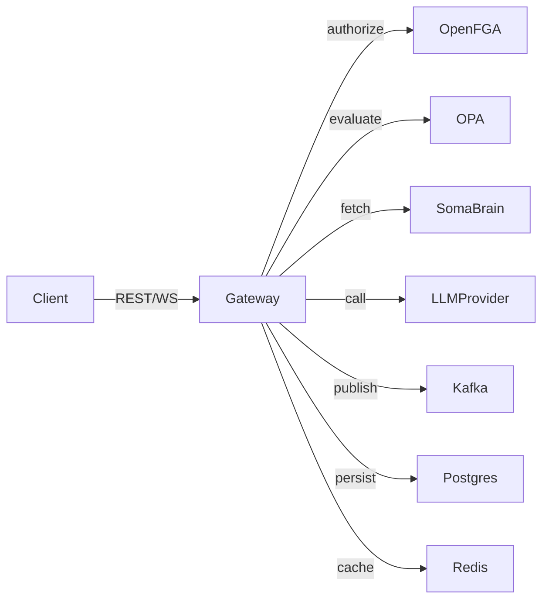

# Gateway Component

## Purpose

- Serves as the primary ingress for HTTP/WebSocket traffic (humans, agents, automations).
- Enforces authentication, authorization, and policy controls before delegating to LLMs or tools.
- Orchestrates conversation flow: context assembly, tool invocation, memory persistence.

## Module Structure

| Module | Key Responsibilities |
| --- | --- |
| `services/gateway/main.py` | FastAPI app, endpoints, metrics, SSE/WS, capsule proxy |
| `services/gateway/auth/openfga.py` | Relationship tuples, access checks |
| `services/gateway/policies/opa_client.py` | Rego policy evaluation |
| `services/gateway/memory/service.py` | SomaBrain reads/writes |
| `services/gateway/tasks/publisher.py` | Kafka publishing helpers |

## Request Lifecycle

1. **Ingress:** Request hits FastAPI dependency stack (auth, tenant resolution).
2. **Policy:** OpenFGA checks relationship tuples; OPA enforces budgets/quotas.
3. **Context:** Gateway fetches session transcript, memories, tenant defaults.
4. **LLM Call:** Provider info comes from `python/helpers/settings.py` and LiteLLM wrapper.
5. **Tooling:** Responses containing tool directives emit Kafka messages or call tool executor.
6. **Persistence:** Updated session state stored in Postgres; new memories saved to SomaBrain.
7. **Streaming:** WebSocket clients receive partial responses and status events.

## Configuration

- `GATEWAY_REQUIRE_AUTH`, `POSTGRES_DSN`, `KAFKA_BOOTSTRAP_SERVERS`, `OPENFGA_*`.
- Settings API merges defaults from `python/helpers/settings.py` with user overrides.
- `dev` profile enables auto-reload and verbose logging.

## Observability

- Metrics: request latency, response codes, circuit breaker counters at `/metrics`.
- Logs: structured JSON per request.
- Traces: optional OTEL instrumentation via environment variables.

## Failure Modes & Mitigations

| Failure | Symptom | Mitigation |
| --- | --- | --- |
| Redis unavailable | Rate limit errors, cache misses | Gateway falls back to Postgres fetches; retries with backoff |
| LLM provider errors | 5xx streaming to UI | Circuit breaker triggers; Gateway surfaces actionable message |
| Kafka publish failure | Tool executions stall | Dead-letter queue records message; operator restarts broker |
| OpenFGA connectivity | 403 responses for all requests | Cached decisions used briefly; escalate to SRE |

## Extensibility

- Add routers under `services/gateway/routes/` and include via FastAPI.
- Define new tool schemas in `python/tools/schema/` and map to executor tasks.
- Update `conf/tenants.yaml` for tenant-specific budgets or prompts.

## Public Endpoints

- POST `/v1/session/message`
- POST `/v1/session/action`
- GET `/v1/session/{session_id}/events` (SSE)
- WS `/v1/session/{session_id}/stream`
- GET `/v1/health` (also `/health` alias, hidden from schema)
- API keys: POST `/v1/keys`, GET `/v1/keys`, DELETE `/v1/keys/{key_id}`
- Model profiles: GET/POST/PUT/DELETE under `/v1/model-profiles`
- Routing: POST `/v1/route`
- Requeue: GET `/v1/requeue`, POST `/v1/requeue/{id}/resolve`, DELETE `/v1/requeue/{id}`
- Capsules proxy: GET `/v1/capsules`, GET `/v1/capsules/{id}`, POST `/v1/capsules/{id}/install`

Nonexistent (do not document under gateway): `/chat`, `/settings_get`, `/settings_set`, `/realtime_session`.

## Verification Checklist

- [ ] `curl http://localhost:8010/health` returns 200.
- [ ] Integration suite passes.
- [ ] Prometheus shows Gateway targets UP.
