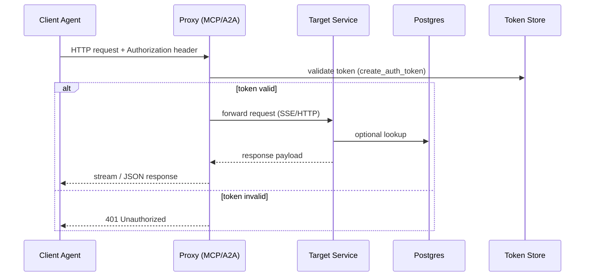

# MCP & A2A Proxy

## Mission

Expose Model-Context-Protocol (MCP) and Agent-to-Agent (A2A) capabilities through a thin proxy that reuses gateway authentication, keeps secrets server-side, and forwards only validated requests to downstream services.

## Implementation Highlights

- Entry points live in `python/helpers/mcp_handler.py` and `python/helpers/fasta2a_server.py`.
- `DynamicMcpProxy` and `DynamicA2AProxy` reload provider definitions at runtime, enabling tenants to register servers without restarts.
- Tokens combine runtime IDs with optional operator credentials (`create_auth_token`).
- Forwarded requests inherit gateway tracing headers so observability spans remain stitched.

## Configuration

- Tenants register MCP endpoints under `conf/tenants.yaml` (`mcp.endpoints`, `a2a.endpoints`).
- Secrets resolved from Vault via `python/helpers/secrets.py` to avoid leaking keys to clients.
- Toggle availability through `settings.mcp_enabled` and `settings.a2a_enabled` per tenant.

## Security Considerations

- All traffic passes through the gateway FastAPI process; no direct exposure of downstream hosts.
- Tokens scoped per tenant and expire based on settings (`settings.mcp_token_ttl_seconds`).
- Proxy enforces allowlists for HTTP methods and maximum payload sizes.

## Verification Checklist

- [ ] `pytest tests/test_fasta2a_client.py` passes.
- [ ] Tenant configuration updates hot-reload without restart.
- [ ] Audit logs record proxy invocations with `mcp_proxy` or `a2a_proxy` labels.
