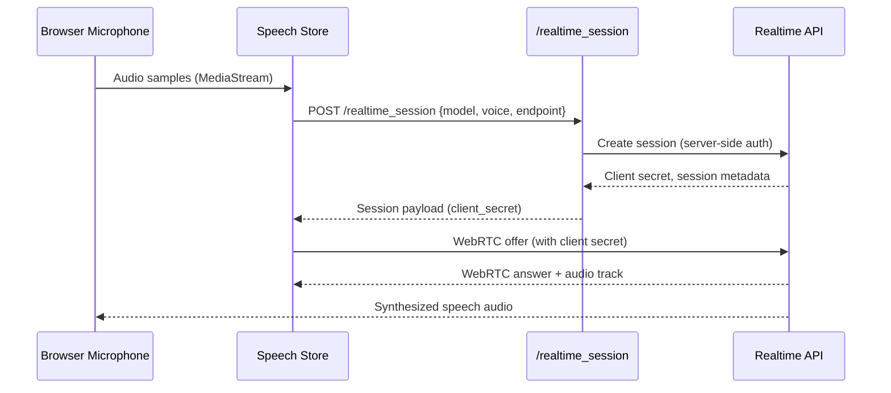

# Realtime Speech Pipeline

Connects web clients to realtime speech models, enabling bidirectional audio streaming.

## Components

| Component | File(s) | Description |
| --- | --- | --- |
| UI Speech Store | `webui/components/chat/speech/speech-store.js` | Manages microphone, WebRTC, audio playback |
| Settings | `webui/js/settings.js`, `/settings` endpoints | Configure provider, voice, endpoint |
| Gateway Endpoint | `python/api/realtime_session.py` | Creates provider session server-side |
| Settings Backend | `python/helpers/settings.py` | Stores defaults and credentials |

## Provider Defaults

- Provider: `openai_realtime`
- Model: `gpt-4o-realtime-preview`
- Voice: `verse`
- Endpoint: `https://api.openai.com/v1/realtime/sessions`

## Security & Compliance

- Gateway authenticates with provider using server-side credentials stored in Vault.
- Client secret returned by provider lives only in memory on the browser.
- CORS restricted to trusted origins; WebRTC sessions scoped per tunnel.

## Error Handling

| Failure | UI Behavior | Operator Action |
| --- | --- | --- |
| Session creation fails | Toast `Realtime session error` | Validate API key, network egress |
| WebRTC negotiation timeout | UI retries | Check browser permissions, system firewall |
| Audio playback blocked | Browser prompts for interaction | User clicks to unlock audio |

## Operational Metrics

- Gateway logs session creation time, error codes.
- UI logs WebRTC state transitions to the console for debugging.
- Roadmap: add Prometheus counters (`realtime_sessions_total`, `realtime_session_failures_total`).

## Extending Providers

1. Extend settings schema with new provider option.
2. Update Gateway `/realtime_session` to call provider-specific API.
3. Adjust UI speech store for codec/auth constraints.
4. Document usage in the User Manual once the provider is stable.
