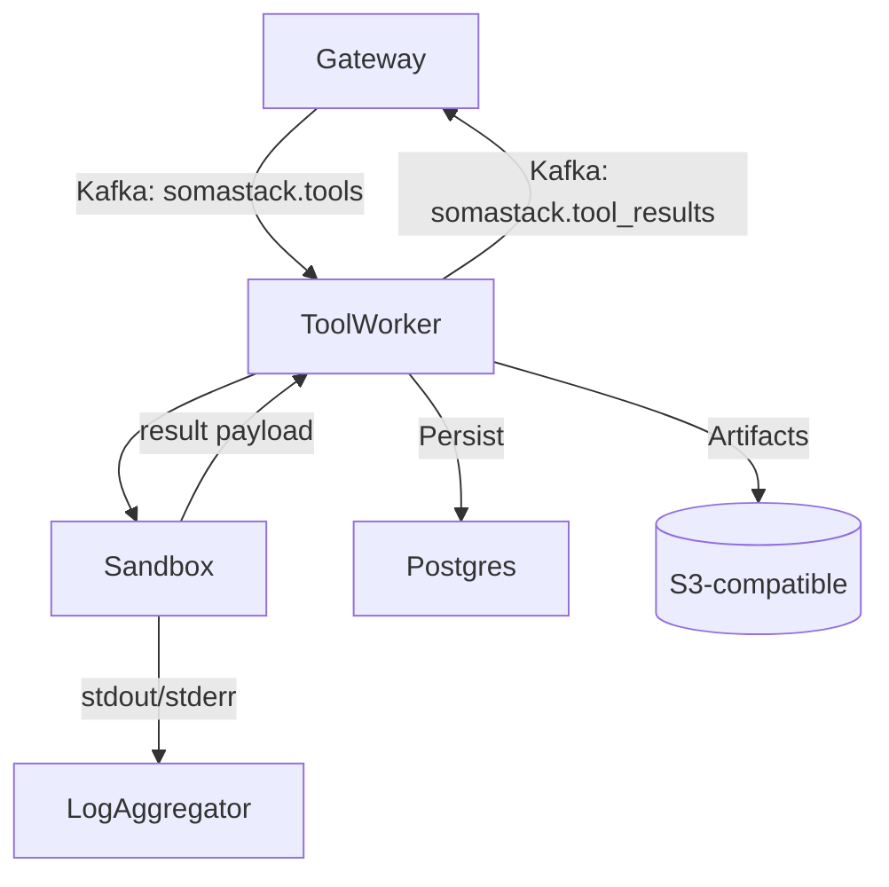
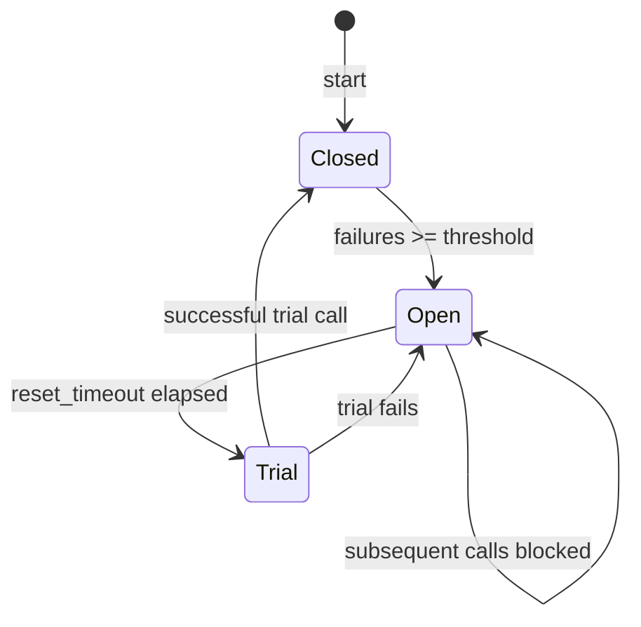

# Tool Executor Component

## Mission

Execute tool calls emitted by the Gateway, ensuring sandboxed, observable, and auditable automation.

## Architecture Layers

| Layer | Description |
| --- | --- |
| Transport | Kafka consumer group (`tool-executor`), optional HTTP callbacks |
| Execution | Worker pool (`python/services/tool_executor/worker.py`) with asyncio concurrency |
| Sandbox | Ephemeral directories under `/tmp/tool-exec`, optional container isolation |
| Persistence | Result metadata in Postgres, large payloads in object storage, cache in Redis |
| Telemetry | Metrics on task duration, success rate, retries |

## Supported Tool Types

| Tool | Module | Notes |
| --- | --- | --- |
| Shell / Command | `python/tools/shell.py` | Runs in sandbox with resource limits |
| Code Interpreter | `python/tools/code.py` | Executes Python snippets deterministically |
| HTTP | `python/tools/http.py` | Makes HTTP(S) calls under allowlist policy |
| Knowledge Base | `python/tools/knowledge.py` | Queries knowledge store |
| Custom | `python/tools/custom/*.py` | Register via startup discovery |

## Configuration

- Topics: `somastack.tools` (input), `somastack.tool_results` (output).
- Environment: `TOOL_EXECUTOR_MAX_WORKERS`, `SANDBOX_ROOT`, `TIMEOUT_SECONDS`.
- Secrets resolved through `python/helpers/secrets.py` to redact logs.

## Error Handling

| Scenario | Response |
| --- | --- |
| Tool timeout | Worker aborts, marks job `failed`, publishes error |
| Sandbox init failure | Retry up to three times before dead-lettering |
| Postgres unavailable | Buffer results in Redis; operator restores DB |
| Invalid payload schema | Publish validation error back to Gateway |

## Observability

- Metrics: `tool_executor_tasks_total`, `tool_executor_duration_seconds`.
- Logs: structured per task with `task_id` correlation.
- Tracing: optional OpenTelemetry spans around sandbox execution.

## Circuit Breaker Safeguards

- Implementation lives in `python/helpers/circuit_breaker.py` and wraps the execution engine.
- When the circuit is **open**, new tool requests raise `CircuitOpenError` and the Gateway retries or surfaces UI guidance.
- Metrics exported when `CIRCUIT_BREAKER_METRICS_PORT` is set:
  - `circuit_breaker_opened_total`
  - `circuit_breaker_closed_total`
  - `circuit_breaker_trial_total`

## Verification Checklist

- [ ] Run `pytest tests/unit/test_execution_engine_circuit.py` to exercise success/failure paths.
- [ ] Confirm circuit breaker metrics emit via `/metrics` when failures are forced.
- [ ] Inspect sandbox directory cleanup under `/tmp/tool-exec` after load tests.

## Extending the Executor

1. Implement new tool under `python/tools/` adhering to base interface.
2. Register in `python/tools/__init__.py` so discovery loads it.
3. Provide JSON schema for input/output validation.
4. Add integration tests ensuring Gateway contracts remain valid.

## Use Cases

- CI/CD agents executing migrations or test suites.
- Security scanners triggered by policy events.
- Realtime data fetchers hydrating chat context.

Ensure long-running jobs emit progress updates so Gateway can stream status to users.
