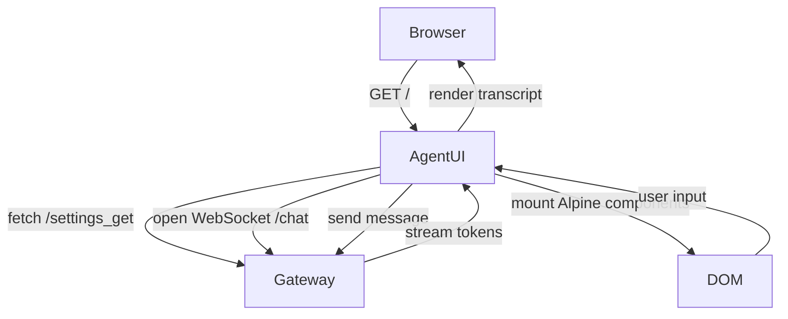

# Agent UI Component

## Mission

Provide operators and automated clients with a realtime interface that mirrors Gateway capabilities while exposing hooks for testing and automation.

## Technology Stack

| Layer | Technology |
| --- | --- |
| Bundler | Vite (Docker build) |
| Runtime | Alpine.js + native ES modules |
| Styling | Tailwind CSS + custom utilities |
| Transport | WebSocket (chat stream), REST (settings/history) |

## Module Map

| Path | Role |
| --- | --- |
| `webui/index.html` | Shell document, layout, script bootstrap |
| `webui/js/settings.js` | Settings modal logic, persistence |
| `webui/components/chat/log-store.js` | Chat transcript state container |
| `webui/components/chat/speech/speech-store.js` | Microphone/WebRTC management |
| `webui/components/settings/*` | Modular settings panels |

## Speech Experience

- Defaults to OpenAI realtime provider (`speech_provider = "openai_realtime"`).
- Builds WebRTC sessions using secrets returned from Gateway `/realtime_session` endpoint.
- Falls back to browser TTS when realtime provider unavailable and surfaces toast notification.

## Accessibility & UX

- Keyboard shortcuts for message send (`Cmd+Enter`) and focus recovery.
- Toast system surfaces Gateway and tool errors with actionable guidance.
- Stores user preferences in `localStorage` with schema versioning.

## Automation Hooks

- `data-testid` attributes on interactive elements enable Playwright scripting.
- `window.sendJsonData` centralizes REST calls, simplifying mock injection.
- Speech store exposes stubbable methods so automated tests can bypass WebRTC.

## Deployment

- Built as part of `agent-ui` Docker image (see `webui/Dockerfile`).
- Served via nginx within the container; assets cached aggressively with cache-busting hashes.
- Reverse proxy (Gateway or Cloudflare Tunnel) handles TLS termination and WebSocket upgrades.

## Observability

- Browser console traces key lifecycle events when `LOG_LEVEL=debug`.
- Gateway tracks WebSocket connect/disconnect metrics and error codes.
- Roadmap item: emit frontend telemetry via optional analytics adapter.

## Verification Checklist

- [ ] UI renders chat interface and receives streamed tokens from Gateway locally.
- [ ] Settings modal persists provider overrides across reloads.
- [ ] Playwright smoke test (`tests/playwright/test_ui_chat.py`) passes in CI.
