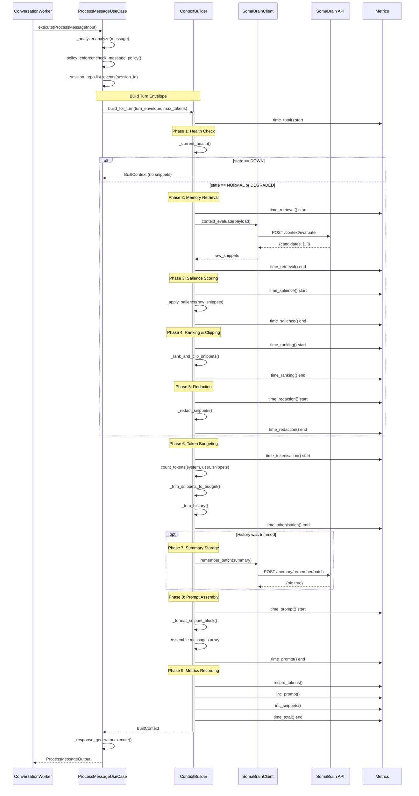
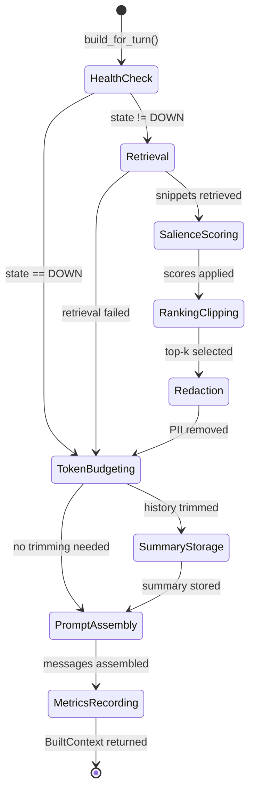
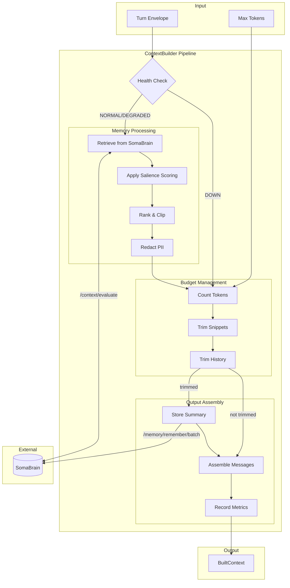
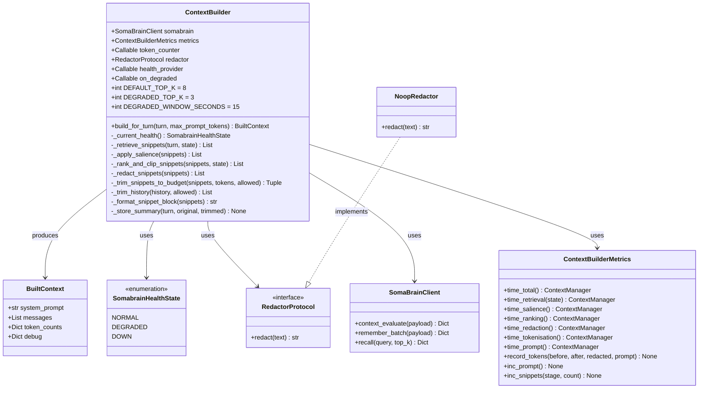

# Context Builder Pipeline - Complete Flow Documentation

**Version:** 2.0.0  
**Last Updated:** December 10, 2025  
**Status:** Production Reference  
**Author:** Architecture Analysis (VIBE Compliant)

---

## 1. Overview

The Context Builder (`python/somaagent/context_builder.py`) is a critical component in SomaAgent01 that constructs the optimal prompt context for LLM interactions. It orchestrates memory retrieval from SomaBrain, applies salience scoring, handles token budgeting, and ensures PII redaction before assembling the final prompt.

### 1.1 Key Responsibilities

1. **Health-Aware Retrieval**: Adapts behavior based on SomaBrain health state (NORMAL/DEGRADED/DOWN)
2. **Memory Retrieval**: Fetches relevant memories via SomaBrain `/context/evaluate` endpoint
3. **Salience Scoring**: Combines semantic similarity with recency boost (70/30 weighting)
4. **Token Budgeting**: Greedy algorithm to fit within `max_prompt_tokens` constraint
5. **PII Redaction**: Pluggable redactor interface (currently NoopRedactor)
6. **Summary Storage**: Automatically stores extractive summaries when history is trimmed
7. **Observability**: Full Prometheus metrics for each pipeline phase

### 1.2 Integration Points

| Component | Integration Method | Purpose |
|-----------|-------------------|---------|
| `ConversationWorker` | Constructor injection | Main consumer |
| `ProcessMessageUseCase` | `build_for_turn()` call | Context building |
| `SomaBrainClient` | `context_evaluate()`, `remember_batch()` | Memory operations |
| `ContextBuilderMetrics` | Timer contexts | Observability |
| `RedactorProtocol` | `redact()` method | PII protection |

## 2. Architecture Diagram

```
┌─────────────────────────────────────────────────────────────────────────────┐
│                         CONTEXT BUILDER PIPELINE                             │
│                                                                              │
│  ┌──────────────────────────────────────────────────────────────────────┐   │
│  │                    ENTRY POINT: build_for_turn()                      │   │
│  │  Input: turn_envelope, max_prompt_tokens                              │   │
│  │  Output: BuiltContext(system_prompt, messages, token_counts, debug)   │   │
│  └──────────────────────────────────────────────────────────────────────┘   │
│                                    │                                         │
│                                    ▼                                         │
│  ┌──────────────────────────────────────────────────────────────────────┐   │
│  │  PHASE 1: HEALTH CHECK                                                │   │
│  │  ├── _current_health() → SomabrainHealthState                        │   │
│  │  │   ├── NORMAL   → Full retrieval (top_k=8)                         │   │
│  │  │   ├── DEGRADED → Reduced retrieval (top_k=3)                      │   │
│  │  │   └── DOWN     → Skip retrieval entirely                          │   │
│  │  └── Metrics: health_provider callback                               │   │
│  └──────────────────────────────────────────────────────────────────────┘   │
│                                    │                                         │
│                                    ▼                                         │
│  ┌──────────────────────────────────────────────────────────────────────┐   │
│  │  PHASE 2: MEMORY RETRIEVAL (if state != DOWN)                        │   │
│  │  ├── _retrieve_snippets()                                            │   │
│  │  │   ├── Build payload: {tenant_id, session_id, query, top_k}        │   │
│  │  │   ├── Call: SomaBrainClient.context_evaluate(payload)             │   │
│  │  │   │   └── POST /context/evaluate                                  │   │
│  │  │   ├── Extract: candidates[] or results[]                          │   │
│  │  │   └── Transform to: [{id, score, text, metadata}]                 │   │
│  │  └── Metrics: thinking_retrieval_seconds histogram                   │   │
│  └──────────────────────────────────────────────────────────────────────┘   │
│                                    │                                         │
│                                    ▼                                         │
│  ┌──────────────────────────────────────────────────────────────────────┐   │
│  │  PHASE 3: SALIENCE SCORING                                           │   │
│  │  ├── _apply_salience()                                               │   │
│  │  │   ├── For each snippet:                                           │   │
│  │  │   │   ├── base_score = snippet.score                              │   │
│  │  │   │   ├── recency = _recency_boost(metadata, now)                 │   │
│  │  │   │   │   └── exp(-age_days / 30.0)                               │   │
│  │  │   │   └── final_score = 0.7 * base_score + 0.3 * recency          │   │
│  │  │   └── Return enriched snippets with updated scores                │   │
│  │  └── Metrics: thinking_salience_seconds histogram                    │   │
│  └──────────────────────────────────────────────────────────────────────┘   │
│                                    │                                         │
│                                    ▼                                         │
│  ┌──────────────────────────────────────────────────────────────────────┐   │
│  │  PHASE 4: RANKING & CLIPPING                                         │   │
│  │  ├── _rank_and_clip_snippets()                                       │   │
│  │  │   ├── Sort by score (descending)                                  │   │
│  │  │   ├── Limit: NORMAL=8, DEGRADED=3                                 │   │
│  │  │   └── Return top-k snippets                                       │   │
│  │  └── Metrics: thinking_ranking_seconds histogram                     │   │
│  └──────────────────────────────────────────────────────────────────────┘   │
│                                    │                                         │
│                                    ▼                                         │
│  ┌──────────────────────────────────────────────────────────────────────┐   │
│  │  PHASE 5: REDACTION (PII Protection)                                 │   │
│  │  ├── _redact_snippets()                                              │   │
│  │  │   ├── For each snippet:                                           │   │
│  │  │   │   └── redactor.redact(text)                                   │   │
│  │  │   └── Currently: NoopRedactor (passthrough)                       │   │
│  │  │       Future: PresidioRedactor for real PII removal               │   │
│  │  └── Metrics: thinking_redaction_seconds histogram                   │   │
│  └──────────────────────────────────────────────────────────────────────┘   │
│                                    │                                         │
│                                    ▼                                         │
│  ┌──────────────────────────────────────────────────────────────────────┐   │
│  │  PHASE 6: TOKEN BUDGETING                                            │   │
│  │  ├── Count tokens:                                                   │   │
│  │  │   ├── system_tokens = count_tokens(system_prompt)                 │   │
│  │  │   ├── user_tokens = count_tokens(user_message)                    │   │
│  │  │   └── snippet_tokens = sum(count_tokens(s.text) for s in snippets)│   │
│  │  ├── Calculate budget:                                               │   │
│  │  │   └── budget_for_history = max_tokens - (system + user + snippets)│   │
│  │  ├── If budget < 0:                                                  │   │
│  │  │   └── _trim_snippets_to_budget() → greedy selection               │   │
│  │  ├── _trim_history() → reverse chronological selection               │   │
│  │  └── Metrics: thinking_tokenisation_seconds histogram                │   │
│  └──────────────────────────────────────────────────────────────────────┘   │
│                                    │                                         │
│                                    ▼                                         │
│  ┌──────────────────────────────────────────────────────────────────────┐   │
│  │  PHASE 7: SUMMARY STORAGE (if history trimmed)                       │   │
│  │  ├── _store_summary()                                                │   │
│  │  │   ├── _build_summary() → extractive summary (max 1024 chars)      │   │
│  │  │   └── SomaBrainClient.remember_batch()                            │   │
│  │  │       └── POST /memory/remember/batch                             │   │
│  │  │           └── tags: [session_summary, auto, context_builder]      │   │
│  │  └── Metrics: context_builder_snippets_total (stage=summary)         │   │
│  └──────────────────────────────────────────────────────────────────────┘   │
│                                    │                                         │
│                                    ▼                                         │
│  ┌──────────────────────────────────────────────────────────────────────┐   │
│  │  PHASE 8: PROMPT ASSEMBLY                                            │   │
│  │  ├── Build messages array:                                           │   │
│  │  │   ├── [0] {role: "system", content: system_prompt}                │   │
│  │  │   ├── [1..n] trimmed_history messages                             │   │
│  │  │   ├── [n+1] {role: "system", name: "memory", content: snippets}   │   │
│  │  │   │   └── _format_snippet_block() → "[1] (label)\n{text}"         │   │
│  │  │   └── [last] {role: "user", content: user_message}                │   │
│  │  └── Metrics: thinking_prompt_seconds histogram                      │   │
│  └──────────────────────────────────────────────────────────────────────┘   │
│                                    │                                         │
│                                    ▼                                         │
│  ┌──────────────────────────────────────────────────────────────────────┐   │
│  │  PHASE 9: METRICS RECORDING                                          │   │
│  │  ├── record_tokens(before_budget, after_budget, after_redaction,     │   │
│  │  │                 prompt_tokens)                                    │   │
│  │  ├── inc_prompt() → context_builder_prompt_total                     │   │
│  │  └── inc_snippets(stage="final", count=len(snippets))                │   │
│  └──────────────────────────────────────────────────────────────────────┘   │
│                                    │                                         │
│                                    ▼                                         │
│  ┌──────────────────────────────────────────────────────────────────────┐   │
│  │  OUTPUT: BuiltContext                                                 │   │
│  │  ├── system_prompt: str                                              │   │
│  │  ├── messages: List[Dict[str, Any]]                                  │   │
│  │  ├── token_counts: {system, history, snippets, user}                 │   │
│  │  └── debug: {somabrain_state, snippet_ids, session_id, tenant_id}    │   │
│  └──────────────────────────────────────────────────────────────────────┘   │
│                                                                              │
└─────────────────────────────────────────────────────────────────────────────┘
```

## 3. Component Integration Flow

```
┌─────────────────────────────────────────────────────────────────────────────┐
│                    END-TO-END MESSAGE PROCESSING FLOW                        │
└─────────────────────────────────────────────────────────────────────────────┘

┌─────────────┐     ┌─────────────────┐     ┌──────────────────────────────┐
│   Gateway   │────▶│  Kafka Topic    │────▶│   ConversationWorker         │
│  /v1/chat   │     │ conversation.   │     │   (services/conversation_    │
│             │     │ inbound         │     │    worker/main.py)           │
└─────────────┘     └─────────────────┘     └──────────────────────────────┘
                                                         │
                                                         ▼
                                            ┌──────────────────────────────┐
                                            │   ProcessMessageUseCase      │
                                            │   (src/core/application/     │
                                            │    use_cases/conversation/   │
                                            │    process_message.py)       │
                                            └──────────────────────────────┘
                                                         │
                    ┌────────────────────────────────────┼────────────────────────────────────┐
                    │                                    │                                    │
                    ▼                                    ▼                                    ▼
        ┌───────────────────┐              ┌───────────────────┐              ┌───────────────────┐
        │  PolicyEnforcer   │              │  SessionRepository│              │  ContextBuilder   │
        │  (OPA check)      │              │  (history fetch)  │              │  (python/soma-    │
        │                   │              │                   │              │   agent/context_  │
        │                   │              │                   │              │   builder.py)     │
        └───────────────────┘              └───────────────────┘              └───────────────────┘
                                                                                       │
                                                                                       ▼
                                                                             ┌───────────────────┐
                                                                             │  SomaBrainClient  │
                                                                             │  (python/integra- │
                                                                             │   tions/somabrain_│
                                                                             │   client.py)      │
                                                                             └───────────────────┘
                                                                                       │
                                                                                       ▼
                                                                             ┌───────────────────┐
                                                                             │  SomaBrain API    │
                                                                             │  /context/evaluate│
                                                                             │  /memory/remember │
                                                                             └───────────────────┘
```

## 4. Detailed Phase Descriptions

### 4.1 Health Check Phase

The ContextBuilder uses a 3-state health model to adapt its behavior:

| State | top_k | Behavior |
|-------|-------|----------|
| NORMAL | 8 | Full retrieval with all features |
| DEGRADED | 3 | Reduced retrieval, faster response |
| DOWN | 0 | Skip retrieval entirely, use history only |

```python
class SomabrainHealthState(str, Enum):
    NORMAL = "normal"
    DEGRADED = "degraded"
    DOWN = "down"
```

### 4.2 Memory Retrieval Phase

The retrieval phase calls SomaBrain's `/context/evaluate` endpoint:

```python
payload = {
    "tenant_id": turn.get("tenant_id"),
    "session_id": turn.get("session_id"),
    "query": turn.get("user_message", ""),
    "top_k": top_k,  # 8 for NORMAL, 3 for DEGRADED
}
resp = await self.somabrain.context_evaluate(payload)
```

### 4.3 Salience Scoring Phase

Combines base retrieval score with recency boost:

```
final_score = 0.7 * base_score + 0.3 * recency_boost

recency_boost = exp(-age_days / 30.0)
```

- Recent memories (< 1 day): ~1.0 boost
- Week-old memories: ~0.79 boost
- Month-old memories: ~0.37 boost

### 4.4 Token Budgeting Algorithm

The greedy budgeting algorithm:

```
1. Calculate fixed costs: system_tokens + user_tokens
2. Calculate snippet_tokens from retrieved memories
3. budget_for_history = max_tokens - fixed_costs - snippet_tokens
4. If budget < 0: trim snippets until budget >= 0
5. Trim history from oldest to newest until within budget
```

### 4.5 Prompt Assembly Format

Final message structure:

```json
[
  {"role": "system", "content": "<system_prompt>"},
  {"role": "user", "content": "<history_msg_1>"},
  {"role": "assistant", "content": "<history_msg_2>"},
  ...
  {"role": "system", "name": "memory", "content": "Relevant memory:\n[1] (source)\n<text>"},
  {"role": "user", "content": "<current_user_message>"}
]
```

## 5. Prometheus Metrics

| Metric | Type | Description |
|--------|------|-------------|
| `thinking_total_seconds` | Histogram | Overall context-building latency |
| `thinking_retrieval_seconds` | Histogram | SomaBrain retrieval latency (by state) |
| `thinking_salience_seconds` | Histogram | Salience scoring latency |
| `thinking_ranking_seconds` | Histogram | Ranking/filtering latency |
| `thinking_redaction_seconds` | Histogram | PII redaction latency |
| `thinking_tokenisation_seconds` | Histogram | Token counting latency |
| `thinking_prompt_seconds` | Histogram | Prompt assembly latency |
| `context_builder_prompt_total` | Counter | Number of prompts built |
| `context_builder_snippets_total` | Counter | Snippets processed (by stage) |
| `context_tokens_before_budget` | Gauge | Tokens before budgeting |
| `context_tokens_after_budget` | Gauge | Tokens after budgeting |
| `context_tokens_after_redaction` | Gauge | Tokens after redaction |
| `context_prompt_tokens` | Gauge | Final prompt token count |

## 6. Error Handling

### 6.1 SomaBrain Failures

```python
try:
    resp = await self.somabrain.context_evaluate(payload)
except SomaClientError as exc:
    if state == SomabrainHealthState.NORMAL:
        self.on_degraded(self.DEGRADED_WINDOW_SECONDS)  # 15s
    return []  # Continue without memory
```

### 6.2 Circuit Breaker

The SomaClient implements a circuit breaker:
- **Threshold**: 3 consecutive failures
- **Cooldown**: 15 seconds
- **Behavior**: Returns error immediately when open

## 7. Configuration

| Environment Variable | Default | Description |
|---------------------|---------|-------------|
| `SA01_SOMA_BASE_URL` | Required | SomaBrain service URL |
| `SA01_SOMA_TIMEOUT_SECONDS` | 30 | Request timeout |
| `SA01_SOMA_MAX_RETRIES` | 2 | Max retry attempts |
| `SA01_SOMA_RETRY_BASE_MS` | 150 | Base retry delay |
| `SA01_NAMESPACE` | - | Logical universe for memories |
| `SA01_MEMORY_NAMESPACE` | wm | Memory namespace |

## 8. Usage Example

```python
from python.somaagent.context_builder import ContextBuilder, SomabrainHealthState
from python.integrations.somabrain_client import SomaBrainClient
from python.helpers.tokens import count_tokens
from observability.metrics import ContextBuilderMetrics

# Initialize
builder = ContextBuilder(
    somabrain=SomaBrainClient.get(),
    metrics=ContextBuilderMetrics(),
    token_counter=count_tokens,
    health_provider=lambda: SomabrainHealthState.NORMAL,
    on_degraded=lambda duration: logger.warning(f"Degraded for {duration}s"),
)

# Build context
turn_envelope = {
    "tenant_id": "tenant-123",
    "session_id": "session-456",
    "system_prompt": "You are a helpful assistant.",
    "user_message": "What is the capital of France?",
    "history": [
        {"role": "user", "content": "Hello"},
        {"role": "assistant", "content": "Hi there!"},
    ],
}

context = await builder.build_for_turn(turn_envelope, max_prompt_tokens=4096)

# Use context.messages for LLM call
print(f"Built {len(context.messages)} messages")
print(f"Token counts: {context.token_counts}")
print(f"Debug info: {context.debug}")
```

## 9. Future Enhancements

1. **Presidio Redaction**: Replace NoopRedactor with real PII detection
2. **Optimal Budgeting**: Implement knapsack algorithm for better snippet selection
3. **Preload Integration**: Add ContextBuilder to preload.py for warm-up
4. **Feedback Loop**: Extend feedback payload with score/timestamp for learning

---

## 10. Related Documentation

- [SomaBrain API Reference](../somabrain-openapi.json)
- [Product Overview](../../.kiro/steering/product.md)
- [Canonical Architecture Cleanup Requirements](../../.kiro/specs/canonical-architecture-cleanup/requirements.md)


---

## 11. Mermaid Sequence Diagram



## 12. State Machine Diagram



## 13. Data Flow Diagram



## 14. Class Diagram




---

## 15. Deep-Dive: Code Analysis

### 15.1 ContextBuilder Constructor

```python
# python/somaagent/context_builder.py

class ContextBuilder:
    DEFAULT_TOP_K = 8          # Full retrieval in NORMAL state
    DEGRADED_TOP_K = 3         # Reduced retrieval in DEGRADED state
    DEGRADED_WINDOW_SECONDS = 15  # Duration to stay degraded after failure

    def __init__(
        self,
        *,
        somabrain: SomaBrainClient,           # Required: SomaBrain HTTP client
        metrics: ContextBuilderMetrics,        # Required: Prometheus metrics wrapper
        token_counter: Callable[[str], int],   # Required: Token counting function
        redactor: Optional[RedactorProtocol] = None,  # Optional: PII redactor
        health_provider: Optional[Callable[[], SomabrainHealthState]] = None,  # Health callback
        on_degraded: Optional[Callable[[float], None]] = None,  # Degradation callback
    ) -> None:
```

**Key Design Decisions:**
- All dependencies injected via constructor (Clean Architecture)
- Health provider is a callback, not a direct dependency on DegradationMonitor
- Redactor defaults to NoopRedactor (passthrough) for backward compatibility
- `on_degraded` callback allows external systems to react to degradation

### 15.2 Integration with ConversationWorker

```python
# services/conversation_worker/main.py (lines 95-102)

class ConversationWorkerImpl:
    def __init__(self) -> None:
        # ... infrastructure setup ...
        
        # Context builder initialization
        self.ctx_builder = ContextBuilder(
            somabrain=self.soma,                    # SomaBrainClient singleton
            metrics=ContextBuilderMetrics(),        # Fresh metrics instance
            token_counter=count_tokens,             # python.helpers.tokens.count_tokens
            health_provider=lambda: SomabrainHealthState.NORMAL,  # FUTURE: Integrate with DegradationMonitor (see §15.2)
            on_degraded=lambda d: None,             # FUTURE: Integrate with circuit breaker (see §15.2)
        )
```

**Current Limitations:**
1. `health_provider` always returns NORMAL - not integrated with `DegradationMonitor`
2. `on_degraded` is a no-op - should trigger circuit breaker state change
3. No redactor configured - PII passes through unredacted

### 15.3 Integration with ProcessMessageUseCase

```python
# src/core/application/use_cases/conversation/process_message.py (lines 280-295)

async def _generate_response(self, event, session_id, persona_id, tenant, metadata, analysis_dict):
    # Step 1: Get history from session repository
    history = await self._session_repo.list_events(session_id, limit=20)
    history_messages = self._history_to_messages(history)

    # Step 2: Build turn envelope
    turn_envelope = {
        "tenant_id": tenant,
        "session_id": session_id,
        "system_prompt": self._build_system_prompt(analysis_dict),
        "user_message": event.get("message", ""),
        "history": history_messages,
    }

    # Step 3: Call ContextBuilder
    built_context = await self._context_builder.build_for_turn(
        turn_envelope, max_prompt_tokens=4096  # Hardcoded limit
    )

    # Step 4: Convert to ChatMessage format for LLM
    messages = [
        ChatMessage(role=msg.get("role", "user"), content=str(msg.get("content", "")))
        for msg in built_context.messages
    ]
```

**Data Flow:**
1. `ProcessMessageUseCase` fetches last 20 events from `PostgresSessionStore`
2. Converts events to `{role, content}` message format
3. Builds turn envelope with tenant/session context
4. Calls `build_for_turn()` with 4096 token limit
5. Converts `BuiltContext.messages` to `ChatMessage` objects for LLM

### 15.4 Salience Scoring Algorithm

```python
# python/somaagent/context_builder.py (lines 165-180)

def _apply_salience(self, snippets: List[Dict[str, Any]]) -> List[Dict[str, Any]]:
    enriched: List[Dict[str, Any]] = []
    now = datetime.now(timezone.utc)
    
    with self.metrics.time_salience():
        for snippet in snippets:
            meta = snippet.get("metadata") or {}
            base_score = self._safe_float(snippet.get("score"))  # Semantic similarity
            recency = self._recency_boost(meta, now)              # Time decay
            
            # Weighted combination: 70% semantic, 30% recency
            final_score = 0.7 * base_score + 0.3 * recency
            
            updated = dict(snippet)
            updated["score"] = final_score
            enriched.append(updated)
    
    return enriched

def _recency_boost(self, metadata: Dict[str, Any], now: datetime) -> float:
    timestamp = metadata.get("timestamp") or metadata.get("created_at")
    if not timestamp:
        return 0.5  # Default for missing timestamp
    
    dt = datetime.fromisoformat(str(timestamp))
    age_days = max(0.0, (now - dt).total_seconds() / 86400)
    
    # Exponential decay with 30-day half-life
    return math.exp(-age_days / 30.0)
```

**Recency Boost Values:**
| Age | Boost Factor |
|-----|--------------|
| 0 days | 1.000 |
| 1 day | 0.967 |
| 7 days | 0.792 |
| 14 days | 0.627 |
| 30 days | 0.368 |
| 60 days | 0.135 |

### 15.5 Token Budgeting Algorithm

```python
# python/somaagent/context_builder.py (lines 200-240)

# Step 1: Calculate fixed costs
system_tokens = self.count_tokens(system_prompt)
user_tokens = self.count_tokens(user_message)
snippet_tokens = self._count_snippet_tokens(snippets)

# Step 2: Calculate remaining budget for history
budget_for_history = max_prompt_tokens - (system_tokens + user_tokens + snippet_tokens)

# Step 3: If over budget, trim snippets first
if budget_for_history < 0:
    snippets, snippet_tokens = self._trim_snippets_to_budget(
        snippets,
        snippet_tokens,
        max_prompt_tokens - (system_tokens + user_tokens),
    )
    budget_for_history = max(0, max_prompt_tokens - (system_tokens + user_tokens + snippet_tokens))

# Step 4: Trim history (reverse chronological - keep recent)
trimmed_history = self._trim_history(history, budget_for_history)
```

**Budget Priority:**
1. System prompt (always included)
2. User message (always included)
3. Memory snippets (trimmed if needed)
4. History (trimmed from oldest to newest)

### 15.6 Summary Storage for Trimmed History

```python
# python/somaagent/context_builder.py (lines 280-320)

async def _store_summary(self, *, turn, original_history, trimmed_history) -> None:
    """Store extractive summary when history is trimmed."""
    summary_text = self._build_summary(original_history, trimmed_history)
    if not summary_text:
        return
    
    payload = {
        "tenant_id": turn.get("tenant_id"),
        "memories": [{
            "type": "session_summary",
            "text": summary_text,
            "session_id": turn.get("session_id"),
            "persona_id": turn.get("persona_id"),
            "tags": ["session_summary", "auto", "context_builder"],
            "metadata": {
                "trimmed_from": len(original_history),
                "trimmed_to": len(trimmed_history),
                "timestamp": datetime.now(timezone.utc).isoformat(),
            },
        }],
    }
    await self.somabrain.remember_batch(payload)

def _build_summary(self, original_history, trimmed_history) -> str:
    """Extractive summary from pruned messages (max 1024 chars)."""
    removed_count = len(original_history) - len(trimmed_history)
    if removed_count <= 0:
        return ""
    
    removed = original_history[:removed_count]
    parts = []
    for msg in removed:
        role = msg.get("role", "user")
        content = (msg.get("content") or "").strip()
        if content:
            parts.append(f"{role}: {content}")
            if len(" | ".join(parts)) > 1024:
                break
    
    return " | ".join(parts)[:1024]
```

**Summary Characteristics:**
- Extractive (not abstractive) - preserves original text
- Max 1024 characters
- Tagged with `session_summary`, `auto`, `context_builder`
- Stored via SomaBrain `/memory/remember/batch`

---

## 16. SomaBrain Client Integration

### 16.1 context_evaluate() Call

The ContextBuilder calls `SomaBrainClient.context_evaluate()` which maps to:

```
POST /context/evaluate
Content-Type: application/json

{
    "tenant_id": "tenant-123",
    "session_id": "session-456",
    "query": "user's message text",
    "top_k": 8  // or 3 in DEGRADED state
}
```

**Response Format:**
```json
{
    "candidates": [
        {
            "id": "mem-001",
            "score": 0.92,
            "text": "Previously stored memory content",
            "metadata": {
                "source": "conversation",
                "timestamp": "2025-12-10T10:30:00Z"
            }
        }
    ]
}
```

### 16.2 remember_batch() Call

For summary storage:

```
POST /memory/remember/batch
Content-Type: application/json

{
    "tenant_id": "tenant-123",
    "memories": [{
        "type": "session_summary",
        "text": "user: Hello | assistant: Hi there!",
        "session_id": "session-456",
        "persona_id": "agent_0",
        "tags": ["session_summary", "auto", "context_builder"],
        "metadata": {
            "trimmed_from": 20,
            "trimmed_to": 10,
            "timestamp": "2025-12-10T12:00:00Z"
        }
    }]
}
```

### 16.3 Circuit Breaker Behavior

The `SomaClient` implements a simple circuit breaker:

```python
# python/integrations/soma_client.py (lines 250-270)

class SomaClient:
    _CB_THRESHOLD: int = 3        # Failures before opening
    _CB_COOLDOWN_SEC: float = 15.0  # Seconds to stay open

    async def _request(self, method, path, **kwargs):
        # Check if breaker is open
        now = time.time()
        if self._cb_open_until and now < self._cb_open_until:
            raise SomaClientError(
                f"SomaBrain unavailable (circuit open for {int(self._cb_open_until - now)}s)"
            )
        
        # On failure, increment counter
        self._cb_failures += 1
        if self._cb_failures >= self._CB_THRESHOLD:
            self._cb_open_until = time.time() + self._CB_COOLDOWN_SEC
```

**State Transitions:**
- CLOSED → OPEN: After 3 consecutive failures
- OPEN → CLOSED: After 15 seconds cooldown (automatic)

---

## 17. Prometheus Metrics Reference

### 17.1 Timing Histograms

| Metric | Labels | Buckets (seconds) |
|--------|--------|-------------------|
| `thinking_total_seconds` | - | 0.001, 0.005, 0.01, 0.05, 0.1, 0.25, 0.5, 1.0, 2.0, 5.0 |
| `thinking_retrieval_seconds` | state | 0.001, 0.005, 0.01, 0.05, 0.1, 0.25, 0.5, 1.0, 2.0 |
| `thinking_salience_seconds` | - | 0.001, 0.005, 0.01, 0.05, 0.1, 0.25, 0.5, 1.0 |
| `thinking_ranking_seconds` | - | 0.001, 0.005, 0.01, 0.05, 0.1, 0.25, 0.5, 1.0 |
| `thinking_redaction_seconds` | - | 0.001, 0.005, 0.01, 0.05, 0.1, 0.25, 0.5, 1.0 |
| `thinking_tokenisation_seconds` | - | 0.001, 0.005, 0.01, 0.05, 0.1, 0.25, 0.5, 1.0 |
| `thinking_prompt_seconds` | - | 0.001, 0.005, 0.01, 0.05, 0.1, 0.25, 0.5, 1.0 |

### 17.2 Token Gauges

| Metric | Description |
|--------|-------------|
| `context_tokens_before_budget` | Token count before applying budget |
| `context_tokens_after_budget` | Token count after budget trimming |
| `context_tokens_after_redaction` | Token count after PII redaction |
| `context_prompt_tokens` | Final prompt token count |

### 17.3 Counters

| Metric | Labels | Description |
|--------|--------|-------------|
| `context_builder_prompt_total` | - | Number of prompts built |
| `context_builder_snippets_total` | stage | Snippets processed (final, summary) |

---

## 18. Known Limitations & Future Work

### 18.1 Current Limitations

1. **Health Provider Not Integrated**: `health_provider` always returns NORMAL
   - Should integrate with `DegradationMonitor.get_component_health("somabrain")`

2. **No Real PII Redaction**: Uses `NoopRedactor`
   - Should implement `PresidioRedactor` for production

3. **Hardcoded Token Limit**: `max_prompt_tokens=4096` in ProcessMessageUseCase
   - Should be configurable via `cfg.env()`

4. **No Knapsack Optimization**: Greedy snippet selection
   - Could use dynamic programming for optimal selection

5. **Extractive Summaries Only**: No LLM-based abstractive summarization
   - Could use utility model for better summaries

### 18.2 Recommended Improvements

```python
# Recommended: Integrate with DegradationMonitor
from services.gateway.degradation_monitor import degradation_monitor

self.ctx_builder = ContextBuilder(
    somabrain=self.soma,
    metrics=ContextBuilderMetrics(),
    token_counter=count_tokens,
    health_provider=lambda: _map_degradation_to_health(
        degradation_monitor.get_component_health("somabrain")
    ),
    on_degraded=lambda d: degradation_monitor.record_degradation("somabrain", d),
)

def _map_degradation_to_health(health: ComponentHealth) -> SomabrainHealthState:
    if health.level == DegradationLevel.HEALTHY:
        return SomabrainHealthState.NORMAL
    elif health.level == DegradationLevel.DEGRADED:
        return SomabrainHealthState.DEGRADED
    else:
        return SomabrainHealthState.DOWN
```

---

## 19. Testing Recommendations

### 19.1 Unit Tests

```python
# tests/unit/test_context_builder.py

@pytest.mark.asyncio
async def test_build_for_turn_normal_state():
    """Property: NORMAL state retrieves DEFAULT_TOP_K snippets."""
    builder = ContextBuilder(
        somabrain=mock_somabrain,
        metrics=ContextBuilderMetrics(),
        token_counter=lambda s: len(s.split()),
        health_provider=lambda: SomabrainHealthState.NORMAL,
    )
    
    result = await builder.build_for_turn(turn_envelope, max_prompt_tokens=4096)
    
    assert len(result.debug["snippet_ids"]) <= ContextBuilder.DEFAULT_TOP_K
    assert result.debug["somabrain_state"] == "normal"

@pytest.mark.asyncio
async def test_salience_scoring_recency_boost():
    """Property: Recent memories score higher than old memories."""
    # ... test implementation
```

### 19.2 Property-Based Tests

```python
# tests/properties/test_context_builder_properties.py

from hypothesis import given, strategies as st

@given(st.lists(st.dictionaries(st.text(), st.text()), min_size=0, max_size=50))
def test_history_trimming_preserves_recent(history):
    """Property: Trimmed history always contains most recent messages."""
    # ... property test implementation
```

---

## 20. File References

| File | Purpose |
|------|---------|
| `python/somaagent/context_builder.py` | Main ContextBuilder implementation |
| `observability/metrics.py` | ContextBuilderMetrics class |
| `python/integrations/somabrain_client.py` | SomaBrainClient wrapper |
| `python/integrations/soma_client.py` | Core SomaClient HTTP client |
| `services/conversation_worker/main.py` | ConversationWorker integration |
| `src/core/application/use_cases/conversation/process_message.py` | ProcessMessageUseCase integration |
| `python/helpers/tokens.py` | Token counting utilities |
