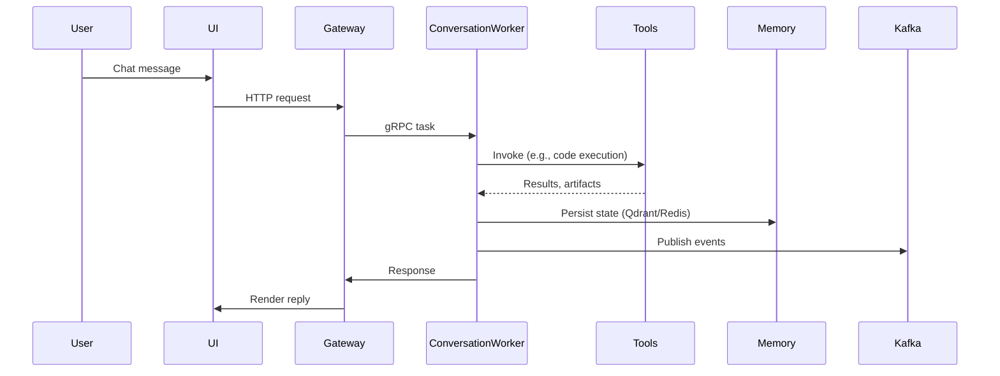

# Data Flow & Persistence

This document explains how data enters, moves through, and leaves SomaAgent01. It covers chat payloads, tool execution artifacts, event streaming, and storage.

## 1. High-Level Flow

## 2. Data Stores

| Store | Type | Purpose | Retention |
| ----- | ---- | ------- | --------- |
| Redis | In-memory | Session state, rate limits | 24 hours (dev), 7 days (prod) |
| Qdrant / pgvector | Vector DB | Long-term semantic memory | 90 days rolling |
| Postgres | SQL | Audit logs, marketplace registry | 180 days |
| Object storage | S3-compatible | Backups, large artifacts | 1 year |

## 3. Event Streams

Topics defined in `schemas/kafka/`:

- `conversation.events`: conversation lifecycle events (schema `conversation_event.avsc`).
- `tool.execution`: request/response payloads for tool usage.
- `config.updates`: broadcast configuration and feature flag changes.

Producers and consumers:

| Topic | Producers | Consumers |
| ----- | --------- | --------- |
| `conversation.events` | Gateway, Conversation Worker | Analytics, audit service |
| `tool.execution` | Tool Executor | Monitoring service |
| `config.updates` | Control plane | All services subscribing to config bus |

## 4. Privacy & Retention Controls

- PII redaction occurs before events are published (see `common/middleware/redaction.py`).
- Backups encrypted and access logged.
- Data deletion requests processed via `scripts/data/erase_user_data.py`.

## 5. Verification

- CI validates Avro schemas via `tests/schemas/test_kafka_schemas.py`.
- Weekly job `scripts/probes/check_retention.py` ensures TTL policies match table configuration.
- Observability dashboards track topic lag and storage usage.

## 6. Change Management

- Update this document when adding new stores or topics.
- Document schema updates in [`docs/changelog.md`](../changelog.md) with SemVer increments.
- Coordinate with privacy team for changes affecting data retention.
