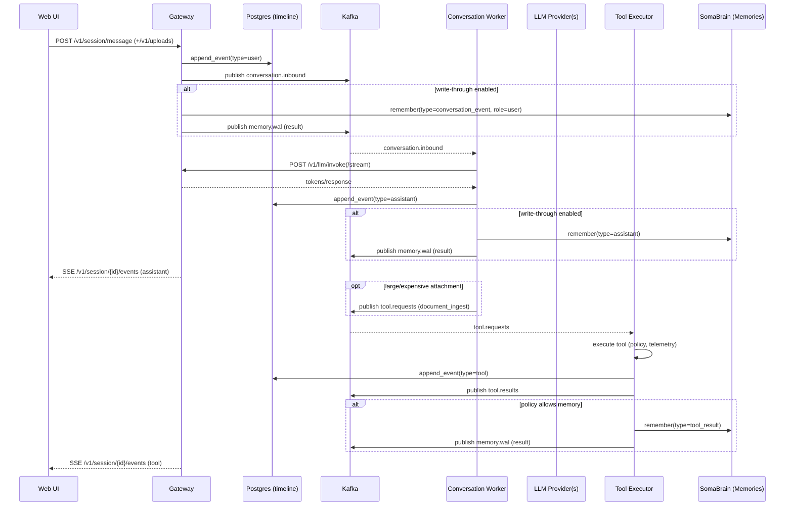

# Tools, Messages, and Memories Flow

This document describes how user messages flow through the system, how tools are executed, and how memories are persisted to SomaBrain. It also clarifies reliability features like WAL/outbox and authorization gates.

## Overview

- UI sends user messages and uploads to the Gateway.
- Gateway publishes message events to Kafka, persists timeline, and (optionally) writes-through to SomaBrain with WAL/outbox.
- Conversation Worker invokes the LLM via Gateway, streams assistant tokens, and writes user/assistant memories.
- Tool Executor executes tool requests and publishes tool results, writing tool_result memories.
- UI renders assistant/tool events via SSE and a poll fallback.

## E2E smoke and verification

Run a lightweight browser smoke to validate the full path (UI ↔ Gateway ↔ Kafka ↔ Workers ↔ SomaBrain):

- Prereqs: Gateway, Conversation Worker, Tool Executor, Kafka, Redis, Postgres, SomaBrain running locally.
- Base URL: set UI_BASE_URL or WEB_UI_BASE_URL (default http://localhost:21016/).
- What it checks:
  - UI loads without console errors.
  - Chat input issues POST /v1/session/message.
  - Optional: detects an AI reply element if workers are active.

Quick runs:

```bash
# Python pytest-based smoke (simple selectors)
pytest -q tests/e2e/test_ui_smoke.py -k smoke

# Async Playwright script with console/network capture
python tests/playwright/test_ui_smoke.py
```

Verify persistence:

- Check memory replica rows:
  - GET /v1/admin/memory?tenant=<t>&session_id=<s> (requires admin scope when auth enabled)
- Inspect WAL/consumer lag:
  - GET /v1/admin/kafka/status?topic=memory.wal&group=memory-replicator
- Confirm tool schemas for prompts/UI:
  - GET /v1/tools (names, descriptions, parameters JSON Schema)

Key environment variables:

- SOMA_BASE_URL, SOMA_TENANT_ID, SOMA_NAMESPACE, MEMORY_WAL_TOPIC
- GATEWAY_WRITE_THROUGH, GATEWAY_WRITE_THROUGH_ASYNC (optional write-through)
- WORKER_GATEWAY_BASE (Conversation Worker → Gateway surface)
- TOOL_REQUESTS_TOPIC, TOOL_RESULTS_TOPIC (Kafka topics; defaults are sensible)

## Mermaid sequence



## Contracts (tiny)

- Conversation event (user/assistant)
  - Keys: event_id, session_id, role, message/content, attachments[], metadata{}
  - Guarantees: appended to timeline; optional memory write-through guarded by OPA; WAL/outbox for durability
- Tool request
  - Keys: event_id, session_id, persona_id, tool_name, args{}, metadata{}
  - Policy: tool.execute enforced in Tool Executor
- Tool result
  - Keys: event_id, session_id, persona_id, tool_name, status, payload, metadata{}
  - Persisted: timeline + memory(type=tool_result) if policy allows

## Reliability and policy

- OPA pre-checks on memory.write in Worker and Tool Executor
- WAL publish (memory.wal) after successful remember; Gateway/Worker/Tool Executor enqueue memory writes into a retry outbox on failure
- Session cache (Redis) stores persona/tenant context for quick access and UI controls

## Tool invocation from chat

There are two coordinated paths, and both are implemented:

1) Model-led orchestration (Conversation Worker)
- The worker exposes available tools (with JSON Schemas) to the LLM using the OpenAI tools API contract.
- When the model emits tool_calls during streaming, the worker publishes tool.requests, waits for tool.results (correlated via request_id), injects the results into the message context, and continues the generation to produce the final assistant answer.
- Policy is still enforced at execution time by the Tool Executor.

2) UI affordance (Gateway + Web UI)
- POST /v1/tool/request allows clients to publish tool.requests directly.
- The Web UI supports a slash command: `/tool <tool_name> <json-args>`.

Tool discovery
- GET /v1/tools returns the in-repo Tool Registry with name, description, and input parameters (JSON Schema) so prompts and UIs can stay aligned with runtime capabilities.

## Attachments and ingestion

Uploads are handled by the Gateway via `/v1/uploads`, which returns attachment references like `/v1/attachments/{id}`. Services ingest by ID; no filesystem paths are required.

### Internal service-to-service attachments API

To support ingestion without exposing raw bytes publicly, the Gateway provides an internal S2S endpoint secured by an internal token:

- GET `/internal/attachments/{id}/binary`
  - Headers:
    - `X-Internal-Token: <token>` (must match `GATEWAY_INTERNAL_TOKEN`)
    - Optional: `X-Tenant-Id: <tenant>` for tenant scoping
  - Response headers include:
    - `Content-Type`
    - `Content-Disposition` (with filename)
    - `X-Attachment-Status` (`clean` | `quarantined`)
    - `X-Attachment-Size` (bytes)
  - Behavior: Allows retrieval even when status is `quarantined`; callers must enforce policy.

- HEAD `/internal/attachments/{id}/binary`
  - Same headers as GET; returns only metadata. Use this to decide inline vs offload without transferring bytes.

Public download remains available at GET `/v1/attachments/{id}`, which blocks `quarantined` payloads.

### Ingestion by ID flow

- UI uploads via `/v1/uploads` produce `/v1/attachments/{id}` references.
- Conversation Worker parses the attachment ID from that path and:
  - HEADs the internal endpoint to get `X-Attachment-Size`.
  - Ingests inline for small attachments or enqueues the `document_ingest` tool with `attachment_id` for large ones.
- The `document_ingest` tool fetches bytes from the internal endpoint using `X-Internal-Token`, extracts text (text/PDF/IMG), and returns the result.

### Ports and environment alignment

- Gateway host port: 21016 (set `GATEWAY_PORT=21016` in Docker Compose)
- SomaBrain base URL: `http://host.docker.internal:9696` (propagated via `SOMA_BASE_URL`)
- Internal token: set the same `GATEWAY_INTERNAL_TOKEN` for Gateway and all internal callers (Worker, Tool Executor)
