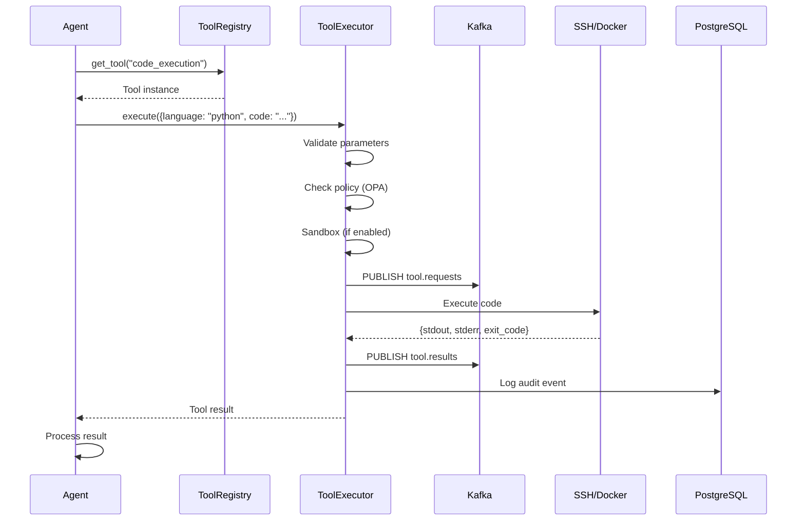
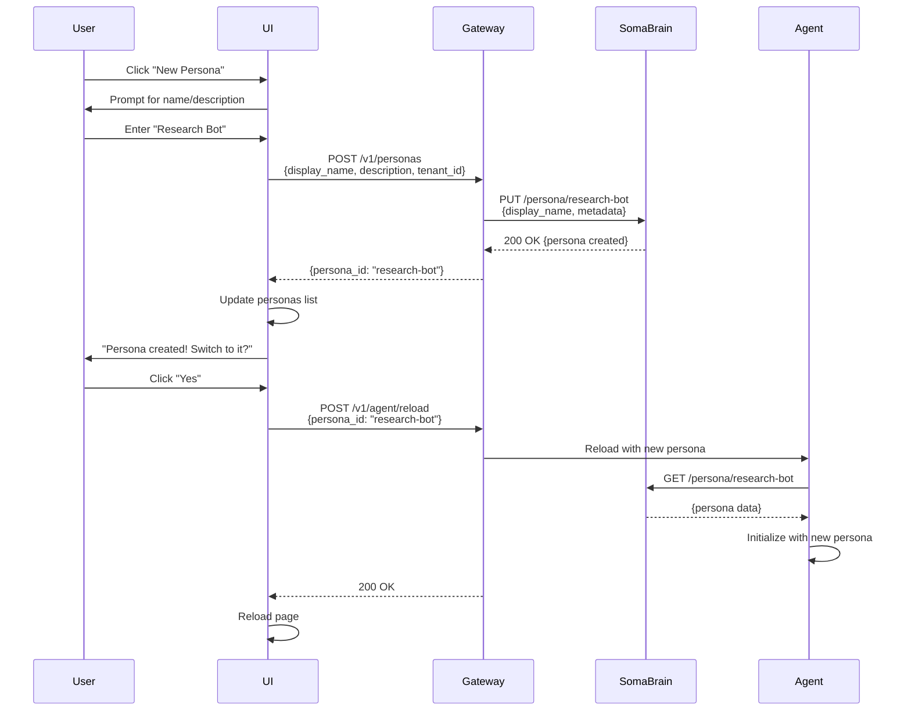
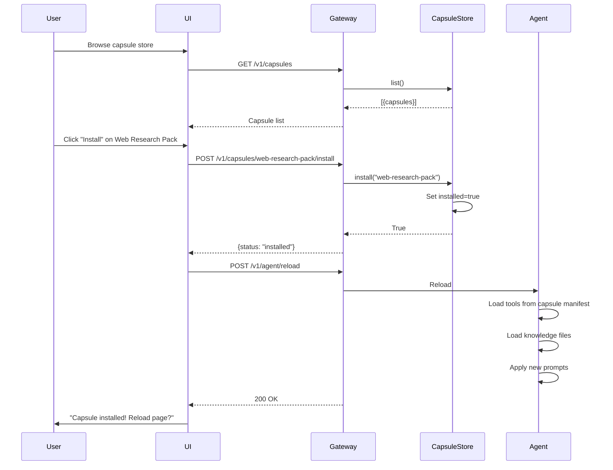
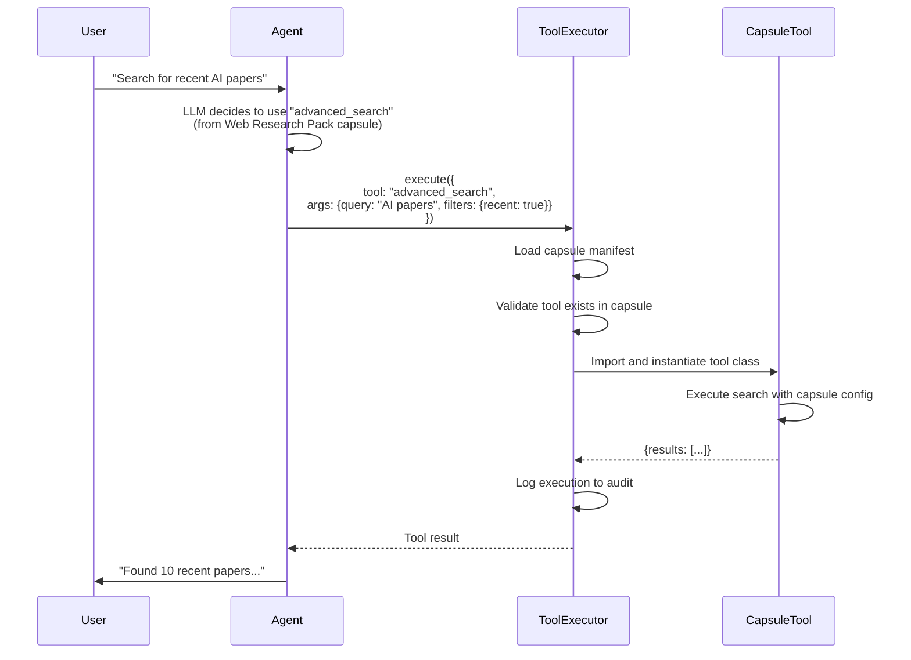

# 🤖 PERSONA, CAPSULES & TOOLS - UI INTEGRATION
## Complete Guide to Agent Customization Systems

---

## 📋 TABLE OF CONTENTS

1. [Persona System](#1-persona-system)
2. [Capsules System](#2-capsules-system)
3. [Tools System](#3-tools-system)
4. [UI Integration](#4-ui-integration)
5. [Complete Flows](#5-complete-flows)

---

## 1. PERSONA SYSTEM

### What is a Persona?

A **Persona** is an **agent identity** stored in SomaBrain that defines:
- Agent's personality and behavior
- Memory namespace (isolated memories)
- Neuromodulator state (dopamine, serotonin, noradrenaline)
- Adaptation parameters (learning rates, weights)
- Associated tenant (multi-tenancy)

### Persona Data Model

```python
@dataclass
class Persona:
    persona_id: str              # Unique identifier (e.g., "agent-1", "dev-bot")
    tenant_id: str               # Tenant for isolation
    display_name: str            # UI-friendly name
    description: str             # What this persona does
    system_prompt: str           # Base instructions
    neuromodulators: dict        # {dopamine: 0.5, serotonin: 0.5, noradrenaline: 0.0}
    adaptation_state: dict       # Learning parameters
    metadata: dict               # Extra config
    created_at: datetime
    updated_at: datetime
```

### Persona API (SomaBrain)

**Base URL:** `http://somabrain:9696`

```http
# Get persona
GET /persona/{persona_id}
Response: {
  "persona_id": "agent-1",
  "tenant_id": "acme-corp",
  "display_name": "Production Assistant",
  "neuromodulators": {"dopamine": 0.4, "serotonin": 0.6},
  ...
}

# Create/Update persona
PUT /persona/{persona_id}
Body: {
  "tenant_id": "acme-corp",
  "display_name": "My Custom Agent",
  "system_prompt": "You are a helpful assistant...",
  "metadata": {}
}

# List personas (by tenant)
GET /personas?tenant_id=acme-corp
Response: {
  "personas": [...]
}

# Delete persona
DELETE /persona/{persona_id}
```

### Persona in Agent Lifecycle

```python
# agent.py initialization
class Agent:
    def __init__(self, number: int, config: AgentConfig):
        self.persona_id = config.profile or f"agent_{number}"
        self.tenant_id = config.profile or "default"
        
        # Initialize persona in SomaBrain
        persona_initialized = await somabrain_ops.initialize_persona(self)
        
        if not persona_initialized:
            PrintStyle(font_color="orange").print(
                f"Warning: Persona '{self.persona_id}' init failed"
            )
```

**Memory Isolation:**
```python
# All memories are namespaced by persona
await soma_client.remember({
    "persona_id": "agent-1",      # Memories for this persona only
    "tenant_id": "acme-corp",     # Tenant isolation
    "session_id": "sess-123",
    "text": "User prefers dark mode"
})

# Recall only returns memories for this persona
memories = await soma_client.recall({
    "persona_id": "agent-1",
    "query": "user preferences",
    "top_k": 5
})
```

---

## 2. CAPSULES SYSTEM

### What is a Capsule?

A **Capsule** is a **lightweight plugin/extension** that can be installed to add functionality:
- Custom prompts
- Tool collections
- Knowledge bases
- UI themes
- Behavior modifications

### Capsule Data Model

```python
@dataclass
class CapsuleRecord:
    capsule_id: str          # Unique ID (e.g., "capsule-1")
    name: str                 # Display name
    description: str          # What it does
    version: str              # Semantic version (1.0.0)
    author: str               # Creator
    category: str             # "tools" | "prompts" | "knowledge" | "themes"
    manifest: dict            # Full configuration
    installed: bool           # Installation status
    downloads: int            # Popularity metric
    rating: float             # User ratings (0-5)
    tenant_id: str            # Ownership
    created_at: datetime
```

### Capsule API (/v1/capsules)

**Implementation:** `services/gateway/routers/capsules.py` (39 lines)

```http
# List all available capsules
GET /v1/capsules
Response: [
  {
    "capsule_id": "capsule-1",
    "name": "Web Research Pack",
    "installed": false,
    "category": "tools",
    "rating": 4.5
  },
  ...
]

# Get specific capsule
GET /v1/capsules/{capsule_id}
Response: {
  "capsule_id": "capsule-1",
  "name": "Web Research Pack",
  "description": "Advanced web search and scraping tools",
  "manifest": {...}
}

# Install capsule
POST /v1/capsules/{capsule_id}/install
Response: {
  "status": "installed",
  "id": "capsule-1"
}

# Uninstall capsule  
DELETE /v1/capsules/{capsule_id}
```

### Capsule Manifest Structure

```json
{
  "capsule_id": "web-research-pack",
  "name": "Web Research Pack",
  "version": "1.0.0",
  "author": "SomaTech",
  "category": "tools",
  "description": "Advanced web research capabilities",
  
  "tools": [
    {
      "name": "advanced_search",
      "file": "tools/advanced_search.py",
      "class": "AdvancedSearch",
      "enabled": true
    }
  ],
  
  "prompts": {
    "research_mode": "You are an expert researcher...",
    "fact_check": "Always verify information from multiple sources..."
  },
  
  "knowledge": {
    "files": ["kb/research_methods.md", "kb/citation_guide.md"],
    "subdirectory": "research"
  },
  
  "dependencies": {
    "capsules": ["basic-tools-v1"],
    "python_packages": ["beautifulsoup4>=4.12.0"]
  },
  
  "settings": {
    "max_search_results": 10,
    "auto_fact_check": true
  }
}
```

### In-Memory Store (capsule_store.py)

```python
class CapsuleStore:
    """Simple in-memory store for capsules."""
    
    def __init__(self):
        self._records: Dict[str, CapsuleRecord] = {}
        self._lock = asyncio.Lock()
        
        # Pre-populate with example capsules
        for i in range(1, 4):
            cid = f"capsule-{i}"
            self._records[cid] = CapsuleRecord(
                capsule_id=cid,
                name=f"Capsule {i}",
                installed=False
            )
    
    async def list(self) -> List[CapsuleRecord]:
        async with self._lock:
            return list(self._records.values())
    
    async def install(self, capsule_id: str) -> bool:
        async with self._lock:
            rec = self._records.get(capsule_id)
            if rec is None:
                return False
            rec.installed = True
            return True
```

**Future Enhancement:** Replace in-memory with PostgreSQL:
```sql
CREATE TABLE capsules (
    capsule_id VARCHAR(50) PRIMARY KEY,
    name VARCHAR(100) NOT NULL,
    manifest JSONB NOT NULL,
    installed BOOLEAN DEFAULT FALSE,
    tenant_id VARCHAR(50),
    created_at TIMESTAMPTZ DEFAULT NOW()
);
```

---

## 3. TOOLS SYSTEM

### What are Tools?

**Tools** are executable functions the agent can call to perform actions:
- Web search
- Code execution
- File operations
- Browser automation
- API calls

### Tools Architecture

```
┌─────────────────────────────────────┐
│         Agent FSM                    │
│  (decides which tool to use)         │
└──────────────┬──────────────────────┘
               │
               ▼
┌─────────────────────────────────────┐
│      Tool Registry                   │
│  (python/tools/*.py - 19 tools)      │
└──────────────┬──────────────────────┘
               │
               ▼
┌─────────────────────────────────────┐
│     Tool Executor Service            │
│  (services/tool_executor/)           │
│  - Validation                        │
│  - Sandboxing                        │
│  - Audit logging                     │
│  - Result publishing                 │
└──────────────┬──────────────────────┘
               │
               ▼
┌─────────────────────────────────────┐
│   Actual Execution                   │
│  (SSH, Docker, Browser, APIs)        │
└─────────────────────────────────────┘
```

### 19 Built-in Tools

| Tool Name | File | Description |
|-----------|------|-------------|
| `web_search` | `web_search.py` | Query search engines |
| `webpage_content` | `webpage_content.py` | Scrape web pages |
| `knowledge_tool` | `knowledge_tool.py` | Query knowledge base |
| `memory_tool` | `memory_tool.py` | Store/recall memories |
| `code_execution` | `code_execution_tool.py` | Run Python/Node/Shell |
| `browser_agent` | `browser_agent.py` | Browser automation (Playwright) |
| `call_subordinate` | `call_subordinate.py` | Delegate to sub-agent |
| `read_file` | `file_tool.py` | Read file contents |
| `write_file` | `file_tool.py` | Write file contents |
| `list_files` | `file_tool.py` | List directory |
| `task_done` | `response.py` | Mark task complete |
| `task_wait` | `response.py` | Wait for user input |
| `response` | `response.py` | Send text response |
| `ssh_command` | `ssh_tool.py` | Execute SSH commands |
| `api_call` | `api_tool.py` | HTTP requests |
| `email_send` | `email_tool.py` | Send emails |
| `calendar` | `calendar_tool.py` | Calendar operations |
| `database` | `database_tool.py` | Query databases |
| `image_analysis` | `vision_tool.py` | Analyze images |

### Tool Schema

```json
{
  "tool_name": "code_execution",
  "description": "Execute code in Python, Node.js, or Shell",
  "parameters": {
    "language": {
      "type": "string",
      "enum": ["python", "nodejs", "sh"],
      "required": true
    },
    "code": {
      "type": "string",
      "description": "Code to execute",
      "required": true
    },
    "runtime": {
      "type": "string",
      "enum": ["local", "ssh"],
      "default": "local"
    }
  },
  "output": {
    "stdout": "string",
    "stderr": "string",
    "exit_code": "integer",
    "duration_ms": "number"
  }
}
```

### Tool Execution Flow



---

## 4. UI INTEGRATION

### 4.1 Persona Manager UI

**Location:** Settings Modal → "Persona" Tab

**UI Components:**

```html
<!-- Persona Selector -->
<div x-data="{personas: [], active: localStorage.getItem('persona_id')}">
  <select x-model="active" @change="switchPersona($event.target.value)">
    <template x-for="p in personas">
      <option :value="p.persona_id" x-text="p.display_name"></option>
    </template>
  </select>
  
  <button @click="createNewPersona()">+ New Persona</button>
</div>

<!-- Persona Details -->
<div class="persona-card" x-show="selectedPersona">
  <h3 x-text="selectedPersona.display_name"></h3>
  <p x-text="selectedPersona.description"></p>
  
  <!-- Neuromodulators -->
  <div class="neuromodulators">
    <label>Dopamine: <input type="range" x-model="dopamine" min="0" max="1" step="0.1"></label>
    <label>Serotonin: <input type="range" x-model="serotonin" min="0" max="1" step="0.1"></label>
  </div>
  
  <button @click="savePersona()">Save</button>
  <button @click="deletePersona()">Delete</button>
</div>
```

**Alpine.js Component:**

```javascript
Alpine.data('personaManager', () => ({
  personas: [],
  activePersona: null,
  
  async init() {
    await this.fetchPersonas();
    this.activePersona = localStorage.getItem('persona_id') || 'default';
  },
  
  async fetchPersonas() {
    const tenant = localStorage.getItem('tenant') || 'default';
    const response = await fetchApi(`/v1/personas?tenant_id=${tenant}`);
    if (response.ok) {
      this.personas = await response.json();
    }
  },
  
  async switchPersona(personaId) {
    localStorage.setItem('persona_id', personaId);
    
    // Reload agent with new persona
    await fetchApi('/v1/agent/reload', {
      method: 'POST',
      body: JSON.stringify({persona_id: personaId})
    });
    
    window.location.reload();
  },
  
  async createNewPersona() {
    const name = prompt("Persona name:");
    if (!name) return;
    
    const response = await fetchApi('/v1/personas', {
      method: 'POST',
      body: JSON.stringify({
        display_name: name,
        description: "Custom persona",
        tenant_id: localStorage.getItem('tenant')
      })
    });
    
    if (response.ok) {
      await this.fetchPersonas();
    }
  }
}));
```

---

### 4.2 Capsule Store UI

**Location:** Settings Modal → "Extensions" or "Store" Tab

```html
<div x-data="capsuleStore()" x-init="init()">
  <!-- Category Filters -->
  <div class="category-filter">
    <button @click="filterCategory('all')">All</button>
    <button @click="filterCategory('tools')">Tools</button>
    <button @click="filterCategory('prompts')">Prompts</button>
    <button @click="filterCategory('knowledge')">Knowledge</button>
    <button @click="filterCategory('themes')">Themes</button>
  </div>
  
  <!-- Capsule Grid -->
  <div class="capsules-grid">
    <template x-for="capsule in filteredCapsules" :key="capsule.capsule_id">
      <div class="capsule-card">
        <h4 x-text="capsule.name"></h4>
        <p x-text="capsule.description"></p>
        <div class="capsule-meta">
          <span>⭐ <span x-text="capsule.rating"></span></span>
          <span>📥 <span x-text="capsule.downloads"></span></span>
        </div>
        
        <button 
          x-show="!capsule.installed" 
          @click="installCapsule(capsule.capsule_id)"
          class="btn-install">
          Install
        </button>
        
        <button 
          x-show="capsule.installed" 
          @click="uninstallCapsule(capsule.capsule_id)"
          class="btn-uninstall">
          Installed ✓
        </button>
      </div>
    </template>
  </div>
</div>
```

**Alpine.js Component:**

```javascript
Alpine.data('capsuleStore', () => ({
  capsules: [],
  filteredCapsules: [],
  activeCategory: 'all',
  
  async init() {
    await this.fetchCapsules();
    this.filterCategory('all');
  },
  
  async fetchCapsules() {
    const response = await fetchApi('/v1/capsules');
    if (response.ok) {
      this.capsules = await response.json();
    }
  },
  
  filterCategory(category) {
    this.activeCategory = category;
    this.filteredCapsules = category === 'all' 
      ? this.capsules
      : this.capsules.filter(c => c.category === category);
  },
  
  async installCapsule(capsuleId) {
    const response = await fetchApi(`/v1/capsules/${capsuleId}/install`, {
      method: 'POST'
    });
    
    if (response.ok) {
      // Update UI
      const capsule = this.capsules.find(c => c.capsule_id === capsuleId);
      if (capsule) capsule.installed = true;
      
      // Show success toast
      this.showToast(`Capsule "${capsule.name}" installed!`);
      
      // Reload agent to load new tools
      await this.reloadAgent();
    }
  },
  
  async uninstallCapsule(capsuleId) {
    if (!confirm("Uninstall this capsule?")) return;
    
    const response = await fetchApi(`/v1/capsules/${capsuleId}`, {
      method: 'DELETE'
    });
    
    if (response.ok) {
      const capsule = this.capsules.find(c => c.capsule_id === capsuleId);
      if (capsule) capsule.installed = false;
      await this.reloadAgent();
    }
  },
  
  async reloadAgent() {
    await fetchApi('/v1/agent/reload', {method: 'POST'});
  }
}));
```

---

### 4.3 Tools Manager UI

**Location:** Settings Modal → "Tools" Tab

```html
<div x-data="toolsManager()" x-init="init()">
  <h2>Available Tools</h2>
  
  <!-- Tool List -->
  <div class="tools-list">
    <template x-for="tool in tools" :key="tool.name">
      <div class="tool-item">
        <div class="tool-info">
          <h4 x-text="tool.name"></h4>
          <p x-text="tool.description"></p>
        </div>
        
        <div class="tool-controls">
          <label>
            <input 
              type="checkbox" 
              :checked="tool.enabled"
              @change="toggleTool(tool.name, $event.target.checked)">
            Enabled
          </label>
          
          <button @click="configureTool(tool.name)">⚙️ Configure</button>
          <button @click="testTool(tool.name)">▶️ Test</button>
        </div>
      </div>
    </template>
  </div>
</div>
```

**Alpine.js Component:**

```javascript
Alpine.data('toolsManager', () => ({
  tools: [],
  
  async init() {
    await this.fetchTools();
  },
  
  async fetchTools() {
    const response = await fetchApi('/v1/tools');
    if (response.ok) {
      this.tools = await response.json();
    }
  },
  
  async toggleTool(toolName, enabled) {
    await fetchApi(`/v1/tools/${toolName}`, {
      method: 'PATCH',
      body: JSON.stringify({enabled})
    });
  },
  
  configureTool(toolName) {
    // Open tool configuration modal
    this.$dispatch('open-tool-config', {toolName});
  },
  
  async testTool(toolName) {
    const response = await fetchApi(`/v1/tools/${toolName}/test`, {
      method: 'POST'
    });
    const result = await response.json();
    alert(JSON.stringify(result, null, 2));
  }
}));
```

---

## 5. COMPLETE FLOWS

### Flow 1: Creating a New Persona



### Flow 2: Installing a Capsule



### Flow 3: Tool Execution with Capsule



---

## 📊 SUMMARY

### Persona System
- **Purpose**: Multi-agent identity management
- **Storage**: SomaBrain (`/persona` endpoint)
- **UI**: Persona selector in settings
- **Key Feature**: Isolated memories per persona

### Capsules System
- **Purpose**: Lightweight plugin architecture
- **Storage**: In-memory (currently), PostgreSQL (future)
- **UI**: Extension store with browse/install
- **Key Feature**: Instant agent enhancement

### Tools System
- **Purpose**: Agent action capabilities
- **Storage**: Code in `python/tools/` (19 tools)
- **UI**: Tools manager for enable/disable/config
- **Key Feature**: Sandboxed execution with audit

**All 3 systems work together to create a fully customizable agent experience!** 🎯
