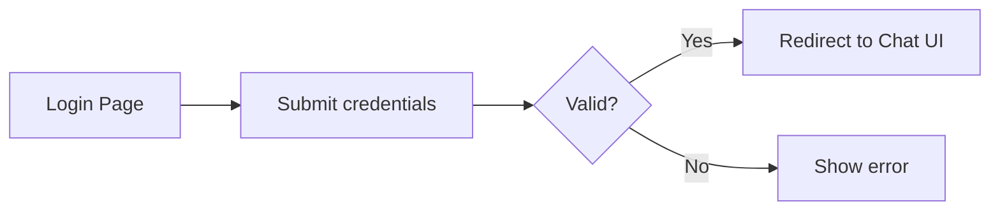
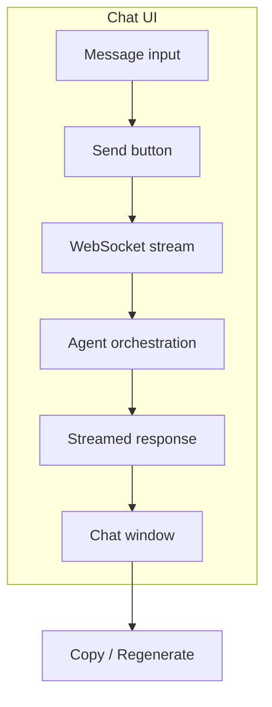
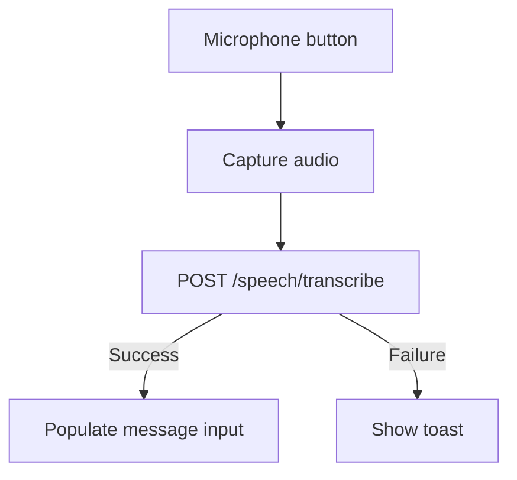

# Web UI Walkthrough

This guide explains every major surface in the SomaAgent01 web UI so operators can navigate confidently, extend the interface, and verify accessibility requirements.

## 1. Authentication Flow



- Credentials default to the values stored in `.env` (`AUTH_LOGIN`, `AUTH_PASSWORD`) or the settings service.
- Failed attempts emit structured events for the security audit log.
- Passwords never render back into the DOM after successful login.

**Verification:** Attempt a login with valid credentials; UI redirects to the chat view and the header shows the active tenant.

## 2. Chat Workspace



- Real-time responses flow through the `response_stream_chunk` hook before rendering.
- Managing sessions: `New Chat`, `Reset Chat`, `Save Chat`, and `Load Chat` manage JSON transcripts in `/tmp/chats`.
- Action bar controls pause/resume processing, import knowledge, inspect context/history, and retry the previous step via **Nudge**.

**Verification:** Send a message, observe streaming updates, and confirm transcript persistence by saving and reloading the chat file.

## 3. Settings Modal

```mermaid
flowchart LR
    Button[Settings button] --> Modal[Open modal]
    Modal --> Tabs[Agent | Models | Speech | Advanced]
    Tabs --> Save[Save]
    Save --> Persist[Write tmp/settings.json]
    Persist --> Reload[Runtime reload]
```

- Each tab maps to Pydantic schemas in `services/gateway/routes/settings.py`.
- Sensitive fields render masked placeholders to avoid leaking secrets.
- Changes trigger a runtime reload via the `apply_settings` pipeline.

**Verification:** Update a non-critical setting (for example, chat temperature), save, and confirm the change persists after refreshing the page.

## 4. Voice Interface (Optional)



- Speech-to-text runs locally via the speech service; no external API keys required.
- Text-to-speech toggles in the sidebar; playback can be stopped via the "Stop Speech" button.

**Verification:** Record a short prompt using the microphone and ensure the text populates in the message input field.

## 5. Extension Hooks

| Hook | Trigger | Typical Use |
| ---- | ------- | ----------- |
| `response_stream_chunk` | Each streamed token | Redact sensitive text or enrich with markdown |
| `ui_before_render` | Prior to DOM update | Inject analytics, reaction buttons |
| `ui_on_error` | Exception propagation | Replace default error alert |

Register hooks via `python/helpers/browser_use_monkeypatch.py`:

```python
from python.helpers import browser_use_monkeypatch

def stamp_chunk(chunk: str) -> str:
    return f"[{time.time():.0f}] {chunk}"

browser_use_monkeypatch.response_stream_chunk = stamp_chunk
```

Changes take effect immediately after a page reload and preserve the lightweight HTML/JS implementation.

## 6. Accessibility Commitments

- Keyboard navigation covers every action button and settings control.
- `aria-label` attributes describe interactive elements; modals trap focus until closed.
- Colour palette meets WCAG AA contrast ratios; dark mode toggle (roadmap item) will keep the same guarantees.
- Screen readers announce agent messages and toast notifications via `aria-live` regions.

**Verification:** Run `make docs-verify` (includes accessibility lint) and perform a manual keyboard walk-through to ensure focus states cycle correctly.

## 7. Future Enhancements

- **Dark mode:** persisted per user in `tmp/settings.json`.
- **Rich text editor:** lightweight WYSIWYG for formatted prompts.
- **Metrics side panel:** optional SSE-powered live telemetry for latency and cost.

Track UI backlog items in the Documentation Change Log and update this page when features graduate from experimental status.
